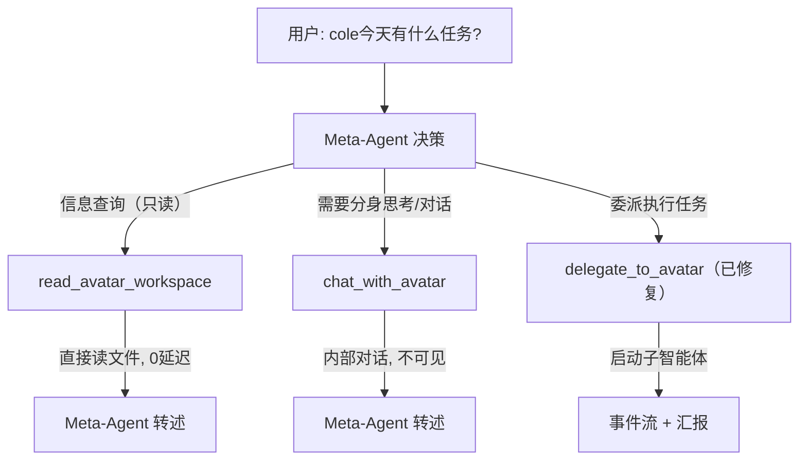

# Meta-Agent 分身直接通信方案

## 问题根因

当前 `delegate_to_avatar` 的实现存在三个缺陷：

1. **每次都创建新子智能体** -- 即使只是"问 cole 今天有什么任务"这种信息查询，也会 `spawn_subagent` 生成新 ID（如 `sa-df411700`），而非与已有的 cole 分身（`ecebde041613`）通信
2. **未使用分身 workspace** -- 子智能体使用 `base_session.workspace_dir`（Meta-Agent 的 workspace），而非 avatar 自身的 `~/.agenticx/avatars/<id>/workspace/`
3. **未传递分身配置** -- avatar 的 `system_prompt`、`default_provider`、`default_model` 均被忽略

## 解决方案：三层交互模型




### 第一层：`read_avatar_workspace`（新增，轻量只读）

**场景**：查询分身的身份、记忆、历史任务等已落盘信息

- 直接读取 avatar 的 workspace 文件（`IDENTITY.md`、`MEMORY.md`、`memory/<date>.md`）
- 不创建子智能体，不启动 LLM，零延迟
- Meta-Agent 基于读取结果自行组织回答

**工具签名**：

```
read_avatar_workspace(avatar_id, files?=["IDENTITY.md","MEMORY.md","memory/today"])
```

**参数**：

- `avatar_id`（必填）：目标分身 ID
- `files`（可选）：要读取的文件列表，默认读取 IDENTITY.md + MEMORY.md + 最近 3 天 daily memory

**返回**：每个文件的内容，截断至合理长度

### 第二层：`chat_with_avatar`（新增，内部对话）

**场景**：需要分身基于自身身份和记忆"思考"后回答，但不需要执行工具操作

- 查找 avatar 是否有活跃会话（通过 `SessionManager.list_sessions(avatar_id=...)`）
- 若有活跃会话：复用其 chat_history 作为上下文，发起一次 LLM 调用
- 若无活跃会话：创建临时上下文（注入 avatar 的 system_prompt + workspace 身份信息），发起一次 LLM 调用
- **不创建子智能体**，不触发事件流，不对用户可见
- 返回 avatar 的回答文本，Meta-Agent 转述给用户

**工具签名**：

```
chat_with_avatar(avatar_id, message, relay_mode?="summary")
```

**参数**：

- `avatar_id`（必填）：目标分身 ID
- `message`（必填）：要问分身的问题
- `relay_mode`（可选）：`"verbatim"` 原文转述 / `"summary"` 摘要转述，默认 `"summary"`

**返回**：avatar 的回答原文 + relay_mode 提示

### 第三层：`delegate_to_avatar`（修复现有）

**场景**：真正需要分身执行多步骤任务（写代码、运行命令等）

修复点：

- 传入 avatar 的 `workspace_dir` 给 `spawn_subagent`（需扩展 `spawn_subagent` 接口）
- 传入 avatar 的 `system_prompt`（注入子智能体的身份 prompt）
- 传入 avatar 的 `default_provider` / `default_model`
- 子智能体在 avatar 自己的 workspace 中执行

## 涉及文件


| 文件                                                                                 | 改动                                                                                                    |
| ---------------------------------------------------------------------------------- | ----------------------------------------------------------------------------------------------------- |
| `[agenticx/runtime/meta_tools.py](agenticx/runtime/meta_tools.py)`                 | 新增 `read_avatar_workspace` 和 `chat_with_avatar` 工具定义 + 实现；修复 `delegate_to_avatar` 传入 workspace/config |
| `[agenticx/runtime/team_manager.py](agenticx/runtime/team_manager.py)`             | `spawn_subagent` 新增可选参数 `workspace_dir`；`_build_isolated_session` 支持自定义 workspace                     |
| `[agenticx/runtime/prompts/meta_agent.py](agenticx/runtime/prompts/meta_agent.py)` | 更新「分身协作」章节，指导 Meta-Agent 选择正确的交互层级                                                                    |


## 关键设计决策

### Q1: `chat_with_avatar` 是否复用已有会话历史？

**推荐方案**：是。如果 avatar 有活跃会话，读取其最近 chat_history 作为上下文注入，这样 avatar 能"记住"之前和用户的对话。但只做一次 LLM 调用（不进入工具循环），确保轻量快速。

### Q2: `chat_with_avatar` 使用哪个 LLM？

**推荐方案**：优先使用 avatar 自身的 `default_provider` / `default_model`，若未配置则 fallback 到 Meta-Agent 当前使用的模型。

### Q3: Meta-Agent 如何判断用哪层？

在 system prompt 中明确指引：

- "查 xxx 的记忆/身份/任务" → `read_avatar_workspace`
- "问 xxx 对某事的看法/请 xxx 帮我想想" → `chat_with_avatar`
- "让 xxx 去执行某任务（写代码/部署/生成文件）" → `delegate_to_avatar`

