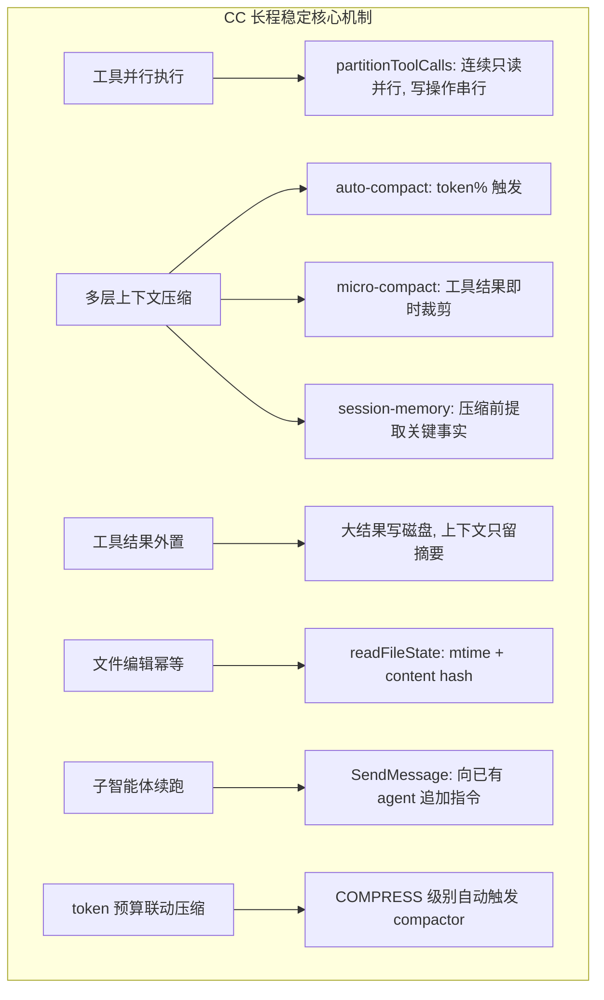
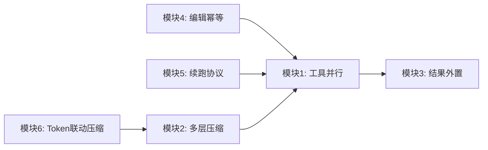

# CC 长程任务稳定运行能力内化

## 现状分析

AgenticX 当前的长程稳定机制：
- `ContextCompactor`（消息条数/字符阈值触发，单次摘要，无 token 精确计量）
- `LoopDetector`（启发式重复/乒乓/无进展/饱和检测）
- `TokenBudgetGuard`（累计 token 到阈值后提示或终止，**不联动 compactor**）
- `team_manager.send_message_to_subagent`（存在但 meta 工具层无对应入口）
- 并行工具 flag `_parallel_tools_enabled()` **已写但未接线**（L1313 处变量赋值后无引用）

CC 相比多出的关键机制（已在 source_notes 和 gap_analysis 中验证）：



---

## 实施计划（6 个独立可交付模块）

### 模块 1: 工具并行执行 (P0, 预计 2-3 天)

**改动文件**:
- [agenticx/tools/base.py](agenticx/tools/base.py) — BaseTool 新增分类方法
- [agenticx/runtime/tool_orchestrator.py](agenticx/runtime/tool_orchestrator.py) — **新建**
- [agenticx/runtime/agent_runtime.py](agenticx/runtime/agent_runtime.py) — 工具循环改造
- [agenticx/cli/agent_tools.py](agenticx/cli/agent_tools.py) — 标注各工具的并发安全性

**BaseTool 新增**（`base.py` 约 L532 后）:
```python
def is_concurrency_safe(self, input_args: dict) -> bool:
    """Whether this specific invocation can run in parallel."""
    return self.is_read_only(input_args)

def is_read_only(self, input_args: dict) -> bool:
    """Whether this invocation has no side effects."""
    return False
```

**新建 `tool_orchestrator.py`**:
- `ToolOrchestrator` 类，含 `partition_tool_calls(calls, tool_registry)` 和 `execute_batches(batches, dispatch_fn)`
- 分区逻辑：扫描 tool_calls 列表，连续 `is_concurrency_safe=True` 的归入同一并行批次，遇到非安全调用则独立串行批次
- 并行批次用 `asyncio.gather(*[dispatch_fn(tc) for tc in batch], return_exceptions=True)`
- 并发上限通过 `asyncio.Semaphore(max_concurrency)` 控制，默认 8，可通过 `AGX_MAX_TOOL_CONCURRENCY` 配置

**agent_runtime.py 改造**（L1313 附近的工具循环）:
- 当前：`for call in tool_calls: ... dispatch_tool_async(...)`
- 改为：`orchestrator.partition_tool_calls(tool_calls) -> batches`，再 `execute_batches(batches, dispatch_fn)`
- `_parallel_tools_enabled()` 为 False 时退化为全串行（向后兼容）

**agent_tools.py 标注**:
- `file_read`, `grep_search`, `codebase_search`, `list_dir` 等 → `is_read_only=True`
- `file_write`, `file_edit`, `bash_exec` 等 → `is_read_only=False`
- `bash_exec` 需按命令内容判断（简单实现：带 `>`, `>>`, `rm`, `mv` 等为非只读）

---

### 模块 2: 多层上下文压缩 (P0, 预计 4-5 天)

**改动文件**:
- [agenticx/runtime/compactor.py](agenticx/runtime/compactor.py) — 全面增强
- [agenticx/runtime/agent_runtime.py](agenticx/runtime/agent_runtime.py) — 压缩触发时机

**2a. Token 精确触发（替代消息条数/字符数）**:

在 `ContextCompactor` 中新增：
```python
def _estimate_token_usage(self, messages: list) -> int:
    """Estimate token count for messages using tiktoken or char-based heuristic."""
    # tiktoken if available, else len(text) // 3.5
    ...

def _should_compact_by_tokens(self, messages: list, model: str) -> bool:
    """Token-based trigger: compact when usage > 80% of model context window."""
    usage = self._estimate_token_usage(messages)
    limit = self._get_context_window(model)
    return usage > limit * 0.80
```

在 `maybe_compact` 中优先用 token 判断，旧的消息数/字符数作为 fallback。

**2b. Micro-Compact（工具结果即时裁剪）**:

在 `ContextCompactor` 中新增：
```python
def micro_compact_tool_result(self, tool_name: str, result: str, budget: int = 4000) -> str:
    """Condense verbose tool results preserving key data."""
    if len(result) <= budget:
        return result
    # Strategy: head(1/3) + "... truncated ..." + tail(1/3) + metadata
    ...
```

在 `agent_runtime.py` 工具结果写入 messages 前调用（L1775 附近）。

**2c. Session Memory Extraction（压缩前提取关键事实）**:

在 `ContextCompactor` 中新增：
```python
def _extract_session_memory(self, messages_to_compact: list) -> dict:
    """Extract key facts before compacting messages away."""
    memory = {
        "files_modified": [],   # from file_write/file_edit tool calls
        "errors_encountered": [],  # from tool results containing ERROR
        "key_decisions": [],    # from assistant messages with decision keywords
        "tools_used_summary": {},  # tool_name -> count
    }
    for msg in messages_to_compact:
        # Parse tool calls and results
        ...
    return memory
```

在 `maybe_compact` 中，压缩前调 `_extract_session_memory`，将结果作为 `[session_memory]` 前缀注入摘要消息，确保关键信息跨压缩边界保留。

**2d. 压缩失败熔断**:

新增 `_consecutive_failures` 计数器，连续 3 次压缩失败后停止重试（对齐 CC 的 `MAX_CONSECUTIVE_AUTOCOMPACT_FAILURES = 3`）。

---

### 模块 3: 工具结果外置（大结果写磁盘）(P1, 预计 1-2 天)

**改动文件**:
- [agenticx/runtime/agent_runtime.py](agenticx/runtime/agent_runtime.py) — 结果写入前检查
- [agenticx/cli/agent_tools.py](agenticx/cli/agent_tools.py) — 工具结果处理

**策略**:
- 阈值：`AGX_TOOL_RESULT_PERSIST_THRESHOLD`，默认 8000 字符
- 超过阈值的工具结果：
  1. 写入 `{session_dir}/tool-results/{tool_use_id}.txt`
  2. 上下文中替换为：`[Tool result persisted to disk: {path}]\n{preview_head}\n... ({total_len} chars, see file for full content)`
  3. preview_head 取前 2000 字符

**实现位置**: `agent_runtime.py` L1775 附近，在 `tool_result_content` 写入 messages 之前插入检查和替换逻辑。

---

### 模块 4: 文件编辑幂等守卫 (P1, 预计 1-2 天)

**改动文件**:
- [agenticx/runtime/file_state.py](agenticx/runtime/file_state.py) — **新建**
- [agenticx/cli/agent_tools.py](agenticx/cli/agent_tools.py) — file_read 记录状态, file_edit 检查

**新建 `file_state.py`**:
```python
@dataclass
class FileReadState:
    path: str
    content_hash: str  # sha256
    mtime: float
    read_at: float

class FileStateTracker:
    def __init__(self):
        self._states: dict[str, FileReadState] = {}

    def record_read(self, path: str, content: str): ...
    def check_staleness(self, path: str) -> Optional[str]: ...
    def clear(self): ...
```

**agent_tools.py 改造**:
- `_tool_file_read`（L1157）：读取成功后调 `tracker.record_read(abs_path, content)`
- `_tool_file_edit`（L1247）：执行前调 `tracker.check_staleness(abs_path)`，返回非 None 则拒绝编辑并提示"文件已被修改，请先重新读取"

**FileStateTracker 生命周期**: 挂在 `StudioSession` 上，每个会话一个实例；子智能体 clone 或共享取决于是否共享 session。

---

### 模块 5: 子智能体续跑协议 (P1, 预计 2-3 天)

**改动文件**:
- [agenticx/runtime/meta_tools.py](agenticx/runtime/meta_tools.py) — 新增 `send_message_to_agent` meta 工具
- [agenticx/cli/agent_tools.py](agenticx/cli/agent_tools.py) — 注册到 STUDIO_TOOLS 和 META_TOOL_NAMES
- [agenticx/runtime/team_manager.py](agenticx/runtime/team_manager.py) — 增强 `send_message_to_subagent` 支持 archived 恢复

**新 meta 工具 `send_message_to_agent`**:
```python
# STUDIO_TOOLS 新增条目
{
    "type": "function",
    "function": {
        "name": "send_message_to_agent",
        "description": "Send a follow-up message to a running or completed sub-agent...",
        "parameters": {
            "agent_id": {"type": "string", "description": "The agent ID (sa-xxx or dlg-xxx)"},
            "message": {"type": "string", "description": "The message/instruction to send"},
        }
    }
}
```

**meta_tools.py 实现**（在 `dispatch_meta_tool_async` 中新增分支）:
- 解析 `agent_id` 和 `message`
- 调 `team_manager.send_message_to_subagent(agent_id, message)`
- 对 `dlg-*` 类型：查找对应 delegation session，追加 user 消息并恢复运行

**team_manager.py 增强**:
- `send_message_to_subagent`（L610）中增加对 `_archived` 的 fallback：若 agent_id 不在 `_agents` 中但在 `_archived` 中，自动恢复 session 并重新 spawn

---

### 模块 6: Token 预算与压缩联动 (P0, 预计 1 天)

**改动文件**:
- [agenticx/runtime/agent_runtime.py](agenticx/runtime/agent_runtime.py) — TokenBudgetGuard COMPRESS 分支

**当前问题**: `TokenBudgetGuard` 返回 `COMPRESS` 时只向 messages 追加一条 XML 提示，**不触发 compactor**。长对话中 token 持续增长但 compactor 只在 turn 开头跑一次。

**改造**（L1162–1190 附近）:
```python
if budget_state == "COMPRESS":
    # Reactive compact: trigger compactor mid-turn
    compacted = await self._compactor.maybe_compact(
        messages, model=current_model, force=True
    )
    if compacted:
        # Re-estimate budget after compaction
        budget_state = self._token_budget.check(...)
    if budget_state in ("COMPRESS", "WARNING"):
        # Still over budget after compaction, inject hint
        messages.append({"role": "user", "content": TOKEN_BUDGET_COMPRESS_HINT})
```

同时在 `maybe_compact` 中增加 `force=False` 参数：`force=True` 跳过阈值检查直接压缩。

---

## 依赖关系与实施顺序



推荐实施顺序：**M6 → M2 → M4 → M1 → M3 → M5**

理由：
1. M6 最小改动最大收益（1 天，解决 token 与压缩脱节）
2. M2 是长程稳定的核心支柱（压缩策略全面升级）
3. M4 独立且简单（文件安全守卫）
4. M1 需要 M2 保证上下文不膨胀后才有意义（否则并行产出更多结果加速溢出）
5. M3 配合 M1 使用（并行产出更多结果时更需要外置）
6. M5 最后做，依赖前面的稳定基础

## 测试策略

每个模块需附带冒烟测试（`tests/test_smoke_cc_stability_*.py`）:
- M1: 4 个 file_read 并行 vs 串行的延迟对比
- M2: 30 轮模拟对话的压缩行为验证
- M3: 超阈值结果的磁盘写入与摘要替换
- M4: 并发文件修改的幂等拒绝
- M5: spawn → complete → send_message 续跑流程
- M6: token 超限后自动压缩触发验证
