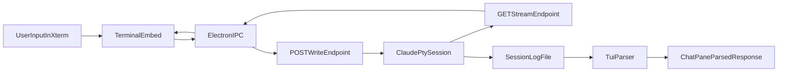

# CC Visible PTY Attach 计划

## 目标
把当前 `tail -f` 日志可见模式升级为“真交互终端”模式：在 Machi 内嵌终端中直接看到并操作 Claude PTY，会话仍由 cc-bridge 管理，聊天侧继续保留 `parsed_response` 回填能力。

## 现状结论
- 当前 `claude-code` 终端是日志尾流，不是 PTY attach。
- `visible_tui` 会话已在 bridge 内持有 PTY（`pty_master_fd`），具备透传基础。
- Desktop 终端目前只支持本地 `node-pty` shell，会话来源需要扩展为“remote stream”。

## 实施方案
1. 在 bridge 增加 PTY 透传 API（HTTP stream + write + resize）
   - 新增只针对 `visible_tui` 的端点：
     - `GET /v1/sessions/{id}/stream`（持续输出 PTY 数据，SSE/NDJSON）
     - `POST /v1/sessions/{id}/write`（写入用户键盘输入）
     - `POST /v1/sessions/{id}/resize`（同步 cols/rows）
   - 会话关闭时自动断流；非 `visible_tui` 返回 400。
   - 复用现有 Bearer token 校验。

2. 在 `session_manager` 补齐 PTY 订阅分发
   - 增加 per-session 广播队列（多订阅者可选，至少 1 路）。
   - `_pty_reader_thread` 读取到的数据同时：
     - 继续写日志（保持解析链路）
     - 推送到 stream 订阅者（低延迟）
   - 新增 API 供 HTTP 层调用：`iter_pty_stream`、`write_pty`、`resize_pty`。

3. Desktop 终端新增 bridge-pty 模式（不再 tail 文件）
   - 在 Electron IPC 新增远端终端会话类型：
     - 建立 `fetch(stream)` 长连接读取输出
     - `terminalWriteByTab` 时改为调用 bridge `/write`
     - resize 时调用 `/resize`
   - `TerminalEmbed` 保持 xterm 渲染，但数据源切换为 bridge stream。

4. ChatPane 接线调整
   - `cc_bridge_start` 成功后，打开 `claude-code` tab 时不再执行 `tail -f`。
   - 改为“attach 当前 bridge session_id”的终端。
   - 兼容失败回退：attach 失败时显示高信号错误，并允许一键退回日志模式（临时兜底）。

5. 回填与状态保持
   - `cc_bridge_send` 的 `parsed_response/parse_confidence` 逻辑保留。
   - 低置信度提示文案改为“请查看正在交互的 claude-code 终端”。
   - `permission` 仍在 PTY 内交互确认，不通过旧 HTTP permission API。

## 关键文件
- Bridge
  - [agenticx/cc_bridge/session_manager.py](/Users/damon/myWork/AgenticX/agenticx/cc_bridge/session_manager.py)
  - [agenticx/cc_bridge/http_app.py](/Users/damon/myWork/AgenticX/agenticx/cc_bridge/http_app.py)
- Desktop
  - [desktop/electron/main.ts](/Users/damon/myWork/AgenticX/desktop/electron/main.ts)
  - [desktop/electron/preload.ts](/Users/damon/myWork/AgenticX/desktop/electron/preload.ts)
  - [desktop/src/global.d.ts](/Users/damon/myWork/AgenticX/desktop/src/global.d.ts)
  - [desktop/src/components/TerminalEmbed.tsx](/Users/damon/myWork/AgenticX/desktop/src/components/TerminalEmbed.tsx)
  - [desktop/src/components/ChatPane.tsx](/Users/damon/myWork/AgenticX/desktop/src/components/ChatPane.tsx)

## 数据流

## 验证与验收
- 单测
  - stream/write/resize 端点鉴权与模式校验。
  - visible_tui 会话在关闭后 stream 正常结束。
- 桌面冒烟
  - 可输入命令并即时回显（非 tail）。
  - resize 后 UI 与 PTY 同步不乱行。
  - 权限等待可在终端内直接确认并继续。
- 回归
  - headless 模式行为不变。
  - `cc_bridge_send` 回填逻辑保持可用。

## 风险与控制
- 长连接稳定性：为 stream 增加心跳和断线重连策略。
- 双写路径一致性：统一写入口，避免 `send_user_message` 与 `/write` 语义漂移。
- 资源泄露：会话 stop 时显式释放订阅队列与 reader 任务。