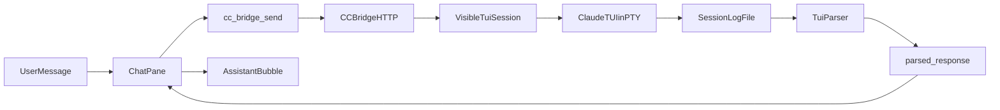

# CC Visible TUI 模式实施计划

## 目标与已确认决策
- 目标：提供“有头”模式，让用户能在 Machi 内嵌终端看到 Claude TUI 全过程，并由 Machi 将消息发送到该 TUI。
- 已确认：
  - V1 选择 `Visible TUI + 自动解析并回填完整答复`。
  - 模式切换入口只放在 Settings 全局开关（不做 ChatPane 局部切换）。

## 现状基线（复用点）
- Bridge 目前是 headless/stream-json 子进程模型，入口在 [agenticx/cc_bridge/http_app.py](/Users/damon/myWork/AgenticX/agenticx/cc_bridge/http_app.py) 与 [agenticx/cc_bridge/session_manager.py](/Users/damon/myWork/AgenticX/agenticx/cc_bridge/session_manager.py)。
- Desktop 已有 CC Bridge 设置面板（URL/token/idle），可扩展模式字段，见 [desktop/src/components/SettingsPanel.tsx](/Users/damon/myWork/AgenticX/desktop/src/components/SettingsPanel.tsx)。
- ChatPane 已接入 `cc_bridge_start/send` 事件渲染与终端自动打开，可作为 Visible TUI 的挂载点，见 [desktop/src/components/ChatPane.tsx](/Users/damon/myWork/AgenticX/desktop/src/components/ChatPane.tsx)。
- Studio 已有 `GET/PUT /api/cc-bridge/config` 可承载新增配置字段，见 [agenticx/studio/server.py](/Users/damon/myWork/AgenticX/agenticx/studio/server.py)。

## 实施步骤

### 1) 配置层：新增全局模式开关
- 在 `cc_bridge` 配置中新增枚举字段：`mode: "headless" | "visible_tui"`，默认 `headless`。
- 扩展 `GET/PUT /api/cc-bridge/config`：读写 `mode`，并做白名单校验。
- Settings 面板新增“运行模式”单选：Headless / Visible TUI（仅全局）。

### 2) Bridge 层：补充 Visible TUI 会话能力
- 在 [agenticx/cc_bridge/session_manager.py](/Users/damon/myWork/AgenticX/agenticx/cc_bridge/session_manager.py) 增加 `visible_tui` 会话类型：
  - 使用 PTY 启动 `claude`（交互模式）而非 `--print stream-json`。
  - 保持会话索引（session_id -> pty 句柄、cwd、log_path、last_activity）。
  - 支持 `send_user_message` 将文本注入 TUI（带换行触发发送）。
- 统一日志落盘：headless 与 visible_tui 都写会话日志，供 UI 可见与解析。

### 3) API 层：同一接口兼容两种会话
- `POST /v1/sessions` 根据 `mode` 创建对应会话。
- `POST /v1/sessions/{id}/message`：
  - headless：维持现有 `wait_for_success_result`。
  - visible_tui：发送后进入“可取消等待窗口”，从日志增量中解析“本轮答复段”。
- `GET /v1/sessions` 返回 `mode`、`log_path`、可见状态字段，便于前端标识。

### 4) 回填策略：Visible TUI 的“完整答复解析”
- 新增解析器模块（例如 `agenticx/cc_bridge/tui_parser.py`）：
  - 以“用户发送时间点”为锚，提取后续 assistant 输出块。
  - 处理 ANSI、光标控制、重绘噪声、分段流式刷新去重。
  - 判定答复完成（空闲阈值 + 提示符恢复 + 最大等待兜底）。
- API 返回结构增加：`ok`、`tail`、`parsed_response`、`parse_confidence`。
- 当低置信度时回退：`parsed_response` 为空并返回解释，前端提示“已可见执行，请查看 TUI”。

### 5) Desktop 集成：仅内嵌终端展示，不再外弹
- ChatPane 在 `cc_bridge_start` 成功后：
  - 确保打开内嵌 `claude-code` tab，并附着到该 session 的日志/状态。
- 对 `cc_bridge_send`：
  - 若后端返回 `parsed_response`，直接回填聊天助手消息；
  - 若为空则展示高信号提示（非错误）：已发送到 TUI，等待可见结果。
- 保持“禁止外部 Terminal 弹窗”策略，避免端口冲突与多实例干扰。

### 6) 验证与回归
- Python 侧测试：
  - 会话创建（headless/visible_tui）、发送、停止。
  - TUI 解析器：ANSI 清洗、增量去重、完成判定、低置信度回退。
- Desktop 冒烟：
  - 切换模式后生效；Visible TUI 可见执行；回填可用；失败提示可读。
- 回归检查：
  - 现有 `cc_bridge_*` 的 token、idle_stop_seconds、localhost 直连与 proxy 绕过行为不回退。

## 数据流（Visible TUI）

## 验收标准
- Settings 可切换 `headless/visible_tui` 且持久化。
- Visible TUI 下，每次 `cc_bridge_send` 都能在 Machi 内嵌终端看到执行过程。
- 至少 80% 常见答复可自动解析并回填聊天气泡；其余情况有明确回退提示，不误报成功。
- 不再弹出 Machi 外部 Terminal。
- 端口冲突、权限等待、解析失败三类场景都有可读提示与恢复路径。