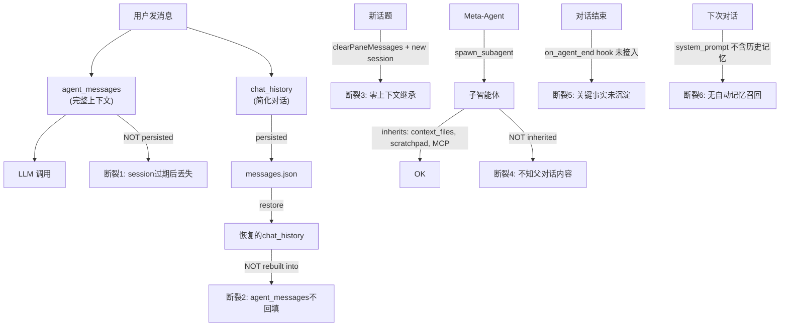

# AgenticX 上下文工程全面升级

## 现状诊断

当前上下文链路中有 **6 个断裂点**导致"agent 不记得"：




---

## Phase 1: 会话连续性（最高优先级）

解决断裂 1-3：session 恢复后上下文丢失、新话题完全失忆。

### 1.1 持久化 agent_messages

**后端** [agenticx/studio/session_manager.py](agenticx/studio/session_manager.py)

- `_persist_session_state`：新增将 `session.agent_messages` 写入 `~/.agenticx/sessions/{id}/agent_messages.json`
- 只保留最近 40 条（含 tool_calls），超出的做截断，避免文件过大
- `_restore_persisted_state`：加载 `agent_messages.json`，通过 `_sanitize_context_messages()` 清洗后回填 `session.agent_messages`
- 同时在 `get_messages()` 中返回完整消息（含 tool_call 角色标记），供前端展示工具调用

### 1.2 新话题继承摘要

**后端** 新增 `POST /api/session/summary` 端点 in [agenticx/studio/server.py](agenticx/studio/server.py)

- 接收 `session_id`，返回当前会话的摘要（复用 `ContextCompactor._summarize()` 逻辑）
- 摘要约 300-500 字，包含：用户目标、关键决策、当前进展、待办事项

**后端** 修改 `POST /api/sessions`（创建会话） in [agenticx/studio/server.py](agenticx/studio/server.py)

- 新增可选参数 `inherit_from_session_id`
- 若提供，自动将前会话摘要注入新 session 的 `agent_messages` 首条（`role: "system"`）
- 同时继承前会话的 `context_files`（引用，不深拷贝内容）和 `scratchpad`

**前端** 修改 `createNewTopic` in [desktop/src/components/ChatPane.tsx](desktop/src/components/ChatPane.tsx)

- 将当前 `pane.sessionId` 作为 `inherit_from_session_id` 传给 `createSession`
- UI 上在输入区显示一行小字："已继承上一话题的上下文摘要"

**前端** 修改 IPC in [desktop/electron/preload.ts](desktop/electron/preload.ts) + [desktop/electron/main.ts](desktop/electron/main.ts)

- `createSession` payload 新增 `inherit_from_session_id` 字段

### 1.3 持久化 context_files 引用

**后端** [agenticx/studio/session_manager.py](agenticx/studio/session_manager.py)

- `_persist_session_state`：新增 `context_files_refs.json`，只存文件路径列表（不存内容，避免磁盘膨胀）
- `_restore_persisted_state`：恢复时按路径重新读取文件内容回填 `context_files`

---

## Phase 2: 子智能体上下文注入

解决断裂 4：子智能体不知道用户和 meta 讨论了什么。

### 2.1 注入父对话摘要

**后端** [agenticx/runtime/team_manager.py](agenticx/runtime/team_manager.py)

- `_build_subagent_system_prompt()`：新增 "父对话上下文" 段落
- 内容来源：`base_session.chat_history` 最近 10 条做精简拼接（约 800 字以内）
- 格式：

```
## 父智能体对话上下文（最近摘要）
- 用户请求: ...
- Meta-Agent 回复: ...
- 用户追问: ...
```

### 2.2 子智能体结果回注主线

**后端** [agenticx/runtime/team_manager.py](agenticx/runtime/team_manager.py)

- `_on_subagent_summary` 目前只写 `agent_messages` 和 `chat_history`
- 增强：同时将子智能体的 `artifacts` 键列表写入 `base_session.scratchpad`（key: `subagent_result::{agent_id}`）
- 这样后续 meta-agent 的 system prompt 中 scratchpad 摘要会包含子智能体产出

---

## Phase 3: 自动记忆沉淀与召回

解决断裂 5-6：对话结束后关键事实丢失、下次对话不记得上次内容。

### 3.1 接入 on_agent_end 记忆提取

**后端** 新建 `agenticx/runtime/hooks/memory_hook.py`

- 实现 `AgentHook` 的 `on_agent_end(final_text, session)`
- 调用 `MemoryExtractionPipeline.extract(session.chat_history)` 提取关键事实
- 对 `scope=USER` 的事实，追加写入 workspace 的 `MEMORY.md`
- 对 `scope=SESSION` 的事实，写入 `scratchpad`（下次恢复可用）

**后端** [agenticx/runtime/agent_runtime.py](agenticx/runtime/agent_runtime.py)

- `AgentRuntime.__init_`_ 默认注册 `MemoryHook`（可通过配置禁用）

### 3.2 系统提示自动注入相关记忆

**后端** [agenticx/runtime/prompts/meta_agent.py](agenticx/runtime/prompts/meta_agent.py)

- `build_meta_agent_system_prompt()` 中新增一段：
  - 用用户的第一条消息（或 session 最近主题）做 `WorkspaceMemoryStore.search(query, mode="hybrid", limit=5)`
  - 将匹配结果注入 system prompt 的 "相关历史记忆" 段落
  - 内容约 500 字以内，避免 token 浪费

**注意**：这个查询不能在每轮 LLM 调用前都做（太贵），只在 `run_turn` 的首轮（`round_idx == 1`）注入一次。

### 3.3 每日记忆自动整理

**后端** 新增 cron hook 或 `on_agent_end` 尾部逻辑

- 每次对话结束后，检查当日 `memory/{YYYY-MM-DD}.md` 是否超过 2000 字
- 若超过，用 LLM 做一次精简合并，保留关键事实
- 同时更新 `WorkspaceMemoryStore` 索引

---

## Phase 4: 前端上下文 UX

让用户能**看到并控制**上下文状态。

### 4.1 上下文指示器

**前端** [desktop/src/components/ChatPane.tsx](desktop/src/components/ChatPane.tsx)

- 在窗格头部 session 信息旁，增加小图标/文字：
  - "已继承摘要" — 新话题继承了前会话
  - "N 条历史" — 当前 agent_messages 深度
  - "已压缩" — 触发过 compaction

### 4.2 新话题选项

**前端** [desktop/src/components/ChatPane.tsx](desktop/src/components/ChatPane.tsx)

- "新话题"按钮改为下拉菜单：
  - "新话题（继承上下文）" — 默认行为，传 `inherit_from_session_id`
  - "全新话题" — 不继承，纯净开始
- 或者保持单按钮，默认继承，长按/右键弹出"不继承"选项

### 4.3 历史面板增强

**前端** [desktop/src/components/SessionHistoryPanel.tsx](desktop/src/components/SessionHistoryPanel.tsx)

- 每条历史 session 显示一行摘要（来自 `session_summaries` 表）
- 点击"恢复"时，提示："将恢复此会话的上下文，当前对话将切换"

---

## 技术风险与约束

- **token 消耗**：Phase 3.2 的记忆注入和 Phase 2.1 的父对话摘要会增加 system prompt 长度（约 +500~800 字），需做 token budget 管控
- **LLM 调用成本**：Phase 3.1 的记忆提取需要额外一次 LLM 调用（on_agent_end），可配置为仅在"对话超过 3 轮"时触发
- **磁盘空间**：`agent_messages.json` 包含 tool_calls，单文件约 50-200KB；设上限 40 条 + 自动截断
- **向后兼容**：所有新字段都是可选的，旧 session 不受影响（`_restore_persisted_state` 做 fallback）

