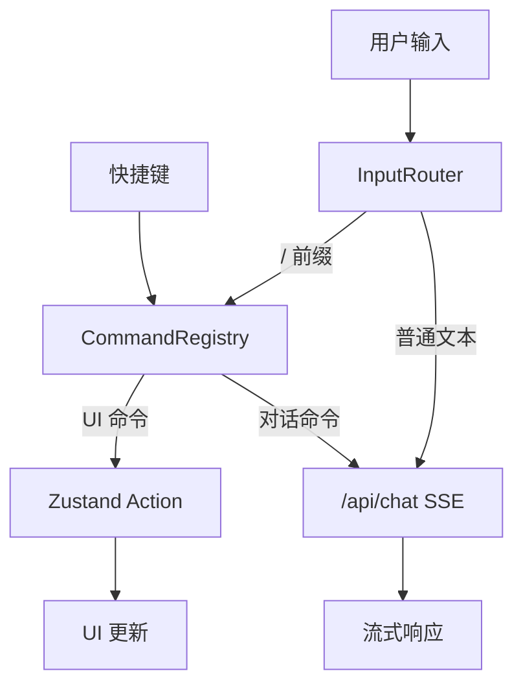

# AgenticX Desktop 双模式交互体验实施计划

基于 [claude-code_proposal.md](research/codedeepresearch/claudecode/claude-code_proposal.md) 技术方案，分三个 Phase 落地。本计划聚焦 **Phase 1 (PoC)**，Phase 2/3 留作后续迭代。

## 核心设计决策

- **双模式架构**: 同一个 App，根据 `userMode` 字段切换 Pro/Lite 布局
- **命令即数据**: 命令通过 `CommandRegistry` 声明式注册，运行时发现
- **输入即路由**: 输入框 `/` 前缀触发命令面板，其余走对话
- **模式不丢状态**: Pro/Lite 共享同一个 Zustand store 和 API 调用路径

## 数据流




## Phase 1: PoC -- 双模式骨架 + 命令面板

### 1. 扩展 Store -- 新增双模式状态

在 [desktop/src/store.ts](desktop/src/store.ts) 中新增字段：

```typescript
type AppState = {
  // ... 现有 97 行类型 ...
  userMode: 'pro' | 'lite';
  onboardingCompleted: boolean;
  commandPaletteOpen: boolean;
  planMode: boolean;
  setUserMode: (mode: 'pro' | 'lite') => void;
  setOnboardingCompleted: (v: boolean) => void;
  setCommandPaletteOpen: (v: boolean) => void;
  setPlanMode: (v: boolean) => void;
};
```

初始值从 Electron IPC `load-config` 读取（`~/.agenticx/config.yaml` 中增加 `user_mode` 和 `onboarding_completed` 字段）。

### 2. Electron 侧持久化

在 [desktop/electron/main.ts](desktop/electron/main.ts) 的 `AgxConfig` 类型和 `loadAgxConfig`/`saveAgxConfig` 中增加：

```typescript
type AgxConfig = {
  // ... 现有字段 ...
  user_mode?: 'pro' | 'lite';
  onboarding_completed?: boolean;
};
```

在 [desktop/electron/preload.ts](desktop/electron/preload.ts) 增加 `saveUserMode` IPC。

### 3. Onboarding 首次启动引导

新建 `desktop/src/components/OnboardingView.tsx`：

- 欢迎页：AgenticX 品牌 + 简短文案
- 身份选择卡片：两个大按钮 -- "我是开发者 (Pro)" / "我想简单使用 (Lite)"
- Pro 路径：跳到当前设置面板（已有 Provider 配置）
- Lite 路径：直接进入主界面
- 选择后调用 `setUserMode` + `setOnboardingCompleted(true)` + IPC 持久化

### 4. App.tsx 路由改造

在 [desktop/src/App.tsx](desktop/src/App.tsx) 第 150-188 行的 return 中增加 Onboarding 分支：

```
if (!onboardingCompleted) → <OnboardingView />
else if (userMode === 'lite') → <LiteChatView />
else → <ChatView /> (现有 Pro 体验)
```

### 5. Command Registry 核心模块

新建 `desktop/src/core/command-registry.ts`：

```typescript
interface Command {
  id: string;
  name: string;
  description: string;
  category: 'model' | 'session' | 'tools' | 'view' | 'settings' | 'help';
  shortcut?: string;
  mode: 'pro' | 'lite' | 'both';
  handler: (args?: string) => void | Promise<void>;
  icon?: string;
}

class CommandRegistry {
  private commands = new Map<string, Command>();
  register(cmd: Command): void;
  unregister(id: string): void;
  dispatch(id: string, args?: string): Promise<void>;
  search(query: string, mode: 'pro' | 'lite'): Command[];
  getAll(mode: 'pro' | 'lite'): Command[];
}
```

Phase 1 注册 5 个内置命令：`/model`、`/settings`、`/clear`、`/mode`、`/help`。

### 6. Command Palette UI

新建 `desktop/src/components/CommandPalette.tsx`：

- 弹窗样式（类 VS Code Command Palette），在输入框上方弹出
- 搜索框 + 命令列表（图标 + 名称 + 描述 + 快捷键）
- 模糊搜索：精确 > 前缀 > 包含
- 按 Enter 执行选中命令，Escape 关闭
- 触发方式：输入框键入 `/` 时 inline 弹出；`Ctrl+K` 全局弹出

### 7. 输入框集成命令路由

改造 [desktop/src/components/ChatView.tsx](desktop/src/components/ChatView.tsx) 第 556-558 行的 `onKeyDown`：

- 检测 `/` 开头：打开 Command Palette（inline 模式）
- 检测 `Ctrl+K`/`Cmd+K`：打开 Command Palette（全局模式）
- 检测 `Escape`：如果 Command Palette 打开则关闭，否则 stopStreaming
- 命令执行后清空输入框，不发送到 `/api/chat`

### 8. Lite Mode 基础视图

新建 `desktop/src/components/LiteChatView.tsx`：

- 复用 ChatView 的核心逻辑（`sendChat`、SSE 解析、消息列表），但简化 UI：
  - 隐藏：Model Badge、团队按钮、子智能体面板、快捷键提示
  - 简化标题栏：仅 "AgenticX" + 设置按钮
  - 更大的字体和间距
  - 底部增加 QuickActions 推荐操作按钮组
- QuickActions：5-6 个预设按钮（"写文章"/"翻译"/"总结"/"管理文件"/"搜索"），点击即发送对应 prompt

### 9. 快捷键管理器 (Phase 1 简化版)

新建 `desktop/src/core/keybinding-manager.ts`：

- Phase 1 仅硬编码 5 个快捷键：`Ctrl+K`(Command Palette)、`Escape`(关闭/停止)、`Ctrl+,`(设置)、`Ctrl+L`(清空)、`Ctrl+Shift+M`(模式切换)
- 在 App.tsx 注册全局 `keydown` 监听，分发到 CommandRegistry
- Pro Mode 全量快捷键，Lite Mode 仅 Escape + Ctrl+,

## 涉及文件清单

**新建**（7 个文件）:

- `desktop/src/core/command-registry.ts`
- `desktop/src/core/keybinding-manager.ts`
- `desktop/src/components/OnboardingView.tsx`
- `desktop/src/components/CommandPalette.tsx`
- `desktop/src/components/LiteChatView.tsx`
- `desktop/src/components/QuickActions.tsx`
- `desktop/src/components/ShortcutHints.tsx`

**修改**（5 个文件）:

- `desktop/src/store.ts` -- 新增 userMode/onboarding/commandPalette 状态
- `desktop/src/App.tsx` -- Onboarding 路由 + 模式分流 + 全局快捷键
- `desktop/src/components/ChatView.tsx` -- 集成 Command Palette + `/` 检测
- `desktop/electron/main.ts` -- AgxConfig 增加 user_mode 字段 + IPC handler
- `desktop/electron/preload.ts` -- 暴露 saveUserMode IPC

## 当前实现进度（2026-03-09）

已完成：

- `store.ts` 双模式状态（`userMode/onboardingCompleted/commandPaletteOpen/planMode`）与 `clearMessages` action
- Electron 配置持久化：`config.yaml` 新增 `user_mode/onboarding_completed`
- Onboarding 首次引导 + 选择模式后持久化
- `CommandRegistry` + Phase 1 的 5 个命令
- `CommandPalette` UI 与 `/` 前缀触发、`Ctrl+K` 触发
- `ChatView` 命令路由（命令不走 `/api/chat`）
- Lite 模式简化展示 + `QuickActions`
- 全局快捷键分发（`Ctrl+K`、`Ctrl+,`、`Ctrl+L`、`Ctrl+Shift+M`）
- 输入历史导航与持久化（`Alt+↑/Alt+↓`）
- Plan Mode 基础落地（`/plan`、`Ctrl+Shift+P`、只规划提示）
- 快捷键面板（`/keybindings`、`Ctrl+/`）
- 三级确认策略接入（manual / semi-auto / auto）
- 命令面板分类显示与 deferred query 性能优化
- 构建验证通过：`npm run build`（desktop）

## 验收标准

- 首次启动展示 Onboarding 引导，选择身份后不再显示
- Pro Mode: 输入 `/` 弹出命令面板，可搜索并执行 5 个基础命令
- Pro Mode: `Ctrl+K` 打开 Command Palette
- Lite Mode: 简洁界面，底部有推荐操作按钮，无命令系统
- `Ctrl+Shift+M` 可在两种模式间切换，不丢失会话状态
- 所有现有功能（对话、流式、确认、语音）保持可用且无明显回归

## 验收记录（2026-03-09）

验证方式说明：

- 自动验证：`desktop` 下执行 `npm run build`，并读取 lints（无错误）
- 代码路径验证：检查关键状态流与事件分发逻辑是否闭环

验收结果：

- Pro 模式命令面板（`/`、`Ctrl+K`）可触发，命令执行不会发送到 `/api/chat`
- Lite 模式隐藏技术入口（命令面板/子智能体面板/模型徽章），保留简洁对话 + QuickActions
- 模式切换统一逻辑（全局快捷键与 `/mode`）已对齐：同步 `confirmStrategy`，切到 Lite 自动关闭 `planMode`
- 三级确认策略（manual / semi-auto / auto）已接入，并可持久化
- Plan Mode 仅在 Pro 生效（请求前缀注入增加 `userMode === "pro"` 保护）
- 输入历史（`Alt+↑/Alt+↓`）可用并本地持久化
- 快捷键面板（`/keybindings`、`Ctrl+/`）可打开
- 构建与类型检查通过（`npm run build`）
- lint 诊断通过（desktop/src + desktop/electron 无新增问题）

待补充（建议下一步手测）：

- 在真实 Electron 窗口做完整交互走查：首次启动 Onboarding 展示一次后不再展示
- 真实语音链路（录音/打断/TTS）在 Pro/Lite 两模式各走一遍
- 快捷键在不同输入焦点场景（textarea、命令面板输入框、设置面板）做冲突回归

## Phase 2（后续）-- MVP 强化项

- 自动补全增强：命令分类、键盘上下选择、回车确认、模糊匹配优化
- 输入历史：`Alt+↑/Alt+↓` 导航与持久化
- Plan Mode 基础实现（`/plan` + 只规划不执行）
- 快捷键设置面板（可视化查看与编辑）
- Pro/Lite 共享逻辑进一步解耦（抽取 `useChatRuntime`）

## Phase 3（后续）-- 稳定化

- Lite Mode 推荐操作精细化（按场景分组）
- 确认策略三级（manual/semi-auto/auto）接入 UI
- 大量命令时的列表虚拟化与性能优化
- 输入补全性能优化（防抖与缓存）
- 全链路回归测试（E2E + 主流程手测）

