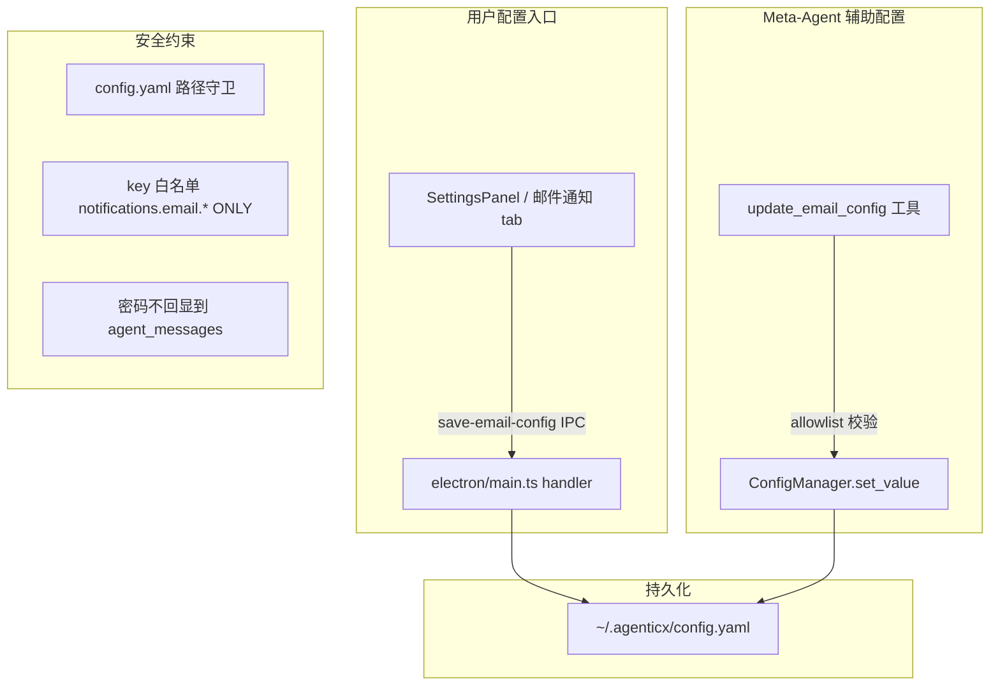

# 邮件配置 UI + Meta-Agent 安全写入

## 架构总览




## 第一层：Desktop 设置页 -- 新增「邮件通知」tab

### 1. [desktop/src/components/SettingsPanel.tsx](desktop/src/components/SettingsPanel.tsx)

- `SettingsTab` 类型加 `"email"`
- TABS 数组加 `{ id: "email", label: "邮件通知" }`
- 新增 `EmailSettingsTab` 组件，包含：
  - SMTP 预设下拉（QQ/163/Gmail/Outlook/自定义）-- 选择后自动填充 host/port/tls
  - 用户名、授权码（password）、发件人、默认收件人、启用开关
  - 「测试发送」和「保存」按钮

SMTP 预设映射：

- QQ: `smtp.qq.com:465, tls=false`
- 163: `smtp.163.com:465, tls=false`
- Gmail: `smtp.gmail.com:587, tls=true`
- Outlook: `smtp.office365.com:587, tls=true`

### 2. [desktop/electron/main.ts](desktop/electron/main.ts)

新增 3 个 IPC handler：

- `load-email-config`: 读 `notifications.email.*`，密码 mask 返回
- `save-email-config`: **只写 `notifications.email.`* 节点**，payload 字段白名单校验
- `test-email-config`: 调后端 `/api/test-email` 发测试邮件

### 3. [desktop/electron/preload.ts](desktop/electron/preload.ts) + [desktop/src/global.d.ts](desktop/src/global.d.ts)

暴露 `loadEmailConfig` / `saveEmailConfig` / `testEmailConfig` 到 renderer。

## 第二层：Meta-Agent 安全工具 -- `update_email_config`

### 4. [agenticx/runtime/meta_tools.py](agenticx/runtime/meta_tools.py)

新增工具定义 + dispatch 实现：

- 参数：`smtp_host, smtp_port, smtp_username, smtp_password, smtp_use_tls, from_email, default_to_email, enabled`（均可选）
- 内部硬编码白名单 `ALLOWED_EMAIL_CONFIG_KEYS`，只允许 `notifications.email.`* 的 8 个 key
- 每个字段做类型校验（str/int/bool）
- 通过 `ConfigManager.set_value` 逐 key 写入
- 返回结果中 `smtp_password` 始终 mask 为 `**`**

### 5. [agenticx/cli/agent_tools.py](agenticx/cli/agent_tools.py)

- `META_TOOL_NAMES` 加入 `"update_email_config"`

## 第三层：安全约束

### 6. [agenticx/cli/agent_tools.py](agenticx/cli/agent_tools.py) -- config.yaml 路径守卫

在 `_tool_file_write` 和 `_tool_file_edit` 的路径校验后、确认前，加一条拦截：

```python
if "config.yaml" in str(path) and ".agenticx" in str(path):
    return "ERROR: 禁止直接修改 AgenticX 配置文件。请使用 update_email_config 等专用工具。"
```

### 7. [agenticx/runtime/prompts/meta_agent.py](agenticx/runtime/prompts/meta_agent.py) -- 提示词硬约束

新增「配置安全红线」段落：

- 禁止通过 file_write/file_edit/bash_exec 修改 `~/.agenticx/config.yaml`
- 修改邮箱配置只能用 `update_email_config`
- 用户给出授权码后，设置后告知"已安全存储，不会出现在对话记录中"

### 8. [agenticx/studio/server.py](agenticx/studio/server.py) -- 测试邮件 API

新增 `POST /api/test-email` 端点，复用 `meta_tools._send_bug_report_email` 发一封测试邮件到 `from_email` 自身。

## 涉及文件清单

- `desktop/src/components/SettingsPanel.tsx` -- 新增 email tab UI
- `desktop/electron/main.ts` -- 3 个 IPC handler
- `desktop/electron/preload.ts` -- 暴露 IPC
- `desktop/src/global.d.ts` -- 类型声明
- `agenticx/runtime/meta_tools.py` -- update_email_config 工具
- `agenticx/cli/agent_tools.py` -- 注册 + 路径守卫
- `agenticx/runtime/prompts/meta_agent.py` -- 安全提示词
- `agenticx/studio/server.py` -- test-email API

