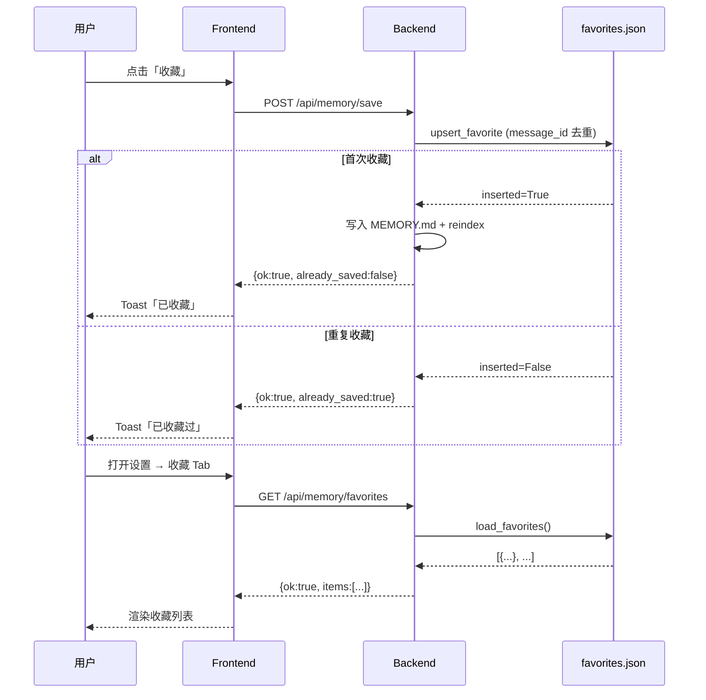

# 收藏功能 UX 完善

## 现状问题

- 点击「收藏」无任何 UI 反馈（按钮不变，无 Toast）
- 重复点击同一消息会重复写入（`records.append` 无去重）
- 收藏内容仅存于 session 级 `scratchpad`（随 session 失效），无全局汇总入口

## 目标

1. 点击「收藏」后立即弹出「已收藏」Toast（1.5s）；若已收藏则弹「已收藏过」
2. 后端以 `message_id` 去重，同一条消息只写入一次
3. 所有收藏写入全局 `~/.agenticx/workspace/favorites.json`，长期持久化
4. 设置面板新增「收藏」Tab，展示全部收藏列表（内容、时间、来源会话）

---

## 变更文件

### 1. `[agenticx/workspace/loader.py](agenticx/workspace/loader.py)`

新增两个函数：

```python
def load_favorites(workspace_dir: Path) -> list[dict]:
    path = workspace_dir / "favorites.json"
    if not path.exists(): return []
    return json.loads(path.read_text(encoding="utf-8"))

def upsert_favorite(workspace_dir: Path, entry: dict) -> bool:
    """Returns True if inserted (new), False if already existed."""
    favorites = load_favorites(workspace_dir)
    if any(f.get("message_id") == entry["message_id"] for f in favorites):
        return False
    favorites.append(entry)
    path = workspace_dir / "favorites.json"
    path.write_text(json.dumps(favorites, ensure_ascii=False, indent=2), encoding="utf-8")
    return True
```

### 2. `[agenticx/studio/server.py](agenticx/studio/server.py)`

**修改 `POST /api/memory/save`**（约 L1749）：

- import `upsert_favorite`
- 在写入 scratchpad 之前，先调用 `upsert_favorite` 检查去重
- 返回 `already_saved: bool` 字段（`True` = 重复，`False` = 首次）
- 仅首次插入时才写 MEMORY.md + 触发 reindex

**新增 `GET /api/memory/favorites`**：

```python
@app.get("/api/memory/favorites")
async def get_favorites(x_agx_desktop_token: ...) -> dict:
    workspace_dir = resolve_workspace_dir()
    items = load_favorites(workspace_dir)
    return {"ok": True, "items": sorted(items, key=lambda x: x.get("saved_at", ""), reverse=True)}
```

### 3. `[desktop/src/components/ChatPane.tsx](desktop/src/components/ChatPane.tsx)`

- 新增 `favoriteToastOpen` state + `favoriteToastMsg` state（"已收藏" / "已收藏过"）
- `favoriteMessage` 回调：读取响应体 `already_saved` 字段，据此设置 toastMsg，然后 `setFavoriteToastOpen(true)`
- JSX 中在现有 `<Toast>` 附近添加第二个 `<Toast>` 用于收藏反馈，`placement="inline-bottom-center"`，`timeoutMs={1800}`

### 4. `[desktop/src/components/SettingsPanel.tsx](desktop/src/components/SettingsPanel.tsx)`

- `SettingsTab` 类型增加 `"favorites"`
- TABS 数组增加 `{ id: "favorites", label: "收藏", icon: Bookmark }`（从 lucide-react 引入 `Bookmark`）
- Props 增加 `apiBase: string` 和 `apiToken: string`（ChatPane 打开 settings 时已有这两个值，需在 App.tsx 传入）
- 新增 `FavoritesTab` 子组件，挂载时 `fetch("/api/memory/favorites")`，渲染列表：
  - 每条显示内容（最多 3 行截断）+ 右侧保存时间
  - 空状态：「暂无收藏」

### 5. `[desktop/src/App.tsx](desktop/src/App.tsx)` 或 `[desktop/src/components/ChatPane.tsx](desktop/src/components/ChatPane.tsx)`

- 找到打开 `<SettingsPanel>` 的位置，补传 `apiBase` 和 `apiToken` props

---

## 数据结构（favorites.json 单条）

```json
{
  "message_id": "msg-abc123",
  "session_id": "session-xyz",
  "content": "...消息文本...",
  "saved_at": "2026-03-23T10:00:00",
  "role": "assistant"
}
```

---

## 流程图




