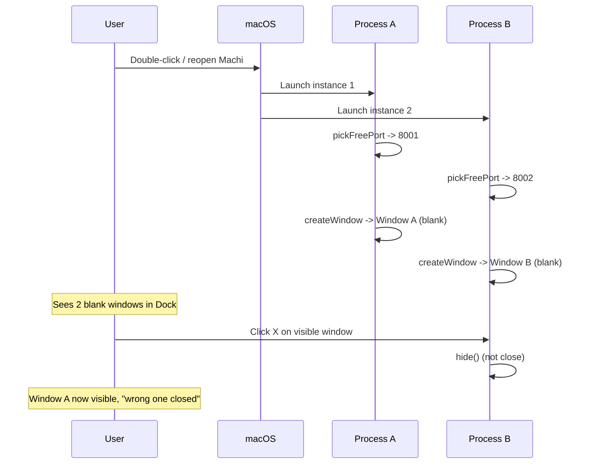

# 修复 Machi Desktop 双窗口冻结问题

## 根因分析

从 `desktop/electron/main.ts` 源码确认：

1. **没有调用 `app.requestSingleInstanceLock()`**（全文搜索无匹配）。macOS 上双击/重复打开应用时，会启动两个独立进程，各自创建一个 BrowserWindow 和一个 `agx-server` 后端子进程。两个进程的窗口被 macOS 归到同一个 Dock 图标下，在右键菜单中出现两个 "AgenticX Desktop" 窗口条目。
2. `**close` 事件是 `hide()` 而非真正关闭**（L643-648）。用户点叉号时，窗口只是隐藏，另一个进程的窗口浮出变成可见，导致"叉掉一个、先叉另一个"的诡异体验。
3. **BrowserWindow 没有 `show: false`**（L611-626）。窗口创建后立即可见，但 `loadFile` 需要时间，用户看到一个空白透明帧。加上 `backgroundColor: "#00000000"` 全透明，进一步加剧"卡住"观感。
4. `**loadFile` 错误被静默吞掉**（L629 `.catch(() => {})`）。如果打包后 `dist/index.html` 路径错误，窗口将永远空白且无任何提示。




## 修改文件

`[desktop/electron/main.ts](desktop/electron/main.ts)` -- 唯一需要修改的文件

## 具体修改

### 1. 加入单实例锁（最关键）

在 `app.setName("Machi")` 之前（约 L1689），加入 `requestSingleInstanceLock()` 逻辑：

```typescript
const gotTheLock = app.requestSingleInstanceLock();
if (!gotTheLock) {
  app.quit();
} else {
  app.on("second-instance", () => {
    if (mainWindow) {
      if (mainWindow.isMinimized()) mainWindow.restore();
      mainWindow.show();
      mainWindow.focus();
    }
  });

  app.setName("Machi");
  // ... existing whenReady / activate / before-quit ...
}
```

效果：第二个进程启动后立即退出，第一个进程收到 `second-instance` 事件后把已有窗口拉到前台。

### 2. BrowserWindow 加 `show: false` + `ready-to-show`

在 `createWindow()` 中：

- BrowserWindow 构造参数加 `show: false`
- 监听 `ready-to-show` 事件再 `mainWindow.show()`

避免白屏闪烁，窗口仅在内容就绪后才可见。

### 3. loadFile 失败时给用户提示

将 `void mainWindow.loadFile(indexPath).catch(() => {})` 改为 catch 中加载一个内嵌的错误页（与 dev 模式的 fallback 对齐），避免静默空白。

## 不改的部分

- 不改 `electron-builder.yml`、`package.json`、`preload.ts`
- 不改后端启动逻辑（`startStudioServe` / `waitServeReady`）
- 不改 IPC / tray / menu
- 不添加 `window-all-closed` handler（macOS 默认行为已正确：不退出应用）

