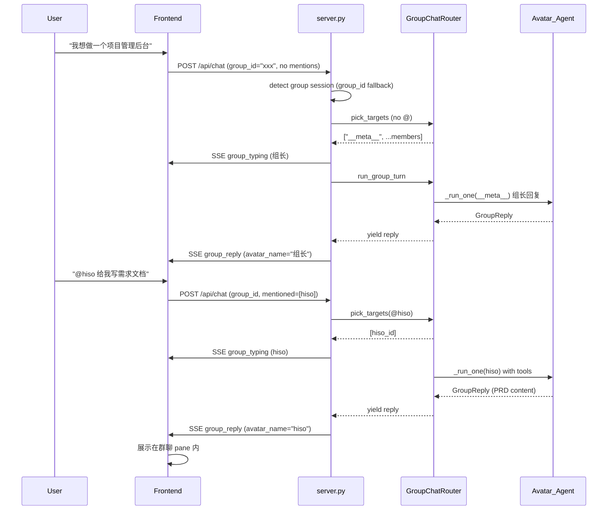

# 群聊路由修复与组长机制

## 问题根因分析

通过代码追踪发现了 **两个关键问题链** 导致用户看到的异常表现：

### 问题 1：群聊消息误入 Meta-Agent 流

`[agenticx/studio/server.py](agenticx/studio/server.py)` 的 `/api/chat` 入口按此顺序判定路径：

```
target_agent_id != "meta"  ->  sub-agent flow
is_group_session = True    ->  group_chat_stream
else                       ->  meta-agent flow (带 delegate_to_avatar 等工具)
```

`is_group_session` 取决于 `_meta_group_chat_payload(managed)` 的返回值，该函数用 `managed.avatar_id.startswith("group:")` 判定。**当 `managed.avatar_id` 为 `None`（例如 session 被 manager 回收后重建但丢失 avatar_id），消息会直接落入 meta-agent 流**，meta-agent 看到 @hiso 后调用 `delegate_to_avatar`，在单独 session 里执行任务。

证据链：

- 用户在群聊中看到 "已委派给 hiso（产品专家），任务进行中。" -- 这是 `delegate_to_avatar` 的 tool result 格式化文案，只存在于 meta-agent 流
- 用户看到 "Thought" 前缀的思考过程 -- 群聊流只返回 `FINAL` 事件的最终文本，不会包含 thinking tokens
- hiso 的回复出现在独立 pane（图4 底部）-- 这是 `_run_delegation_in_avatar_session` 的行为

### 问题 2：群聊缺少"组长"角色

当前 `GroupChatRouter.pick_targets` 的逻辑：

- 有 @ 时：只返回被 @ 的 avatar
- 无 @ + broadcast：返回所有群成员
- 无 @ + round-robin：轮询选一个

**缺少 meta-agent 作为"组长"**。当用户说 "我想做一个项目管理后台" 时，所有群成员都被广播，每个人都尝试回复，但没有一个协调者来统筹。

### 问题 3：群聊 agent 无工具

`[agenticx/runtime/group_router.py](agenticx/runtime/group_router.py)` 的 `_run_one` 函数用 `tools=[]` 调用 `AgentRuntime.run_turn`。Agent 在群聊中无法使用任何工具（写文件、搜索等），只能做纯文本回复。这无法满足 "写一个需求文档" 这类任务。

### 问题 4：MiniMax-M2.7 兼容性

错误 `invalid chat setting (2013)` 是 MiniMax API 对请求格式的拒绝，可能与空 tools 参数或消息格式有关。这是独立的模型兼容性问题，不在本 plan 范围内（建议单独排查）。

---

## 修复方案

### 修复 A：加固群聊 session 检测（防止消息误入 meta-agent 流）

**文件**: `[agenticx/studio/server.py](agenticx/studio/server.py)`

1. 在 `/api/chat` 入口，增加**双重检测**：除了 `managed.avatar_id`，还检查 `payload.mentioned_avatar_ids` 是否存在（只有群聊前端才会发送此字段），作为 fallback 判定群聊
2. 当检测到不一致（前端发了 `mentioned_avatar_ids` 但 `managed.avatar_id` 不是 "group:"），主动修复 `managed.avatar_id`
3. 前端 `ChatRequest` 新增 `group_id` 字段，由前端在群聊时显式传入，让后端不再完全依赖 session 状态

**文件**: `[agenticx/studio/protocols.py](agenticx/studio/protocols.py)`

- `ChatRequest` 新增 `group_id: Optional[str] = None`

**文件**: `[desktop/src/components/ChatPane.tsx](desktop/src/components/ChatPane.tsx)`

- `sendChat` 在 `isGroupPane` 时，body 增加 `group_id: groupChatId`

### 修复 B：Meta-Agent 作为群聊"组长"

**文件**: `[agenticx/runtime/group_router.py](agenticx/runtime/group_router.py)`

1. `pick_targets` 新增逻辑：
  - 当 routing 为 `meta-routed` 且无 @mention 时，在 targets 列表最前面插入 `"__meta__"` 虚拟 ID
  - 当有 @mention 时，不加入 meta（用户明确指定了回答者）
2. `_run_one` 新增 `"__meta__"` 分支：
  - 使用组长系统提示词（"你是这个群聊的组长/协调者，负责统筹调度..."）
  - 有权调度其他成员但不直接 delegate（群聊内用 @ 引导）
  - 使用 group chat session 的 provider/model

**文件**: `[agenticx/studio/server.py](agenticx/studio/server.py)`

- 在 `_group_chat_stream` 中，为 `"__meta__"` 也发送 `group_typing` 事件（显示名为"组长"）

**前端**: 在 `ImBubble` 渲染时，`avatarName === "组长"` 使用 Meta-Agent 图标

### 修复 C：为群聊 Agent 开放工具

**文件**: `[agenticx/runtime/group_router.py](agenticx/runtime/group_router.py)`

1. `_run_one` 中将 `tools=[]` 改为一个受限工具集（STUDIO_TOOLS 的子集）：
  - 允许：文件读写、代码执行、搜索等基础工具
  - 禁止：`delegate_to_avatar`（这是 meta-agent 专属）
  - `spawn_subagent` 保留但增加约束：spawned agent 必须挂载到群聊 session 的 workspace 中
2. 已有的 `spawn_subagent` 名称冲突检测（`meta_tools.py:1415-1436`）已存在，可保持不变

### 修复 D：阻止群聊上下文中的 delegation 自动创建新 pane

**文件**: `[desktop/src/components/ChatPane.tsx](desktop/src/components/ChatPane.tsx)`

- 在 `subagent_started` 事件处理中，增加判定：如果当前 pane 是 `isGroupPane`，则**不创建新 pane**，只在当前群聊 pane 的 workspace（Spawns 面板）中显示 sub-agent 状态

---

## 数据流（修复后）




## 涉及文件清单

- `[agenticx/studio/protocols.py](agenticx/studio/protocols.py)` -- ChatRequest 增加 group_id
- `[agenticx/studio/server.py](agenticx/studio/server.py)` -- 群聊检测加固 + 组长 typing
- `[agenticx/runtime/group_router.py](agenticx/runtime/group_router.py)` -- 组长逻辑 + agent 工具开放
- `[desktop/src/components/ChatPane.tsx](desktop/src/components/ChatPane.tsx)` -- sendChat 传 group_id + 阻止 delegation 新 pane

