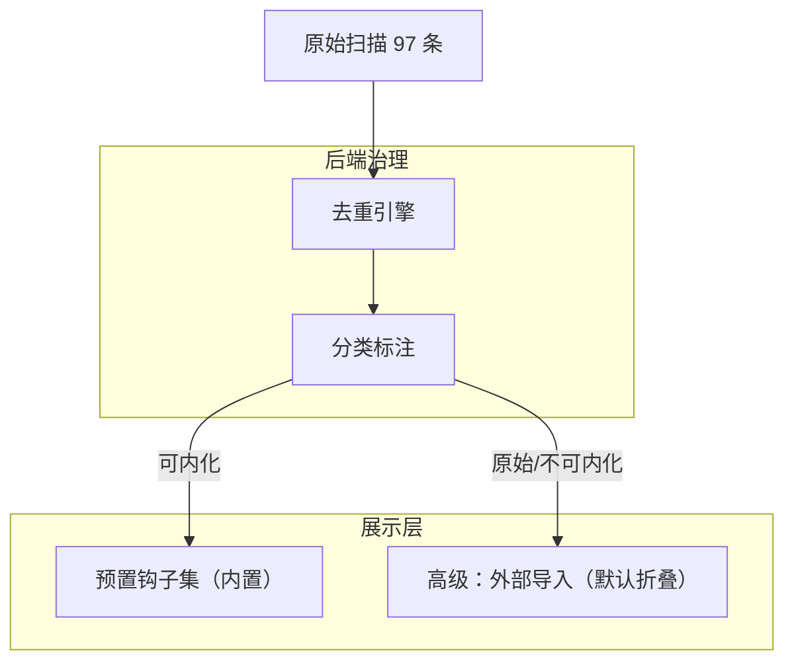

# 钩子去重与内化治理方案

## 现状问题

当前扫描到 97 条外部钩子，存在三大问题：

- **大量重复**：`cache/` 与 `marketplaces/` 各一份、Claude/Cursor 同名脚本交叉出现，同一脚本平均 2-4 条
- **不可直接用**：绝大多数依赖 `${CLAUDE_PLUGIN_ROOT}`、`CURSOR_PLUGIN_ROOT`、`../lib/utils` 等外部环境，在 AgenticX runtime 中执行会报错
- **展示混乱**：同名事件下堆积十几条来源不同但本质相同的条目

## 治理策略：两层分离

### 第一层：后端去重 + 分类

修改 [agenticx/hooks/loader.py](agenticx/hooks/loader.py)

- 新增 `deduplicate_hooks(configs)` 函数：
  - 按 `(normalized_command, event)` 聚合
  - 归一化命令：去掉绝对路径前缀，只保留脚本文件名
  - 同组取第一条为代表，记录 `duplicate_count` 和 `duplicate_sources`
- 新增 `classify_hook(config)` 函数：
  - 标记 `usability`：`native`（可直接执行）/ `needs_env`（依赖 `CLAUDE_PLUGIN_ROOT` 等）/ `unknown`
  - 依据：命令中是否含 `${CLAUDE_PLUGIN_ROOT}`、`${CURSOR_PLUGIN_ROOT}`、`../lib/` 等模式

### 第二层：预置钩子集（内化）

新增 [agenticx/hooks/curated.py](agenticx/hooks/curated.py)

AgenticX 不直接执行外部 `.js` 脚本，而是将有价值的**概念**内化为 Python 原生钩子：

- `session-checkpoint`：会话开始/结束时写状态快照（对应 `session-start.js` + `session-end.js` 的思路）
- `pre-tool-guard`：工具执行前的安全闸门（对应 `convex` 的 `beforeShellExecution` 模式 + Claude 的 tmux/console.log 拦截）
- `compact-advisor`：按工具调用轮数建议主动压缩上下文（对应 `suggest-compact.js`）
- `session-evaluator`：会话结束后提取可复用模式（对应 `evaluate-session.js` 概念，接入 AgenticX 自己的 skill/memory 系统）

这些作为 `bundled/` 下的新 HOOK.yaml + handler.py 包提供，与已有的 `session_memory`、`agent_metrics`、`command_logger` 并列。

### 第三层：前端展示重构

修改 [desktop/src/components/SettingsPanel.tsx](desktop/src/components/SettingsPanel.tsx)

**替换当前的"按事件分组 + 来源分组"嵌套结构**，改为两区块：

- **区块 A：预置钩子**（默认展示）
  - 扁平列表，每条一行：名称 + 简短描述 + 开关
  - 对齐内置工具的展示风格（干净、无路径噪音）
  - 来源 badge 统一标"内置"

- **区块 B：外部导入**（默认折叠）
  - 折叠标题：`外部导入钩子 (N 条，已去重)`
  - 展开后按事件分组、去重后的扁平列表
  - 每条标注 `需要外部环境` 或 `可直接执行`
  - 标注来源数：`来自 Cursor + Claude`

### 第四层：API 适配

修改 [agenticx/studio/server.py](agenticx/studio/server.py)

- `/api/hooks` 返回结构调整：
  - `curated_hooks`：预置钩子列表（从 bundled 目录加载）
  - `imported_hooks`：去重后的外部导入列表，含 `duplicate_count`、`usability` 字段
  - `scan_summary`：扫描摘要（总扫描数、去重后数、各来源计数）

## 实施顺序

1. 后端去重引擎 + 分类标注
2. 预置钩子集（4 个新 bundled hook）
3. API 返回结构调整
4. 前端"预置 + 高级导入"双区块重构
5. 测试覆盖

## 不做的事

- 不直接执行外部 `.js` 脚本（避免 `CLAUDE_PLUGIN_ROOT` 等环境依赖问题）
- 不删除扫描能力（保留为高级功能）
- 不改变已有 bundled hooks（session_memory / agent_metrics / command_logger）
