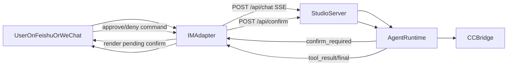

# 手机端闭环到 CC 的差距与实施计划

## 当前已具备能力
- 手机消息可进 Machi：飞书长连、微信 iLink、远程 Gateway 都能把消息送到 Studio 会话。
- Machi 可触发 CC：`cc_bridge_start` / `cc_bridge_send` 链路已打通，`visible_tui` 可把内容投到内嵌终端。
- 运行时事件已有标准化：`tool_call`/`tool_result`/`confirm_required` 等都在 `/api/chat` 的 SSE 流中可获取。
- 外部渠道已有回包能力：飞书与微信适配器都能把文本回复发回手机端。

## 距离目标的核心缺口
- **缺口1：确认并未“回到手机端由人确认”**
  - 当前飞书/微信桥接在收到 `confirm_required` 后会自动 `approved: true` 调 `/api/confirm`，不是人工闭环。
  - 关键位置：`agenticx/gateway/feishu_longconn.py`、`agenticx/gateway/adapters/wechat_ilink.py`、`agenticx/gateway/client.py`。
- **缺口2：CC 的 visible_tui 权限确认只能在本机终端完成**
  - `visible_tui` 下 bridge 不支持 HTTP permission API，确认必须在 TUI 内操作。
  - 关键位置：`agenticx/cc_bridge/http_app.py`、`agenticx/cc_bridge/session_manager.py`。
- **缺口3：手机端缺少“工具进度/待确认”产品化视图**
  - 虽有 SSE 事件，但外部适配器目前主要消费 `token/final`，未把 `tool_*`、`confirm_required`结构化转发到 IM。
- **缺口4：会话绑定策略偏“单机全局”**
  - 飞书长连优先 `_desktop` 全局绑定，不是按每个发送者独立会话，规模化时易串上下文。

## 目标架构（建议）

## 分阶段实施（最小可行）
1. **P0：先实现 Machi 工具确认的人审闭环（不含 CC-TUI 权限）**
   - 外部适配器遇到 `confirm_required` 时，不再 auto-approve；改为推送确认卡片/命令。
   - 接收用户“同意/拒绝”后，携带 `request_id`、`agent_id` 调 `/api/confirm`。
   - 增加超时策略（如 5 分钟默认拒绝）和幂等处理。
2. **P1：把 `tool_call/tool_result/tool_progress` 转成手机端可读状态**
   - SSE 事件节流聚合，避免刷屏。
   - 仅推关键里程碑：开始执行、等待确认、执行完成/失败。
3. **P2：会话绑定治理**
   - 明确按“发送者维度绑定 session”还是“统一绑定到桌面当前 session”。
   - 若要多人并行，改造飞书 `_desktop` 全局绑定逻辑。
4. **P3：CC 权限策略统一**
   - 方案A（推荐）：移动端通道默认用 `headless + permission API`，实现可远程确认。
   - 方案B：继续 `visible_tui`，但明确“CC 权限需本机终端人工确认”，仅将状态同步到手机。

## 关键文件清单（实施会改动）
- `agenticx/gateway/feishu_longconn.py`
- `agenticx/gateway/adapters/wechat_ilink.py`
- `agenticx/gateway/client.py`
- `agenticx/studio/server.py`（确认接口契约与错误码利用）
- `agenticx/runtime/events.py`（如需补充事件字段）
- `desktop/src/components/ChatPane.tsx`（可选：与移动端策略提示文案一致）

## 验收口径（面向你的愿望）
- 手机发任务后，Machi 能自动调 CC 执行。
- 任何 `confirm_required` 都会在手机端收到“可操作确认”。
- 用户在手机端回复同意/拒绝后，任务在 Machi 内继续推进或中止。
- 执行过程至少有 3 个可见状态：执行中、等待确认、完成/失败。
- 全流程不依赖“必须打开本机 GUI 才能继续”（除你选择保留的 visible_tui 限制）。