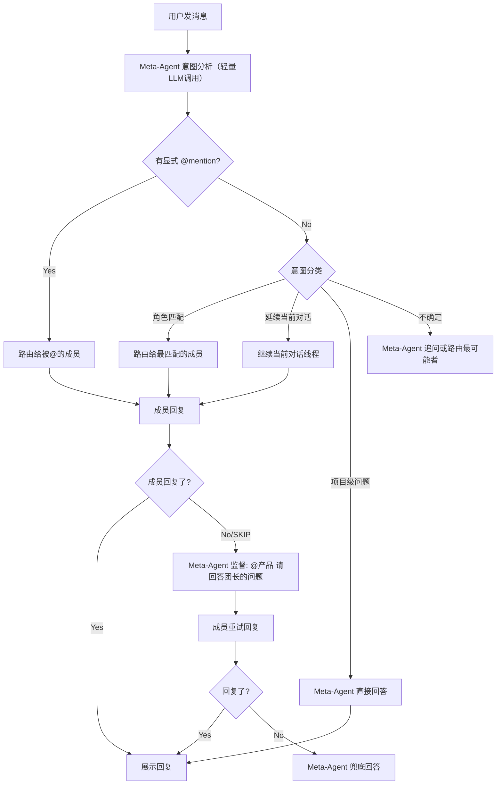

# Intelligent Group Chat - 微信式智能群聊模式

## 核心理念

当前三种路由策略（user-directed / meta-routed / round-robin）过于机械。用户期望的是**一种统一的智能模式**，让 Meta-Agent 作为「隐形项目经理」持续监控对话上下文，智能决定每条消息该由谁回复：




## 当前实现分析

**关键文件**:

- [agenticx/runtime/group_router.py](agenticx/runtime/group_router.py) - `GroupChatRouter`：`pick_targets` 选择目标、`run_group_turn` 执行轮次、`_run_one` 单个 avatar 调用
- [agenticx/runtime/group_context.py](agenticx/runtime/group_context.py) - `GroupChatContext`：共享历史读写、`render_recent_dialogue()` 渲染上下文
- [agenticx/studio/server.py](agenticx/studio/server.py) - `/api/chat` 群聊分支：SSE 事件流 `group_typing`/`group_reply`/`group_skipped`
- [agenticx/avatar/group_chat.py](agenticx/avatar/group_chat.py) - `GroupChatConfig`：配置持久化
- [desktop/src/components/ChatPane.tsx](desktop/src/components/ChatPane.tsx) - 前端群聊消息发送/渲染
- [desktop/src/components/AvatarSidebar.tsx](desktop/src/components/AvatarSidebar.tsx) - 群聊编辑/路由策略选择 UI

**当前 `pick_targets` 逻辑**（[group_router.py:59-82](agenticx/runtime/group_router.py)）：

- 有 @mention → 仅返回被@的成员
- round-robin → 轮询一个成员
- meta-routed → `[__meta__, *所有成员]`（全员广播，每人自行判断 `__SKIP`__）
- user-directed 无 @ → 广播所有成员

**核心问题**：meta-routed 模式虽然让 Meta-Agent 参与，但它是**并发广播**给所有成员，每个成员独立决定是否 `__SKIP_`_。没有意图预分析，没有对话线程追踪，没有监督和 nudge 机制。

## 设计方案

### 1. 新增 `intelligent` 路由策略

新增一种路由策略 `intelligent`，作为新群聊的默认选项。保留现有三种策略以兼容。

**核心流程（三阶段）**：

**Phase 1 - 意图分析**：

- Meta-Agent 进行一次轻量 LLM 调用（structured JSON output）
- 输入：用户消息 + 群成员列表（含角色） + 最近对话上下文 + 当前活跃线程
- 输出：`{ "action": "route_to" | "meta_direct" | "continue_thread", "target_ids": [...], "reason": "..." }`

**Phase 2 - 执行**：

- `route_to`：只调用被选中的 1-2 个成员
- `meta_direct`：Meta-Agent 以「项目经理」身份直接回答
- `continue_thread`：延续当前对话线程的对象

**Phase 3 - 监督**：

- 如果被路由的成员回复 `__SKIP__` 或为空
- Meta-Agent 生成一条 nudge 消息（如 `"@产品 团长问了需求文档的进度，请回复"`）
- nudge 消息作为 `group_reply` 展示在群聊中
- 被 nudge 的成员强制重试（`force_reply=True`）
- 若仍然无响应，Meta-Agent 兜底回答

### 2. 对话线程追踪

在 `scratchpad` 中维护：

```python
{
    "active_thread": {
        "partner_id": "cole_avatar_id",
        "partner_name": "cole",
        "turn_count": 3,        # 已连续对话轮数
        "last_topic": "前端开发进度"
    }
}
```

- 当用户 @新人 或意图分析判断话题切换时，自动断开旧线程、开启新线程
- 线程信息注入意图分析 prompt，帮助 Meta-Agent 判断是否延续

### 3. 意图分析 Prompt 设计

```
你是群聊「{group_name}」的隐形项目经理。分析用户消息，决定谁应该回复。

## 群成员
{members_with_roles}

## 当前对话线程
{active_thread_info}

## 最近群聊上下文
{recent_dialogue}

## 用户消息
{user_input}

以 JSON 输出：
{
  "action": "route_to" | "meta_direct" | "continue_thread",
  "target_ids": ["avatar_id"],
  "reason": "简短理由"
}

规则：
- 有显式 @mention：action=route_to, target_ids=被@的人
- 明显属于某角色职责：action=route_to, target_ids=该角色
- 和当前线程对象话题延续：action=continue_thread
- 项目全局问题/进度汇总：action=meta_direct
```

### 4. Meta-Agent 直接回答增强

当 action=`meta_direct` 时，Meta-Agent 以项目经理视角回答。其 system prompt 比当前「组长」丰富得多：

- 能看到所有成员的角色和最近发言
- 能综合项目上下文给出全局性回答
- 口吻是「项目经理向团长汇报」

### 5. 前端适配

- 路由策略选择 UI：增加 `intelligent` 选项，描述为「智能对话 · 像项目经理一样自动分配」
- 新 SSE 事件 `group_nudge`：展示 Meta-Agent 的 nudge 消息（和普通 `group_reply` 类似但带特殊标识）
- 建议将 `intelligent` 设为新群聊默认值

## 涉及文件变更


| 文件                                         | 变更类型   | 内容                                                                                           |
| ------------------------------------------ | ------ | -------------------------------------------------------------------------------------------- |
| `agenticx/runtime/group_router.py`         | **重构** | 新增 `_analyze_intent()` 意图分析、`_run_intelligent_turn()` 三阶段流程、`_nudge_and_retry()` 监督重试、对话线程追踪 |
| `agenticx/runtime/group_context.py`        | **增强** | 新增 `active_thread` 读写方法、`render_members_summary()` 成员角色摘要                                    |
| `agenticx/avatar/group_chat.py`            | **小改** | routing 默认值改为 `intelligent`；文档说明                                                             |
| `agenticx/studio/server.py`                | **小改** | 支持 `group_nudge` 事件类型                                                                        |
| `desktop/src/components/AvatarSidebar.tsx` | **小改** | 路由选择 UI 增加 `intelligent` 选项                                                                  |
| `desktop/src/components/ChatPane.tsx`      | **小改** | 处理 `group_nudge` SSE 事件的渲染                                                                   |


## 实施约束

- 现有三种路由模式保持不变，`intelligent` 作为新增策略
- 意图分析使用与群聊 session 相同的 provider/model，不引入额外配置
- 意图分析 prompt 保持精简（token 成本控制）
- nudge 重试最多一次，避免无限循环
- 所有 Python 注释/docstring 英文，遵循 google-python-style 规范

