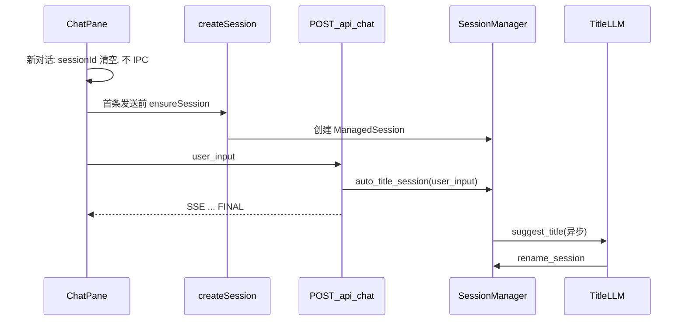

# 延迟建会话 + LLM 会话标题

## 现状与根因

- [`sessionHistoryLabel`](desktop/src/components/SessionHistoryPanel.tsx) 在 `session_name` 为空时用 `session_id` 前 8 位生成 `·xxxx`，即截图中的临时名。
- [`createNewTopic`](desktop/src/components/ChatPane.tsx) 在清空本地消息后立刻调用 [`initSession` → `createSession`](desktop/src/components/ChatPane.tsx)，会话已进入 [`SessionManager.list_sessions`](agenticx/studio/session_manager.py)，但尚未走 [`POST /api/chat`](agenticx/studio/server.py)，因此没有触发入口处的 [`auto_title_session(payload.session_id, payload.user_input)`](agenticx/studio/server.py)（该逻辑会把首条用户输入截成约 48 字标题）。
- 此前为修「列表不刷新」放宽了 `list_sessions` 对**空 `chat_history` 内存会话**的过滤，加剧了「无标题 UUID 会话」出现在列表里。

## 目标行为（对齐你的描述）

1. **新建对话**：本地进入「可输入」状态，**不调用** `createSession`，历史侧栏**不出现**新行。
2. **用户回车发出首条指令**：此时 `createSession`（若选「继承上下文」则带 `inherit_from_session_id`），再发 `/api/chat`；列表在现有 `bumpSessionCatalogRevision` 机制下刷新。
3. **未等模型回复就终止**：服务端在收到 `/api/chat` 时已执行 `auto_title_session`，标题即为**用户 query 截断**（与现有后端一致）。
4. **有模型回复后**：在**首轮 Meta 对话**流式结束（收到 `FINAL`）后，**异步**调用一次 LLM 生成短标题并 `rename_session`（你已选「高质量」方案）。

## 实现要点

### 1. 桌面端：延迟建会话

- 文件：[`desktop/src/components/ChatPane.tsx`](desktop/src/components/ChatPane.tsx)
- **`createNewTopic`**：`clearPaneMessages`、`setPaneSessionId("")`、`setPaneContextInherited`；**不再调用** `initSession`。用 `useRef<string | null>` 保存「继承上下文」时的 `inherit_from_session_id`（仅 `inherit===true` 时写入上一 `sessionId`）。
- **`sendChat` 开头**：在通过 `text`/附件校验后，若 `!pane.sessionId.trim()`：
  - 调用 `window.agenticxDesktop.createSession({ avatar_id, inherit_from_session_id: inheritRef 或 undefined })`，成功后 `setPaneSessionId`、清空 inherit ref、`bumpSessionCatalogRevision`（可与现有延迟 bump 一致）。
  - 再执行原有逻辑（本地 `addPaneMessage` → `fetch /api/chat`）。注意与 **会话冲突分支**（多窗格同 sid）的创建顺序协调，避免重复创建。
- **空 `sessionId` UI**：将当前「正在初始化会话…+重试」改为与「有 session 且无消息」一致的 **Machi 空状态**（或等价文案：「发送首条消息以开始会话」），**不再**默认调用 `initSession(false)`；保留在异常路径或显式「恢复」时再建会话（若有需要可仅保留设置里诊断入口，避免主路径误点）。
- **顶栏 session chip**：`sessionId` 为空时显示「未创建」类占位（避免误导）。

### 2. 其他入口对齐（按需最小改动）

- 检查 [`App.tsx`](desktop/src/App.tsx) / [`AvatarSidebar.tsx`](desktop/src/components/AvatarSidebar.tsx) 是否在「新开窗格」时**强制**预建 session；若与「首条发送再建」产品一致，对 **Meta 单聊** 与 **分身窗格** 采用同一策略，或仅在 Meta 窗格启用延迟建会话（若你要求全端一致，则一并改；请在实现时以「与 ChatPane 行为一致」为准）。
- **群聊 / 自动化** 窗格：若存在必须预绑定 `sessionId` 的约束，可对该类 `pane` **豁免**延迟策略（保持现有 `initSession`），避免破坏定时任务等路径。

### 3. 后端：首轮助手结束后的 LLM 标题

- 文件：[`agenticx/studio/server.py`](agenticx/studio/server.py)（在 Meta 流式路径产出 `EventType.FINAL` 且 `agent_id==meta` 之后）、辅以 [`agenticx/studio/session_manager.py`](agenticx/studio/session_manager.py) 新方法（例如 `schedule_llm_session_title(session_id)`）。
- **行为**：
  - **仅执行一次**每会话：用 `managed.studio_session.scratchpad` 或 metadata 中布尔标记（如 `__agx_llm_title_done__`）防重复。
  - **触发条件**：至少存在一轮 user + assistant 可见内容；可选仅当当前 `session_name` 仍属于「自动填充」范畴（与 [`session_title_needs_auto_fill`](agenticx/studio/session_manager.py) 一致）再调用 LLM，避免覆盖用户手动重命名。
  - **实现**：拼装简短 system/user prompt（输出单行标题、≤20 字中文等约束），通过现有 [`ProviderResolver.resolve`](agenticx/studio/server.py) 与 session 当前 `provider_name`/`model_name`（或环境变量如 `AGX_SESSION_TITLE_MODEL` 覆盖为更小模型）做一次 **非流式** `chat/completions`；清洗后 `rename_session`。
  - **异步**：`asyncio.create_task(...)` + 内部 try/except 打日志，**不阻塞** SSE 结束；失败则保留用户 query 标题。
- **可选**：新增 `POST /api/sessions/{id}/suggest-title` 供调试；非必须若仅服务端自触发即可。

### 4. 列表噪声收敛（建议）

- 文件：[`agenticx/studio/session_manager.py`](agenticx/studio/session_manager.py)
- 在延迟建会话落地后，**恢复**内存分支对 `len(chat_history)==0` 的过滤（或等价：仅列出「已持久化且 messages 非空」+「内存中且已发过至少一条」），避免其他路径再次制造无标题会话；需跑 [`tests/test_session_manager_persistence.py`](tests/test_session_manager_persistence.py) 并视情况增补一条「仅 create 未 chat 不应列出」的断言。

### 5. 验证

- 手动：新对话 → 侧栏无新行 → 首条发送 → 行出现且标题为 query 截断 → 首轮回复结束后标题变为 LLM 短标题（失败则仍为 query）。
- `pytest`：session_manager 相关 + 若有新 title 函数则加小单测（mock LLM 或抽成纯函数测 prompt 解析）。

## 风险与注意

- **LLM 标题成本与延迟**：异步执行，不拖慢主对话；需控制 token 与超时。
- **首条消息前** 依赖 `sessionId` 的 IPC（工作区、部分工具）在空会话阶段应已 `return`（现有大量 `if (!pane.sessionId)`），需快速回归。
- **飞书/微信绑定**：空会话阶段不应写绑定；绑定仍通过历史面板右键，逻辑不变。
