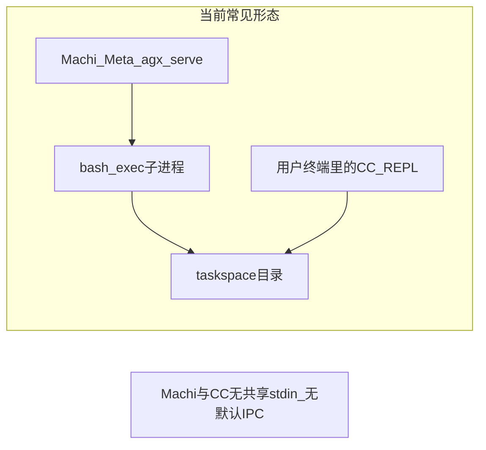
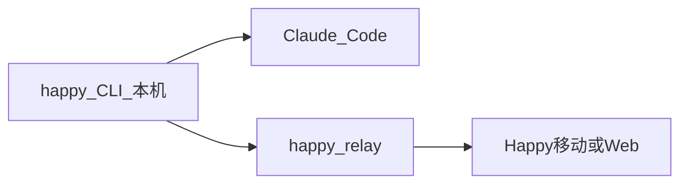

# Machi × HappyCoder × Claude Code：学习与集成路径

## 目标对齐（基于你的选择）

- **体验目标**：类似 HappyCoder——由本机侧的 agent 守住 Claude Code 会话，远端（此处希望是 Machi）发指令，**同一 CC 会话**内执行，并能**感知进度**（而非每次 `bash_exec` 起新 `claude` 子进程）。
- **生态约束**：**尽量沿用 Happy 的 relay/多端模型**（[官方功能说明](https://happy.engineering/docs/features/)：`happy` CLI、WebSocket、E2E 加密、可自托管 relay，后端参考 [slopus/happy-server](https://github.com/slopus/happy-server)）。

## AgenticX / Machi 现状（与对话里 Meta 结论一致）

- **执行位置**：工具如 `bash_exec` 由 [`agx serve`](agenticx/studio/server.py) 侧发起子进程，工作目录受会话 **taskspaces** 约束（见 [`_session_workspace_roots`](agenticx/cli/agent_tools.py) 与 Meta 提示里的 taskspace 说明）。这与「用户 IDE 里已打开的 CC」是**不同进程、不同 stdin**，**不能**在无协作组件的情况下抢占该 REPL 的 TTY。
- **「看见 CC 在干活」**：当前没有到「外部 CC 进程」的订阅通道；`list_mcps` 只能看到已连接的 MCP，**不会自动发现**本机 Happy/CC。
- **直接调 `claude`**：`claude` **不在** [`SAFE_COMMANDS`](agenticx/cli/agent_tools.py) 中，每次通过 `bash_exec` 调用通常会走**确认/高风险**路径；且多为**新进程**，不等于接管已有会话。

## HappyCoder 架构要点（内化学习时抓这几条）

1. **会话锚点在桌面**：`happy` CLI **包装** Claude Code，负责终端状态序列化、与 relay 的加密双向同步（官方文档 *Real-Time CLI Synchronization*）。
2. **控制面在 relay**：消息是 **E2E 加密 blob**；relay（可自建）不读明文。
3. **配对模型**：典型是 **QR / 共享密钥** 建立信任通道；第三方要接入同一加密会话，必须实现**兼容的客户端密码学与会话协议**，或得到官方扩展点。

## 推荐路线（按投入递增）

### 阶段 A — 学习与验证（无 Machi 代码改动）

- **读**：`happy-coder`（npm 全局包 `happy`）CLI 源码、与 [slopus/happy-server](https://github.com/slopus/happy-server) 的 API/WebSocket 载荷形态；确认是否存在「第二桌面客户端」或「自动化注入」的**公开**接口。
- **跑通**：在本机用官方流程 `happy` + 手机/Web 配对，确认你要的「接管感」来自 **happy↔relay↔副设备**，而不是 Machi 直接绑 TTY。
- **与 Machi 共享磁盘**：在 Machi 工作区面板把 **同一仓库路径** 加成 taskspace；CC/happy 也在该目录工作——得到 **文件级一致**，但 **对话上下文仍只在 happy 会话链**里，除非后续做阶段 C。

### 阶段 B — 并行使用（仍不对齐「单一会话」，但可协作）

- 复杂编排、记忆、多工具仍在 **Machi**；需要「同一仓库里 CC 长会话」时在 **happy 包装的终端**里操作。
- 若偶尔要从 Machi **触发一次性** headless CC：用 `bash_exec` + `cwd` 指向 taskspace + 本机 `claude` 的非交互参数（以你本机 CC 文档为准）；接受 **确认弹窗**与 **新进程上下文** 的限制。

### 阶段 C — 与 Happy 生态对齐的「真·接管」（产品级，需协议或上游协作）

在官方**未承诺** Machi 为第三端的前提下，可行方向只有几类（择一并做 spike）：

| 方向 | 思路 | 主要依赖 |
|------|------|----------|
| C1 协议级客户端 | 在 AgenticX 或 Desktop 侧实现与 `happy` **同等的 relay 客户端**（配对、加解密、消息类型），使 Machi 成为「另一台设备」 | 研读 `happy-coder` + `happy-server` 协议；工作量大；需处理密钥与合规 |
| C2 本机桥接（推荐优先评估） | 向 **happy 上游**提议或贡献：在已配对的 `happy` CLI 上增加 **localhost 受控 IPC**（仅本机 token，把 Machi 指令转发进现有会话） | 需上游接受；实现面通常小于完整 E2E 重放 |
| C3 MCP 适配器（若 CC/happy 暴露 MCP） | 独立 MCP server 将「发指令/拉状态」映射为工具，Machi 通过现有 [`/api/mcp/connect`](agenticx/studio/server.py) 连接 | 取决于 CC/happy 是否稳定暴露 MCP；与 Happy 移动端的体验可能不一致 |

**与 Machi 代码的耦合点**（仅当你选定 C1/C2/C3 其一后才值得开工）：Desktop IPC / 新 MCP 配置、以及可选地在 [`SAFE_COMMANDS`](agenticx/cli/agent_tools.py) 或单独工具策略中对待「受控 bridge」命令（应走最小权限，避免把 `claude` 全局加入白名单）。

## 风险与预期管理

- **「完全和 Happy 一致」**：移动端是官方一等公民；**Machi 作为额外控制面**目前不是文档承诺能力，**深集成依赖协议逆向或上游 API/IPC**。
- **安全**：任何「代发 CC 指令」能力都等价于**本机代码执行**；必须与现有 **确认策略 / Run Everything** 策略一致，避免绕过权限模型。
- **远程后端**：若未来使用 [Desktop 远程后端计划](.cursor/plans/2026-03-24-desktop-remote-backend.plan.md)，`bash_exec` 的执行环境可能在云端，与「本机 happy 包装的本机 CC」**不在同一机器**——Happy 模型要求 **happy 与 CC 同机**；架构上需坚持 **本机 bridge** 或 **SSH 到开发机** 再跑 happy。

## 建议的下一步（执行层）

1. **克隆并阅读** [slopus/happy-server](https://github.com/slopopus/happy-server) 与 `happy-coder` CLI（npm 包源码），输出一页「消息类型 + 配对流程 + 是否已有第三方客户端钩子」的结论。
2. **在 Happy GitHub / Discord 等渠道**确认：是否已有「桌面第二客户端」或「自动化 API」路线图；若无，**优先推动 C2（本机 IPC bridge）** 比重写 C1 更现实。
3. 仅当 C2/C3 有明确接口后，再在 AgenticX 仓库内开 **独立 plan**（落盘 `.cursor/plans/`）定义 FR：配对 UX、token 存储、与 `mcp_connect` 或 Electron IPC 的接线方式。
