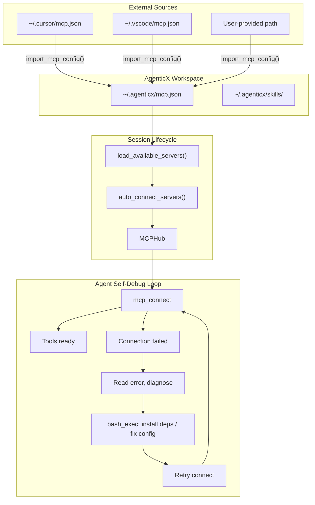

# AgenticX MCP 配置自动导入与自调试闭环

## 问题分析

当前 AgenticX Desktop 的 Agent 遇到 MCP 相关请求时无法正常工作，原因有三：

1. **配置搜索路径缺失**：`load_available_servers()` 只搜索 `.cursor/mcp.json` 和 `~/.cursor/mcp.json`，不搜索 `~/.agenticx/mcp.json`
2. **无导入机制**：不像 OpenClaw 那样能读取外部 MCP 配置并复制到自己 workspace
3. **无自动连接**：Session 启动后 MCP 服务器全部处于"未连接"状态，Agent 需要手动逐一连接
4. **无自调试引导**：Meta-Agent 的 system prompt 没有指导 Agent 在 MCP 连接失败时如何诊断和修复

## 数据流设计




## Phase 1: MCP 配置发现与导入

### 1.1 扩展搜索路径

在 [agenticx/cli/studio_mcp.py](agenticx/cli/studio_mcp.py) 的 `load_available_servers()` 中，将 `~/.agenticx/mcp.json` 加入搜索路径并改为**合并**而非 break-on-first：

```python
search_paths = [
    Path.home() / ".agenticx" / "mcp.json",   # AgenticX 自有配置（优先）
    Path(".cursor/mcp.json"),                   # 项目级 Cursor 配置
    Path.home() / ".cursor" / "mcp.json",       # 全局 Cursor 配置
]
```

合并逻辑：后发现的同名 server 不覆盖先发现的（AgenticX 自有优先）。

### 1.2 新增 `import_mcp_config()` 函数

在 [agenticx/cli/studio_mcp.py](agenticx/cli/studio_mcp.py) 中新增：

```python
def import_mcp_config(source_path: str, target_path: str = None) -> dict:
    """Import MCP config from external source to AgenticX workspace.
    
    Reads source, merges into ~/.agenticx/mcp.json, returns imported servers.
    """
```

- 读取 source_path 的 MCP 配置
- 合并到 `~/.agenticx/mcp.json`（不覆盖已有同名 server）
- 返回导入结果（新增/跳过/冲突列表）

### 1.3 新增 Agent 工具 `mcp_import`

在 [agenticx/cli/agent_tools.py](agenticx/cli/agent_tools.py) 的 `STUDIO_TOOLS` 中新增：

```python
{
    "name": "mcp_import",
    "description": "Import MCP server configs from an external source (e.g. ~/.cursor/mcp.json) into AgenticX workspace.",
    "parameters": {
        "properties": {
            "source_path": {"type": "string", "description": "Path to external mcp.json"}
        },
        "required": ["source_path"]
    }
}
```

## Phase 2: Workspace Bootstrap 增强

### 2.1 扩展 workspace 目录结构

在 [agenticx/workspace/loader.py](agenticx/workspace/loader.py) 的 `ensure_workspace()` 中增加：

- `~/.agenticx/mcp.json` — 空 MCP 配置模板 `{"mcpServers": {}}`
- `~/.agenticx/skills/` — Skills 目录

### 2.2 Bootstrap 时自动发现和导入

`ensure_workspace()` 调用时，如果 `~/.agenticx/mcp.json` 不存在且 `~/.cursor/mcp.json` 存在，自动执行一次 `import_mcp_config()`，并在 daily memory 中记录。

## Phase 3: Session 自动连接

### 3.1 `auto_connect_servers()` 函数

在 [agenticx/cli/studio_mcp.py](agenticx/cli/studio_mcp.py) 中新增：

```python
def auto_connect_servers(hub, configs, connected, auto_connect_list=None) -> dict:
    """Auto-connect MCP servers on session start.
    
    If auto_connect_list is None, connect all. Otherwise connect specified names.
    Returns {name: success_bool} for each attempted server.
    """
```

### 3.2 Studio Session 启动集成

在 [agenticx/cli/studio.py](agenticx/cli/studio.py) 的 Session 初始化中，加入 `auto_connect` 配置项（`config.yaml` 中 `mcp.auto_connect: all | none | [list]`）。

## Phase 4: Meta-Agent 自调试闭环

### 4.1 增强 system prompt

在 [agenticx/runtime/prompts/meta_agent.py](agenticx/runtime/prompts/meta_agent.py) 中的 `build_meta_agent_system_prompt()` 增加 MCP 自调试指导：

```
## MCP 工具管理
- 当用户请求使用 MCP 工具或导入外部 MCP 配置时：
  1. 先调用 `list_mcps` 查看当前配置
  2. 若有配置但未连接，启动子智能体执行 `mcp_connect`
  3. 若连接失败，子智能体应：
     a. 读取错误信息，诊断原因（缺依赖/路径错误/端口冲突）
     b. 用 `bash_exec` 安装缺失依赖或修复配置
     c. 重试连接，最多 3 轮
  4. 若用户提供外部 mcp.json 路径，用 `mcp_import` 导入后再连接
- 当用户说"帮我配置 MCP"或"接入 Cursor 的 MCP"时：
  1. 用 `file_read` 读取 `~/.cursor/mcp.json`
  2. 用 `mcp_import` 导入到 AgenticX workspace
  3. 逐一 `mcp_connect` 并报告结果
  4. 连接失败的自动进入调试流程
```

### 4.2 Meta-Agent 新增 `mcp_import` 工具

在 [agenticx/runtime/meta_tools.py](agenticx/runtime/meta_tools.py) 中新增 `mcp_import` 到 `META_AGENT_TOOLS`，使 CEO 层也能直接触发导入。

## Phase 5: Desktop 集成

### 5.1 Electron IPC 新增

在 [desktop/electron/main.ts](desktop/electron/main.ts) 中增加：

- `import-mcp-config` — 触发 MCP 导入（调用后端 API）
- `load-mcp-status` — 获取 MCP 服务器状态列表

### 5.2 后端 API 新增

在 [agenticx/studio/server.py](agenticx/studio/server.py) 中增加：

- `GET /api/mcp/servers` — 返回 MCP 服务器列表及连接状态
- `POST /api/mcp/import` — 从外部路径导入 MCP 配置
- `POST /api/mcp/connect` — 连接指定 MCP 服务器

### 5.3 Store 和 UI

在 [desktop/src/store.ts](desktop/src/store.ts) 中增加 `mcpServers` 状态。设置面板中增加 MCP 管理区域。

## 涉及文件清单

**修改（7 个文件）**:

- `agenticx/cli/studio_mcp.py` — 搜索路径扩展 + import/auto-connect 函数
- `agenticx/cli/agent_tools.py` — 新增 mcp_import 工具定义和 dispatch
- `agenticx/workspace/loader.py` — bootstrap 增加 mcp.json 和 skills/
- `agenticx/runtime/prompts/meta_agent.py` — MCP 自调试 prompt
- `agenticx/runtime/meta_tools.py` — 新增 mcp_import 到 META_AGENT_TOOLS
- `agenticx/studio/server.py` — 新增 MCP HTTP API
- `agenticx/cli/studio.py` — Session 初始化增加 auto_connect

**修改（Desktop 3 个文件）**:

- `desktop/electron/main.ts` — MCP 相关 IPC handlers
- `desktop/src/store.ts` — mcpServers 状态
- `desktop/src/components/ChatView.tsx` 或新组件 — MCP 管理 UI

