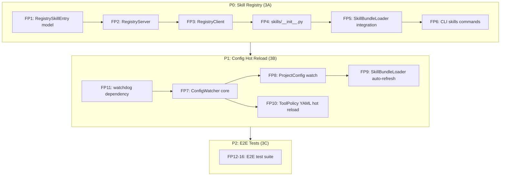

# OpenClaw Phase 3: Ecosystem Enhancement Implementation Plan

## Functional Points Table


| #   | Functional Point                       | Priority | Upstream Evidence               | AgenticX Target                                            | Acceptance Scenario                                                                     |
| --- | -------------------------------------- | -------- | ------------------------------- | ---------------------------------------------------------- | --------------------------------------------------------------------------------------- |
| 1   | RegistrySkillEntry data model          | P0       | OpenClaw ClawHub skill metadata | `agenticx/skills/registry.py`                              | Serializable dataclass with name/version/description/gate/author/created_at/checksum    |
| 2   | SkillRegistryServer (HTTP API)         | P0       | ClawHub publish/search/install  | `agenticx/skills/registry.py`                              | FastAPI server: POST/GET/DELETE /skills endpoints, JSON file storage with atomic writes |
| 3   | SkillRegistryClient                    | P0       | ClawHub client operations       | `agenticx/skills/registry.py`                              | httpx-based client: publish/search/install/uninstall, default URL localhost:8321        |
| 4   | skills package init                    | P0       | -                               | `agenticx/skills/__init__.py`                              | Re-exports SkillRegistryClient, SkillRegistryServer, RegistrySkillEntry                 |
| 5   | SkillBundleLoader registry integration | P0       | -                               | `agenticx/tools/skill_bundle.py`                           | registry_url param, scan() merges local + remote index                                  |
| 6   | CLI skills subcommand group            | P0       | ClawHub CLI                     | `agenticx/cli/main.py` + `agenticx/cli/skills_commands.py` | `agx skills list/search/install/publish/serve/uninstall`                                |
| 7   | ConfigWatcher core                     | P1       | OpenClaw config hot-reload      | `agenticx/core/config_watcher.py`                          | watchdog-based, 500ms debounce, on_change callback, start/stop/context-manager          |
| 8   | ProjectConfig watch integration        | P1       | -                               | `agenticx/deploy/config.py`                                | watch()/unwatch() methods, load_config auto_watch param                                 |
| 9   | SkillBundleLoader auto-refresh         | P1       | -                               | `agenticx/tools/skill_bundle.py`                           | ConfigWatcher signal triggers refresh()                                                 |
| 10  | Tool Policy YAML hot reload            | P1       | -                               | `agenticx/core/hooks/tool_hooks.py`                        | Watch tool-policy.yaml, rebuild ToolPolicyStack on change                               |
| 11  | watchdog dependency                    | P1       | -                               | `pyproject.toml`                                           | Add watchdog to optional deps                                                           |
| 12  | E2E test: overflow recovery            | P2       | -                               | `tests/e2e/test_e2e_overflow_to_recovery.py`               | Execute -> overflow -> L1/L2/L3 progressive recovery                                    |
| 13  | E2E test: auth rotation                | P2       | -                               | `tests/e2e/test_e2e_auth_rotation.py`                      | Rate-limit triggers profile switch and retry success                                    |
| 14  | E2E test: skill lifecycle              | P2       | -                               | `tests/e2e/test_e2e_skill_lifecycle.py`                    | publish -> search -> install -> use -> uninstall                                        |
| 15  | E2E test: config hot reload            | P2       | -                               | `tests/e2e/test_e2e_config_hot_reload.py`                  | Modify config at runtime, verify auto-reload                                            |
| 16  | E2E test: subagent chain               | P2       | -                               | `tests/e2e/test_e2e_subagent_chain.py`                     | Handoff depth limit + PromptMode minimal                                                |


---

## Phase 3A: Skill Registry (P0, Functional Points 1-6)

### FP1: RegistrySkillEntry Data Model

New file: [agenticx/skills/registry.py](agenticx/skills/registry.py)

```python
@dataclass
class RegistrySkillEntry:
    name: str
    version: str
    description: str
    gate: Dict[str, Any]  # serialized SkillGate
    author: str
    created_at: str        # ISO 8601
    checksum: str          # SHA-256 of SKILL.md content
    skill_content: str     # full SKILL.md text
```

- `to_dict()` / `from_dict()` for JSON serialization
- `checksum` computed via `hashlib.sha256`

### FP2: SkillRegistryServer

Same file `registry.py`. Lightweight FastAPI app (FastAPI already in deps).

**Minimal interface:**

- `POST /skills` -- publish a skill (body: RegistrySkillEntry dict)
- `GET /skills` -- list all, optional `?q=<query>` for search (name/description substring match)
- `GET /skills/{name}` -- get specific skill (latest version)
- `DELETE /skills/{name}/{version}` -- remove specific version

**Storage layer:** `RegistryStorage` class:

- Default path: `~/.agenticx/registry.json`
- Atomic write: write to tmp file then `os.replace()`
- Data structure: `{"skills": {"<name>": [RegistrySkillEntry...]}}`
- Provide `RegistryStorage` as an interface so SQLite can replace later

**Server class:**

```python
class SkillRegistryServer:
    def __init__(self, storage_path=None, host="0.0.0.0", port=8321):
        ...
    def create_app(self) -> FastAPI:
        ...
    def run(self):
        uvicorn.run(self.create_app(), host=self.host, port=self.port)
```

### FP3: SkillRegistryClient

Same file. httpx-based (httpx already in deps).

```python
class SkillRegistryClient:
    def __init__(self, registry_url="http://localhost:8321"):
        ...
    def publish(self, skill_path: Path) -> RegistrySkillEntry:
        # Read SKILL.md, compute checksum, POST /skills
    def search(self, query: str = "") -> List[RegistrySkillEntry]:
        # GET /skills?q=query
    def install(self, name: str, target_dir: Path = None) -> Path:
        # GET /skills/{name}, write SKILL.md to target_dir
    def uninstall(self, name: str, target_dir: Path = None) -> bool:
        # Remove local skill directory
```

Default install directory: `~/.agenticx/skills/registry/`

### FP4: Skills Package Init

New file: [agenticx/skills/**init**.py](agenticx/skills/__init__.py)

```python
from agenticx.skills.registry import (
    RegistrySkillEntry,
    SkillRegistryClient,
    SkillRegistryServer,
    RegistryStorage,
)
```

### FP5: SkillBundleLoader Registry Integration

Modify: [agenticx/tools/skill_bundle.py](agenticx/tools/skill_bundle.py)

- Add `registry_url: Optional[str] = None` parameter to `__init`__
- In `scan()`, after local scanning, if `registry_url` is set:
  - Create `SkillRegistryClient(registry_url)`
  - Call `client.search()` to get remote skills
  - Merge remote skills into `self._skills` (local takes priority for same name)
  - Handle connection errors gracefully (log warning, continue with local only)

### FP6: CLI Skills Subcommand Group

New file: [agenticx/cli/skills_commands.py](agenticx/cli/skills_commands.py) (following existing pattern of `tools.py`, `volcengine_commands.py`)

Modify: [agenticx/cli/main.py](agenticx/cli/main.py) -- register `skills_app`

Commands:

- `agx skills list [--registry-url URL]` -- list local + remote skills
- `agx skills search <query> [--registry-url URL]` -- search remote registry
- `agx skills install <name> [--registry-url URL] [--target-dir DIR]` -- install from registry
- `agx skills publish <path> [--registry-url URL]` -- publish to registry
- `agx skills serve [--port PORT] [--storage-path PATH]` -- start registry server
- `agx skills uninstall <name>` -- remove locally installed skill

Smoke test: `tests/test_smoke_openclaw_skill_registry.py`

- Happy: create entry, publish, search, install, uninstall
- Boundary: publish duplicate name, search empty result, install non-existent, invalid SKILL.md

---

## Phase 3B: Config Hot Reload (P1, Functional Points 7-11)

### FP7: ConfigWatcher Core

New file: [agenticx/core/config_watcher.py](agenticx/core/config_watcher.py)

```python
class ConfigWatcher:
    def __init__(self, watch_paths: List[Path], debounce_ms: int = 500):
        ...
    def on_change(self, callback: Callable[[Path], None]) -> None:
        ...
    def start(self) -> None:
        # Start watchdog observer in background thread
    def stop(self) -> None:
        # Stop observer
    def __enter__(self) / __exit__():
        # Context manager support
```

Key design:

- Uses `watchdog.observers.Observer` + `watchdog.events.FileSystemEventHandler`
- Debounce via `threading.Timer` (cancel + restart on each event within window)
- Thread-safe: callbacks dispatched on caller's event loop if asyncio, else in watchdog thread
- Watch paths: `agenticx.yaml`, `tool-policy.yaml`, `skills/` directory

### FP8: ProjectConfig Watch Integration

Modify: [agenticx/deploy/config.py](agenticx/deploy/config.py)

- Add `_watcher: Optional[ConfigWatcher]` field to `ProjectConfig`
- `watch(on_reload: Callable = None)` -- creates ConfigWatcher, registers callback that re-loads config from `_config_path`
- `unwatch()` -- stops watcher
- Enhance `load_config()` -- add `auto_watch: bool = False` parameter; if True, calls `config.watch()` after loading

### FP9: SkillBundleLoader Auto-Refresh

Modify: [agenticx/tools/skill_bundle.py](agenticx/tools/skill_bundle.py)

- Add `config_watcher: Optional[ConfigWatcher] = None` parameter to `__init`__
- If watcher provided, register callback: `watcher.on_change(lambda path: self.refresh())`
- Filter: only trigger refresh if changed path is under skills directories

### FP10: Tool Policy YAML Hot Reload

Modify: [agenticx/core/hooks/tool_hooks.py](agenticx/core/hooks/tool_hooks.py)

New function:

```python
def enable_policy_hot_reload(
    policy_stack: ToolPolicyStack,
    policy_yaml_path: Path,
    watcher: ConfigWatcher,
) -> None:
```

- Parses `tool-policy.yaml` (format: list of layers with name/allow/deny)
- On change: re-parse YAML, rebuild layers, replace `policy_stack._layers`
- Provide `load_policy_from_yaml(path: Path) -> ToolPolicyStack` helper

### FP11: Add watchdog Dependency

Modify: [pyproject.toml](pyproject.toml)

- Add `watchdog>=3.0.0,<5` to the core `dependencies` list (it's lightweight, pure Python fallback available)
- Alternative: add to a new `[project.optional-dependencies] hotreload` group

Smoke test: `tests/test_smoke_openclaw_config_watcher.py`

- Happy: write config file, verify callback fires after debounce
- Boundary: rapid writes within debounce window (only one callback), stop/start lifecycle

Smoke test: `tests/test_smoke_openclaw_policy_hot_reload.py`

- Happy: load policy YAML, modify file, verify ToolPolicyStack updates
- Boundary: invalid YAML (graceful error, old policy retained)

---

## Phase 3C: E2E Tests (P2, Functional Points 12-16)

New directory: `tests/e2e/`

All E2E tests mock external dependencies (LLM calls, network) and focus on verifying the integration path end-to-end.


| Test File                          | Coverage                                                                                        |
| ---------------------------------- | ----------------------------------------------------------------------------------------------- |
| `test_e2e_overflow_to_recovery.py` | OverflowRecoveryPipeline + ContextCompiler: simulate overflow, verify L1->L2->L3 progression    |
| `test_e2e_auth_rotation.py`        | AuthProfileManager: simulate rate-limit, verify profile switch + retry + backoff                |
| `test_e2e_skill_lifecycle.py`      | SkillRegistryServer + Client + SkillBundleLoader: publish->search->install->use->uninstall      |
| `test_e2e_config_hot_reload.py`    | ConfigWatcher + ProjectConfig + SkillBundleLoader: modify config at runtime, verify auto-reload |
| `test_e2e_subagent_chain.py`       | Handoff depth limit + PromptMode minimal verification                                           |


---

## Implementation Order

Strictly follow P0 -> P1 -> P2. Within each priority, implement one functional point at a time with its smoke test.




## Key Design Decisions

- **No new heavy dependencies for 3A**: FastAPI and httpx are already in deps. Registry server is a thin FastAPI app.
- **watchdog for 3B**: Lightweight (pure Python fallback on unsupported platforms), well-maintained, standard choice. Add to core deps since it's only ~100KB.
- **Storage layer abstraction**: `RegistryStorage` class wraps JSON file access, allowing future SQLite migration without API changes.
- **Local-first priority**: In `scan()` merge, local skills always override remote skills with the same name.
- **Graceful degradation**: Registry client errors (connection refused, timeout) are logged as warnings; the system falls back to local-only operation.
- **File header compliance**: All new files follow `google-python-style.mdc` rule -- English docstrings, `Author: Damon Li`, no relative imports, no emoji.

## Files Changed Summary

**New files:**

- `agenticx/skills/__init__.py`
- `agenticx/skills/registry.py`
- `agenticx/core/config_watcher.py`
- `agenticx/cli/skills_commands.py`
- `tests/test_smoke_openclaw_skill_registry.py`
- `tests/test_smoke_openclaw_config_watcher.py`
- `tests/test_smoke_openclaw_policy_hot_reload.py`
- `tests/e2e/__init__.py`
- `tests/e2e/test_e2e_overflow_to_recovery.py`
- `tests/e2e/test_e2e_auth_rotation.py`
- `tests/e2e/test_e2e_skill_lifecycle.py`
- `tests/e2e/test_e2e_config_hot_reload.py`
- `tests/e2e/test_e2e_subagent_chain.py`

**Modified files:**

- `agenticx/tools/skill_bundle.py` -- registry_url param, ConfigWatcher integration
- `agenticx/cli/main.py` -- register skills_app
- `agenticx/deploy/config.py` -- watch/unwatch, auto_watch
- `agenticx/core/hooks/tool_hooks.py` -- policy hot reload
- `pyproject.toml` -- add watchdog dependency

