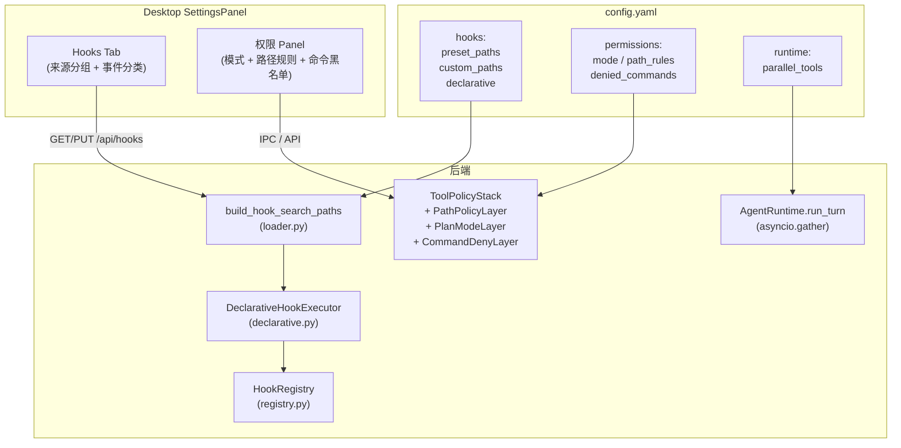

# OpenHarness Hook/权限/并行 实施计划

## 背景

来源：[OpenHarness_proposal.md](research/codedeepresearch/OpenHarness/OpenHarness_proposal.md) + 用户确认的两个设计决策

## 一、声明式 Hook 系统（P0）

### 1.1 后端：声明式 Hook 加载与执行

在 `agenticx/hooks/` 体系中增加声明式 hook 支持：

- **新增** `agenticx/hooks/declarative.py`：
  - `DeclarativeHookConfig`（Pydantic model）：支持 4 种类型 command/http/prompt/agent
  - `DeclarativeHookExecutor`：按类型分发执行（shell subprocess / httpx POST / LLM 判断）
  - 适配到现有 `HookRegistry` 的事件分发体系
- **修改** `agenticx/hooks/loader.py` 的 `resolve_hook_dirs`：
  - 新增 `build_hook_search_paths()` 函数（参照 `skill_bundle.py` 的 `build_skill_search_paths`）
  - 核心路径：`~/.agenticx/hooks/`（始终扫描）
  - 预设路径（可在 config.yaml 开关）：`~/.cursor/hooks/`、`~/.claude/hooks/`、`~/.openharness/hooks/`
  - 自定义路径：`config.yaml` 的 `hooks.custom_paths` 列表
  - 扫描 `hooks.json` / `HOOK.yaml` / `handler.py`，兼容 Cursor/Claude/OpenHarness 三种 hook 配置格式
- **修改** `agenticx/hooks/config.py`：增加 `hooks.preset_paths` / `hooks.custom_paths` 读取
- **新增** Studio API：`GET /api/hooks`（返回聚合后的所有 hook，标注来源）、`PUT /api/hooks/settings`（持久化路径配置与 hook 启停）

### 1.2 前端：Hooks Tab

在 [desktop/src/components/SettingsPanel.tsx](desktop/src/components/SettingsPanel.tsx) 中新增 Hooks Tab：

- `SettingsTab` 联合类型增加 `"hooks"`
- `TABS` 数组增加 `{ id: "hooks", label: "Hooks", icon: Zap }`（放在 Skills 之后、Automation 之前）
- Tab 内容布局（对齐 Cursor 截图风格）：
  - **顶部统计**：`Configured Hooks (N)` 折叠头
  - **配置路径区域**：主路径只读 + 预设路径开关 + 自定义路径列表（复用 MCP Tab 的 `mcpExtraPaths` 交互模式）
  - **Hook 列表**：按来源分组 → 组内按事件类型（preToolUse / postToolUse / sessionStart / sessionEnd）分类
  - 每条 hook 显示：类型 badge（复用 `skillSourceBadge` 色彩体系）+ 内容摘要 + matcher + block 开关
  - 来源 badge：内置 / Cursor / Claude / OpenClaw / 自定义
- IPC：`get-hook-settings` / `put-hook-settings` / `list-hooks`

### 1.3 Hook 格式兼容

需要解析三种外部 hook 格式：

- **Cursor hooks**（`~/.cursor/hooks/`）：`hooks.json` 内 `preToolUse` / `postToolUse` 数组，每项为 `node -e "..."` 形式的 command hook
- **Claude Code hooks**（`~/.claude/hooks/`）：同 Cursor 格式（Claude Code 复刻 Cursor hooks 协议）
- **OpenHarness hooks**（`~/.openharness/hooks/`）：`hooks.json` 含 command/http/prompt/agent 4 种类型
- **AgenticX 原生**（`~/.agenticx/hooks/`）：`HOOK.yaml` + `handler.py` Python 文件，以及新增的 YAML 声明式配置

## 二、权限增强（P1）

### 2.1 后端

- **修改** [agenticx/tools/policy.py](agenticx/tools/policy.py)：
  - 新增 `PathPolicyLayer`：fnmatch 路径规则 allow/deny
  - 新增 `PlanModeLayer`：plan mode 下阻止变更工具（`is_read_only` 判定）
  - 新增 `CommandDenyLayer`：fnmatch 命令黑名单
- **修改** `agenticx/cli/config_manager.py`：
  - `AgxConfig` 增加 `permissions` 字段（`PermissionsConfig` dataclass：`mode`、`path_rules`、`denied_commands`、`denied_tools`、`allowed_tools`）
- **修改** `agenticx/runtime/agent_runtime.py` 或 `agenticx/runtime/confirm.py`：
  - 加载 config.yaml 的 `permissions` 节构建 `ToolPolicyStack`
  - Plan Mode 下 `ConfirmGate` 行为变更：只读工具自动放行，变更工具阻止

### 2.2 前端：权限 Panel 扩展

在 [desktop/src/components/SettingsPanel.tsx](desktop/src/components/SettingsPanel.tsx) 的 `tab === "general"` 中扩展现有「权限」Panel：

- **权限模式**：现有 select 增加 `plan`（只读模式）选项
- **路径规则列表**（新增区域）：
  - 每行：`pattern` input + allow/deny 切换 + 删除按钮
  - 底部「添加规则」按钮
- **命令拒绝列表**（新增区域）：
  - 每行：fnmatch pattern input + 删除按钮
  - 底部「添加命令」按钮
- 持久化到 `config.yaml` 的 `permissions` 节

## 三、多工具并行执行（P1）

- **修改** [agenticx/runtime/agent_runtime.py](agenticx/runtime/agent_runtime.py)：
  - `run_turn` 中 tool_calls > 1 时用 `asyncio.gather` 并行 dispatch
  - 配置开关 `AGX_PARALLEL_TOOLS`（默认关闭）
  - `config.yaml` 可配 `runtime.parallel_tools: true`

## 四、数据流总览

