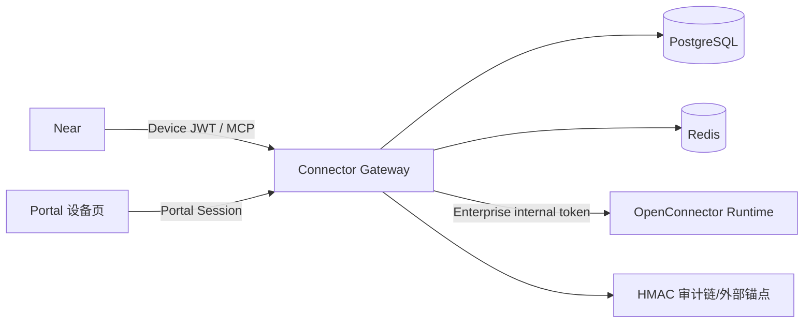

# Enterprise 连接器控制面与 MCP Façade

Planned-with: gpt-5.6-sol-medium
Suggested-Impl-Model: gpt-5.6-sol-medium
Status: implementation-ready
Parent-Plan: `.cursor/plans/2026-07-12-enterprise-connector-gateway.plan.md`
Depends-On: `.cursor/plans/2026-07-12-enterprise-connector-gateway-poc.plan.md` G1

## 目标

新增 `enterprise/apps/connector-gateway` 独立服务，负责 Enterprise/Near 身份、多租户连接映射、设备授权、provider 编排、只读 Action 权限、审计与固定四工具 MCP。OpenConnector 仅作为内网执行内核，不直接对 Near/Portal 暴露。

## 约束

- 不修改 `enterprise/apps/gateway` Go LLM Gateway 的职责。
- Gateway 不持有 OpenConnector 完整 Admin Token；运行期只使用受限 internal token。
- Portal JWT 与 Near Device JWT 不可混用。
- 首版所有 write/destructive Action block。
- Portal 首版只做 Near 设备批准/撤销，不做重复连接器管理中心。
- staging 可接 PoC Runtime；生产 feature flag 必须等待 HA 子计划通过。

## 架构



## 数据模型

在 `enterprise/packages/db-schema/src/schema/` 新增：

- `connector-providers.ts`：全局 service/readiness/固定 allowlist，不含 OAuth secret。
- `connector-connections.ts`：tenant/user/service/HMAC alias/status/profile/scopes/`sensitive_read_enabled`。
- `connector-authorizations.ts`：pending/authorizing/pending_confirmation/connected/failed/revoked。
- `connector-device-clients.ts`：token family/generation/current+previous refresh hash/device/jti revoke。
- `connector-cleanup-outbox.ts`：service/alias/version/status/retry，不因 tenant 删除丢失清理依据。
- `connector-audit-events.ts`：tenant chain_seq、HMAC checksum、脱敏事件；tenant 删除只匿名化。
- Migration: `enterprise/packages/db-schema/drizzle/0029_connector_gateway.sql`
- Export: `enterprise/packages/db-schema/src/schema/index.ts`

alias 公式：

```text
"oc_" + base64url(
  HMAC-SHA256(CONNECTOR_ALIAS_KEY, tenant_id + ":" + user_id + ":" + connection_id)
)[0:32]
```

alias 不含租户名、邮箱或可识别 ID。

## API 与状态合同

REST 使用 `{ code, message, data }`；MCP/metrics/health 遵循各自协议。

### Near Device

- `POST /connectors/v1/device/authorizations`
- `POST /connectors/v1/device/token`
- `POST /connectors/v1/device/token/refresh`
- `DELETE /connectors/v1/device/clients/:id`
- Portal proxy：`POST /api/connectors/device/approve`

设备码：8 位 user code、10 分钟 TTL、5 秒轮询。按 code/account/IP 组合限流；GET 不能批准；不存在/过期/已用返回统一文案。

### Connections

- `GET /connectors/v1/connectors`
- `GET /connectors/v1/connections`
- `POST /connectors/v1/connections/:service/authorizations`
- `GET /connectors/v1/authorizations/:id`
- `POST /connectors/v1/authorizations/:id/confirm`
- `DELETE /connectors/v1/connections/:id`

Near 只得到 Enterprise `launch_url`。Portal launch endpoint 同主体重认证后设置 HttpOnly browser nonce，再重定向 provider。callback 后 connection 保持 `pending_confirmation`；用户核对 profile 并选择 `sensitive_read` 后激活。

### MCP

- `POST /connectors/mcp`
- 工具固定：`list_apps`, `search_actions`, `get_action_guide`, `execute_action`
- 从 Device JWT 得到 tenant/user，客户端 alias 永远拒绝。
- Gateway 调 OpenConnector 时强制注入当前 connection alias。

## 首版 Action 权限

### metadata_read（连接确认后默认）

```text
github.get_current_user
gmail.get_profile
tencent_docs.get_current_user
```

### sensitive_read（按 connection 显式开启）

```text
github.get_repository
github.list_branches
github.list_commits
github.get_file_contents
github.get_issue
github.get_pull_request
gmail.list_labels
gmail.list_threads
gmail.search_threads
gmail.get_message
gmail.fetch_message_by_message_id
notion.list_users
notion.search
notion.retrieve_page
notion.retrieve_page_markdown
notion.list_block_children
slack.list_users
slack.list_channels
slack.list_conversations
slack.get_channel_messages
slack.get_thread
slack.get_file
tencent_docs.get_file_metadata
tencent_docs.list_folder
tencent_docs.search_files
tencent_docs.get_doc_content
tencent_docs.get_sheet_range
```

其余 Action、全部 write/destructive、provider proxy 固定 block。上游新增 Action 不自动获得权限。

## 文件

### 领域与 schema

- Create: `enterprise/packages/db-schema/src/schema/connector-providers.ts`
- Create: `enterprise/packages/db-schema/src/schema/connector-connections.ts`
- Create: `enterprise/packages/db-schema/src/schema/connector-authorizations.ts`
- Create: `enterprise/packages/db-schema/src/schema/connector-device-clients.ts`
- Create: `enterprise/packages/db-schema/src/schema/connector-cleanup-outbox.ts`
- Create: `enterprise/packages/db-schema/src/schema/connector-audit-events.ts`
- Modify: `enterprise/packages/db-schema/src/schema/index.ts`
- Create: `enterprise/packages/db-schema/drizzle/0029_connector_gateway.sql`
- Create: `enterprise/features/connectors/package.json`
- Create: `enterprise/features/connectors/tsconfig.json`
- Create: `enterprise/features/connectors/src/{types,repos,alias,read-only-allowlist,redaction}.ts`
- Create: `enterprise/features/connectors/src/index.ts`
- Create: `enterprise/features/connectors/src/__tests__/{alias,tenant-isolation,read-only-allowlist,cleanup-outbox,audit-chain,redaction}.test.ts`

### Gateway service

- Create: `enterprise/apps/connector-gateway/package.json`
- Create: `enterprise/apps/connector-gateway/tsconfig.json`
- Create: `enterprise/apps/connector-gateway/src/server.ts`
- Create: `enterprise/apps/connector-gateway/src/config.ts`
- Create: `enterprise/apps/connector-gateway/src/auth/{device-grant,device-token,device-jwt-service,portal-jwt}.ts`
- Create: `enterprise/apps/connector-gateway/src/routes/{device,connectors,connections,health}.ts`
- Create: `enterprise/apps/connector-gateway/src/mcp/{server,tools}.ts`
- Create: `enterprise/apps/connector-gateway/src/runtime/open-connector-client.ts`
- Create: `enterprise/apps/connector-gateway/src/providers/{catalog,bootstrap,readiness}.ts`
- Create: `enterprise/apps/connector-gateway/src/policy/read-only-allowlist.ts`
- Create: `enterprise/apps/connector-gateway/src/workers/cleanup-outbox.ts`
- Create: `enterprise/apps/connector-gateway/src/audit.ts`
- Create: `enterprise/apps/connector-gateway/src/__tests__/`
- Modify: `enterprise/turbo.json`
- Modify: `enterprise/scripts/start-dev.sh`
- Modify: `enterprise/scripts/start-dev-with-infra.sh`

### Portal device UI

- Create: `enterprise/apps/web-portal/src/app/connect/near/page.tsx`
- Create: `enterprise/apps/web-portal/src/app/connect/devices/page.tsx`
- Create: `enterprise/apps/web-portal/src/app/api/connectors/device/approve/route.ts`
- Create: `enterprise/apps/web-portal/src/app/api/connectors/devices/route.ts`
- Create: corresponding `__tests__` under those routes/pages.

## 实施单元

### C1. Schema 与领域 repo

- 所有用户数据查询强制 tenant+user 索引条件。
- 全局 provider catalog repo 是唯一无 tenant 例外，只读。
- connection/tenant 删除事务先写 cleanup outbox，再删领域映射。
- audit chain 以 tenant 为链作用域，advisory lock 分配 `chain_seq`，独立 HMAC key，链头发送 `CONNECTOR_AUDIT_ANCHOR_URL`。

### C2. Device grant 与 Device JWT

新增独立 `DeviceJwtService`，签发/验证：

```text
iss
aud=agenticx-connectors
typ=device_access
tenant_id
user_id
device_client_id
jti
token_family_id
exp
```

access 15 分钟；refresh 30 天、family/generation 轮换、事务 CAS；重放撤销设备族。每次 MCP 执行检查 device/jti deny-list。

### C3. Connection/OAuth 编排

- 创建 connection 与 HMAC alias。
- 返回 Enterprise launch URL，不返回 provider 原始 URL。
- 调 Runtime 受限 OAuth-start façade。
- poll exact connection；profile 确认后激活。
- 断开先 `revoking`，Runtime delete 成功后 `revoked`；失败保留可重试错误。
- cleanup worker 使用 `FOR UPDATE SKIP LOCKED`、幂等 delete、指数退避。

### C4. MCP façade

- 使用 Hono + `@modelcontextprotocol/sdk`。
- tool schema 总大小 <2 KB。
- `list_apps/search_actions` 限制/分页，不返回上游全量 465 KB。
- Runtime 超时/429/5xx 映射稳定 `connector.runtime.*`；只读 Action可按幂等规则重试。
- `execute_action` 只接受 actionId/input/connectionId；alias/风险声明等额外字段拒绝。

### C5. Portal 设备页

- 显示 Near 设备名、平台、请求权限、申请时间。
- 最近登录超阈值则重新认证。
- POST 批准/拒绝；统一错误防枚举。
- 设备列表仅当前用户，可撤销并即时 deny access。

## 测试

1. tenant A 使用 tenant B connection/device id 返回 404。
2. user code 未批、慢轮询、过期、重放、暴力枚举均符合合同。
3. Portal JWT、错误 audience/type、缺 jti 的 JWT 不能访问 MCP。
4. refresh 并发只有一个 rotation 成功；旧 token 重放撤销 family。
5. `sensitive_read=false` 时正文/私聊/全文 Action 拒绝；开启后仅固定清单可用。
6. write/destructive/unknown Action 永远拒绝。
7. tenant 删除后 outbox 保留 alias，并最终删除 Runtime credential。
8. 双 Gateway 并发审计 chain_seq 连续；删改检测失败；链头锚定成功。
9. 日志/审计不含 token、cookie、authorization、邮件/文档正文或原始 input/output。
10. Runtime 不可用时状态 degraded，不把 connection 改成未连接。

## 验收

- AC-1：GitHub staging OAuth 可经控制面完成到 `pending_confirmation/connected`。
- AC-2：设备绑定无需复制 Token。
- AC-3：四工具 MCP 按 tenant/user/connection 隔离。
- AC-4：Gateway 不持有 Admin Token，客户端不持有 Runtime/Internal Token。
- AC-5：首版 Action 权限符合固定清单。
- AC-6：设备撤销下一次 MCP 请求立即失败。
- AC-7：cleanup/audit/secret redaction 通过测试。
- AC-8：关闭 `CONNECTOR_GATEWAY_ENABLED` 不影响现有 Portal Chat/Go Gateway。

## Definition of Done

1. G1 后全部 C1–C5 通过单元/集成测试。
2. staging 可连接 PoC Runtime，完成 GitHub 纵切；腾讯文档在 provider certification 通过后独立启用。
3. 生产 flag 明确依赖 Runtime HA 子计划，不可绕过。
4. Plan 与代码提交包含本 Plan-Id/Plan-File trailer。

## 追溯

- Plan-Id: `2026-07-12-enterprise-connector-gateway-control-plane`
- Plan-File: `.cursor/plans/2026-07-12-enterprise-connector-gateway-control-plane.plan.md`
