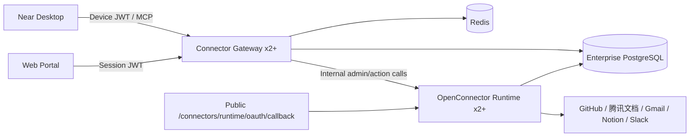
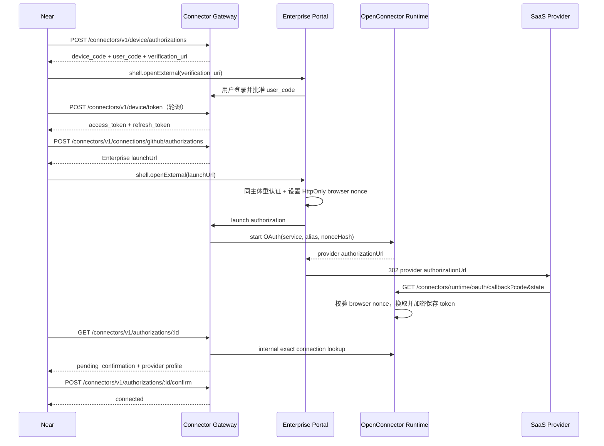
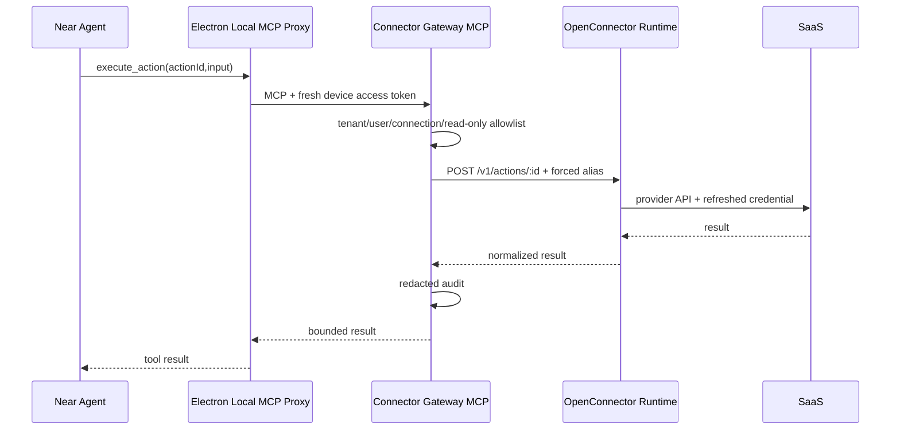

# Enterprise 高可用连接器网关与 Near 接入

Planned-with: gpt-5.6-sol-medium
Suggested-Impl-Model: gpt-5.6-sol-medium
Status: implementation-ready

## 目标

在 `enterprise/` 内新增独立的连接器网关部署单元，为自家 Enterprise Portal 与 Near Desktop 提供统一的 SaaS 账号授权、凭证托管、Action 执行与 MCP 能力。首批覆盖：

1. GitHub
2. 腾讯文档（OpenConnector service id：`tencent_docs`）
3. Gmail
4. Notion
5. Slack

采用“Enterprise 控制面 + OpenConnector 执行内核 + PostgreSQL 高可用适配 + Near 薄客户端”模式。OpenConnector 不直接暴露给 Portal、Near 或 Agent；所有外部请求必须经过 Enterprise Connector Gateway 完成身份校验、租户/用户隔离、策略判断与审计。

本计划以“方便、性价比最高、Near 尽快可用”为排序原则：

- 先用上游单副本 Docker 完成真实 OAuth 认证门禁，避免先做高可用改造后才发现供应商审核或协议不可用。
- 门禁通过后，用上游已有 `RuntimeDatabase` Store 接口补 PostgreSQL adapter，而不是重写 provider catalog、OAuth 刷新和 Action executor。
- Near 通过浏览器设备授权绑定 Enterprise 账号，不要求用户复制 Token。
- Near 只连接 Enterprise 暴露的固定四工具 MCP façade，不直接获取 OpenConnector Runtime/Admin Token。

## 推荐实施模型

| 子任务 | Suggested-Impl-Model | 理由 |
|---|---|---|
| U1 上游锁定与五 provider 认证 | gpt-5.3-codex | 外部协议核验与脚本实施，代码量有限 |
| U2 数据模型与领域包 | gpt-5.3-codex | TypeScript/Drizzle 后端接线 |
| U3 Connector Gateway 与设备授权 | gpt-5.6-sol-medium | 身份、令牌和多租户边界敏感 |
| U4 OpenConnector PostgreSQL HA adapter | gpt-5.6-sol-medium | 跨仓补丁、并发刷新、一致性风险最高 |
| U5 OAuth 编排与只读 allowlist | gpt-5.6-sol-medium | 五家供应商差异、权限与回调安全 |
| U6 Portal 设备批准 UI | composer-2.5-fast | 基于现有 UI 原语的单一授权页面 |
| U7 Near 薄客户端与本地 MCP 代理 | gpt-5.3-codex | Electron/IPC/MCP 接线，需代码专精 |
| U8 部署、可观测性与跨栈收口 | gpt-5.6-sol-medium | 跨 Enterprise/Near/OpenConnector 的高风险验收 |

## 已确认规划决策

- OpenConnector 改造以 AgenticX 仓库内“固定上游 commit + 可复现 overlay build”维护；首期不新建独立 fork。
- 首个用户可用里程碑为 GitHub + 腾讯文档；Gmail、Notion、Slack 各自通过认证后独立 feature flag 上线，不阻塞前两者。
- `sensitive_read` 采用连接确认时按账号一次性显式开启；首版不做逐 Action 弹窗，也不默认开启。

## 子计划与实施顺序

| 子计划 | 范围 | Suggested-Impl-Model | 依赖 |
|---|---|---|---|
| `.cursor/plans/2026-07-12-enterprise-connector-gateway-poc.plan.md` | 固定上游、GitHub/腾讯文档首个认证门禁、其余 provider 独立认证 | gpt-5.3-codex | 无 |
| `.cursor/plans/2026-07-12-enterprise-connector-gateway-control-plane.plan.md` | PG 领域模型、设备授权、MCP façade、provider 编排、Portal 设备页 | gpt-5.6-sol-medium | PoC G1 |
| `.cursor/plans/2026-07-12-enterprise-connector-runtime-ha.plan.md` | OpenConnector PG/CAS/security overlay、双副本、网络与回调部署 | gpt-5.6-sol-medium | PoC G2；可与控制面后半段并行 |
| `.cursor/plans/2026-07-12-near-enterprise-connectors.plan.md` | Near safeStorage、设备绑定、本地 MCP proxy、连接器 UX、全链路上线 | gpt-5.3-codex | 控制面 staging-ready；生产开放依赖 Runtime HA |

---

## 根因与证据

### 已确认事实

- OpenConnector 是连接器执行网关，不是 Agent 框架；它已提供 provider catalog、OAuth/API Key 凭证、token refresh、Action schema/executor、HTTP/OpenAPI 和固定四工具 MCP。
- `research/codedeepresearch/open-connector/spike/decision.md` 的 NO-GO 针对 Near Desktop 全量内嵌：空闲 RSS 约 287–305 MB、原始安装约 651 MB、压缩估算约 222 MB。服务端部署不受 DMG/桌面内存门禁约束。
- `research/codedeepresearch/open-connector/spike/security-contract.md` 证明 Admin/Runtime bearer 鉴权与凭证 AES-GCM 可用，但 Admin 写接口未校验恶意 Origin。故 Admin API 必须只允许 Connector Gateway 内网访问。
- `research/codedeepresearch/open-connector/spike/mcp-contract.md` 证明 OpenConnector MCP 仅暴露 `list_apps`、`search_actions`、`get_action_guide`、`execute_action` 四个工具，不会把 1000+ Action 全量塞入模型上下文。
- 2026-07-12 复核上游 `oomol-lab/open-connector@62796b0d9390df49ed7644692ed75ba576bac9e9`：
  - `src/providers/tencent_docs/definition.ts` 已声明腾讯文档 OAuth2；
  - `src/providers/tencent_docs/actions.ts` 已覆盖用户、网盘、doc、sheet、smartsheet、form 等能力；
  - GitHub、Gmail、Notion、Slack 也在上游 catalog；
  - `src/server/storage/runtime-database.ts` 抽象了 `connectionStore`、`oauthClientConfigStore`、`oauthStateStore`、`runtimeTokenStore`、`runLogStore`；
  - 官方 Node/Docker 运行时只支持 SQLite；Cloudflare 路径使用 D1/R2；没有 PostgreSQL 实现。
- Enterprise 已有 PostgreSQL 多租户 schema、JWT、RBAC、AES-256-GCM/HKDF secret helpers、审计事件和 Redis；这些能力应复用，不能在新网关里平行复制。
- Near 已有连接器设置/菜单、Electron IPC、远程 MCP 配置与本地 `agx serve`，但远程 MCP header 目前是静态值；企业设备 refresh token 不得明文写入 `~/.agenticx/mcp.json`。

### 关键结论

1. 不把连接器逻辑塞入现有 `enterprise/apps/gateway`。该 Go 服务负责 LLM 代理、策略、配额与审计；SaaS OAuth/凭证是独立故障域。
2. 不把 `connector-sdk` 当成中间件。它只是薄 HTTP client；OAuth 与凭证仍由网关承担。
3. 不让 Near 直连 OpenConnector。OpenConnector 自建版没有 Enterprise tenant/user 授权语义，Runtime Token 可访问整个 runtime。
4. 生产高可用不能直接使用上游 SQLite 镜像多副本。必须通过上游 Store 接口实现 PostgreSQL adapter，或明确停留在单活 PoC。本文选择前者。

---

## 产品与安全边界

### In scope

- 新建独立 `connector-gateway` Node/Hono 服务，端口建议 `8090`。
- OpenConnector 作为受控执行内核，固定到不可变 commit/image digest。
- OpenConnector PostgreSQL `RuntimeDatabase` adapter 与双副本部署。
- Redis：设备码 TTL、OAuth/刷新短锁、限流与短期缓存；不得作为连接事实单一来源。
- 五个 OAuth provider 的真实认证、状态、断开与最小 Action 认证。
- Enterprise Portal：Near 设备授权确认页。
- provider readiness、回调 URI、运行状态与失败率通过 API/metrics 暴露；首版不建设重复的 Admin 可视化页。
- Near：浏览器设备绑定、内联 OAuth、连接状态、叠加品牌图标、断开连接、本地安全 MCP 代理。
- Enterprise MCP façade 固定四工具，按 tenant/user 过滤结果与执行连接。
- 审计、限流、熔断、健康检查、滚动发布和回滚。

### Out of scope

- 把现有腾讯会议 CLI、TAPD PAT 迁移到 Enterprise；它们继续走 Near 本地原生连接器。
- 公开销售成类似 Composio/OOMOL 的第三方多租户平台。
- 让客户或浏览器访问 OpenConnector Web Console/Admin API。
- 首版开放任意 provider proxy。
- 首版开放附件上传、文档导出等依赖 transit-file 共享存储的 Action。
- 首版允许删除仓库、发邮件、批量改文档等破坏性 Action 无确认执行。
- 修改 `agenticx/studio/server.py`。
- 将 OAuth Client Secret、provider token、OpenConnector Admin/Runtime Token 写入前端、日志、审计详情或 Near 配置文件。

### 延后工作

- S3/MinIO transit-file adapter 与附件/导出 Action。
- 敏感租户切换独立 OpenConnector 实例的 hybrid 隔离。
- 更多 provider、API Key/custom credential 的通用表单生成。
- Portal 完整连接器管理页与 Admin provider readiness 可视化页。
- write Action 一次性审批、租户级 Action 策略编辑与 destructive Action。
- 面向第三方开发者的公开 SDK 与计费。

---

## 功能需求

### FR-1：独立服务边界

Connector Gateway 必须是 `enterprise/apps/connector-gateway` 独立部署单元，不修改现有 Go LLM Gateway 的职责。Portal、Admin 与 Near 只访问 Connector Gateway 公共 API/MCP；OpenConnector Admin API 仅内网可达。

### FR-2：Near 设备授权

Near 首次绑定采用设备授权语义：

- Near 请求设备码，获得 `device_code`、8 位 `user_code`、`verification_uri`、`expires_in=600`、`interval=5`。
- Near 打开系统浏览器至 Enterprise Portal 授权页。
- 用户以现有 Enterprise 账号登录并确认设备。
- Near 轮询换取 15 分钟 access token 与 30 天 refresh token。
- refresh token 只在 Electron `safeStorage` 中持久化；服务端只存 hash。
- 设备可在 Portal 撤销；refresh 立即失败，Gateway 在每次 MCP 执行前检查 device id/jti deny-list，使现存 access token 也立即失效。

### FR-3：五个 OAuth 连接器

首版由 Near 发起 GitHub、腾讯文档、Gmail、Notion、Slack OAuth；Portal 只承载同主体登录/重认证、设备批准与设备撤销。Connector Gateway 根据当前 `(tenant_id, user_id)` 生成不可猜的 OpenConnector alias：

```text
alias = "oc_" + base64url(
  HMAC-SHA256(CONNECTOR_ALIAS_KEY, tenant_id + ":" + user_id + ":" + connection_id)
)[0:32]
```

alias 不得包含可识别租户名、邮箱或用户 ID。Gateway 调用 OpenConnector 受限 internal façade 时传该 alias，客户端不可自定义 alias。

Near 只能收到 Enterprise `launch_url`，不能收到供应商原始 authorization URL。launch endpoint 要求 Portal 同主体重认证，设置 HttpOnly/Secure/SameSite=Lax 高熵 browser nonce cookie，并把 nonce hash + authorization id 绑定进 OpenConnector OAuth state 后才重定向供应商。供应商 callback 缺少同一 browser nonce 时必须拒绝落凭证；不能只依赖事后 profile 确认。

### FR-4：连接状态与断开

状态统一为：

```text
pending → authorizing → pending_confirmation → connected
                    ↘ failed              ↘ revoked
connected → degraded → connected
connected → revoking → revoked
```

Near 只能看到当前用户连接；Portal 完整连接管理延后。断开连接必须：

1. 将 Enterprise 连接记录置 `revoking`；
2. 删除 OpenConnector 对应 `service + alias` 凭证；
3. 成功后置 `revoked`；
4. 任一步失败保留可重试错误，不能前端伪成功。

### FR-5：固定四工具 MCP façade

`POST /connectors/mcp` 对 Near 暴露：

1. `list_apps`
2. `search_actions`
3. `get_action_guide`
4. `execute_action`

Gateway 必须从设备 access token 得到 tenant/user，过滤连接与 Action，并在调用 OpenConnector `/v1/actions/*` 时强制注入映射 alias。禁止透传客户端 alias、OpenConnector token 或 Admin API。

### FR-6：首版 Action 策略

- 首版只读 Action 分两级：
  - `metadata_read`：连接成功后可用，仅限当前账号/profile 类动作。
  - `sensitive_read`：默认关闭；用户在 provider profile 确认页明确勾选“允许读取内容”后按 connection 开启。
- 所有 write/destructive Action 固定 block；客户端、Near 权限策略或 MCP 参数均不得豁免。
- `/v1/proxy/:service` 首版固定禁用。
- write Action 审批协议另立后续 plan，不进入本计划首发链路。

首版精确清单：

```text
metadata_read:
  github.get_current_user
  gmail.get_profile
  tencent_docs.get_current_user

sensitive_read (per-connection opt-in):
  github.get_repository
  github.list_branches
  github.list_commits
  github.get_file_contents
  github.get_issue
  github.get_pull_request
  gmail.list_labels
  gmail.list_threads
  gmail.search_threads
  gmail.get_message
  gmail.fetch_message_by_message_id
  notion.list_users
  notion.search
  notion.retrieve_page
  notion.retrieve_page_markdown
  notion.list_block_children
  slack.list_users
  slack.list_channels
  slack.list_conversations
  slack.get_channel_messages
  slack.get_thread
  slack.get_file
  tencent_docs.get_file_metadata
  tencent_docs.list_folder
  tencent_docs.search_files
  tencent_docs.get_doc_content
  tencent_docs.get_sheet_range
```

不在清单中的 Action 固定 block。上游升级新增 Action 不得自动继承权限。

### FR-7：Provider readiness

readiness API/metrics 展示每个 provider：

- `configured / missing_secret / callback_mismatch / degraded / healthy`
- 注册回调 URI
- 最近验证时间
- 最近错误码与脱敏摘要
- 可用 Action 数与首版允许数

OAuth Client Secret 来自 K8s/Docker Secret，经部署 bootstrap job 内网同步至 OpenConnector 加密存储；任何 UI 均不提供明文读取或回显。

### FR-8：Near 连接器体验

- `desktop/src/components/settings/connectors/connector-catalog.ts` 增加 `tencent-docs`，并将 GitHub/Gmail/Notion/Slack 的可用性改为 Gateway capability 驱动。
- 未绑定 Enterprise Gateway 时，点击远程连接器先进入设备绑定。
- 已绑定时，点击“连接”直接打开供应商 OAuth，不跳设置页。
- 成功后工具栏显示已连接品牌图标叠加；下拉开关可断开。
- 顶部“管理”仍进入完整连接器设置页。
- Gateway 离线时显示“服务暂不可用”，不得把连接状态误改为未连接。
- 首版只支持 Near 当前本地 `agx serve` 后端；若未来启用远程 Agent backend，必须禁用本机 loopback MCP 代理并显示“远程后端暂不支持企业连接器”，不得生成远端不可达配置。

---

## 非功能需求

### NFR-1：多租户隔离

- 除全局部署级 `connector_providers` 外，所有 Gateway 领域表均含 `tenant_id`；用户数据表同时含 `user_id`。
- 除只读全局 provider catalog repo 外，所有 repo 查询必须在索引条件中包含 tenant；禁止先全表查询再在内存过滤。
- OpenConnector Admin/Runtime token 仅存在于 Connector Gateway/Runtime 进程环境或 Secret volume。
- Runtime 公网只暴露 `/connectors/runtime/oauth/callback`；Admin、`/v1`、原生 `/mcp` 仅内网。
- Gateway 不持有完整 OpenConnector Admin Token；运行身份只持有受限 internal token，可调用 OAuth start、exact lookup/delete 和 Action execute。部署 bootstrap job 单独持有 Admin Token。

### NFR-2：高可用

- Connector Gateway 与 patched OpenConnector Runtime 生产均至少 2 replicas。
- 两者均无本地持久状态；PG 为事实源，Redis 为短期协调。
- OAuth callback 任意副本可处理。
- 同一连接 token refresh 使用 Redis 30 秒租约锁；overlay 扩展 `ConnectionService` 与 Store contract，使用 `compareAndSet(expectedVersion)` 防止锁丢失后旧 token 覆盖新 token。
- readiness 必须检查 PG；Redis/Runtime 不可用时 Gateway 标记 degraded 而非进程崩溃。

### NFR-3：安全

- provider credential 与 OAuth client config 使用带 key id 的 AES-256-GCM keyring；Runtime AAD 必须绑定 `service/alias/record_id/credential_type/key_version`（alias 已由 tenant/user HMAC 派生），密钥从部署 Secret 注入，永不落库。
- device refresh token 按 token family/generation 保存 current/previous HMAC hash，以事务 CAS 检测轮换与重放。
- OAuth state 单次消费、15 分钟过期；state 绑定 tenant/user/service/alias。
- provider authorization URL 打开前要求 Portal 同主体短时重认证；callback 后连接保持 `pending_confirmation`，用户核对 provider profile 后才激活，防止转发 URL 导致账号错绑。
- 公共 API 校验 Origin/CSRF；MCP 与设备 API 只接受 bearer，不使用 cookie。
- 审计写入独立 append-only/HMAC-chain `connector_audit_events`；按 tenant chain 使用 PG advisory lock 分配单调 `chain_seq`，HMAC key 与业务 DB 分离；tenant 删除只匿名化主体，不级联删除保留期内证据。生产必须配置外部 audit anchor sink 定期接收签名链头。
- 审计详情仅记录 action id、service、connection id、device id、JWT jti、结果、耗时、输入摘要 hash；不记录 token、邮件正文、文档正文或原始 Action input/output。

### NFR-4：供应链

- `enterprise/deploy/connector-gateway/open-connector.lock.json` 固定上游 repo、commit `62796b0d9390df49ed7644692ed75ba576bac9e9`、镜像 digest/源码归档 SHA-256。
- 禁止生产使用 `latest`、`tip` 或浮动 branch。
- 构建产出 SBOM，保留 Apache-2.0 LICENSE/NOTICE；第三方品牌权利不由 Apache-2.0 授予。

### NFR-5：性能与容量

- Gateway 自身 P95 附加延迟目标：不含第三方 provider 时间时 ≤150 ms。
- 四工具 MCP schema 保持小于 2 KB。
- `list_apps`、`search_actions` 必须分页/限制，禁止返回上游约 465 KB 全量目录给模型。
- 每用户 OAuth start 与 execute 均有 Redis 限流；429 返回可重试错误和 `retry_after`。

### NFR-6：兼容与回滚

- 上游 provider contract 通过 adapter 层封装；Near 不依赖 OpenConnector 字段。
- 生产可将 Gateway feature flag `CONNECTOR_GATEWAY_ENABLED=0` 关闭，不影响 LLM Gateway、Portal 聊天、Near 本地腾讯会议/TAPD。
- PG migration 只新增表；首版回滚不删除连接数据。

---

## 高层技术设计

### 组件关系



### Near 设备绑定与 OAuth



### Action 执行



---

## 数据模型

在 `enterprise/packages/db-schema/src/schema/` 新增：

### `connector-providers.ts`

- `id`（service id）
- `display_name`
- `auth_type`
- `enabled`
- `readiness`
- `allowed_action_patterns`
- `blocked_action_patterns`
- `last_verified_at`
- `last_error_code`
- audit columns

Provider OAuth secret 不入此表。

### `connector-connections.ts`

- `id`
- `tenant_id`
- `user_id`
- `service`
- `runtime_alias`（HMAC 派生）
- `status`
- `profile`（仅 account id/display name/avatar）
- `granted_scopes`
- `sensitive_read_enabled`（默认 `false`）
- `runtime_version`
- `last_verified_at`
- `last_error_code`
- `revoked_at`
- audit columns

唯一索引：`(tenant_id, user_id, service, id)`；查询索引：`(tenant_id, user_id, status)`；`runtime_alias` 全局唯一。

### `connector-authorizations.ts`

- `id`
- `tenant_id`
- `user_id`
- `connection_id`
- `service`
- `status`
- `runtime_alias`
- `expires_at`
- `completed_at`
- `error_code`
- audit columns

### `connector-device-clients.ts`

- `id`
- `tenant_id`
- `user_id`
- `device_name`
- `platform`
- `token_family_id`
- `token_generation`
- `current_refresh_token_hash`
- `previous_refresh_token_hash`
- `previous_rotated_at`
- `refresh_reuse_detected_at`
- `scopes`
- `last_seen_at`
- `expires_at`
- `revoked_at`
- audit columns

设备码本身只存 Redis：

```text
key: connector:device:<sha256(device_code)>
value: { user_code_hash, status, tenant_id?, user_id?, device_meta }
ttl: 600 seconds
```

设备 access JWT 必须包含 `device_client_id` 与 `jti`；每次 MCP 请求检查设备状态及 Redis deny-list。

### `connector-cleanup-outbox.ts`

- `id`
- `tenant_id`
- `connection_id`
- `service`
- `runtime_alias`
- `credential_version`
- `status`
- `attempts`
- `next_attempt_at`
- `last_error_code`
- audit columns

tenant/connection 删除事务必须先写 outbox/tombstone，再删除领域映射；Runtime 删除确认后才能标记 outbox 完成。

### `connector-audit-events.ts`

- `id`
- `tenant_id`（不建 `ON DELETE CASCADE` FK）
- `actor_user_id`
- `device_client_id`
- `jwt_jti`
- `event_type`
- `service`
- `connection_id`
- `action_id`
- `input_hash`
- `status`
- `latency_ms`
- `chain_seq`
- `prev_checksum`
- `checksum`
- `event_time`

该表 append-only；`(tenant_id, chain_seq)` 唯一。写入事务获取 tenant-scoped advisory lock，checksum 使用独立审计 HMAC key；tenant 删除仅匿名化 actor，不删除保留期内记录。链头按配置周期签名并发送到 `CONNECTOR_AUDIT_ANCHOR_URL`。

OpenConnector 内部 PG adapter 使用独立 `open_connector_*` 表前缀，禁止与 Enterprise 领域表混用。

---

## 公共 API 契约

REST JSON 业务接口使用现有 Enterprise `{ code, message, data }` 形状；MCP、Prometheus metrics 与健康检查遵循各自协议，不套业务 envelope。错误码前缀统一为 `connector.`。

### Device

- `POST /connectors/v1/device/authorizations`
- `POST /connectors/v1/device/token`
- `POST /connectors/v1/device/token/refresh`
- `DELETE /connectors/v1/device/clients/:id`
- Portal：`GET/POST /api/connectors/device/approve`

### Catalog / Connections

- `GET /connectors/v1/connectors`
- `GET /connectors/v1/connections`
- `POST /connectors/v1/connections/:service/authorizations`
- `GET /connectors/v1/authorizations/:id`
- `POST /connectors/v1/authorizations/:id/confirm`
- `DELETE /connectors/v1/connections/:id`

### MCP

- `POST /connectors/mcp`
- `GET /connectors/healthz`
- `GET /connectors/readyz`
- `GET /connectors/metrics`

### Internal only

- Connector Gateway → OpenConnector Admin API
- OpenConnector exact connection lookup（overlay 新增）
- provider readiness probe

公共 Nginx 只将 `/connectors/runtime/oauth/callback` 转发给 OpenConnector Runtime；其 `/api`、`/v1`、`/mcp` 不配置公网路由。`OOMOL_CONNECT_ORIGIN` 固定为公开 origin 加 `/connectors/runtime`，避免与现有 Go Gateway 的 `/v1/` 路由冲突。

---

## 分阶段实施单元

### U1. 上游锁定与五 provider 真实认证门禁

**目标：** 在改造高可用前证明五个 provider 的 OAuth 和最小 Action 可用。

**依赖：** 五家 provider OAuth App 已申请；回调域名可配置 HTTPS。

**文件：**

- Create: `enterprise/deploy/connector-gateway/open-connector.lock.json`
- Create: `enterprise/deploy/connector-gateway/compose.poc.yml`
- Create: `enterprise/scripts/connectors/certify-providers.ts`
- Create: `enterprise/scripts/connectors/provider-certification.fixture.json`
- Create: `enterprise/docs/connectors/provider-certification.md`
- Modify: `enterprise/package.json`

**精确做法：**

- 固定上游 commit `62796b0d9390df49ed7644692ed75ba576bac9e9` 与实际源码归档 SHA-256/image digest。
- PoC 仅单副本、内网 Admin API、HTTPS callback；明确标记 `non-production`。
- 对每个 provider 记录：
  - authorization URL host/path；
  - callback 成功；
  - token refresh（能主动过期或等待则验证，否则标记条件验证）；
  - profile；
  - 一个只读 Action；
  - revoke 后执行失败。
- 腾讯文档测试至少覆盖 user profile + list/search file；不得只验证登录页。

**测试场景：**

- GitHub/Gmail/Notion/Slack/腾讯文档分别完成 OAuth 后，certification 输出 `connected` 与只读 Action 成功。
- 错误 client secret、错误 redirect URI、拒绝授权、过期 state 均返回稳定 `connector.oauth.*` 结果，不泄露 secret。
- 缺少 provider 真实凭证时，该 provider 保持 `blocked`，不得对用户显示可用；不得阻塞已经认证通过的其它 provider 上线。

**门禁：**

- G1：GitHub OAuth + 只读 Action PASS 后，允许 U2/U3 正式实施并启动 Near 纵切联调。
- G2：GitHub + 腾讯文档 PASS，且两者中至少一个真实返回 refresh token 后允许进入 U4；若两者均无 refresh token，则 Gmail 必须先通过 refresh 认证门禁。
- 每个 provider 独立认证、独立 feature flag 上线；总体 DoD 仍要求五个 provider 全部 PASS。

### U2. Enterprise 连接器数据模型与领域包

**目标：** 建立多租户连接、设备、授权、清理 outbox 与审计的 PG 单一事实源。

**依赖：** U1 G1。

**文件：**

- Create: `enterprise/packages/db-schema/src/schema/connector-providers.ts`
- Create: `enterprise/packages/db-schema/src/schema/connector-connections.ts`
- Create: `enterprise/packages/db-schema/src/schema/connector-authorizations.ts`
- Create: `enterprise/packages/db-schema/src/schema/connector-device-clients.ts`
- Create: `enterprise/packages/db-schema/src/schema/connector-cleanup-outbox.ts`
- Create: `enterprise/packages/db-schema/src/schema/connector-audit-events.ts`
- Modify: `enterprise/packages/db-schema/src/schema/index.ts`
- Create: `enterprise/packages/db-schema/drizzle/0029_connector_gateway.sql`
- Create: `enterprise/features/connectors/package.json`
- Create: `enterprise/features/connectors/tsconfig.json`
- Create: `enterprise/features/connectors/src/types.ts`
- Create: `enterprise/features/connectors/src/repos.ts`
- Create: `enterprise/features/connectors/src/alias.ts`
- Create: `enterprise/features/connectors/src/read-only-allowlist.ts`
- Create: `enterprise/features/connectors/src/redaction.ts`
- Create: `enterprise/features/connectors/src/index.ts`
- Create: `enterprise/features/connectors/src/__tests__/alias.test.ts`
- Create: `enterprise/features/connectors/src/__tests__/tenant-isolation.test.ts`
- Create: `enterprise/features/connectors/src/__tests__/read-only-allowlist.test.ts`
- Create: `enterprise/features/connectors/src/__tests__/cleanup-outbox.test.ts`
- Create: `enterprise/features/connectors/src/__tests__/audit-chain.test.ts`
- Create: `enterprise/features/connectors/src/__tests__/redaction.test.ts`

**模式：**

- 仿照 `enterprise/packages/db-schema/src/schema/mcp-servers.ts` 的 tenant 索引与 ULID。
- repo 方法必须显式接收 `tenantId`，不提供无 tenant 的 public list/get。
- alias 使用前述 HMAC 公式；测试断言稳定、不可逆、跨租户不同。
- read-only allowlist 使用 provider/action 精确清单；未命中一律 block，不按 Action 名临时猜测风险。

**测试场景：**

- 同 user/service 在不同 tenant 的查询永不串行。
- 删除 tenant/connection 的同一事务先写 cleanup outbox/tombstone，保留 service/alias/version；U3 worker 确认 Runtime 删除后才完成 outbox。
- audit redaction 对 token、authorization header、cookie、邮件/文档正文键做删除或 hash。
- 双 Gateway 副本并发写审计时 chain_seq 连续且不分叉；删改历史行后链校验失败；外部 anchor 接收签名链头。

### U3. Connector Gateway、设备授权与 MCP façade

**目标：** 新建正式控制面服务，统一 Portal/Near 身份与四工具 MCP。

**依赖：** U2。

**文件：**

- Create: `enterprise/apps/connector-gateway/package.json`
- Create: `enterprise/apps/connector-gateway/tsconfig.json`
- Create: `enterprise/apps/connector-gateway/src/server.ts`
- Create: `enterprise/apps/connector-gateway/src/config.ts`
- Create: `enterprise/apps/connector-gateway/src/auth/device-grant.ts`
- Create: `enterprise/apps/connector-gateway/src/auth/device-token.ts`
- Create: `enterprise/apps/connector-gateway/src/auth/device-jwt-service.ts`
- Create: `enterprise/apps/connector-gateway/src/auth/portal-jwt.ts`
- Create: `enterprise/apps/connector-gateway/src/routes/device.ts`
- Create: `enterprise/apps/connector-gateway/src/routes/connectors.ts`
- Create: `enterprise/apps/connector-gateway/src/routes/connections.ts`
- Create: `enterprise/apps/connector-gateway/src/routes/health.ts`
- Create: `enterprise/apps/connector-gateway/src/mcp/server.ts`
- Create: `enterprise/apps/connector-gateway/src/mcp/tools.ts`
- Create: `enterprise/apps/connector-gateway/src/runtime/open-connector-client.ts`
- Create: `enterprise/apps/connector-gateway/src/audit.ts`
- Create: `enterprise/apps/connector-gateway/src/workers/cleanup-outbox.ts`
- Create: `enterprise/apps/connector-gateway/src/__tests__/device-grant.test.ts`
- Create: `enterprise/apps/connector-gateway/src/__tests__/device-jwt-service.test.ts`
- Create: `enterprise/apps/connector-gateway/src/__tests__/mcp-tenant-scope.test.ts`
- Create: `enterprise/apps/connector-gateway/src/__tests__/connection-routes.test.ts`
- Create: `enterprise/apps/connector-gateway/src/__tests__/authz.test.ts`
- Create: `enterprise/apps/connector-gateway/src/__tests__/cleanup-outbox.test.ts`
- Modify: `enterprise/turbo.json`
- Modify: `enterprise/scripts/start-dev.sh`
- Modify: `enterprise/scripts/start-dev-with-infra.sh`

**技术决定：**

- 使用 Hono + `@hono/node-server` + `@modelcontextprotocol/sdk`，与 OpenConnector 技术栈一致。
- Portal 登录复用 `@agenticx/auth` JWT 与 `@agenticx/iam-core` 用户状态；设备 token 使用独立 `DeviceJwtService`，严格签发/验证 `iss`、`aud=agenticx-connectors`、`typ=device_access`、`device_client_id`、`jti`、`token_family_id`，禁止直接用通用 `verifyAccessToken()` 接受 Portal JWT。
- access token 15 分钟；refresh token 30 天、按 family/generation 轮换，旧 token 重放即撤销设备族；每次 MCP 执行检查 device/jti deny-list。
- user code 查询/批准按 code、账号、IP 组合限流；失败响应不暴露 code 是否存在；批准只能 POST，不能由 GET 完成。
- MCP `execute_action` 参数只接受 `actionId`、`input`、`connectionId`；忽略/拒绝 alias，未命中只读 allowlist 一律拒绝。
- cleanup worker 使用 `FOR UPDATE SKIP LOCKED` 领取 outbox，幂等删除 Runtime credential，指数退避并在超过阈值时告警。
- 上游响应做大小限制和超时；错误映射为稳定 `connector.runtime.*`。

**测试场景：**

- 设备码未批准返回 `authorization_pending`；过快轮询返回 `slow_down`；过期返回 `expired_token`；批准后只兑换一次。
- 缺失/伪造 `jti`、错误 audience/type、Portal access JWT 调 MCP 均返回 401；撤销 device id/jti 后现存 JWT 下一请求失败。
- tenant A 的设备 token 访问 tenant B connection id 返回 404，不返回 403 暴露存在性。
- MCP `list_apps/search_actions` 只返回当前用户已连接/允许内容且有分页上限。
- Runtime 超时、429、5xx 分别映射重试语义；首版 write/destructive Action 不进入执行链路。
- tenant 删除后 outbox 保留 alias 并最终删除 Runtime credential；重试期间该 alias 已被 Gateway deny。

### U4. OpenConnector PostgreSQL RuntimeDatabase 与高可用

**目标：** 用现有 PostgreSQL/Redis 替换 SQLite 单活限制，保持 provider/OAuth/Action 逻辑上游兼容。

**依赖：** U1 G2、U2、U3 client contract。

**文件：**

- Create: `enterprise/deploy/connector-gateway/runtime/Dockerfile`
- Create: `enterprise/deploy/connector-gateway/runtime/package.overlay.json`
- Create: `enterprise/deploy/connector-gateway/runtime/package-lock.overlay.json`
- Create: `enterprise/deploy/connector-gateway/runtime/src/postgres-runtime-store.ts`
- Create: `enterprise/deploy/connector-gateway/runtime/src/enterprise-server.ts`
- Create: `enterprise/deploy/connector-gateway/runtime/src/redis-refresh-lock.ts`
- Create: `enterprise/deploy/connector-gateway/runtime/src/internal-connection-route.ts`
- Create: `enterprise/deploy/connector-gateway/runtime/src/keyring-secret-codec.ts`
- Create: `enterprise/deploy/connector-gateway/runtime/patches/connection-store-cas.patch`
- Create: `enterprise/deploy/connector-gateway/runtime/patches/connection-service-refresh-lock.patch`
- Create: `enterprise/deploy/connector-gateway/runtime/patches/oauth-callback-errors.patch`
- Create: `enterprise/deploy/connector-gateway/runtime/patches/oauth-browser-binding.patch`
- Create: `enterprise/deploy/connector-gateway/runtime/patches/run-log-redaction.patch`
- Create: `enterprise/deploy/connector-gateway/runtime/patches/internal-auth.patch`
- Create: `enterprise/deploy/connector-gateway/runtime/migrations/0001_open_connector_pg.sql`
- Create: `enterprise/deploy/connector-gateway/runtime/tests/postgres-runtime-store.test.ts`
- Create: `enterprise/deploy/connector-gateway/runtime/tests/oauth-state-concurrency.test.ts`
- Create: `enterprise/deploy/connector-gateway/runtime/tests/token-refresh-race.test.ts`
- Create: `enterprise/scripts/build-connector-runtime.sh`
- Create: `enterprise/deploy/connector-gateway/NOTICE.md`

**精确做法：**

- 构建脚本下载锁文件指定的上游源码归档、校验 SHA-256、应用 overlay 与同步 lockfile，随后只运行 `npm ci`；禁止浮动 main 或未锁定安装。`pg` 与 Redis client 的版本/完整性哈希必须在 overlay lockfile 固定。
- `PostgresRuntimeDatabase` 完整实现上游五个 Store，不修改 provider executor。
- OAuth state 使用 `DELETE ... RETURNING` 单次消费。
- 扩展上游 `IConnectionStore`/`ConnectionService`：refresh lock 覆盖 get→refresh→CAS set 全链路，connection 更新使用 `compareAndSet(expectedVersion)`。
- 新增独立 `OOMOL_CONNECT_ENTERPRISE_INTERNAL_TOKEN` 鉴权中间件和仅内网 exact lookup/delete/OAuth-start/Action-execute façade；Gateway 不使用完整 Admin Token。
- OAuth callback 解析标准 `error`/`error_description`，把拒绝/失败写入可查询 authorization 状态。
- 扩展 OAuth state 保存 `authorizationId + browserNonceHash`；callback 必须校验 HttpOnly cookie 中 nonce，失败时不得换 token/落凭证。
- keyring ciphertext 包含 `kid`，解密支持 primary + old keys；轮换先增加新 primary，再后台重加密，确认完成后才移除 old key。
- `runLogStore.add()` 丢弃上游 `inputSummary` 与原始错误详情，仅持久化白名单 hash/status/latency。
- Redis refresh lock key 使用 alias hash，不含 tenant/user 明文。
- 禁用 transit-file Action 与 provider proxy，直到共享对象存储 adapter 完成。

**测试场景：**

- 两个 Runtime 进程并发处理同一 OAuth state，只有一个成功。
- 两副本同时刷新过期 token，不会把新 token 覆盖为旧 token。
- encryption key 轮换期间旧密文可读、新写使用新 `kid`；缺少所需旧 key 时 readiness 失败。
- provider 拒绝授权时记录稳定错误，不把缺 code 统一误报为未知 callback。
- authorization URL 被转发到另一浏览器时，因 browser nonce 不匹配而拒绝 callback；原浏览器正常完成。
- 含 `body/content/text` 的 Action input 与 provider 错误正文不进入 PG run log。
- 上游 Store contract tests 对 PG adapter 全部通过。

**门禁：** 两副本 + PG 下完成授权、执行、刷新、重启恢复后方可宣称 HA。

### U5. 五 provider 编排与只读 allowlist

**目标：** 将五个 provider 从“上游可用”变为“Enterprise 可控上线”。

**依赖：** U1 对应 provider PASS、U3；staging 可接 PoC Runtime，生产 feature flag 必须等待 U4。

**文件：**

- Create: `enterprise/apps/connector-gateway/src/providers/catalog.ts`
- Create: `enterprise/apps/connector-gateway/src/providers/bootstrap.ts`
- Create: `enterprise/apps/connector-gateway/src/providers/readiness.ts`
- Create: `enterprise/apps/connector-gateway/src/policy/read-only-allowlist.ts`
- Create: `enterprise/apps/connector-gateway/src/__tests__/provider-readiness.test.ts`
- Create: `enterprise/apps/connector-gateway/src/__tests__/read-only-allowlist.test.ts`
- Create: `enterprise/apps/connector-gateway/src/__tests__/oauth-orchestration.test.ts`
- Create: `enterprise/docs/connectors/provider-app-setup.md`

**精确做法：**

- Provider app config 用部署 secret，bootstrap 通过内网 Admin API upsert；日志只打印 readiness。
- 腾讯文档必须使用 `tencent_docs`，scope 以其上游 definition 为准，授权请求保留 `scope=all` 的上游合同。
- Gmail 必须验证 offline access/refresh token；缺 refresh token 时 readiness degraded。
- 首版只读 allowlist 严格使用 FR-6 精确 Action ID，不根据 Action 名临时猜测；未命中、write、destructive 全部 block。
- Provider callback 完成后返回 profile，连接保持 `pending_confirmation`；用户确认账号并选择是否开启 `sensitive_read` 后才置 `connected`。

**测试场景：**

- callback host/path 与 provider 控制台登记不一致时禁止 readiness=healthy。
- 用户拒绝、scope 不足、refresh token 缺失、provider 限流均有可读错误。
- 任意未列入只读 allowlist 的 Action 均拒绝，即便客户端伪造风险等级或本地权限状态。
- 转发/泄露的 authorization URL 完成后不能自动激活；必须由原 Enterprise 用户确认 provider profile。
- `sensitive_read_enabled=false` 时 Gmail 正文、Slack 会话、Notion/腾讯文档内容与 GitHub 私有内容 Action 均拒绝；显式开启后仅 FR-6 对应清单放行。

### U6. Portal Near 设备批准页

**目标：** 提供 Near 设备批准/拒绝与同主体短时重认证；完整连接器管理 UI 延后。

**依赖：** U3、U5。

**文件：**

- Create: `enterprise/apps/web-portal/src/app/connect/near/page.tsx`
- Create: `enterprise/apps/web-portal/src/app/connect/devices/page.tsx`
- Create: `enterprise/apps/web-portal/src/app/api/connectors/device/approve/route.ts`
- Create: `enterprise/apps/web-portal/src/app/api/connectors/devices/route.ts`
- Create: `enterprise/apps/web-portal/src/app/connect/near/__tests__/page.test.tsx`
- Create: `enterprise/apps/web-portal/src/app/connect/devices/__tests__/page.test.tsx`
- Create: `enterprise/apps/web-portal/src/app/api/connectors/device/approve/__tests__/route.test.ts`
- Create: `enterprise/apps/web-portal/src/app/api/connectors/devices/__tests__/route.test.ts`

**UX：**

- 设备页展示 Near 设备名、平台、申请权限和批准/拒绝；不只展示泛化“登录成功”。
- 批准前要求最近登录时间满足阈值，否则重新认证；GET 只展示，POST 才能批准。
- user code 不存在/过期/已使用采用统一错误文案，避免枚举。
- 设备页仅列当前用户 Near 设备，支持撤销；撤销后写 device/jti deny-list 并使 refresh family 失效。
- 复用 `@agenticx/ui` 和现有三态主题；不得暴露内部路径、OpenConnector token 或存储实现。

### U7. Near 薄客户端与安全本地 MCP 代理

**目标：** Near 无需内嵌 OpenConnector 即可使用 Enterprise 五连接器。

**依赖：** U3、至少一个 U5 provider staging-ready；生产开放依赖 U4。

**文件：**

- Create: `desktop/electron/enterprise-connector-client.ts`
- Create: `desktop/electron/enterprise-connector-token-store.ts`
- Create: `desktop/electron/enterprise-connector-mcp-proxy.ts`
- Create: `desktop/src/assets/connectors/tencent-docs.svg`
- Create: `desktop/tests/enterprise-connector-client.test.ts`
- Create: `desktop/tests/enterprise-connector-token-store.test.ts`
- Create: `desktop/tests/enterprise-connector-mcp-proxy.test.ts`
- Modify: `desktop/electron/main.ts`
- Modify: `desktop/electron/preload.ts`
- Modify: `desktop/src/global.d.ts`
- Modify: `desktop/src/components/settings/connectors/connector-catalog.ts`
- Modify: `desktop/src/components/settings/connectors/ConnectorsTab.tsx`
- Modify: `desktop/src/components/connectors/ConnectorsMenuButton.tsx`
- Modify: `desktop/src/utils/mcp-remote-config.ts`
- Modify: `agenticx/runtime/prompts/meta_agent.py`
- Create: `tests/test_enterprise_connector_prompt.py`

**安全设计：**

- Gateway base URL 可在连接器设置 GUI 配置并持久化；只允许 HTTPS，开发 localhost 例外。
- refresh token 使用 Electron `safeStorage` 加密；不可用时拒绝保存并提示，不降级明文。
- Electron 启动 loopback MCP reverse proxy：
  - 只绑定 `127.0.0.1` 随机端口；
  - 远端 access token 只在主进程内存；
  - 自动 refresh 后流式转发 `/mcp`；
  - `mcp.json` 仅保存 loopback URL 和每次启动轮换的本地 nonce，不保存远端 token。
- loopback capability 至少 256 bit，配置目录 `0700`、文件 `0600`、原子写入并拒绝 symlink；代理拒绝 Origin/CORS、redirect、非预期 Content-Type 和非 loopback Host。
- 注册 `enterprise-connectors` MCP；仅用户已绑定且显式启用时启动/恢复。
- 写入无密钥状态快照供 Meta-Agent prompt 识别；不得注入账号或 token。
- 当前 backend 不是本地 `agx serve` 时禁用 Enterprise MCP，并给出明确说明；不得把本机 loopback URL下发给远程 Agent。

**测试场景：**

- 首次点击 GitHub：设备绑定 → OAuth → 状态 connected → 品牌图标出现。
- OAuth callback 后先展示 provider profile；用户确认后才出现 connected。
- 完全退出重启后 safeStorage refresh 成功，MCP 恢复；撤销设备后恢复失败并回到未绑定。
- Gateway 断网不删除本地连接状态，显示 degraded；恢复后自动刷新。
- loopback proxy 拒绝错误 nonce、非 loopback Host、非 `/mcp` 路径。
- loopback proxy 拒绝 Origin、symlink 配置与非预期 Content-Type；退出后旧 capability 失效。
- streaming MCP 的 POST/GET/session header 能完整转发，客户端断开会取消上游。

### U8. 部署、可观测性与渐进上线

**目标：** 完成可运维高可用交付，不以“能授权一次”代替生产验收。

**依赖：** U1–U7。

**文件：**

- Create: `enterprise/deploy/connector-gateway/deployment.yaml`
- Create: `enterprise/deploy/connector-gateway/service.yaml`
- Create: `enterprise/deploy/connector-gateway/runtime-deployment.yaml`
- Create: `enterprise/deploy/connector-gateway/runtime-service.yaml`
- Create: `enterprise/deploy/connector-gateway/pdb.yaml`
- Create: `enterprise/deploy/connector-gateway/network-policy.yaml`
- Create: `enterprise/deploy/connector-gateway/provider-bootstrap-job.yaml`
- Create: `enterprise/deploy/connector-gateway/values.example.yaml`
- Create: `enterprise/deploy/connector-gateway/README.md`
- Modify: `enterprise/deploy/docker-compose/prod.yml`
- Modify: `enterprise/deploy/nginx/gateway.conf`
- Modify: `enterprise/deploy/README.md`
- Modify: `enterprise/docs/apps/README.md`
- Modify: `enterprise/docs/README.md`
- Create: `enterprise/scripts/e2e-connectors.ts`
- Create: `enterprise/docs/observability/connector-gateway.md`

**部署规则：**

- Gateway/Runtime 均 `replicas: 2` 起步；PDB 保证滚动时至少一副本。
- OAuth callback 只允许公网 exact path；Nginx 必须把外部 `/connectors/runtime/oauth/callback` **剥离前缀并重写为 Runtime `/oauth/callback`**、保留 query 与受限 browser nonce cookie，不得原样 proxy 导致 404。NetworkPolicy 仅允许 Connector Gateway service account 访问 Runtime 受限 internal façade，完整 Admin API 仅 bootstrap job service account 可访问。
- Secret 独立：alias key、device JWT key、credential encryption key、connector audit HMAC/signing key、OpenConnector admin token、Enterprise internal token、五 provider client secret；首版客户端不使用 OpenConnector Runtime Token。生产必须配置 `CONNECTOR_AUDIT_ANCHOR_URL`。
- metrics 至少包含 OAuth start/success/fail、execute result/latency、refresh fail、active devices、runtime circuit state；label 禁止 tenant/user/action input。
- 发布 flag：内部账号 → 小流量 Near → 全体自家用户；任一阶段可关闭远程连接器而不影响本地连接器。

**测试场景：**

- 滚动重启一个 Gateway 与一个 Runtime 副本，已连接 Near 的只读 Action 连续可用。
- 从公网 exact callback URL 完成 OAuth，断言 Nginx rewrite 后 Runtime 收到 `/oauth/callback`；其它 `/connectors/runtime/*` 路径返回 404。
- 模拟 Runtime 单副本失效、Redis 失效、PG 短暂不可用，状态与恢复符合 NFR-2。
- 进行小规模并发 smoke，记录 P50/P95/P99 作为后续基线输入；不得在无真实数据时承诺吞吐指标。
- e2e 覆盖设备绑定、五 provider staging 认证、MCP 搜索/执行、断开、撤销设备。

---

## 验收条件

- AC-1：U1 对 GitHub、腾讯文档、Gmail、Notion、Slack 的真实 OAuth + 最小只读 Action 全部 PASS。
- AC-2：Near 不包含 OpenConnector runtime/node_modules，DMG/NSIS 体积不因本方案显著增加。
- AC-3：Near 用户无需复制 Token；通过浏览器登录 Enterprise 并批准设备即可绑定。
- AC-4：tenant A 的设备、连接 ID、MCP 调用均无法枚举或执行 tenant B 资源。
- AC-5：OpenConnector Admin/Runtime Token、provider token、Client Secret 不出现在浏览器响应、Near renderer、`mcp.json`、审计或日志。
- AC-6：五个 provider 成功连接后，Near 工具栏显示叠加品牌图标，菜单开关可断开且状态真实刷新。
- AC-7：固定四工具 MCP 可列出当前用户连接、搜索允许 Action、获取 guide、执行只读 Action。
- AC-8：所有未列入固定只读 allowlist 的 write/destructive Action 首版始终拒绝，客户端无法声明豁免。
- AC-9：Gateway 与 Runtime 双副本滚动重启期间，已建立连接与 OAuth state 不丢失。
- AC-10：设备撤销后 refresh 立即失败，现存 access JWT 因 device/jti deny-list 在下一次 MCP 请求立即失败。
- AC-11：Gateway 离线时 Near 显示 degraded，不误显示“未连接”或删除连接。
- AC-12：关闭 `CONNECTOR_GATEWAY_ENABLED` 后，Enterprise 聊天、Go LLM Gateway、Near 本地腾讯会议/TAPD 回归不受影响。
- AC-13：转发 provider authorization URL 到无 browser nonce 的浏览器时 callback 失败且不落凭证；原浏览器可完成并需确认 profile。
- AC-14：`sensitive_read` 默认关闭；开启前正文/私聊/全文内容 Action 拒绝，开启后也只放行 FR-6 固定清单。
- AC-15：双 Gateway 副本并发审计不分叉，删改检测失败且链头成功锚定外部 sink。

---

## 风险与缓解

### 上游维护风险

OpenConnector 尚在快速迭代。使用精确 commit + overlay contract tests；升级必须重新跑 U1 五 provider certification 和 U4 Store contract tests。

### PostgreSQL adapter 维护成本

这是选择“现有 Docker/K8s + PG/Redis”且要求共享 HA 的必然成本。除五个 Store 外，仅扩展 refresh CAS、callback error、keyring codec、run-log redaction 与受限 internal façade；禁止改 provider executor，并优先向上游贡献通用 PG adapter。

### OAuth App 审核

GitHub/Notion/Slack 通常较快，Google 与腾讯文档可能需要品牌、隐私政策、回调域名审核。U1 是硬门禁；不能用假 URL 或测试截图代替。

### 共享内核隔离

OpenConnector 自身没有 Enterprise tenant 语义。唯一安全边界是 Gateway 强制 alias、内网隔离和不下发 runtime token。任何直连 Runtime 的“临时调试”都不得进入生产。

### Transit files

Node 版默认本地文件，双副本不安全。首版禁用相关 Action；不能用 sticky session 冒充 HA。

---

## Definition of Done

1. U1–U8 的门禁与测试场景均有证据。
2. 五 provider 真实 OAuth、刷新、只读 Action、断开链路在 staging 通过。
3. Connector Gateway/OpenConnector Runtime 双副本 + PG/Redis 通过故障与滚动测试。
4. Near 设备绑定、OAuth、状态、品牌图标、MCP、撤销可完整演示。
5. secrets 扫描、租户隔离测试、审计脱敏测试通过。
6. 部署、provider app 配置、告警、回滚文档齐全。
7. Plan 文件随对应代码提交；所有实现 commit 带本 Plan-Id/Plan-File trailer。

## 追溯

- Plan-Id: `2026-07-12-enterprise-connector-gateway`
- Plan-File: `.cursor/plans/2026-07-12-enterprise-connector-gateway.plan.md`
- 研究基线：`research/codedeepresearch/open-connector/`
- 上游：`https://github.com/oomol-lab/open-connector`
- SDK：`https://github.com/oomol-lab/connector-sdk`
