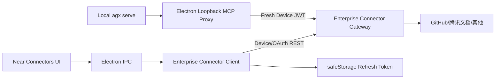
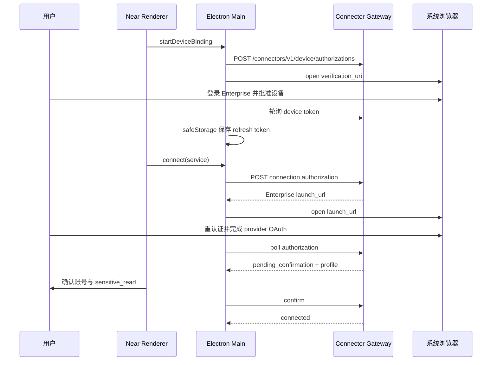

# Near Enterprise 连接器薄客户端

Planned-with: gpt-5.6-sol-medium
Suggested-Impl-Model: gpt-5.3-codex
Status: implementation-ready
Parent-Plan: `.cursor/plans/2026-07-12-enterprise-connector-gateway.plan.md`
Depends-On:

- `.cursor/plans/2026-07-12-enterprise-connector-gateway-control-plane.plan.md` staging-ready
- `.cursor/plans/2026-07-12-enterprise-connector-runtime-ha.plan.md`（生产开放硬门禁）

## 目标

Near 不内嵌 OpenConnector，通过 Enterprise Connector Gateway 获得 GitHub、腾讯文档、Gmail、Notion、Slack 连接能力：

- 浏览器绑定 Enterprise 账号，无需复制 Token；
- 点击“连接”直接进入受控 OAuth；
- 连接后显示叠加品牌图标并可断开；
- Agent 通过固定四工具 MCP 使用当前用户连接；
- refresh token 不写 `mcp.json`、localStorage、renderer 或日志。

首个用户可用里程碑：GitHub + 腾讯文档。其它三家由 Gateway capability 独立开启。

## 约束

- 保留 Near 本地腾讯会议/TAPD，不迁移、不回归。
- 首版只支持本地 `agx serve` backend；远程 Agent backend 禁用企业连接器并给出明确说明。
- Gateway Base URL 必须在 Connectors 设置 GUI 可配置；生产只允许 HTTPS，开发允许 localhost。
- Near 不持有 OpenConnector Admin/Runtime/Internal Token。
- write/destructive Action 首版由服务端固定 block。
- 不修改 `agenticx/studio/server.py`。

## 数据流



## 设备与 OAuth 流程



Near 不得接收 provider 原始 authorization URL；只打开 Enterprise launch URL。

## 本地 Token/MCP 安全

### Token store

- refresh token 使用 Electron `safeStorage.encryptString()`。
- 存储文件位于 `~/.agenticx/connectors/enterprise-auth.bin`，目录 `0700`、文件 `0600`、原子 rename、拒绝 symlink。
- safeStorage 不可用时拒绝持久化并显示可读错误，不降级明文。
- access token 仅 Electron 主进程内存，过期前刷新。

### Loopback MCP proxy

- 只绑定 `127.0.0.1` 随机端口。
- 每次应用启动生成至少 256 bit 本地 capability。
- `mcp.json` 只存 loopback URL + 本地 capability；绝不存远端 access/refresh token。
- 代理仅接受 `/mcp`、正确 Authorization capability、loopback Host、预期 MCP Content-Type。
- 拒绝 Origin/CORS、redirect、非 loopback Host、其它 path。
- 支持 MCP streamable HTTP POST/GET/session header 和流式取消。
- 转发前保证 Device JWT 可用，401 时只刷新一次并重试幂等握手/读取；不自动重试 Action execute。
- 应用退出关闭 proxy，旧 capability 失效。

### Backend 模式

- 本地 `agx serve`：可注册 `enterprise-connectors` remote MCP 指向 loopback proxy。
- 远程 backend：禁用该 MCP，不把 loopback URL 写给远程 Agent；UI 显示“远程后端暂不支持企业连接器”。

## 状态

```text
unpaired
pairing
paired
authorizing
pending_confirmation
connected
degraded
revoking
revoked
error
```

- Gateway 离线：已连接状态变 `degraded`，不删除连接。
- 设备撤销/refresh replay：变 `unpaired`，停止 proxy/MCP。
- provider 单独失败：只影响该 provider。
- capability 列表为 availability 单一来源；不得把未认证 provider 显示可连接。

## 文件

### Electron

- Create: `desktop/electron/enterprise-connector-client.ts`
- Create: `desktop/electron/enterprise-connector-token-store.ts`
- Create: `desktop/electron/enterprise-connector-mcp-proxy.ts`
- Modify: `desktop/electron/main.ts`
- Modify: `desktop/electron/preload.ts`
- Modify: `desktop/src/global.d.ts`

### Renderer

- Create: `desktop/src/assets/connectors/tencent-docs.svg`
- Modify: `desktop/src/components/settings/connectors/connector-catalog.ts`
- Modify: `desktop/src/components/settings/connectors/ConnectorsTab.tsx`
- Modify: `desktop/src/components/connectors/ConnectorsMenuButton.tsx`
- Modify: `desktop/src/utils/mcp-remote-config.ts`

### Agent 状态

- Modify: `agenticx/runtime/prompts/meta_agent.py`
- Create: `tests/test_enterprise_connector_prompt.py`

### Tests

- Create: `desktop/tests/enterprise-connector-client.test.ts`
- Create: `desktop/tests/enterprise-connector-token-store.test.ts`
- Create: `desktop/tests/enterprise-connector-mcp-proxy.test.ts`
- Create: `desktop/tests/enterprise-connector-state.test.ts`
- Create: `enterprise/scripts/e2e-connectors.ts`

## IPC 合同

在 preload/global types 暴露最小 API：

```text
enterpriseConnectorConfigGet/Save
enterpriseConnectorDeviceStart/Poll/Cancel
enterpriseConnectorStatus
enterpriseConnectorList
enterpriseConnectorAuthorize
enterpriseConnectorAuthorizationStatus
enterpriseConnectorConfirm
enterpriseConnectorDisconnect
enterpriseConnectorUnpair
onEnterpriseConnectorProgress
```

Renderer 不接收 refresh token、Device JWT、local proxy capability 或 Gateway internal error detail。

进度 phase：

```text
opening_enterprise_login
waiting_device_approval
paired
opening_provider
waiting_provider
waiting_profile_confirmation
connected
disconnected
degraded
error
```

## 实施单元

### N1. Gateway client 与 safeStorage

- 校验 base URL HTTPS/localhost。
- 实现 device start/poll/refresh/revoke。
- refresh token 加密/文件权限/原子写/symlink 防护。
- 日志只输出 host、status、error code，不输出 URL query/token。

### N2. Loopback MCP proxy

- 支持 streamable HTTP。
- 保持/转发 MCP session header。
- upstream abort 随客户端断开。
- 注册/删除 `enterprise-connectors` mcp.json entry；只在 paired+enabled+local backend 时存在。
- 完全退出/重启恢复后重新生成端口与 capability。

### N3. Connectors UI

- catalog 增加 `tencent-docs` 正式品牌图标。
- GitHub/腾讯文档首先由 Gateway readiness 变“可用”；Gmail/Notion/Slack 后续独立变可用。
- 点击连接：
  - unpaired → 设备绑定；
  - paired → Enterprise launch URL OAuth；
  - callback → profile + `sensitive_read` checkbox；
  - confirm → connected。
- 已连接 icon 叠加；菜单开关断开；按钮无连接时仍常驻。
- 只“管理”进入设置页。

### N4. Agent 状态与启动恢复

- 写无密钥状态快照到 `~/.agenticx/connectors/enterprise-status.json`。
- Meta-Agent prompt 仅注入 provider/status/read capability，不注入账号、scope 明细、token。
- 主会话恢复后，仅当用户此前显式启用时恢复 MCP。
- Gateway degraded 时工具调用给可读错误，不伪装未连接。

### N5. E2E 与渐进上线

- staging 可在 PoC Runtime 上联调，但生产 flag 必须检查 HA readiness。
- 发布顺序：内部账号 → GitHub+腾讯文档小流量 → 全体自家用户 → Gmail/Notion/Slack 各自上线。
- 任一 provider 可独立 kill switch。

## 测试场景

1. safeStorage 不可用、损坏密文、symlink、错误权限均拒绝读取/写入。
2. device code pending/slow_down/expired/approved/replayed 显示正确。
3. Portal/device 被撤销后下一次 MCP 请求失败并停止恢复。
4. OAuth callback 后必须确认 profile；`sensitive_read` 默认关闭。
5. Gateway 离线显示 degraded，恢复后刷新，不删除连接。
6. loopback proxy 拒绝错误 capability、Origin、非 loopback Host、错误 path/Content-Type。
7. MCP POST/GET/session/stream/cancel 转发完整；远端 401 refresh 一次。
8. remote backend 模式不写 loopback MCP 配置。
9. GitHub/腾讯文档连接后叠加图标出现；断开后单个图标消失但连接器按钮保留。
10. Gmail/Notion/Slack readiness 未开时显示暂不可用，不能伪连接。
11. restart 恢复 paired 状态并重建 proxy；旧 capability 无效。
12. 日志、renderer、mcp.json、状态快照无远端 token。

## 验收

- AC-1：用户无需复制 Token 即可绑定 Enterprise。
- AC-2：GitHub + 腾讯文档完整连接、确认、Agent 只读 Action、断开可演示。
- AC-3：远端 token 不出现在 renderer/localStorage/mcp.json/log。
- AC-4：四工具 MCP 经 loopback proxy 可用且租户隔离由 Gateway 强制。
- AC-5：设备撤销立即使 MCP 失败。
- AC-6：Gateway 断网不误删连接。
- AC-7：remote backend 明确禁用，不产生不可达配置。
- AC-8：Near 本地腾讯会议/TAPD 回归通过。
- AC-9：生产开放前 HA readiness 为 healthy。

## Definition of Done

1. N1–N5 与测试场景全部通过。
2. GitHub + 腾讯文档小流量生产验证完成。
3. Gmail/Notion/Slack 仅在各自 certification PASS 后独立开启。
4. Desktop 主进程改动重新编译并完全重启验收。
5. Plan 与代码提交包含本 Plan-Id/Plan-File trailer。

## 追溯

- Plan-Id: `2026-07-12-near-enterprise-connectors`
- Plan-File: `.cursor/plans/2026-07-12-near-enterprise-connectors.plan.md`
