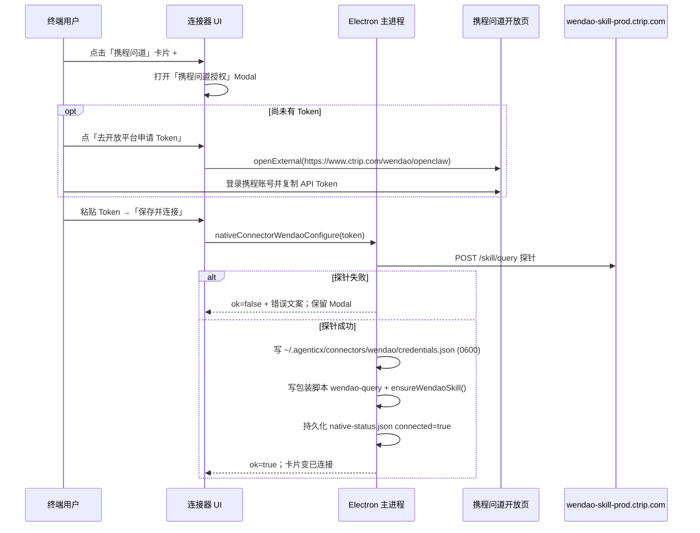

# Near 内置「携程问道」连接器（官方 API Token + 托管 Skill）

Planned-with: Cursor Grok 4.5
Suggested-Impl-Model: gpt-5.3-codex（主进程/校验/skill）+ composer-2.5-fast（UI 目录与 Modal）

> 目标：Near「连接器」目录增加 **携程问道** 卡片；用户点 `+` 后弹出与 OpenClaw 同构的「填 API Token → 保存并连接」弹层；
> Token 来自 [携程问道 OpenClaw 开放页](https://www.ctrip.com/wendao/openclaw)（打开后需登录携程账号再申请 Token，即用户截图图 3）；
> 连接成功后写入 Near 托管 skill，Agent 可通过自然语言查询机酒火、攻略与行程规划。
> **不引入 OpenCLI / 浏览器 Cookie 爬取**（见下方对比与 Out of scope）。

---

## 背景与根因（写进正文，不依赖对话记忆）

### 用户截图对应的产品（携程问道，非 OpenCLI）

| 截图 | 含义 |
|---|---|
| 图 2 卡片「携程问道」 | OpenClaw / ClawHub 风格连接器目录项：旅行规划 API |
| 图 1 授权弹层 | 单字段 **API Token** +「去开放平台申请」+「保存并连接」 |
| 图 3 | 开放页 `ctrip.com/wendao/openclaw` 触发的携程账号登录（申请 Token 的前置） |

权威技能来源（ClawHub，owner `trips-ai`，slug `wendao-skill` v1.0.1，MIT-0）：

- 主页：`https://www.ctrip.com/wendao/openclaw`
- 环境变量：`WENDAO_API_KEY`
- 调用：`POST https://wendao-skill-prod.ctrip.com/skill/query`，JSON body `{ "token": "<API Token>", "query": "<自然语言>" }`，响应 Markdown
- 依赖声明：`curl` + `jq`（OpenClaw skill 元数据）；Near 侧改为**本地包装脚本**读凭证发请求，避免 Agent 在 bash 参数里看到完整 token

### OpenCLI 携程适配器（用户给的文档）在做什么 —— 与本期目标不同

文档：[Ctrip (携程) \| OpenCLI](https://opencli.info/docs/adapters/browser/ctrip.html)  
源码：`https://github.com/jackwener/opencli` → `clis/ctrip/`

| 能力 | 模式 | 实现要点 |
|---|---|---|
| `ctrip search` / `hotel-suggest` | Public `fetch` | `POST m.ctrip.com/restapi/soa2/21881/json/gaHotelSearchEngine`，`searchType=D\|H` |
| `ctrip hotel-search` | Browser + Cookie | 打开 `hotels.ctrip.com`，读 SSR `window.__NEXT_DATA__...hotelList`；验证码 → `AuthRequiredError` |
| `ctrip flight` | Browser + Cookie | DOM 解析 `.flight-list` 卡片（XHR 抓不到）；需 `login_uid` cookie |
| `ctrip` auth | Browser login | `passport.ctrip.com` + cookie `login_uid` / `AHeadUserInfo` |

OpenCLI **不是**「携程问道」官方 AI API，而是站点公开联想接口 + 浏览器 Cookie 抓列表。要落地 OpenCLI 路线，Near 需引入完整 browser daemon / Cookie 会话（远超现有 native connector 范式，且与用户截图 UI 不一致）。

### Near 现有范式（本期对齐对象）

**Token 弹层 + 校验 + 落盘**：TAPD（`ConnectorsTab.tsx` Modal「保存并连接」、`configureTapdConnector` in `desktop/electron/main.ts` ~5383）。

**托管 Skill（非 MCP）**：GitHub / 飞书 / 企微 —— `ensure*Skill()` 写 `~/.agenticx/skills/near-connectors/<id>/SKILL.md` + `.near-managed`；断开时 `remove*Skill()`。

**可用性白名单**：`desktop/electron/native-connectors-core.ts` 的 `AVAILABLE_CONNECTOR_IDS`（当前含 `tencent-meeting` / `tapd` / `github` / `feishu` / `wecom`）。

本期选择：**TAPD 式 Token UI + GitHub 式托管 Skill + 本地包装二进制/脚本**（不接 MCP、不装 OpenCLI）。

### Token 校验探针结论（2026-07-14 实测，须写入实施注意）

对 `https://wendao-skill-prod.ctrip.com/skill/query`：

- `token` 为空字符串：请求易超时（约 20s 无 body）
- `token` 缺失或明显假值：当前 Beta **仍可能 HTTP 200 返回旅行 Markdown**（严格鉴权尚未强制）

因此「保存并连接」校验策略定为：

1. Token 非空、长度上限（建议 ≤ 4096，同 TAPD）
2. 探针：`POST` 带用户 token + 固定短 query（如 `你好`），超时 15s
3. 成功条件：HTTP 2xx 且 body 非空且**不含**明显鉴权失败关键词（中英：`未授权` / `unauthorized` / `invalid token` / `token无效` / `认证失败` —— 正则大小写不敏感）
4. 空 token / 超时 → 明确失败，不落盘
5. Plan 注释：Beta 期假 token 可能「校验通过」；产品文案可写「请使用开放平台申请的真实 Token」；若上游日后收紧鉴权，同一探针即可挡住假 token，无需再改 UI

---

## 终端用户视角：点 `+` 之后



断开：删除托管 skill 目录（仅当有 `.near-managed`）、删除 credentials / 包装脚本、状态回落未连接。**不**删用户从 ClawHub 自行安装的其它 skill。

---

## Suggested-Impl-Model（子规划 → 推荐模型）

| 子任务 | 推荐模型 | 理由 |
|---|---|---|
| `native-connectors-core` 纯函数 + 单测 | composer-2.5-fast / kimi-k2.7-code | 样板 CRUD |
| 主进程 configure / status / disconnect / skill / wrapper | gpt-5.3-codex | 与 TAPD/GitHub 同构接线，需小心 `main.ts` 精确增行 |
| ConnectorsTab + MenuButton Modal UI | composer-2.5-fast | 复制 TAPD Modal 文案与布局即可 |
| 跨栈收口 / 回归 | gpt-5.6-sol-medium（可选） | 多文件 IPC + 状态一致性 |

---

## In scope

- `ConnectorId` 增加 `wendao`（UI 展示名 **携程问道**）
- 白名单 `AVAILABLE_CONNECTOR_IDS` 加入 `wendao`
- 设置页 / 聊天连接器菜单：TAPD 同构 Token Modal（标题「携程问道授权」、外链按钮、必填 API Token、「保存并连接」）
- 主进程：探针校验、凭证落盘、包装脚本、托管 skill、status / disconnect IPC
- 图标：`desktop/src/assets/connectors/wendao.svg`（携程海豚标简化矢量或官方 favicon 提取，与其它 connector SVG 同目录）
- 单测：token 校验判定、skill 路径约定、availability

## Out of scope

- OpenCLI / `jackwener/opencli` / browser Cookie / captcha 会话
- 把问道做成 stdio MCP（本期 skill + wrapper 足够）
- 修改 `agenticx/studio/server.py` import 区
- ClawHub 在线安装 `wendao-skill`（内容内化为 Near 托管 skill，避免依赖 ClawHub 运行时）
- 企业微信 / QQ 邮箱等其它连接器
- Token 写入聊天、localStorage、或日志明文

---

## FR / NFR / AC

### FR-1：目录可见且可点 `+`
- **落点**：`desktop/src/components/settings/connectors/connector-catalog.ts`（`ConnectorId` union + `CONNECTORS` 数组）；`native-connectors-core.ts` `AVAILABLE_CONNECTOR_IDS`
- **AC**：设置 → 连接器出现「携程问道」；未连接时有 `+`；描述含旅行规划 / 机酒火等能力（对齐图 2 文案，可略压缩）

### FR-2：授权 Modal（对齐图 1）
- **落点**：`ConnectorsTab.tsx`、`ConnectorsMenuButton.tsx`
- **文案要点**：
  - 标题：`携程问道授权`
  - 说明：`输入 携程问道 API Token（从携程问道开放平台申请）`
  - 按钮：`去携程问道开放平台申请 Token` → `openExternal("https://www.ctrip.com/wendao/openclaw")`
  - 字段：`API Token *`，placeholder 与帮助文案指向开放平台
  - 主按钮：`保存并连接`；取消在左
- **AC**：无 Token 时主按钮 disabled；连接中有 loading；失败保留弹窗并展示错误（对齐 TAPD / 分身保存失败 UX）

### FR-3：主进程配置与探针
- **落点**：`desktop/electron/main.ts` 新增 `configureWendaoConnector` / `getWendaoStatus` / `disconnectWendaoConnector`（插在 TAPD/wecom 邻近，**禁止整段替换无关 import**）
- **凭证路径**：`~/.agenticx/connectors/wendao/credentials.json`，内容 `{"apiToken":"..."}`，目录与文件 mode `0700`/`0600`
- **探针 URL**：`https://wendao-skill-prod.ctrip.com/skill/query`（固定官方域名，禁止可配置任意 host）
- **AC**：空 Token 拒收；超时返回可读错误；成功后 `native-connector-status` 对 `wendao` 返回 `connected: true`

### FR-4：包装脚本 + 托管 Skill
- **包装脚本**：`~/.agenticx/connectors/wendao/wendao-query`（win：`wendao-query.cmd` 或 `.ps1` —— 实施时按平台写一种，skill 内用绝对路径）
  - 读取 credentials → `POST` 官方 endpoint → stdout 打印 Markdown
  - 不得 `echo` token；失败时 stderr 给短错误、exit ≠ 0
- **Skill 目录**：`~/.agenticx/skills/near-connectors/wendao/`（含 `.near-managed`）
- **SKILL.md 意图**（before → after）：
  - before：无 skill，Agent 不知问道
  - after：仅旅行意图时通过 `bash_exec` 调用包装脚本绝对路径，参数为用户自然语言 query；禁止把 token 写进命令行或回复
- **AC**：连接后 skill 文件存在；断开后托管目录删除；无 marker 时不断删用户自建目录

### FR-5：IPC / preload / 类型
- **落点**：`main.ts` ipcMain handlers；`preload.ts`；`desktop/src/global.d.ts`
- **建议 API 名**（与 tapd 对称）：
  - `native-connector-wendao-configure` → `{ ok, error? }`
  - `native-connector-wendao-disconnect` → `{ ok, error? }`
  - status 走现有 `native-connector-status` 分支 `id === "wendao"`
- **AC**：渲染进程无 Node、看不到 raw token（仅 input 本地 state）；断开后 status 未连接

### NFR
- Token 不进聊天记录、不写 `messages.json`
- 所有外呼走 `proxyAwareFetch`（主进程探针），与 GitHub/飞书一致
- Windows：包装脚本可执行；路径含空格时 skill 内正确引用
- no-scope-creep：不改 `server.py`、不改其它连接器行为

---

## 精确改动清单（Composer 2.5 可独立实施）

### Task 1：纯函数 + 测试

**Files:**
- Modify: `desktop/electron/native-connectors-core.ts`
- Modify: `desktop/tests/native-connectors-core.test.ts`

**新增：**
```ts
export function isWendaoProbeSuccess(status: number, body: string): boolean {
  if (status < 200 || status >= 300) return false;
  const text = (body || "").trim();
  if (!text) return false;
  if (/未授权|unauthorized|invalid\s*token|token\s*无效|认证失败/i.test(text)) return false;
  return true;
}

export function wendaoCredentialsPath(homeDir: string): string { /* .../connectors/wendao/credentials.json */ }
export function wendaoSkillDir(homeDir: string): string { /* .../skills/near-connectors/wendao */ }
```

`AVAILABLE_CONNECTOR_IDS` 加入 `"wendao"`。

**AC：** 单测覆盖 success / empty / auth-keyword / 4xx。

### Task 2：Catalog + 图标

**Files:**
- Modify: `connector-catalog.ts` — `ConnectorId` + `CONNECTORS` 项
- Create: `desktop/src/assets/connectors/wendao.svg`
- Modify: `ConnectorsMenuButton.tsx` 的 `NativeId` union 与分支（照 TAPD）

文案建议：
```
name: "携程问道"
description: "通过携程问道 API 获取旅行规划与攻略（酒店、机票、火车、景点与行程）"
```

### Task 3：主进程实现

**Files:**
- Modify: `desktop/electron/main.ts`（仅精确追加函数与 ipc 分支）

伪代码意图：
```ts
async function configureWendaoConnector(apiToken: string) {
  const token = apiToken.trim();
  if (!token || token.length > 4096) return { ok: false, error: "请填写有效的 API Token" };
  const res = await proxyAwareFetch(WENDAO_ENDPOINT, {
    method: "POST",
    headers: { "Content-Type": "application/json" },
    body: JSON.stringify({ token, query: "你好" }),
    signal: AbortSignal.timeout(15000),
  });
  const body = await res.text();
  if (!isWendaoProbeSuccess(res.status, body)) {
    return { ok: false, error: "Token 校验失败或服务无响应，请确认已从开放平台申请 Token" };
  }
  writeCredentials(token);
  writeWendaoQueryWrapper();
  ensureWendaoSkill(wrapperPath);
  persistStatus(true);
  return { ok: true };
}
```

`ensureWendaoSkill` 复用 `assertManagedSkillDirectory` + 原子写（对照 `ensureGithubSkill` ~3691）。

### Task 4：UI Modal

**Files:**
- Modify: `ConnectorsTab.tsx` — 复制 TAPD Modal 结构，替换文案与 handler
- Modify: `ConnectorsMenuButton.tsx` — 同上

已连接态：展示「已连接」+「断开连接」（同 TAPD）。

### Task 5：验收

1. `cd desktop && npx vitest run tests/native-connectors-core.test.ts`
2. 手动：设置 → 连接器 → 携程问道 → 外链打开开放页 → 填 Token → 保存并连接 → 绿点
3. 对话：「帮我看看上海外滩附近酒店」→ Agent 调用包装脚本 → 返回 Markdown
4. 断开 → skill 目录消失 → 再问不应再走问道

---

## 风险与已知缺口

1. **Beta 鉴权宽松**：假 token 可能探针通过 —— 文案引导用户用真实 Token；上游收紧后现有探针自动变严。
2. **开放页需登录**：图 3 是正常申请路径，Near 只 `openExternal`，不嵌入账号密码表单、不抓 Cookie。
3. **与 OpenCLI 易混淆**：产品命名必须用「携程问道」，内部 id `wendao`，禁止叫 `ctrip` 以免与未来可能的 OpenCLI 路线撞名。
4. **响应内容信任**：问道 Markdown 可能含营销链接；skill 注明如实展示、勿当无害可信内容执行。

---

## 决策记录（已拍板写入 plan，实施勿再发散）

| 问题 | 决策 |
|---|---|
| 跟截图还是跟 OpenCLI？ | **跟截图：官方问道 API Token** |
| OpenCLI 何时做？ | 另开 plan；本期 Out of scope |
| MCP 还是 Skill？ | **Skill + 本地 wrapper**（同 GitHub，非 TAPD MCP） |
| ConnectorId | `wendao`，展示名「携程问道」 |
