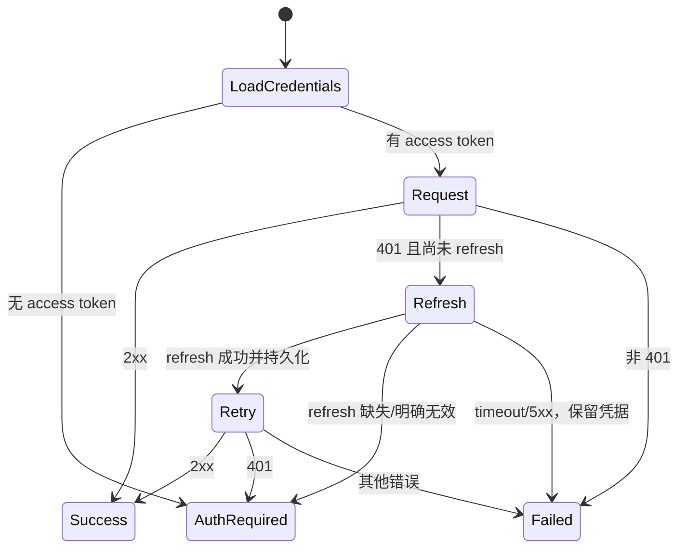

# Near Share SP3：Desktop 认证、Provider 与 IPC

Planned-with: GPT-5.6 Sol  
Suggested-Impl-Model: Cursor Grok 4.5 High Fast  
Plan-Id: `2026-07-21-near-share-desktop-transport`  
Parent-Plan: `.cursor/plans/2026-07-21-near-public-conversation-sharing.plan.md`  
Depends-On: `.cursor/plans/2026-07-21-near-share-cloud-core.plan.md`

## 目标

在 Electron 主进程实现官网 `ConversationSharePublisher`，安全消费 `~/.agenticx/config.yaml` 中的 Supabase token，支持创建、列表和撤销；access token 过期时 refresh 并只重试一次。Renderer 只能通过 IPC 使用结果，永远拿不到 token。

## 前置条件

- SP1 已部署/本地可运行 `/api/shares` 与 `/api/auth/device/refresh` 契约。
- SP1 golden fixture 已冻结。
- SP2 可以并行，本计划不得修改公开页文件。

## In scope files

新增：

- `desktop/electron/agx-share-client.ts`
- `desktop/tests/agx-share-client.test.ts`
- `desktop/tests/fixtures/conversation_share_v1.json`

修改：

- `desktop/electron/main.ts`
- `desktop/electron/preload.ts`
- `desktop/src/global.d.ts`

## Out of scope

- 不改 `ChatPane.tsx`、`ImBubble.tsx`、`AccountTab.tsx`（SP4）。
- 不改 `store.ts` 消息结构。
- 不把官网 token 放进 Zustand、localStorage 或 IPC 返回值。
- 除在登录成功时精确写入 `agx_account.account_origin` 外，不改变 `agx-account-login-start` 的 init/poll/响应行为。
- 不实现 Enterprise provider，只定义未来可扩展的窄接口。
- 不改 `agenticx/studio/server.py`。

## 当前锚点

- `desktop/electron/main.ts::AgxConfig.agx_account` 约第 288 行，已有 `access_token`, `refresh_token`, `supabase_url`, `updated_at`。
- `desktop/electron/main.ts::getAgxAccountWebBase()` 约第 1851 行。
- `desktop/electron/main.ts::registerIpc()` 内 `agx-account-login-start/logout/load-agx-account` 约第 7054–7155 行。
- `desktop/electron/main.ts` 顶部已 import `proxyAwareFetch`。
- `desktop/electron/preload.ts` 约第 817 行暴露官网账号 IPC。
- `desktop/src/global.d.ts` 约第 779 行声明对应 renderer API。
- `desktop/electron/tsconfig.json` 只 include `electron/*.ts`；测试放 `desktop/tests/`，避免编进 `dist-electron`。
- Website SP1 的 commit/deployment/API v1/fixture hash 必须已写入主仓 `desktop-integration-baseline` evidence commit；本计划从该 commit 建 worktree，不从 Website commit 或空白 bootstrap 建分支。

## IPC 契约

在 `desktop/electron/agx-share-client.ts` 导出主进程使用的完整 `ConversationShare*` 类型与接口；`main.ts` 只从该模块 import。`global.d.ts` 定义 renderer 镜像，字段与 Parent Plan 对齐。两端测试分别读取本仓 fixture，并与 Website fixture 的 Master 记录 SHA-256 对齐：

```ts
type ConversationShareScope = "turn" | "selection" | "session";

type ConversationShareSummary = {
  slug: string;
  url: string;
  title: string;
  scope: ConversationShareScope;
  createdAt: string;
  expiresAt: string;
};

type ConversationShareCreateInput = {
  clientRequestId: string;
  snapshot: ConversationShareSnapshotV1;
};

type AgxShareResult<T> =
  | { ok: true; data: T }
  | { ok: false; error: string; status?: number; retryAfterSeconds?: number };
```

向 `window.agenticxDesktop` 增加：

```ts
agxShareCreate(input): Promise<AgxShareResult<ConversationShareSummary>>
agxShareList(): Promise<AgxShareResult<ConversationShareSummary[]>>
agxShareRevoke(slug: string): Promise<AgxShareResult<{ revoked: true }>>
```

禁止增加 `getAgxToken()` 或把响应 header 透传给 renderer。

## Provider 设计

`desktop/electron/agx-share-client.ts`：

```ts
export interface ConversationSharePublisher {
  create(input: ConversationShareCreateInput): Promise<ConversationShareSummary>;
  list(): Promise<ConversationShareSummary[]>;
  revoke(slug: string): Promise<void>;
}
```

首期实现：

```ts
export class AgxWebsiteSharePublisher implements ConversationSharePublisher
```

依赖必须可注入以便测试：

```ts
type AgxWebsiteSharePublisherDeps = {
  baseUrl: string;
  allowLoopbackOrigin: boolean;
  fetchImpl: typeof proxyAwareFetch;
  loadCredentials: () => AgxAccountCredentials | null;
  saveCredentialsIfCurrent: (expectedRefreshToken: string, next: AgxAccountCredentials) => boolean;
  clearCredentialsIfCurrent: (expectedRefreshToken: string) => boolean;
};
```

不要让该模块 import `main.ts`。`main.ts` 在注册 IPC 时用现有 `loadAgxConfig()` / `saveAgxConfig()` 组装 deps。

`AgxAccountCredentials` 增加 `accountOrigin`。SP3 精确扩展现有 device login 成功写入逻辑，把本次 `getAgxAccountWebBase()` 的规范化 origin 写入 `agx_account.account_origin`。历史配置缺该字段时：

- 当前 base 为官方 `https://www.agxbuilder.com`：一次性补写官方 origin。
- 当前 base 为 override：要求重新登录，不能把旧 token 发往新 origin。

主进程 DTO 不直接等同 YAML shape：

```ts
type AgxAccountCredentials = {
  accessToken: string;
  refreshToken: string;
  accountOrigin: string;
  supabaseUrl: string;
  userEmail: string;
  userDisplayName: string;
  updatedAt: string;
};
```

在 `main.ts` 新增 `fromAgxAccountConfig()` / `toAgxAccountConfig()`，显式映射 camelCase 与 `access_token`、`refresh_token`、`account_origin` 等 snake_case 字段。load、CAS save、CAS clear 都通过映射，禁止把 raw `cfg.agx_account` 直接返回给 client。

### 运行时输入验证

主进程必须在发网前验证：

- `clientRequestId` 是 UUID。
- `schemaVersion === 1`
- `source === "near-desktop"`
- scope 合法。
- messages 是数组且 1–200 条。
- 每条 role/content/senderLabel/attachments 合法；content ≤65,536、senderLabel ≤80、attachments ≤20、mimeType ≤120、name ≤255。
- JSON UTF-8 ≤1 MiB。
- slug 符合 `/^[A-Za-z0-9_-]{32}$/`。

这里做快速拒绝；SP1 Website strict Zod 仍是最终校验者。

### URL 与超时

- 所有 URL 基于 `getAgxAccountWebBase()`，去掉尾斜杠。
- packaged production 只允许 `https://www.agxbuilder.com`。
- local development/test 默认只额外允许 `http://localhost:*` 与 `http://127.0.0.1:*`。
- staging 非打包 build 仅在 `AGX_ALLOW_NON_PRODUCTION_ACCOUNT_ORIGIN=1` 时接受与 `AGX_ACCOUNT_WEB_BASE` 完全相等的固定 HTTPS staging origin；staging token/DB 与 production 隔离。
- 非 HTTPS 非 loopback、环境变量恶意 origin、`account_origin` 不匹配时在发网前返回 `auth_required`，绝不发送 token。
- 使用 `proxyAwareFetch`，禁止 `globalThis.fetch`。
- create/list/revoke/refresh 每次请求使用 15 秒 AbortSignal timeout。
- 接收 Website 返回的 `share.url` 时验证 origin 与已绑定 `accountOrigin` 一致；不一致时丢弃服务器 URL并使用 `${accountOrigin}/s/${slug}` 重建。
- response 只解析有限 JSON；错误正文最多保留机器码，不把 HTML/快照塞进异常。
- 429 只解析合法整数秒 `Retry-After`，clamp 到 `1..86400` 并映射为 `retryAfterSeconds`；WAF 无该 header 时保持 undefined。

## Token refresh 状态机



实现一个私有 `requestWithAuthRetry()` 和 publisher 实例级共享 `refreshPromise`：

1. `registerIpc()` 只创建一个 publisher 实例供三个 handler 共用；create/list/revoke 的并发 401 等待同一个 single-flight refresh。
2. 每个顶层调用在共享 refresh 完成后只允许重试原请求一次。
3. refresh 请求发往 `/api/auth/device/refresh`，body 只含 refresh token。
4. 成功后合并并以旧 refresh token compare-and-swap 保存，返回已提交的新 credential generation：
   - 新 access token
   - 响应有新 refresh token时替换旧值
   - `updated_at = new Date().toISOString()`
   - 原有 user email/display name/supabase URL 保留
5. `saveCredentialsIfCurrent()` 返回 false 说明 refresh 期间退出/切换账号：返回 `auth_context_changed`，不得重试旧请求。
6. refresh 明确返回 401 `invalid_refresh_token`：以旧 refresh token CAS clear，返回 `auth_required`。
7. refresh 成功后原请求重试仍 401：以刚提交的新 generation/refresh token CAS clear，返回 `auth_required`。
8. refresh timeout/5xx 保留凭据，返回 `share_service_unavailable`；较晚失败的旧 refresh 不能清除已轮换的新凭据。
9. 原请求 500、timeout、invalid payload 不 refresh。
10. 任意 Error message 不拼 access/refresh token。

## TDD 任务

### Task 1：写 client 失败测试

新增 `desktop/tests/agx-share-client.test.ts`，fake fetch + 内存 credential store。

先覆盖：

- 无 token → `auth_required`，fetch 0 次。
- create 201 → 返回 summary。
- list 200 → 返回 active 数组。
- revoke 200 → resolve。
- 第一次 401 → refresh 200 → 原请求 200；原请求恰好两次、refresh 恰好一次。
- 两个并发 401 → 只有一个 refresh 请求，两者随后各重试一次。
- refresh token rotation 写回。
- refresh 401 → clear credential，原请求不无限重试。
- 旧 refresh 的延迟失败不能清除已保存的新凭据。
- refresh 期间 logout / A→B 账号切换 → `auth_context_changed`，原请求不重试。
- refresh 成功后原请求仍 401 → 用新 generation 清除。
- refresh 503/timeout → 保留 credential。
- 原请求 500 → 不 refresh。
- timeout → `share_service_unavailable`。
- 返回 URL origin 不匹配时重建官网 URL。
- packaged 模式恶意 base、HTTP 非 loopback、account_origin 不匹配时 fetch 0 次。
- 显式 staging flag + 固定 HTTPS origin 可用；未开 flag 时 fetch 0 次。
- raw YAML snake_case 与 camelCase DTO 双向映射、历史官方配置补写。
- 429 秒数 Retry-After 透传并 clamp；无 header 时 undefined。
- thrown error/console args 不含 token 字符串。

运行确认 FAIL：

```bash
npm --prefix desktop exec vitest run tests/agx-share-client.test.ts
```

### Task 2：实现 provider

- import 均放模块顶部。
- `AgxShareClientError` 只包含 `code`、`status` 与可选 `retryAfterSeconds`；IPC handler 将该字段复制到失败 `AgxShareResult`。
- `fetchImpl` 使用标准 RequestInit，不依赖 Electron global。
- response parser 按 endpoint 校验 Website HTTP envelope：create `{ ok:true, share }`、list `{ ok:true, shares }`、revoke `{ ok:true, revoked:true }`、refresh `{ ok:true, access_token, refresh_token, expires_at }`。
- 只有 IPC handler 把成功值转换成 renderer 的 `{ ok:true, data }`。
- 不 catch 后返回伪成功。

运行确认 PASS。

### Task 3：注册 IPC

`main.ts` 只做精确接线：

1. 顶部 import `AgxWebsiteSharePublisher` 和必要类型。
2. 在现有 `agx-account-*` handlers 邻近注册：
   - `agx-share-create`
   - `agx-share-list`
   - `agx-share-revoke`
3. 组装 credential callbacks：
   - `loadCredentials`: `loadAgxConfig().agx_account`
   - `saveCredentialsIfCurrent`: 重新 load config，只有当前 refresh token 仍等于 expected 时替换 `agx_account` 并保存
   - `clearCredentialsIfCurrent`: 只有当前 refresh token 仍等于 expected 时 delete `agx_account`、save，并发送现有 `agx-account-changed` 空状态事件
4. handler 返回 discriminated result，不向 renderer throw 原始 stack。

必须避免把大段实现塞进 `main.ts`；业务留在新模块。

### Task 4：preload 与类型

`preload.ts` 在现有账号 API 邻近暴露三个 invoke。

`global.d.ts`：

- 声明 snapshot/summary/result。
- `agxShareCreate/List/Revoke` 签名与 preload 完全一致。
- 不使用 `any`。

### Task 5：Electron 构建验证

```bash
npm --prefix desktop exec vitest run tests/agx-share-client.test.ts
npm --prefix desktop run build
```

因修改 `main.ts`/preload，手工 smoke 必须完全退出 Electron 后重新启动，不能只刷新 renderer：

```text
未登录调用 list → auth_required
登录后 list → 200
把测试 access token 置为过期、保留 refresh token → list 自动恢复
断网 → 明确失败且聊天功能不受影响
```

## AC

- AC-SP3-1：renderer API 不含 token getter，IPC 结果不含 token。
- AC-SP3-2：全部公网请求使用 `proxyAwareFetch`，支持 HTTPS_PROXY/NO_PROXY。
- AC-SP3-3：并发 401 共用 single-flight refresh；无效 refresh 或新 generation 重试仍 401 才按对应版本清理，5xx/timeout 保留凭据。
- AC-SP3-4：非 401 不触发 refresh。
- AC-SP3-5：create/list/revoke 运行时校验响应，错误不伪成功。
- AC-SP3-6：恶意或异常 Website URL 不能让 Desktop 复制跨 origin 链接。
- AC-SP3-7：token 不出现在日志、Error message 或 IPC payload。
- AC-SP3-8：client tests 与 Desktop build 全绿；完全重启后 IPC 可用。
- AC-SP3-9：`ChatPane.tsx`、`ImBubble.tsx`、`AccountTab.tsx`、Enterprise、Studio 无 diff。
- AC-SP3-10：packaged build 只向已绑定官方 HTTPS origin 发送凭据；dev/test loopback override 有测试。
- AC-SP3-11：refresh 期间账号切换终止旧上下文；新 generation 重试 401 能正确清理。
- AC-SP3-12：camelCase DTO/YAML snake_case 映射和 staging origin 矩阵有测试。
- AC-SP3-13：字段限制与 Retry-After 经 IPC 保真传递。

## 提交边界

本 subplan 在 AgenticX 主仓独立提交。如果与 SP2 并行，SP3 使用主仓 worktree，SP2 使用 Website 独立仓 worktree；两者没有共同 commit/lockfile。

