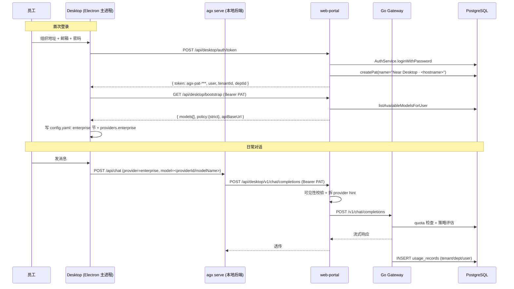

# Desktop × Enterprise 账号打通：托管模型下发与用量归集

Planned-with: claude-opus-5-thinking（Cursor Opus 5）
Suggested-Impl-Model: 见下方「子任务 → 推荐模型」表

---

## 1. 背景与目标

Enterprise 已部署到客户侧，客户管理员在 admin-console 为员工分配账号、可见模型与配额。现在希望员工安装 Desktop（Near）后：

1. 用企业账密登录 Desktop，**无需自己配置任何模型服务与 API Key**；
2. 模型选择器里只出现管理员分配给他的模型（**严格托管模式**：禁止自带 provider）；
3. 他在 Desktop 里的所有模型调用，用量能在 admin-console 的「Token 用量」里按 租户/部门/用户 看到，并受配额约束。

### 核心思路

**把企业网关伪装成 Desktop 的一个「受管 provider」。** Desktop 侧不新增任何「上报用量」的代码——只要模型流量经过 Go 网关，`metering.Reporter` 就会自动把 usage 写进 `usage_records`，配额也由 `quota.Tracker` 自动拦截。

---

## 2. 现状证据链（实施者无需回溯对话即可自行验证）

### 2.1 Enterprise 侧已具备的能力

| 能力 | 落点 | 结论 |
| --- | --- | --- |
| 账密校验 | `enterprise/packages/auth/src/services/auth.ts` `AuthService.loginWithPassword` (L104) | 可复用 |
| Portal 登录封装 | `enterprise/apps/web-portal/src/lib/auth-runtime.ts` `loginWithPassword` (L224) | 可复用，但**只返回 token 字符串，不返回用户上下文** |
| PAT 签发 | `@agenticx/iam-core` 的 `createPat({tenantId,userId,deptId,name,createdBy,expireDays})`，调用示例见 `apps/web-portal/src/app/api/me/api-tokens/route.ts` L24 | 可复用 |
| 网关 PAT 鉴权 | `enterprise/apps/gateway/internal/server/server.go` `identityFromRequest` (L1429)，`agx-pat-` 前缀走 `PATVerifier.Verify` | **已支持**，Desktop 用 PAT 即可 |
| 用户可见模型 | `apps/web-portal/src/lib/admin-providers-reader.ts` `listAvailableModelsForUser(userId, email?, deptId?)` (L162) | 可复用；返回 `PortalModelOption`（`id` 形如 `providerId/modelName`），**不含 api_key/base_url** |
| 用量落库 | `apps/gateway/internal/metering/reporter.go` `Reporter.ReportAsync` → `INSERT INTO usage_records` | 自动，无需 Desktop 参与 |
| 配额 | `apps/gateway/internal/quota/tracker.go` `Tracker.CheckAndAddContext` | 自动 |

### 2.2 关键约束（务必遵守，否则接不上）

**网关不接受 `providerId/modelName` 复合 model 名。** 见 `apps/web-portal/src/app/api/chat/completions/route.ts` L69-L94：portal 会把 `parsed.model` 按 `/` 拆开，body 里只留裸模型名，provider 放到 `x-agenticx-provider` 请求头。

```69:94:enterprise/apps/web-portal/src/app/api/chat/completions/route.ts
  // portal 把模型 id 编码为 "<provider>/<model>"；admin 配置好的 provider 与上游 endpoint 一一对应。
  // gateway 用 model 字段查表，所以这里把 provider 拆出来放请求头，body.model 仅保留模型名。
  try {
    const parsed = JSON.parse(rawBody) as { model?: string };
    if (typeof parsed.model === "string" && parsed.model.includes("/")) {
      const effectiveModels = await listAvailableModelsForUser(session.userId, session.email, session.deptId ?? undefined);
      const isVisible = effectiveModels.some((m) => m.id === parsed.model);
      if (!isVisible) { /* 403 */ }
      const [providerId, ...rest] = parsed.model.split("/");
      const modelName = rest.join("/");
      if (providerId && modelName) {
        providerHint = providerId;
        forwardBody = JSON.stringify({ ...parsed, model: modelName });
      }
    }
  } catch { /* body 不是 JSON 时维持原样转发 */ }
```

**结论：Desktop 不直连网关**，而是连 portal 新增的 `/api/desktop/v1/*`，由 portal 复用上述拆分 + 实时可见性校验。这样：
- 模型收窄后 Desktop 未刷新也不会打到已撤销的模型；
- provider hint 逻辑只有一份实现；
- Desktop 侧的 `base_url` 是一个标准 OpenAI 兼容地址，可直接喂给现有 `LiteLLMProvider`。

**Portal 现有 `/api/auth/login` 不能给 Desktop 用**（`apps/web-portal/src/app/api/auth/login/route.ts` L23-47）：它把 token 写进 httpOnly cookie，响应体只有 `expiresInSeconds`。故需新增设备 token 端点。

### 2.3 Desktop / agx 侧已具备的能力

| 能力 | 落点 | 结论 |
| --- | --- | --- |
| 自定义 OpenAI 兼容 provider | `agenticx/llms/provider_resolver.py` `ProviderResolver.resolve` L133-L145：未知 provider key 且 `extra.interface == "openai"` → `LiteLLMProvider` + `effective_key="openai"` | **直接可用**，注入的受管 provider 走这条路，Python 侧几乎零改动 |
| provider 配置持久化 | `~/.agenticx/config.yaml` 的 `providers.<name>`；Electron 侧 `desktop/electron/main.ts` `loadAgxConfig`/`saveAgxConfig`（CONFIG_PATH 定义在 L346-347）；Python 侧 `agenticx/cli/config_manager.py` `ConfigManager` | 可复用 |
| 模型选择器数据源 | `desktop/src/utils/model-options.ts` `collectSelectableModelOptions`（L102）读 `settings.providers`；`desktop/src/components/ChatPane.tsx` `PaneModelPicker`（L923、L944） | 只要 providers map 里有受管 provider，选择器自动出现 |
| providers 注入时机 | `desktop/src/App.tsx` L505-530：`loadConfig()` → `toProviderEntries()` → `updateSettings({ providers })` | **严格模式的过滤点放这里最省事**，一处生效，picker/自动化/分身默认模型全部覆盖 |
| 设备码式登录先例 | `desktop/electron/main.ts` `agx-account-login-start/cancel/logout`（L7067-7160），凭据写入 `config.yaml` 的 `agx_account` 节 | 可参照其结构与 IPC 命名风格 |

---

## 3. 架构



---

## 4. In scope / Out of scope

### In scope（P0）
- Portal 新增 `/api/desktop/auth/token`、`/api/desktop/bootstrap`、`/api/desktop/v1/chat/completions`
- Desktop 新增企业登录 UI + `enterprise` 配置节 + 受管 provider 注入
- 严格托管模式：登录后隐藏所有自配 provider
- 一次端到端验证：带工具调用的完整对话 → `usage_records` 有记录 → admin-console 可见

### Out of scope（本 plan 不做，另开）
- OIDC/SSO 登录（P2）
- `/v1/embeddings` 走网关（知识库仍用本地配置，P1 再评估）
- 部门/用户级配额在网关真正生效（网关当前偏租户级，需独立评估）
- Desktop 本地工具行为纳入 Enterprise 审计
- 任何对 `apps/web-portal/src/app/api/chat/completions/route.ts` 现有浏览器链路的改动（**禁止改动，只做新路由**）

### no-scope-creep 边界
- 不重构 `ProviderResolver`、`LiteLLMProvider`、`collectSelectableModelOptions` 的既有逻辑，只做加法
- 不动 `agenticx/studio/server.py` 的 import 区块（该文件历史上因整块替换误删 import 导致启动崩溃，见 AGENTS.md）
- 不改 admin-console 任何页面

---

## 5. P0 需求与验收

### FR-0（**必须最先做**）工具调用透传验证 Spike

**动机**：Desktop 是重度 tool-calling 客户端（每轮可能几十次工具调用 + 流式 tool_call 分片 + `<think>` 推理块），而网关的 `OpenAICompatibleProvider`（`apps/gateway/internal/provider/openai_http.go`）是为 portal 的普通聊天写的。若它吞掉或改写 `tools` / `tool_calls` / `tool_choice`，Desktop 的智能体能力会直接残废——这比登录打通重要得多。

**做法**：不写业务代码，先用 curl 直打网关 `POST /v1/chat/completions`（Bearer 用 admin 后台手动签发的 PAT），分别验证：

1. 非流式 + `tools` + `tool_choice: "auto"` → 响应 `choices[0].message.tool_calls` 结构完整（含 `id`/`function.name`/`function.arguments`）
2. `stream: true` + `tools` → SSE delta 中 `tool_calls[].index` / `function.arguments` 分片可正确拼接
3. 携带 `role: "tool"` 的历史消息回传 → 网关不报 400
4. 上游返回 `reasoning_content` 或 `<think>` 时是否原样透传

**AC-0**：在 plan 同目录产出 `2026-07-25-desktop-enterprise-account-binding.spike.md`，逐条记录 curl 命令、实际响应片段与结论。**若 1/2/3 任一不通过，停止 P0 并回报**——需要先补网关透传能力，本 plan 后续任务全部阻塞。

---

### FR-1 Portal：设备 token 端点

**新建** `enterprise/apps/web-portal/src/app/api/desktop/auth/token/route.ts`

```ts
// 请求: POST { email, password, deviceName? }
// 响应: { code:"00000", data: { token, tokenId, user:{ userId, email, displayName?, tenantId, deptId }, expiresAt } }
export async function POST(request: Request) {
  // 1. 校验 email/password 非空 → 400
  // 2. await loginWithPassword(email, password)   // 复用 auth-runtime，仅用于验密；返回的 JWT 丢弃不用
  //    失败抛错 → 统一返回 401 { code:"40101", message:"邮箱或密码错误" }，不透出底层原因
  // 3. 取用户上下文（见下方 FR-1.1）
  // 4. createPat({ tenantId, userId, deptId, name: `Near Desktop · ${deviceName ?? "unknown"}`,
  //                createdBy: userId, expireDays: DESKTOP_PAT_EXPIRE_DAYS })
  // 5. 返回明文 token（仅此一次）
}
```

**FR-1.1**：`auth-runtime.ts` 的 `loginWithPassword`（L224）只返回 `AuthTokens`（`accessToken/refreshToken/tokenType/expiresInSeconds`，见 `packages/auth/src/types.ts` L23），**不含 userId/tenantId/deptId**。需在 `auth-runtime.ts` **新增导出函数**（不修改现有 `loginWithPassword`）：

```ts
export async function loginAndGetIdentity(email: string, password: string) {
  const runtime = await getRuntime();
  await runtime.authService.loginWithPassword({ email, password }); // 验密，失败抛错
  const user = await runtime.repo.findByEmail(email.toLowerCase());
  if (!user) throw new Error("user not found after login");
  return { userId: user.id, tenantId: user.tenantId, deptId: user.deptId ?? null,
           email: user.email, displayName: user.displayName };
}
```

**环境变量**：新增 `DESKTOP_PAT_EXPIRE_DAYS`（默认 90），写入 `enterprise/.env.local.example` 与 `enterprise/docs/configuration/env-vars.md`。

**AC-1**：
- `curl -X POST localhost:3000/api/desktop/auth/token -d '{"email":"admin@agenticx.local","password":"<AUTH_DEV_OWNER_PASSWORD>","deviceName":"macbook"}'` 返回 200 且 `data.token` 以 `agx-pat-` 开头
- 密码错误返回 401，响应体不包含 "Invalid credentials" 之类的底层文案
- PG 表 `api_tokens` 新增一行，`name` 含 `Near Desktop`

---

### FR-2 Portal：Desktop bootstrap 端点

**新建** `enterprise/apps/web-portal/src/app/api/desktop/bootstrap/route.ts`

```ts
// GET, Authorization: Bearer agx-pat-***
// 响应 data: {
//   user: { userId, email, displayName, tenantId, deptId },
//   models: PortalModelOption[],          // 直接来自 listAvailableModelsForUser
//   policy: { strict: true },             // 严格托管模式；预留后续后台可配
//   apiBaseUrl: "<portal origin>/api/desktop/v1"
// }
```

**PAT 校验共用逻辑**：新建 `enterprise/apps/web-portal/src/lib/desktop-auth.ts`，导出 `resolveDesktopIdentity(request: Request)`，返回 `{ userId, tenantId, deptId, email } | null`。实现方式：解析 `Authorization: Bearer`，前缀必须为 `agx-pat-`，用 `@agenticx/iam-core` 已有的 PAT 校验能力（与 gateway `PATVerifier` 同一张 `api_tokens` 表；若 iam-core 未导出校验函数，则在该包内新增 `verifyPat(token)` 并同时被此处复用）。校验需检查 `revoked_at` 为空、未过期，并更新 `last_used_at`。

**AC-2**：
- 带上 FR-1 拿到的 PAT，`GET /api/desktop/bootstrap` 返回 200，`data.models` 与同一用户在 portal 页面 `GET /api/me/models` 的结果一致
- 在 admin-console 撤销该 PAT 后再请求 → 401
- 管理员在 admin-console 收窄该用户可见模型后重新请求 → `data.models` 立即变短

---

### FR-3 Portal：Desktop 聊天代理

**新建** `enterprise/apps/web-portal/src/app/api/desktop/v1/chat/completions/route.ts`

以现有 `apps/web-portal/src/app/api/chat/completions/route.ts` 为蓝本，差异：

| 项 | 浏览器版（现有，禁止改动） | Desktop 版（新建） |
| --- | --- | --- |
| 鉴权 | `getSessionFromCookies()` | `resolveDesktopIdentity(request)`（FR-2） |
| 转发给网关的 Authorization | cookie 里的 access JWT | 原样透传 Desktop 的 `agx-pat-***` |
| `x-chat-session-id` | 必填，校验归属 | **不要求**（Desktop 自管历史） |
| 可见性校验 | 有 | **保留**，逻辑完全一致 |
| provider hint 拆分 | 有 | **保留**，逻辑完全一致 |
| 流式透传 | 有 | 保留 |

拆分与可见性校验建议抽到 `enterprise/apps/web-portal/src/lib/gateway-forward.ts` 的 `prepareGatewayForward(rawBody, identity)`，返回 `{ forwardBody, providerHint } | { error }`；**新文件由 Desktop 版调用即可，暂不回改浏览器版**（避免动到已工作的链路，符合 no-scope-creep）。

**错误映射**：网关返回 4xx/5xx 时，除原样透传 body 外，对配额类错误（网关 quota 拒绝，通常 429 或带 quota 字样）额外保证响应体是 JSON 且含可读 `message`，供 Desktop 展示。

**AC-3**：
- `curl` 用 PAT 打 `/api/desktop/v1/chat/completions`，body `{"model":"<providerId>/<modelName>","messages":[...],"stream":true}` 能拿到流式响应
- 传一个不在可见列表里的 model → 403，message 为中文可读文案
- 请求完成后 `usage_records` 新增一行，且 `user_id`/`dept_id`/`tenant_id` 与登录用户一致（SQL 自检：`SELECT user_id,dept_id,model,total_tokens FROM usage_records ORDER BY id DESC LIMIT 1;`）

---

### FR-4 Desktop：`enterprise` 配置节与受管 provider 注入

**config.yaml 新增节**（与 `agx_account` 平级）：

```yaml
enterprise:
  enabled: true
  base_url: "https://portal.customer.example.com"   # 用户填的组织地址（portal origin）
  token: "agx-pat-***"
  user:
    user_id: "01J..."
    email: "zhang@customer.com"
    display_name: "张三"
    tenant_id: "..."
    dept_id: "..."
  policy:
    strict: true
  models:                       # bootstrap 下发快照，形如 providerId/modelName
    - "openai-main/gpt-4o"
    - "zhipu-cn/glm-5"
  synced_at: "2026-07-25T09:00:00Z"

providers:
  enterprise:                   # 受管 provider，由程序写入，用户不可编辑
    display_name: "企业模型"
    interface: openai
    base_url: "https://portal.customer.example.com/api/desktop/v1"
    api_key: "agx-pat-***"
    models: ["openai-main/gpt-4o", "zhipu-cn/glm-5"]
    model: "openai-main/gpt-4o"
    enabled: true
    managed: true               # 新增标记，仅前端用于只读渲染与严格模式过滤
```

**为什么 `providers.enterprise` 能直接工作**：`ProviderResolver.resolve`（`agenticx/llms/provider_resolver.py` L133-L138）对未知 provider key + `extra.interface == "openai"` 会走 `LiteLLMProvider` 且 `effective_key="openai"`；`_normalized_model`（L89-L90）在 `provider_name == "openai"` 且有 `base_url` 时调 `normalize_litellm_model_for_openai_compat_gateway`，能处理带斜杠的模型 id。**实施时必须实测**含斜杠的 `openai-main/gpt-4o` 经该函数后仍能正确路由；若被误改写，则在 Desktop 侧改为下发时保留原 id、由 FR-3 的 portal 端负责拆分（portal 已具备该能力），必要时给 provider 配 `drop_params: true`。

**Electron 主进程改动**（`desktop/electron/main.ts`）：
- `ProviderConfig` 类型增加可选 `managed?: boolean`
- 新增 IPC：
  - `enterprise-login`：入参 `{ baseUrl, email, password }` → 调 FR-1 与 FR-2 → 写 `enterprise` 节 + `providers.enterprise` → 返回 `{ ok, user, models }`
  - `enterprise-logout`：删除 `enterprise` 节与 `providers.enterprise`，并清理 `active_provider`/`default_provider` 中对它的引用
  - `enterprise-refresh`：仅重跑 bootstrap，刷新 `models`
  - `load-enterprise`：读当前状态供渲染进程展示
- 所有外网/内网 HTTP 请求**必须用 `desktop/electron/proxy-fetch.ts` 的 `proxyAwareFetch`**，不要用 `globalThis.fetch`（Electron 主进程的 fetch 是 `net.fetch`，忽略 `HTTPS_PROXY`；且 undici 必须锁 `^6.x`）
- `preload.ts` 与 `desktop/src/global.d.ts` 同步补类型声明

**AC-4**：
- 完成登录后 `~/.agenticx/config.yaml` 出现上述两节
- 完全退出并重启 Desktop（⌘Q，不是刷新渲染进程），登录态仍在，模型选择器有企业模型
- `enterprise-logout` 后两节均被清除，配置文件无残留 PAT

---

### FR-5 Desktop：严格托管模式与只读 UI

**过滤点**：`desktop/src/App.tsx` L505-530 附近，`toProviderEntries()` 之后、`updateSettings({ providers })` 之前插入：

```ts
// 严格托管模式：登录企业账号后，只暴露受管 provider，自配 provider 一律不进入 store。
const entries = toProviderEntries(cfgEarly.providers ?? {});
const managedOnly = ent?.enabled === true && ent?.policy?.strict !== false;
const visibleEntries = managedOnly
  ? Object.fromEntries(Object.entries(entries).filter(([, e]) => e.managed === true))
  : entries;
```

之所以在这里过滤而不是改 `collectSelectableModelOptions`：一处生效即可覆盖聊天模型选择器、自动化任务模型、分身默认模型等全部下游，且不触碰已有工具函数逻辑。

**`ProviderCatalogEntry`**（`desktop/src/utils/model-options.ts` L3-12）增加可选 `managed?: boolean`。**不要修改** `providerPassesPickerGate` 等既有函数——受管 provider 有 apiKey 与 baseUrl，天然通过 `isProviderCredentialed`。

**SettingsPanel**（`desktop/src/components/SettingsPanel.tsx`）：
- 严格模式下，「模型服务」Tab 隐藏「添加服务厂商」按钮，只展示 `enterprise` 一项
- `enterprise` 项的 API Key / Base URL / 模型列表输入全部 `disabled`，顶部显示提示条「模型由企业管理员统一配置」
- 提供「刷新模型列表」与「退出企业登录」两个动作
- 视觉遵循既有主题 token（主按钮用 `--ui-btn-primary-*`，勿硬编码颜色）

**登录入口**：新增 `desktop/src/components/settings/enterprise/EnterpriseAccountPanel.tsx`，放在设置面板一个新分区（中文标题「企业账号」）。未登录时展示三个输入：组织地址 / 邮箱 / 密码 + 「登录」按钮；登录中禁用按钮并显示进度；失败时在表单内就近展示可读错误（不要只发顶栏 toast）。

**AC-5**：
- 登录前自配 provider 正常可用；登录后模型选择器里**只有**企业模型，设置页看不到自配 provider
- 退出企业登录后自配 provider 全部恢复可见（说明只是过滤展示，未删数据）
- 企业 provider 的输入框不可编辑

---

### FR-6 端到端验证

**AC-6**（必须全部实测通过，逐条在 PR/回报里附证据）：
1. 干净环境（`~/.agenticx/config.yaml` 无 `enterprise` 节）启动 Desktop → 登录 → 选企业模型 → 发一条**会触发工具调用**的消息（如「列出当前工作目录下的文件」）→ 回答正常、工具卡片正常、流式无重复拼接
2. `usage_records` 里能查到这几轮的记录，`user_id` 正确
3. admin-console 「Token 用量」页能看到该用户的消耗
4. 管理员把该用户的可见模型删掉 → Desktop 点「刷新模型列表」→ 选择器同步变化；若仍用旧模型发消息 → 收到可读的 403 提示
5. 管理员撤销 PAT → Desktop 下次请求收到 401 → UI 提示「企业登录已失效，请重新登录」而不是裸错误
6. `agx serve` 冷启动 smoke：`agx serve --host 127.0.0.1 --port <临时端口>` 后 `/api/session`、`/api/avatars`、`/api/sessions` 均 200（**只要动过 `agenticx/studio/server.py` 就必须做**）

---

## 6. 子任务 → 推荐实施模型

| 子任务 | 推荐模型 | 理由 |
| --- | --- | --- |
| FR-0 网关透传 Spike | 强推理档（GPT-5.x 系列） | 协议细节敏感、结论决定后续全部工作是否继续 |
| FR-1 / FR-2 Portal 端点 | 代码专精中档（Codex 系列） | 标准 Next.js route + 复用既有 service，后端实施型 |
| FR-3 聊天代理 | 强推理档 | 流式透传 + 可见性校验 + 错误映射，出错影响面大 |
| FR-4 Electron 配置与 IPC | 代码专精中档 | 有 `agx_account` 先例可对照，模式化 |
| FR-5 严格模式与只读 UI | 顶配（Opus 系列） | 涉及设置面板视觉与交互品味，且过滤点选错会造成大面积回归 |
| FR-6 端到端验证 | 强推理档 | 跨栈排障 |

---

## 7. 后续阶段（不在本 plan 实施范围）

**P1｜可交付质量**
- PAT 临近过期的静默续期或提前提醒
- 离线降级：缓存模型列表可展示，但明确标注「离线，无法调用」
- `/v1/embeddings` 走网关，让知识库向量化也纳入计量（需先确认网关侧对 DashScope batch≤10 等适配）
- 策略拦截（block/redact）命中时 Desktop 的专门 UI，与正常模型回复视觉区分

**P2｜企业深化**
- OIDC/SSO 登录：复用 `apps/web-portal/src/lib/sso-runtime.ts`，Desktop 走系统浏览器 + 回调，参照现有 `agx-account-login-start` 设备码流程
- 部门/用户级配额在网关真正生效（当前 `quota.Tracker` 偏租户级，需独立评估，**不可对客户口头承诺已支持**）
- Desktop 本地工具行为纳入 Enterprise 审计