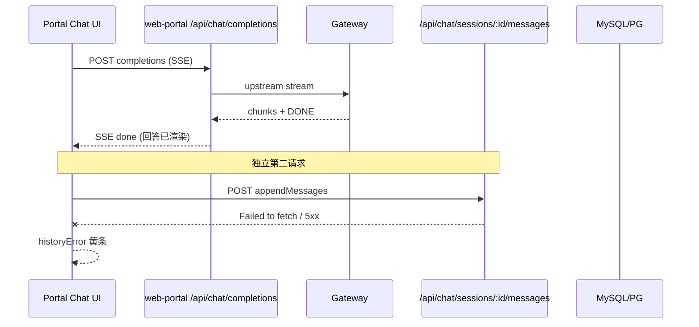

# Enterprise 聊天历史持久化韧性（回答完成后「历史同步」失败）

Planned-with: cursor-grok-4.5
Suggested-Impl-Model: gpt-5.6-sol
Status: pending-review
Prerequisite-Commit: `06d321b9` (`fix/enterprise-chat-stream-history-resilience`)

## Goal

回答流（SSE）已成功结束后，后续「落库历史」若因浏览器→门户瞬断失败，不得只弹一次「历史同步 / 无法连接门户服务」就放弃；须做到：**本地待同步队列 + 长退避重试 + 幂等写入 + 刷新/下一条消息自动补同步**，且文案区分「聊天失败」与「仅历史未落库」。

## Planned-with / Suggested-Impl-Model

| 子任务 | Suggested-Impl-Model | 理由 |
|--------|----------------------|------|
| P1 幂等 SQL upsert + message_count | gpt-5.6-sol / Codex 中档 | 方言双写、计数一致性，偏后端 |
| P2 localStorage 待同步队列 + store 接线 | gpt-5.6-sol | 状态机清晰、Composer 2.5 可落 |
| P3 退避重试与文案分层 | Composer 2.5 | 样板改动 |
| P4 测试与验收 | gpt-5.6-sol | 需覆盖并发/幂等边界 |

Suggested-Impl-Model（整包默认）: gpt-5.6-sol

---

## 根因与证据链（实施者无需对话上下文）

### 现象

- UI 已显示完整助手回答（含联网搜索引用）。
- 输入区上方出现 **「历史同步」** 黄条：`无法连接门户服务…多半是历史同步失败…`。
- 这不是「模型没答完」，而是 **第二段请求失败**。

### 链路



### 代码落点（当前行为）

1. `enterprise/features/chat/src/store.ts` ~L1173–1189（`sendMessage` 成功路径）：SSE 循环结束后 `await portalHistory.appendMessages(sessionId, [u, a])`；失败只 `set({ historyError })`，**无跨会话持久队列、无页面刷新后补传**。
2. 同类路径：`replaceMessages` 在 edit/regenerate 约 L1420–1430、L1626–1636。
3. `enterprise/features/chat/src/history-client.ts`：`historyFetch` 已有短退避（默认 2～3 次、`120 * 2^attempt` ms）。实测仍可能在 SSE 刚结束后连续失败；且失败后 **没有 outbox**。
4. `enterprise/apps/web-portal/src/lib/chat-history/sql-store.ts` `insertMessages` / `appendChatMessages`：纯 `INSERT`，**无按 `id` 幂等**；重试若第一次已写入、第二次重放会撞主键，或 `message_count` 被重复累加（若改成盲目重试而不幂等）。
5. `enterprise/apps/web-portal/src/components/MachiChatView.tsx` ~L428–435：`historyError` 一律 `historySyncTitle`；文案经 `normalizeTransportErrorMessage`（`enterprise/packages/sdk-ts/src/chat/http.ts`）把 `Failed to fetch` 写成「无法连接门户服务」——在 **回答已完成** 时易误判为整站挂掉。
6. 证据（2026-07-30）：同一用户会话回答可见后 DB `message_count`/行数未增加；门户日志无对应 `chat-history` 500——属 **浏览器侧 fetch 失败**，非 JSON metadata 回归（metadata stringify 已在前置 commit `06d321b9` 修复）。

### 前置已落地（本 plan **不要重做**）

- SSE 错误帧、Gateway idle_timeout 不映射合规、首 token 前瞬断重试、MySQL `JSON.stringify(metadata)`、historyFetch 短重试。  
- Commit：`06d321b9` on branch `fix/enterprise-chat-stream-history-resilience`。

---

## In scope

- 客户端 **durable outbox**（`localStorage`，按 `userId`/`tenant` 隔离键）。
- `appendMessages` / `replaceMessages` 失败入队；`hydrateSessions`、下一次 `sendMessage` 成功前后、以及定时/可见性回调触发 **flush**。
- 服务端 append **幂等**（按 message `id` upsert / ignore duplicate），`message_count` 用真实 `COUNT(*)` 或「仅新增行数」更新。
- 文案：历史同步失败 ≠ 聊天请求失败；黄条可带「正在重试 / 待同步 N 条」。
- 测试：client outbox + server idempotent insert。

## Out of scope

- Desktop / `agenticx/studio` 历史。
- admin-console。
- 改 Gateway 上游协议、改 web-search 检索逻辑。
- 全量离线 PWA、跨设备同步。
- 重构整个 `store.ts` 流式状态机。

## no-scope-creep

- 只改下列路径；禁止顺手改 completions/tool-loop/gateway（除非幂等 SQL 测试需要只读引用）。
- 禁止改 `agenticx/studio/server.py`。
- 禁止把「历史失败」重新映射成 `status: "error"` 聊天失败（回答已成功时必须保持 idle + history 黄条）。

---

## FR / NFR / AC

### FR-1：Durable outbox

失败的 `append`/`replace_all` 任务写入 `localStorage` key：`agx-portal-history-outbox-v1:<tenantId>:<userId>`（若前端拿不到 tenant/user，退化为 `agx-portal-history-outbox-v1` + session cookie 用户维度注释：优先从已有 session list 的首条 `tenant_id`/`user_id` 或 hydrate 后注入）。

任务形状：

```ts
type HistoryOutboxItem = {
  id: string; // ulid of the job
  sessionId: string;
  mode: "append" | "replace_all";
  messages: ChatMessage[]; // 完整可 POST 的消息
  attempts: number;
  nextAttemptAt: number; // epoch ms
  lastError?: string;
  createdAt: number;
};
```

### FR-2：自动 flush

触发点（均调用同一 `flushHistoryOutbox()`）：

1. `hydrateSessions` 成功末尾。
2. `sendMessage` / `editAndResend` / `regenerate` 在 persist catch 入队后立即 `void flush…`（带 backoff）。
3. `document.visibilitychange` → visible 时（在 portal 挂载处或 store 初始化 side-effect）。
4. 入队后按 `nextAttemptAt` 用 `setTimeout`（单飞：`historyOutboxFlushInFlight` Promise）。

Backoff：`min(30_000, 500 * 2^attempts)`，最多 attempts=8；超过仍保留队列并显示「待同步」，不删。

### FR-3：服务端幂等 append

**文件：** `enterprise/apps/web-portal/src/lib/chat-history/sql-store.ts`  
**函数：** `insertMessages` / `appendChatMessages`

**Before：** 批量 `INSERT`；`message_count = old + messages.length`。

**After（意图）：**

- MySQL：`INSERT ... ON DUPLICATE KEY UPDATE id=id`（或等价 `INSERT IGNORE`）——以 `chat_messages.id` PK 为准。
- PostgreSQL：`INSERT ... ON CONFLICT (id) DO NOTHING`。
- `message_count` / `last_message_at`：在事务内 `SELECT COUNT(*) ...` + `MAX(created_at)` 回写，**禁止** `+ messages.length`（避免重放双计）。

`replaceAllChatSessionMessages`：保持 delete-all + insert；replace 任务重放应整体可重入（先删再插；或 outbox 对同一 session 合并为最新 replace 快照）。

### FR-4：文案分层

- `normalizeTransportErrorMessage`：对历史路径使用更短文案，例如：  
  `历史未能保存到服务器，将自动重试；刷新页面或稍后再试。`  
  **不要**在「仅 historyError」场景强调「对话若已显示完整回答」（可保留一句）。
- `historyError` 成功 flush 后必须清 `null`（已有部分逻辑，入队成功也要清「致命」态，改为「同步中」可选状态字段 `historySyncPendingCount`）。

建议新增 store 字段（最小）：

```ts
historySyncPendingCount: number; // outbox 长度，供 UI
```

`MachiChatView.tsx`：若 `historySyncPendingCount > 0` 且无硬错误，黄条改为「正在同步历史（N）…」；硬错误仍用 warning。

### NFR

- Outbox 单用户上限 50 jobs / 总 payload < 2MB；超限丢弃最旧并打 `console.warn`（不 toast 刷屏）。
- 不把 API Key / cookie 写入 outbox。
- MySQL + PostgreSQL 双方言测试或至少 dialect 分支单测。

### AC

| ID | 验收 |
|----|------|
| AC-1 | 单测：mock `appendMessages` 连续 fail→outbox 非空；随后 mock ok→outbox 空、`historyError` null |
| AC-2 | 单测：同一 message id 连续 `appendChatMessages` 两次，DB 仅 1 行，`message_count` 正确 |
| AC-3 | 手动：联网搜索完整回答后人为断网再恢复，黄条可消失且刷新会话消息仍在 |
| AC-4 | 手动：回答成功时 **不得** 再出「聊天请求失败」顶栏（仅历史条） |
| AC-5 | `pnpm -C enterprise/features/chat exec vitest run` 相关文件绿；web-portal chat-history 相关 vitest 绿 |

---

## 实施任务（Composer 2.5 可独立执行）

### Task 0: 确认前置 commit 在分支上

```bash
git log -1 --oneline
# 期望含 06d321b9 或已 cherry-pick 的同等改动
```

### Task 1: 服务端幂等 insert（先写失败测试）

**Create/Modify tests:**  
`enterprise/apps/web-portal/src/lib/chat-history/append-idempotent.test.ts`（或扩展现有 sql-store 测试；若无 DB harness，用 mock `SqlClient` 断言最终 SQL 含 `ON CONFLICT` / `ON DUPLICATE KEY`）。

**Modify:** `sql-store.ts` `insertMessages` + `appendChatMessages` 计数更新。

伪代码（MySQL 分支）：

```sql
INSERT INTO chat_messages (...) VALUES (...)
ON DUPLICATE KEY UPDATE id = id
```

事务末：

```sql
SELECT COUNT(*) AS c, MAX(created_at) AS last_at FROM chat_messages
 WHERE session_id=? AND tenant_id=? AND user_id=?
```

再 `UPDATE chat_sessions SET message_count=?, last_message_at=?, ...`.

### Task 2: Outbox 模块

**Create:** `enterprise/features/chat/src/history-outbox.ts`

- `loadOutbox()` / `saveOutbox()` / `enqueueOutbox(item)` / `removeOutbox(id)` / `flushHistoryOutbox(client, { now })`
- flush 时跳过 `nextAttemptAt > now`；单飞锁；成功 remove；失败 `attempts++` 与新 `nextAttemptAt`。
- **replace_all** 入队时：删除同 `sessionId` 的旧 append jobs，只保留最新 replace（防乱序）。

**Test:** `enterprise/features/chat/src/history-outbox.test.ts`

### Task 3: 接线 store

**Modify:** `enterprise/features/chat/src/store.ts`

- persist catch：`enqueueOutbox` + `set({ historyError, historySyncPendingCount })` + `void flushHistoryOutbox(portalHistory)`.
- `hydrateSessions` finally/success：`void flushHistoryOutbox(...)`.
- 导出或内部 `getHistorySyncPendingCount` 更新。

**不要**在 catch 里把 `status` 设为 `error`。

### Task 4: historyFetch / 文案

**Modify:** `history-client.ts` — append/replace 默认 retries 提到 5；backoff 上限 2s（`min(2000, 200 * 2^attempt)`）。  
**Modify:** `sdk-ts` 增加 `normalizeHistoryTransportErrorMessage`（或给 `normalizeTransportErrorMessage` 第二参 `kind: "chat" | "history"`），history 用更短文案；更新 `http.test.ts`。

### Task 5: UI

**Modify:** `MachiChatView.tsx` — 订阅 `historySyncPendingCount`；文案分支。  
中文 key 若走 i18n：只加必要 key，勿大翻文案表。

### Task 6: 验收命令

```bash
pnpm -C enterprise/features/chat exec vitest run src/history-outbox.test.ts src/history-client.test.ts
pnpm -C enterprise/apps/web-portal exec vitest run src/lib/chat-history
pnpm -C enterprise/packages/sdk-ts exec vitest run src/chat/http.test.ts
```

---

## 推荐实施顺序

1. Task 1（幂等）→ 2（outbox）→ 3（store）→ 4（文案/retry）→ 5（UI）→ 6（验收）
2. 每 Task 独立 commit；trailer：

```
Plan-Id: 2026-07-30-enterprise-chat-history-durable-sync
Plan-File: .cursor/plans/2026-07-30-enterprise-chat-history-durable-sync.plan.md
Plan-Model: <规划模型>
Impl-Model: <实施模型>
Made-with: Damon Li
```

实施开始前：将本文件从 `.cursor/plans/pending/` **移回** `.cursor/plans/` 根目录。

---

## 风险

| 风险 | 缓解 |
|------|------|
| 重放导致 message_count 翻倍 | COUNT(*) 回写 |
| replace 与 append 乱序 | 同 session 合并策略 |
| localStorage 配额 | 上限 + 裁剪 |
| 误把聊天失败当历史失败 | 禁止改 status；文案分层 |

## 完成定义

- AC-1～AC-5 全过。
- 复现路径「联网搜索完整回答 → 偶发 Failed to fetch」在恢复网络后 **无需用户手动重发问题** 即可落库（刷新可验证）。
