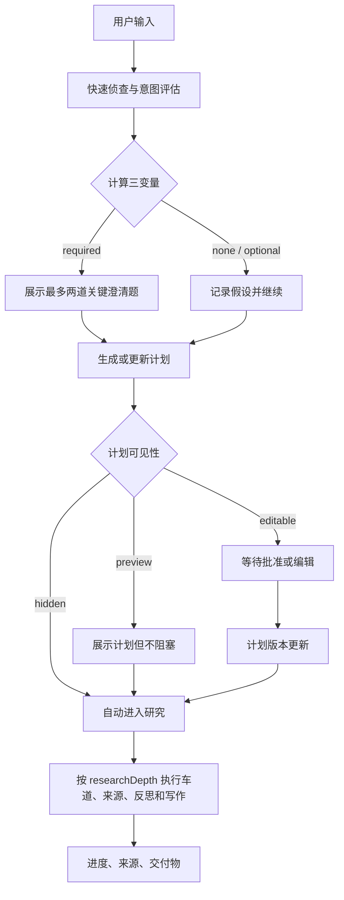

# 深度研究交互策略与统一落地计划

Planned-with: GPT-5 (Codex)
Suggested-Impl-Model: GPT-5.x（跨 BFF、事件协议、运行状态与前端工作台的一致性改动；局部 UI 可拆给 composer-2.5-fast）
Status: Pending；本文是交互策略与实现总计划，不包含本次实现代码
Date: 2026-08-04

## 0. 一句话结论

不把深度研究做成三个互斥入口，也不使用一个叫「任务复杂度」的分数同时决定所有交互。每次运行独立计算三个变量：

1. `researchDepth`：这次研究本身需要投入多少工作；
2. `clarificationDecision`：用户表达是否存在会改变结论的歧义，以及错误结论的代价是否值得打扰用户；
3. `planVisibility`：根据用户偏好，计划是隐藏、只读展示，还是可编辑并等待确认。

三者可以任意组合。因此「先澄清，再展示/修改计划，再开始研究」是合法且重要的一条路径，但不是所有任务都必须经过它。

目标体验是：默认少打扰，必要时只问高价值问题；研究深度由工作量决定；计划始终在系统内部生成，但是否让用户看到由偏好决定。

## 1. 背景、范围与当前状态

### 1.1 用户要解决的问题

市面上的深度研究产品通常呈现为几种表面形态：

- 给出研究方向或计划，用户可以对话修改后再开跑；
- 用户输入 prompt 后直接开始，过程和结果中再展示进度与来源；
- 运行前给出一组较长的澄清问题，让用户自己补全或修改；
- 让用户先选「简洁 / 深入 / 深度研究」或「先想后搜 / 先搜后扩」等深度/检索策略。

这些不是同一维度。前两类描述的是启动门槛，第三类描述的是澄清表单的强度，第四类描述的是工作量或检索策略。若直接把它们做成三个模式按钮，最终会把「是否要问用户」「研究做多深」「是否展示计划」错误地耦合。

### 1.2 当前实现能复用的基础

当前 Enterprise Portal 已有一条完整的深研流水线：

```text
recon → clarify → plan → parallel lanes → reflect → synthesize → artifacts / sources
```

主要落点：

- `enterprise/apps/web-portal/src/lib/deep-research/orchestrator.ts:437` 的 `runDeepResearchTurn` 负责主流程；`594–747` 处理冷启动检索、澄清和交付偏好；`747–797` 生成研究计划；后续负责车道、反思、写作和交付。
- `enterprise/apps/web-portal/src/lib/deep-research/research-intent.ts:8` 的 `looksOpenEndedResearchQuery` 已经提供开放题识别和默认方向。
- `enterprise/apps/web-portal/src/lib/deep-research/clarifier.ts:38` 已有 LLM 澄清器，最多生成两道题，并对开放式问题提供确定性兜底。
- `enterprise/apps/web-portal/src/lib/deep-research/planner.ts:16` 已有 `ResearchPlan.complexity` 与子问题拆分；`enforcePlanBreadth` 能防止开放题被压缩为单一车道。
- `enterprise/apps/web-portal/src/lib/deep-research/delivery-prefs.ts` 已有交付内容形态与主格式偏好。
- `enterprise/packages/core-api/src/chat.ts:41` 与 `enterprise/packages/sdk-ts/src/deep-research.ts:3` 已有结构化深研事件协议。
- `enterprise/features/chat/src/components/molecules/DeepResearchWorkbench.tsx:454` 已有工作台；`DeepResearchClarifyCard.tsx:84` 已有澄清卡；`deep-research-segments.ts:128` 已将事件聚合成时间线；`DeepResearchDelivery.tsx:70` 已收敛主交付物。
- `enterprise/apps/web-portal/src/lib/deep-research/run-store.ts:33`、`enterprise/apps/web-portal/src/lib/deep-research/run-wait.ts:129` 和重连路由已经支持长任务持久化、澄清等待、超时和断点恢复。

### 1.3 当前缺口

1. `looksOpenEndedResearchQuery` 主要按关键词、长度和问号判断开放题（`research-intent.ts:8–27`）。它可以判断「像不像开放研究」，但不能判断「缺少什么约束」「不同理解会不会导致不同结论」「错误的代价是否值得打扰」。
2. `ResearchPlan.complexity` 目前主要是规划输出字段，尚未成为独立的研究投入控制器；`clarify` 仍容易被误解为复杂度开关。
3. 计划虽然在 `orchestrator.ts` 内部生成，但没有作为一等事件/状态呈现给用户，也没有用户可编辑的版本号、批准动作和差异更新。
4. 当前方向问题与交付偏好问题会在开放题中合并为最多四道题（`orchestrator.ts:670–731`）。这能补信息，但容易让「只是想直接开跑」的用户感觉被问卷拦住。
5. `DeepResearchEvent`、`ChatMessageDeepResearch`、`RunRecord` 当前没有统一的 `researchDepth`、`clarificationDecision`、`planVisibility`、`assumptions` 和 `plan version` 契约；刷新/重连后只能从事件和 `clarifyAnswers` 部分恢复。
6. 用户只能在侧栏或输入区开关深度研究，尚不能表达「我希望直接开始」或「我希望先看并修改计划」这类交互偏好。

### 1.4 In scope

- Enterprise Portal 深度研究的启动前交互、澄清策略、计划展示/编辑和研究深度控制。
- `enterprise/apps/web-portal`、`enterprise/features/chat`、`enterprise/packages/core-api`、`enterprise/packages/sdk-ts` 及必要的 DB schema/迁移。
- 当前已有的澄清卡、时间线、车道、来源面板、交付卡和重连能力的统一接线。
- 运行指标、灰度开关和可回滚策略。

### 1.5 Out of scope

- 不重写搜索 provider、页面正文抓取、引用注册、报告写作质量和交付格式；这些已有独立计划。
- 不在本计划内改 Desktop、Python AgenticX runtime、Gateway 模型路由或管理后台。
- 不把模型内部思维链展示给用户；计划只展示可执行的研究任务摘要、来源策略和假设。
- 不要求第一版支持研究开始后的任意重规划；先完成启动前的澄清/计划协作，运行中 steering 作为后续波次。
- 不把第三方产品名称写入 commit subject、PR 标题或 PR 正文；竞品名称仅保留在内部调研文档与本计划中。

## 2. 竞品调查：表面是三类，底层是多条交互轴

本节以产品官方公开说明为主；公开页面会随版本变化，最终 UI 仍应在固定日期做实机复测。用户提到的产品归类保留为研究假设，不把未核实的品牌行为写成稳定事实。

### 2.1 协作式开题：先给计划，再允许自然语言修改

代表：ChatGPT Deep Research、Gemini Deep Research 的公开说明。

- OpenAI 公开说明明确提到：深度研究会根据上下文提出研究计划，用户可以在开始前查看和调整；研究过程中可以查看进度、打断并调整重点或来源。
- Google 公开说明提供 `Edit plan`，用户可以用自然语言让研究增加内容或改变方向；API 文档也把 collaborative planning 作为复杂查询的计划复核能力。

优点：

- 降低「模型到底理解了什么」的不确定性；
- 适合范围、来源、输出格式有明确偏好的专业用户；
- 计划成为用户纠偏的低成本入口，能减少跑完后返工；
- 计划、来源、进度和结果形成可解释链条。

缺点：

- 多了一次等待和决策，简单任务会显得笨重；
- 计划展示过细时，用户需要阅读模型内部工作分解，认知成本高；
- 用户可能把计划误认为承诺，实际检索发生变化时需要解释版本更新；
- 计划质量依赖模型，错误计划的可视化可能反而增加信任错觉。

### 2.2 自动开跑：prompt 即启动，过程和结果承担解释责任

代表：Kimi 深度研究，以及用户提到的偏自动执行的国内产品。Kimi 官方说明同时包含「意图澄清」「主动搜索」「自主调用工具」「动态可视化报告」等能力；从用户感知看，它更接近输入后直接执行，而不是先要求用户编辑一份长计划。

优点：

- 启动成本最低，符合「我已经说了，请你先做」的期待；
- 对问题清楚、错误代价低的任务，速度和流畅度最好；
- 用户不需要学习研究方法、车道和来源策略；
- 可通过进度、来源和最终报告补足过程透明度。

缺点：

- 模型误解目标后会花较长时间在错误方向上；
- 用户直到结果出来才发现范围、口径或格式不对，返工成本高；
- 自动执行会放大错误假设，尤其是需要做推荐、比较和决策支持的任务；
- 若只给一个「正在研究」状态，用户无法判断是真的在工作还是卡住。

### 2.3 表单式澄清：先补齐一组结构化约束

代表：用户对纳米类产品的体验描述，以及一类「先问一长串问题再开始」的研究工具。当前可检索到的纳米官方公开页面更强调搜索、深度推理和多模型能力，并未完整公开澄清问卷的稳定协议，因此「长问卷」在本计划中作为待实机验证的交互假设，不作为唯一竞品事实。

优点：

- 适合高风险、强约束、需要用户提供领域上下文的任务；
- 把隐含需求显式化，便于模型构造稳定的研究空间；
- 用户可以一次性指定受众、范围、格式、来源和评价标准。

缺点：

- 用户负担最大，问题越多越像填写需求单；
- 很多问题用户其实没有答案，模型应能先做侦查和提出默认假设；
- 「所有信息都必须先填」会把可由模型推断的工作转嫁给用户；
- 对低风险问题会产生明显的打扰和流失。

### 2.4 显式深度/检索策略选择：把研究投入交给用户

代表：秘塔公开页面中的「深度研究 / 先想后搜 / 先搜后扩」，以及同类产品的「简洁 / 深入 / 研究」选择。这个维度不是澄清，而是让用户直接选择回答或检索投入。

优点：

- 用户对速度、成本和结果深度有直接预期；
- 对熟悉自己任务的人很高效；
- 产品解释简单，容易形成可记忆的模式。

缺点：

- 用户必须理解「深度」意味着什么；
- 用户可能为了快选浅模式，得到不够可靠的结果；
- 仍然没有解决「问题说清楚了吗」；
- 复杂度、歧义和错误代价不是同一个选择。

### 2.5 共同抽象

| 交互轴 | 可能取值 | 用户真正关心的问题 |
|---|---|---|
| 启动门槛 | 直接开始 / 可选澄清 / 必须澄清 | 我现在要不要被问问题？ |
| 计划可见性 | 隐藏 / 只读预览 / 可编辑并批准 | 我想不想参与研究设计？ |
| 研究投入 | 轻量 / 标准 / 深度 | 这次要搜多广、读多深、写多长？ |
| 运行时控制 | 被动等待 / 查看进度 / 中途调整 | 开始后还能不能纠偏？ |
| 来源治理 | 全网默认 / 指定网站 / 文件和知识库优先 | 证据从哪里来？ |
| 交付形态 | 简短答案 / 结构化报告 / 比较矩阵 / 决策建议 | 最终要拿结果做什么？ |

结论：竞品不是三个互斥模式，而是在上述轴上做了不同默认值。我们的产品应把这些轴解耦，再用一个默认的智能策略组合它们。

## 3. 与现有方案的对比结论

### 3.1 我们已有的优势

- 已有 `recon → clarify → plan → lanes → reflect → synthesize` 的真实编排，不需要从聊天 UI 重新发明研究运行时。
- 已有确定性开放题兜底、最小车道数和多选方向展开，能抵御模型把开放题压缩成单一搜索。
- 已有每车道来源、正文抓取、备忘、引用、HTML/Markdown 交付和文件面板，研究过程可审计、结果可复用。
- 已有 SSE 结构化事件、run-store、文件等待器、超时和重连，适合加入计划版本和用户 gate。
- 已有交付偏好题和单主交付卡，可以继续扩展为「研究前偏好」而不重做交付层。

### 3.2 当前最需要修正的方向

- **不要再让“开放题”直接等价于“需要阻塞澄清”。** 开放题通常需要更深的研究，但不一定需要问用户；是否澄清应由歧义和错误代价决定。
- **不要让 `complexity` 兼任三种含义。** 研究计划复杂，不代表用户表达不清，也不代表计划必须展示。
- **不要把交付偏好和阻塞问题堆成一长串问卷。** 方向问题是研究正确性的约束；交付格式是偏好，可以默认、折叠或在计划中修改。
- **不要只做“隐藏计划”和“展示计划”两个前端分支。** 计划必须有版本、假设、编辑、批准和重连语义，否则用户修改后无法证明实际执行的是哪一版。
- **不要让模型单独决定是否澄清。** LLM 可以提出问题和理由码，但最终要经过确定性规则兜底，尤其是高错误代价场景。

## 4. 产品共识与决策规则

### 4.1 三变量契约

推荐新增一个运行级内部对象。字段名可在实现时按现有命名统一，但语义必须保持独立：

```ts
export type ResearchDepth = "light" | "standard" | "deep";
export type ClarificationDecision = "none" | "optional" | "required";
export type PlanVisibility = "hidden" | "preview" | "editable";
export type PlanApproval = "automatic" | "required";

export type ResearchInteractionProfile = {
  researchDepth: ResearchDepth;
  clarification: {
    decision: ClarificationDecision;
    reasonCodes: string[];
    blockingSlots: Array<{
      id: string;
      label: string;
      impact: "low" | "medium" | "high";
    }>;
    maxQuestions: 0 | 1 | 2;
  };
  plan: {
    visibility: PlanVisibility;
    approval: PlanApproval;
  };
  assumptions: string[];
};
```

约束：

- `researchDepth` 只影响车道数量、来源数量、正文抓取、反思轮次、写作预算和交付详略。
- `clarification.decision` 只影响是否问用户、问题是否阻塞，以及问题最多多少道。
- `plan.visibility` 只影响计划是否进入用户界面；隐藏计划仍然必须生成并参与执行。
- `assumptions` 是面向用户的短假设，不是模型思维链；每条必须能被用户理解和纠正。
- 原有 `ResearchPlan.complexity` 可以在迁移期保留，但只能作为 `researchDepth` 的兼容输入，不再参与澄清判断。

### 4.2 什么叫“任务复杂度”

这里的复杂度不是用户 prompt 的字数，也不是句子看起来是否专业，而是研究工作的预期投入。评估以下维度：

1. **研究面宽度**：是否包含多个相互独立、需要分别检索的子问题；
2. **证据深度**：是否需要阅读原文、数据、论文、公告或多级来源，而不是看摘要即可；
3. **时效性**：是否需要当前状态、时间线、近期变化或多时间点比较；
4. **综合难度**：是否需要比较、因果解释、权衡、预测或决策建议；
5. **核验要求**：是否存在多方口径、冲突来源、需要交叉验证；
6. **交付要求**：是否需要结构化报告、矩阵、图表、引用链或多个交付物。

建议的深度语义：

| `researchDepth` | 典型任务 | 运行策略 |
|---|---|---|
| `light` | 单一事实、定义、一个指标、短解释 | 少量来源，单车道，跳过反思，短结果 |
| `standard` | 多侧面对比、近期综述、一般性分析 | 2–4 个车道，来源交叉，必要时一次反思 |
| `deep` | 跨主题、时间线、技术机制、竞争情报、决策支持 | 4–8 个车道，优先正文/权威来源，反思补搜，结构化长报告 |

深度是“要做多少工作”，不是“要不要先问用户”。

### 4.3 什么情况下应该澄清

澄清决策同时看三个因素：

- **歧义**：是否存在多个合理解释，且缺少的约束会改变研究范围、证据口径或结论；
- **错误代价**：错答是否会导致错误决策、财务/法律/医疗/声誉风险、不可逆操作或大规模返工；
- **打扰成本**：用户是否容易回答，是否会因为等待、长问卷或上下文切换而放弃。

不用把内部评分暴露给用户，但规则可以表达为：

```text
如果“歧义会显著改变结论”且“错误代价高” → required
如果“歧义有影响”但可用默认假设先做，且错误代价中低 → optional
如果结论对多种合理解释都基本稳定，或问题已明确 → none
```

具体规则：

- 只问会改变研究方向的“阻塞槽位”，例如地域、时间范围、比较对象、目标受众、评价标准、风险边界；
- 一轮最多两道高价值问题，默认合并呈现，不逐题打断；
- 用户明确说“直接开始”时，可以跳过 `optional`，但不能静默绕过 `required`；
- `required` 也要尽量只问最关键的一题，并给出可接受的默认项；
- `none` 时仍记录 assumptions，并在结果开头用一句话告知采用的范围；
- 不能因为问题很难就自动澄清，也不能因为 prompt 很长就认为用户没说清楚。

### 4.4 两个关键反例

| 输入形态 | 研究深度 | 澄清决策 | 原因 |
|---|---|---|---|
| 很难的问题 + 很简单的描述，例如“研究 Transformer 的核心技术演进” | `deep` | `optional` 或 `none` | 研究工作量大，但如果用户接受默认范围，可以先按架构、训练、推理、评测拆解；不应仅因描述短就阻塞 |
| 很简单的问题 + 很复杂的描述，例如长篇背景后问“这个 API 的发布日期是什么” | `light` | `none` | 目标是单一事实，长背景不改变答案；应提取最终目标，避免被字数误导 |
| 很难的问题 + 目标也含糊，例如“帮我做一份 AI 战略建议” | `deep` | `required` | 目标、对象、时间范围和评价标准缺失，错误建议代价高；先问 1–2 个决定性约束，并可同时展示草案计划 |
| 很简单的问题 + 但关键条件缺失，例如“推荐一款手机” | `light` 或 `standard` | `optional` 或 `required` | 研究不深，但预算、地区、用途会改变推荐；澄清由歧义和错误代价触发，而不是由研究深度触发 |

### 4.5 用户偏好只决定计划是否可见

建议提供一个简单的用户偏好，而不是把内部评分暴露成复杂设置：

| 用户偏好 | 运行映射 |
|---|---|
| 自动 | 采用系统判断；默认隐藏内部计划，遇到高影响澄清时可展示一份简短只读草案 |
| 直接开始 | 隐藏计划；跳过 `optional` 澄清；`required` 澄清仍保留 |
| 先看计划 | 计划以可编辑草案展示，用户批准或修改后才进入正式研究 |

“先看计划”不会取消必要澄清；“直接开始”不会允许系统在高风险且关键条件缺失时盲跑。偏好可以按用户保存，也允许对当前任务临时覆盖。

## 5. 三种体验如何切换

不在界面上展示“Gemini 模式 / Kimi 模式 / 纳米模式”，而是在深度研究入口下提供“启动偏好”三项；默认选择“自动”。系统根据三变量组合出体验：

| `clarificationDecision` | `planVisibility` | 用户看到的体验 | 对应市场形态 |
|---|---|---|---|
| `none` | `hidden` | 输入后直接开跑，展示进度和来源 | 自动开跑 |
| `required` | `hidden` | 只问关键问题，回答后直接开跑 | 澄清后自动开跑 |
| `none` / `optional` | `editable` | 先看计划，可对话修改，批准后开跑 | 协作式计划 |
| `required` | `editable` | 一张卡同时展示“关键问题 + 草案计划”；回答后计划更新，再批准 | 澄清 + 计划 |
| `optional` | `preview` | 先展示简短计划，但默认继续执行；用户可补充修正 | 低打扰协作 |

核心状态流：



“澄清”和“计划”不是互斥步骤，也不是只能二选一；它们可以在同一张开题卡中出现。

## 6. 交互设计

### 6.1 统一开题卡（Preflight Card）

新增一个统一容器，替代“澄清卡 + 单独计划块 + 交付问卷”堆叠：

1. **我的理解**：一句话复述研究目标和默认范围；
2. **需要你确认的关键点**：只有 `required` 或高价值 `optional` 问题；最多两道；
3. **研究计划草案**：目标、3–8 个子问题、来源策略、交付形态、当前假设；
4. **操作**：`直接开始`、`修改目标`、`修改计划`、`确认并开始`；
5. **偏好入口**：当前任务可临时切换“直接开始 / 先看计划”，不改变研究深度。

澄清题和计划同时出现时，计划中的受影响部分标记为“待确认”；用户提交答案后只更新变化部分，并展示简短 diff，不重新刷一张长计划。

### 6.2 计划展示边界

计划只包含可执行信息，不包含模型思考过程：

```ts
export type ResearchPlanSnapshot = {
  version: number;
  objective: string;
  scope: string[];
  subQuestions: Array<{
    id: string;
    title: string;
    purpose?: string;
  }>;
  sourceStrategy: string[];
  deliverables: string[];
  assumptions: string[];
};
```

计划要短、可扫描、可修改。默认不展示每个搜索词、模型内部理由和完整思维链；车道和来源在正式运行的时间线中逐步展开。

### 6.3 用户偏好入口

当前 `MachiChatView.tsx:820–837` 的深研 chip 已能表达“深度研究已开启”。在此 chip 旁增加一个轻量设置入口，或将 chip 点击改为打开 Popover；不要把深度、澄清评分、车道数量暴露给普通用户。

建议文案：

- `自动`：由系统判断是否需要问我；
- `直接开始`：能合理假设时不要等我确认；
- `先看计划`：开始前给我看计划，我可以修改。

偏好先使用浏览器本地持久化，后续再接用户 profile；当前任务可临时覆盖。租户管理员的 `deepResearchEnabled` 仍是能力开关，不与用户交互偏好混合。

## 7. 技术落地设计

### 7.1 事件与状态协议

在以下两个文件同步扩展结构：

- `enterprise/packages/sdk-ts/src/deep-research.ts:3`
- `enterprise/packages/core-api/src/chat.ts:42`

建议新增以下事件，保持旧事件兼容：

```ts
type ResearchProfileEvent = {
  type: "research_profile";
  runId: string;
  researchDepth: "light" | "standard" | "deep";
  clarificationDecision: "none" | "optional" | "required";
  planVisibility: "hidden" | "preview" | "editable";
  assumptions: string[];
};

type ResearchPlanEvent = {
  type: "research_plan";
  runId: string;
  action: "proposed" | "updated" | "approved";
  version: number;
  plan: ResearchPlanSnapshot;
};
```

对现有 `clarify` 事件增加可选字段：

```ts
blocking?: boolean;
reasonCode?: string;
```

对 `ChatMessageDeepResearch` / `DeepResearchState` 增加可选快照字段，便于不重放全部事件时仍能显示当前状态：

```ts
profile?: ResearchInteractionProfile;
plan?: ResearchPlanSnapshot;
planVersion?: number;
assumptions?: string[];
```

状态建议增加通用 `awaiting_input`，并在状态上带 gate 类型：

```ts
gate?: "clarify" | "plan" | "clarify_and_plan";
```

迁移期间客户端继续识别旧的 `awaiting_clarify`，并将其视为 `awaiting_input + clarify`，避免历史消息和旧运行挂死。

### 7.2 意图/澄清评估器

新建：

`enterprise/apps/web-portal/src/lib/deep-research/interaction-policy.ts`

职责：

- 从用户原始消息中抽取目标、对象、时间、地域、受众、评价标准、风险类型等槽位；
- 将“工作量评估”和“澄清评估”分开输出；
- LLM 只负责候选结构化判断和问题生成；
- 确定性规则负责边界、最多题数、风险覆盖和默认假设；
- 不把原始内部分数或思维链写入用户消息。

建议导出纯函数：

```ts
export function assessResearchInteraction(input: {
  query: string;
  reconBrief?: string;
  userPreference?: "auto" | "direct" | "plan_first";
}): ResearchInteractionProfile;

export function applyClarificationAnswers(
  profile: ResearchInteractionProfile,
  answers: Record<string, string>,
): ResearchInteractionProfile;

export function deriveResearchDepth(input: {
  query: string;
  plan: ResearchPlan;
  deliveryPrefs?: DeliveryPrefs;
}): ResearchDepth;
```

`research-intent.ts:8` 的关键词启发式保留为兜底，不再直接决定是否阻塞澄清；应改为帮助识别研究面宽度和默认方向。

### 7.3 Orchestrator 接线

修改 `enterprise/apps/web-portal/src/lib/deep-research/orchestrator.ts`：

1. 在 `runDeepResearchTurn`（`437`）完成 recon 后调用 `assessResearchInteraction`。
2. 在现有 `641–731` 的 Clarify gate 中：
   - `none`：不产生阻塞等待，只记录 assumptions；
   - `required`：发出最多两道 `blocking: true` 的问题，并等待回答；
   - `optional`：第一版可默认按假设继续，卡片显示“可补充”；第二版再支持运行中非阻塞补充。
3. 交付偏好不再无条件追加到阻塞问题列表；使用默认值，或作为开题卡的折叠区。
4. 在 `747–797` 生成计划后，根据 `planVisibility`：
   - `hidden`：只在内存和运行事件中保存，不等待用户；
   - `preview`：发出 `research_plan: proposed`，继续执行；
   - `editable`：发出 `research_plan: proposed`，等待批准/编辑。
5. 澄清回答和计划编辑必须原子地重新生成 `ResearchPlanSnapshot`，递增 `version`，发出 `research_plan: updated`，再进入正式车道。
6. 用 `researchDepth` 驱动现有常量的解析，不改变现有总预算保护：
   - `light`：1–2 车道、较少结果、跳过反思；
   - `standard`：2–4 车道、现有默认策略；
   - `deep`：4–8 车道、全文抓取、反思补搜和完整交付。
7. `WRITE_RESERVE_MIN_MS`、`TOTAL_BUDGET_MS` 和已有超时策略继续保留；深度只控制目标投入，预算不足时允许降级并在 `research_profile`/完成摘要中诚实表达。

### 7.4 用户 gate 与 resume

现有 `enterprise/apps/web-portal/src/lib/deep-research/run-wait.ts:129` 只表达澄清等待。建议将其抽象为 `ResearchGate`，保留旧函数别名以兼容测试和旧调用：

```ts
type ResearchGatePayload = {
  answers?: Record<string, string>;
  planAction?: "approve" | "edit" | "skip";
  planPatch?: Partial<ResearchPlanSnapshot>;
  skip?: boolean;
};
```

现有 `enterprise/apps/web-portal/src/app/api/chat/deep-research/resume/route.ts:17–58` 可扩展为同一轮原子提交：

- 仍校验 `runId`、当前用户和待处理 gate；
- 只允许修改已有计划的结构化字段，限制标题、子问题、来源策略和交付物长度/数量；
- `answers + planPatch` 同时提交时，先应用答案，再生成计划版本，不能出现“UI 显示新版但后端执行旧版”；
- 超时或重复提交保持幂等，返回 `alreadyContinued: true`，不让 UI 显示裸 JSON 错误。

第一版不引入新的公网 endpoint，减少路由和权限面；若后续需要独立审计，再拆出 `/plan` route。

### 7.5 持久化与重连

第一版优先复用现有事件持久化，不立即新增数据库列：

- `enterprise/apps/web-portal/src/lib/deep-research/run-store.ts:33` 的 `RunRecord.events` 已可持久化新事件；
- `enterprise/apps/web-portal/src/app/api/chat/deep-research/runs/route.ts:64–81` 的 hydrate payload 增加从最新事件派生的 `profile`、`plan`、`gate`；
- `enterprise/features/chat/src/utils/deep-research-hydrate.ts` 与 `deep-research-reconnect.ts` 需正确合并新事件；
- `enterprise/features/chat/src/history-outbox.ts:233–245`、`enterprise/apps/web-portal/src/lib/chat-history/sql-store.ts:100–129` 需把新快照字段加入白名单；
- `enterprise/apps/web-portal/src/lib/chat-message-sanitize.ts:117–151` 增加字段长度、子问题数、假设数和版本号限制；
- 只有当后续需要按 profile 做后台报表或跨设备恢复用户偏好时，再增加 PG/MySQL JSON 字段和对应迁移；不能只改 PG 而遗漏 MySQL。

### 7.6 前端工作台

建议新建：

`enterprise/features/chat/src/components/molecules/DeepResearchPreflightCard.tsx`

并修改：

- `DeepResearchWorkbench.tsx:454–551`：将 `research_profile`、`research_plan` 和 `clarify` 聚合成一个 preflight segment；
- `deep-research-segments.ts:128–220`：增加 `preflight` 类型，确保同一轮只渲染一张卡；
- `DeepResearchClarifyCard.tsx`：保留旧消息兼容，并复用选择、答案格式化和超时处理；
- `DeepResearchDelivery.tsx`：继续只展示主交付物，读取 profile/delivery prefs 时不重复展示澄清原文；
- `MachiChatView.tsx:639–665`：发送请求时携带当前任务的计划偏好，并在重试/重新生成时保持一致；
- `enterprise/features/chat/src/store.ts:360–426, 2108–2126`：处理 profile、plan、gate 事件，维护 plan version 和 answers；
- `enterprise/apps/web-portal/src/components/MachiChatView.tsx:820–837`：增加启动偏好 Popover；`WorkspaceShell.tsx:118–130` 仍只负责租户可用性和深研总开关。

视觉与交互要求：

- 关键问题最多两道，默认一张卡内完成；
- 计划默认折叠为 3–8 条可扫描的子问题；
- 计划更新展示“变更了哪些方向”，不把整份计划重新刷屏；
- `required` 问题必须有明确的“为什么需要确认”一句话，但不展示内部评分；
- `optional` 问题不能阻塞用户，也不能覆盖正在进行的正式研究；
- 运行中继续使用现有车道、来源、全文和产物展开能力。

## 8. 分阶段实施顺序

### Wave 0：契约与测量基线（P0）

目标：先把三变量从概念变成可测试的结构，不改变默认用户体验。

改动：

- 新建 `interaction-policy.ts` 和纯函数测试；
- 扩展 SDK/Core API 的 profile/plan 事件；
- 保留现有 `awaiting_clarify` 兼容语义，先不引入新的阻塞状态；
- 记录分类指标和 reason codes，不记录原始 prompt/答案；
- 将当前 `complexity` 映射为 `researchDepth`，但默认行为保持不变。

验收：

- 同一个输入的 `researchDepth`、`clarificationDecision`、`planVisibility` 可独立断言；
- 旧事件和新事件可以被旧客户端忽略而不崩溃；
- 现有深研单测全绿。

### Wave 1：最小打扰的澄清策略（P0）

目标：解决“难题简单描述”和“简单题复杂描述”的错判，消除长问卷默认阻塞。

改动：

- `orchestrator.ts` 接入 deterministic policy；
- `clarifier.ts` 只负责生成高价值问题候选，最终由 policy 限制最多两题；
- `delivery-prefs.ts` 的交付偏好改成默认值/折叠区，不再和阻塞问题混排；
- `run-wait.ts` 和 `resume/route.ts` 保持超时、重复提交和权限行为不退化。

验收：

- 清楚的深题不再因为“开放关键词”强制等待；
- 目标明确的长 prompt 不再因为字数触发澄清；
- 高影响且关键条件缺失的任务至少询问一个决定性条件；
- `required` 超时按 assumptions 继续，且 UI 文案不显示原始错误 JSON；
- `optional` 不阻塞正式研究。

### Wave 2：计划可见性与“澄清 + 计划”同卡（P0/P1）

目标：让三种市场形态由同一套运行时自然组合出来。

改动：

- 新建 `DeepResearchPreflightCard.tsx`；
- 增加 `research_plan` 事件、版本号和批准动作；
- 扩展 `resume` 为结构化 gate；
- `DeepResearchWorkbench` 统一渲染一张 preflight 卡；
- 为 `auto / direct / plan_first` 增加本地持久化偏好和当前任务临时覆盖。

验收：

- `direct`：清楚任务直接开始，`optional` 不阻塞，计划不显示；
- `plan_first`：计划展示后可通过自然语言/结构化编辑更新，并明确版本变化；
- “澄清 + 计划”：先看到问题和草案计划，回答后计划更新，再批准开始；
- 刷新、重连、历史打开后仍显示当前计划版本和假设；
- 旧历史消息仍能正常展示。

### Wave 3：研究深度自适应（P1）

目标：让 `researchDepth` 真正影响研究投入，而不是只改变一个标签。

改动：

- 将现有 `MAX_LANES`、每车道结果数、正文抓取、反思阈值和写作预算收敛到 `resolveDepthBudget()`；
- `light/standard/deep` 只控制目标上限，不突破租户配额、总预算和安全限制；
- 车道和报告中显示“按轻量/标准/深度策略完成”，不泄露内部评分；
- 预算不足时允许从 deep 降级为 standard，但必须产出降级事件或完成摘要说明。

验收：

- 相同问题只改变计划展示偏好时，研究深度不变；
- 相同研究深度只改变是否澄清时，车道预算不被意外重置；
- light 不会启动完整深度车道；deep 不会被 planner 的单个子问题意外压缩；
- 总预算、写作保留预算、超时和取消行为不退化。

### Wave 4：运行中 steering 与个性化（P2）

目标：补齐协作式产品在正式运行期间的优势。

候选能力：

- 用户在车道运行期间追加“只看官方来源”“聚焦成本”等修正；
- 支持暂停尚未开始的车道，保留已完成证据；
- 统计用户长期偏好，自动调整 plan visibility 默认值；
- 对高风险场景提供租户级强制澄清策略和来源白名单。

本波次不能提前侵入 Wave 1/2 的主流程；第一版先把启动前 gate 做正确。

## 9. 文件级改动清单与推荐实施模型

| 子任务 | 主要落点 | 推荐模型 | 理由 |
|---|---|---|---|
| policy 纯函数与测试 | 新建 `enterprise/apps/web-portal/src/lib/deep-research/interaction-policy.ts`；扩展 `research-intent.test.ts`、`clarifier.test.ts` | composer-2.5-fast | 规则、类型和单测为主，边界已由本计划写死 |
| 事件/状态协议 | `enterprise/packages/sdk-ts/src/deep-research.ts`、`enterprise/packages/core-api/src/chat.ts`、sanitize/history/hydrate | GPT-5.x | 需要确保 SDK、BFF、store、重连和历史协议一致 |
| orchestrator gate | `enterprise/apps/web-portal/src/lib/deep-research/orchestrator.ts:641–797`、`run-wait.ts`、`resume/route.ts` | GPT-5.x | 触碰长任务状态、超时、预算和原子 resume |
| preflight UI | 新建 `DeepResearchPreflightCard.tsx`；改 `DeepResearchWorkbench.tsx`、`deep-research-segments.ts`、`DeepResearchClarifyCard.tsx` | composer-2.5-fast；视觉收口用强审美模型 | 组件接线相对局部，但需注意等待/超时/计划 diff |
| 用户偏好接线 | `MachiChatView.tsx`、`WorkspaceShell.tsx`、`ComposerPlusMenu.tsx`、`features/chat/src/store.ts` | composer-2.5-fast | 以现有 Popover、localStorage 和请求透传为主 |
| 深度预算控制 | `orchestrator.ts`、`planner.ts`、`orchestrator.test.ts` | GPT-5.x | 涉及预算、车道、反思和报告收尾的序列一致性 |
| 灰度与最终回归 | 深研全量 Vitest、Portal typecheck、手动冒烟 | GPT-5.x | 跨层行为和兼容路径需要最终复核 |

## 10. 验收矩阵

### 10.1 决策矩阵

| 场景 | 预期 depth | 预期 clarification | 预期 plan |
|---|---|---|---|
| “研究一下某模型的核心技术演进” | deep | optional/none；默认方向可直接采用 | 按用户偏好 |
| “比较 2024–2026 的 A/B/C，关注成本、Agent 能力，优先官方来源” | deep | none | 按用户偏好，不再问已明确条件 |
| “帮我做 AI 战略建议” | deep | required，问对象/期限/评价标准中最关键的 1–2 个 | 若 plan_first，则澄清 + 计划同时展示 |
| 长篇背景 + “发布日期是什么” | light | none | hidden 或 preview，不阻塞 |
| “推荐一款手机” | light/standard | optional；预算/地区会改变结论时再问 | hidden 默认 |
| 医疗/法律/投资决策，关键适用范围缺失 | 视研究工作量 | required | 建议 preview/editable，并显示假设 |
| 用户选择“直接开始”但仍缺高风险关键条件 | 视研究工作量 | required 不能被偏好关闭 | 可隐藏，但必须先完成关键澄清 |

### 10.2 必须新增的测试

- `enterprise/apps/web-portal/src/lib/deep-research/interaction-policy.test.ts`：覆盖深度与澄清完全解耦、长 prompt 不误触发、短描述深题不误跳过、高风险缺槽位必问、可用默认假设的任务不阻塞。
- `enterprise/apps/web-portal/src/lib/deep-research/clarifier.test.ts`：模型返回长问卷时最多保留两道高价值问题；交付偏好不挤占阻塞题额度。
- `enterprise/apps/web-portal/src/lib/deep-research/orchestrator.test.ts`：覆盖 `none / optional / required` 与 `hidden / preview / editable` 的组合；断言事件顺序、等待状态、计划版本和预算不变。
- `enterprise/apps/web-portal/src/lib/deep-research/run-wait.test.ts`：答案、计划编辑、批准、超时、重复提交和 HMR/文件轮询场景。
- `enterprise/features/chat/src/components/molecules/DeepResearchPreflightCard.test.tsx`：同卡显示问题和计划；答案后计划 diff；直接开始不阻塞；计划编辑只提交白名单字段。
- `enterprise/features/chat/src/components/molecules/deep-research-segments.test.ts`：`research_profile → preflight → research_plan → tools → delivery` 的聚合顺序；旧事件仍能渲染。
- `enterprise/features/chat/src/store.deep-research.test.ts`、`deep-research-hydrate.test.ts`、`deep-research-clarify-resume.test.ts`：新状态、版本、重连、历史恢复和旧状态兼容。
- SDK/Core API 类型检查和 `chat-message-sanitize` 字段上限测试。

### 10.3 手动冒烟

至少运行以下六条：

1. 清楚的深题：验证 deep 研究但不强制澄清；
2. 含糊的深题：验证只问一轮关键问题；
3. 简单且明确的事实题：验证 light、无澄清、快速完成；
4. 简单但缺关键推荐条件的题：验证澄清由歧义/代价触发，而不是深度触发；
5. `先看计划`：修改一个子问题，确认执行车道与计划版本一致；
6. 刷新/关闭页面/重新打开会话：确认运行、澄清、计划和产物可恢复。

建议命令：

```bash
cd enterprise/apps/web-portal
pnpm vitest run src/lib/deep-research
pnpm vitest run ../../features/chat/src
pnpm typecheck
```

## 11. 指标与灰度

不记录原始 prompt、完整澄清答案或模型思维链，只记录分类事件：

- `research_profile_selected`：depth、clarification decision、plan visibility、reason codes；
- `clarify_shown / clarify_submitted / clarify_skipped / clarify_timeout`；
- `plan_shown / plan_edited / plan_approved / plan_skipped`；
- `research_started / first_lane_started / first_source / completed / cancelled / failed`；
- 用户在完成后短时间内重问、修改目标或重跑的比例；
- 任务耗时、来源数、报告交付完成率和前端错误率。

灰度顺序：

1. 先只上报 profile，不改变 UI；
2. 仅对内部/测试租户启用新澄清策略；
3. 默认保持 `planVisibility: hidden`，给少量用户开放“先看计划”；
4. 对比“无谓澄清率”和“结果后纠偏/重跑率”，不能只看澄清提交率；
5. 若新策略让澄清超时、取消或用户重写显著增加，立即回滚 policy 选择，不回滚已有事件兼容代码。

重点指标不是“问得越多越好”或“越少越好”，而是：在不增加不必要打扰的前提下，减少因目标误解导致的研究返工。

## 12. 与已有计划的关系

本计划是交互策略总计划，不替代已有的具体实现计划：

- `.cursor/plans/2026-07-27-enterprise-portal-deep-research.plan.md`：深研主流程；
- `.cursor/plans/2026-07-27-enterprise-portal-deep-research-workbench.plan.md`：工作台与过程展示；
- `.cursor/plans/2026-07-28-portal-deep-research-kimi-style-ux.plan.md`：可展开时间线与澄清卡；
- `.cursor/plans/2026-08-01-deep-research-clarify-timeout-ux.plan.md`：澄清超时、幂等和等待器；
- `.cursor/plans/2026-08-02-deep-research-p0-fulltext-longform.plan.md`：正文抓取与长报告；
- `.cursor/plans/2026-08-02-deep-research-llm-json-and-quality.plan.md`：LLM JSON 与写作质量；
- `.cursor/plans/2026-08-02-deep-research-rich-deliverables.plan.md`：报告内容形态；
- `.cursor/plans/2026-08-03-deep-research-clarify-delivery-prefs.plan.md`：交付偏好与单主产物；
- `.cursor/plans/2026-08-03-deep-research-lane-sources-panel.plan.md`：车道来源面板。

实施时先完成本计划 Wave 0/1 的契约与决策逻辑，再把已有各子计划中的澄清、工作台和交付实现接到同一个 profile/gate/plan 语义上。禁止在不同计划中各自新增一套“复杂度”“模式”或“澄清状态”。

## 13. 调研来源

以下公开页面用于确认竞品当前公开描述，实际产品行为仍需在发布版本上复测：

- [OpenAI Help — Deep research in ChatGPT](https://help.openai.com/en/articles/10500283-search-in-chatgpt)：计划审阅/调整、实时进度、打断和来源控制。
- [Google Gemini Apps Help — Use Deep Research](https://support.google.com/gemini/answer/15719111?hl=en)：Gemini Deep Research 的入口、来源和报告能力。
- [Google Blog — How to use Google’s Deep Research](https://blog.google/products-and-platforms/products/gemini/tips-how-to-use-deep-research/)：`Edit plan` 与自然语言调整计划。
- [Google Gemini API — Deep Research Agent](https://ai.google.dev/gemini-api/docs/deep-research?hl=en)：collaborative planning 的 API 形态。
- [Kimi 帮助中心 — 深度研究是什么](https://www.kimi.com/zh-cn/help/deep-research/deep-research-overview)：意图澄清、主动搜索、工具调用、动态报告和来源类型。
- [秘塔 AI 搜索](https://metaso.cn/)：公开页面中的深度研究、先想后搜、先搜后扩和搜索范围选择。
- [纳米 AI 搜索](https://nami.qingmo.net/)：公开页面中可核对的深度推理/搜索定位；长澄清问卷部分需以实机体验继续验证。
