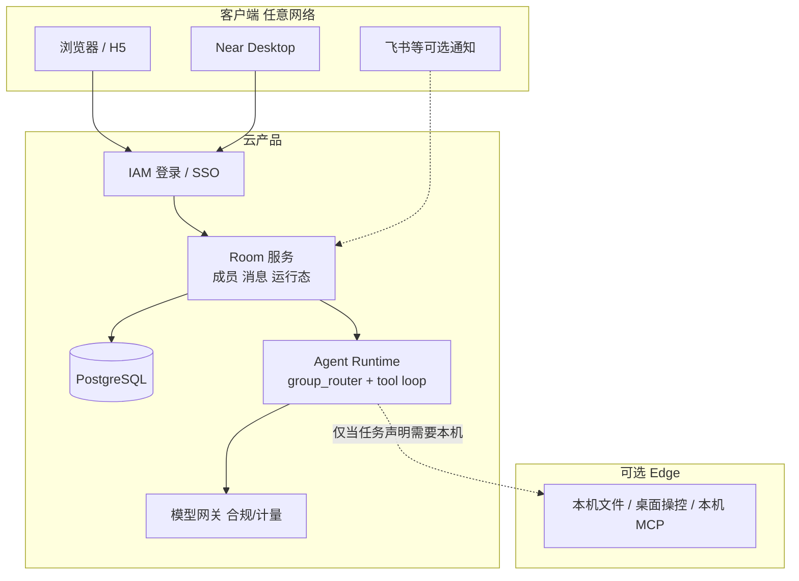

# 云端项目房间（Cloud Project Room）产品总规划

Planned-with: Cursor Grok 4.6

**Goal:** 做成可在任意网络使用的云产品：2–3 个真人 + N 个智能体在同一个项目房间里协作；手机 / 浏览器 / Desktop 都是客户端，房间与消息的真相源在云上，不依赖某台电脑是否在线、是否同一网段。

**Architecture:** 云端 **Room 服务**（成员、消息、运行态）+ 云端 **Agent Runtime**（群路由 / 工具循环）为默认执行面。Desktop 降级为「云房间的一个客户端」，本机文件与桌面操控作为可选 **Edge**，经出站长连接挂到房间，而不是让全世界来连你的笔记本。

**Tech Stack（复用现仓，不另起炉灶）：** Enterprise IAM + PG（`enterprise/packages/db-schema`、web-portal 鉴权）；新建 `project_rooms` 等表（**不要**把现有 `chat_sessions` 的 `user_id` 行硬改成多人房）；云端跑 Python `agenticx` runtime（`group_router` / `agent_runtime`），模型调用走已有 Gateway 合规中继；Web 客户端在 portal 增「项目房间」而不是再做一个 LAN 静态页。

---

## 为什么 LAN H5 不是云产品

| | 本机 `/room/` + LAN | 云产品 |
|--|---------------------|--------|
| 页面部署 | 挂在用户电脑的 `agx serve` | 云上 HTTPS 站点 |
| 4G / 不同网段 | 不可达 | 可达 |
| 电脑合盖 / 关机 | 房间消失 | 房间仍在；Agent 仍可在云上跑 |
| 同事加入 | 必须进你的局域网 | 邀请进租户房间 |
| 真相源 | `~/.agenticx/sessions` | 租户 PG（房间维度） |

已作废主路径：`.cursor/plans/pending/2026-08-13-project-room-phase1-h5.plan.md`（LAN 同域 H5）。

---

## 目标架构



**两条铁律：**

1. **房间在云上。** 人在 4G、电脑关机，仍能打开房间看历史；若 Agent 跑在云上，任务也可继续。
2. **执行宿主显式。** 默认 `cloud`。需要碰用户磁盘/GUI 的步骤才派发到已上线的 Desktop Edge。手机从不假装自己是 runtime。

---

## 现状（能复用 / 不能假装已有）

**可复用**

- 租户与账号：`enterprise/packages/iam-core`、portal 登录 / SSO
- 单用户聊天落 PG：`enterprise/packages/db-schema/src/schema/chat-sessions.ts`（`tenant_id + user_id`，**私有会话**）
- 模型合规中继：`enterprise/apps/gateway` 的 `/v1/chat/completions`（**不是** Agent 工具循环）
- 群聊路由与分身：仅 Python 栈 `agenticx/runtime/group_router.py`、`agenticx/avatar/*`、Desktop
- Desktop 已有 `remote_server` 配置雏形（连远程 `agx serve`），未做成多租户云房间

**没有**

- `project_rooms` / 多 human 成员 / 邀请
- 云上托管的 `agent_runtime` 工作进程（portal 聊天 = completion + 深度研究编排，见 `web-portal/.../chat/completions/route.ts`）
- Desktop 群聊与 portal 历史打通
- `enterprise/features/agents` 仍是 TODO 空壳

Gateway **不要**改造成 Agent 宿主；继续只做模型策略与计量。Runtime 另进程，出站调 Gateway。

---

## 产品形态（验收画面）

打开 `https://<product>/rooms/<id>`（需登录）：

- 成员：Alice、Bob（human）+ Machi（meta）+ 若干分身（agent）
- 任一人从手机浏览器发消息，其他人（含 Desktop 若已登录同一租户）看到同一条
- Agent 被 @ 或智能路由后在**云端**执行；进度写回房间
- 电脑没开时：仍能看历史、仍能让云端 Agent 干活（不依赖本机工具的任务）

---

## 分阶段（云优先，禁止再走 LAN 主路径）

### Phase C0 — 产品边界（文档/配置，几乎无代码）

- 租户 = 一个云工作区；房间属于租户，不属于某台电脑
- Desktop 登录同一租户后，群列表来自云，不再以 `~/.agenticx/groups/*.yaml` 为云产品真相源（本机 yaml 可保留给离线/个人模式，另开关，本规划不实施离线模式）

Suggested-Impl-Model: 规划已完成；实施时不必单独开 C0 工程任务。

### Phase C1 — 云房间 MVP（多人能聊，Agent 可先只有 Meta）

**这是第一刀可实施子 plan 的范围。**

| 项 | 落点（实施子 plan 须再钉行号） |
|----|--------------------------------|
| 表 | 新建 `project_rooms` / `project_room_members` / `project_room_messages`（或等价名）于 `enterprise/packages/db-schema/src/schema/`；**禁止**把 `chat_sessions.user_id` 改成可空来「变多人」——那是个人历史表，Portal 现网依赖它 |
| API | portal（或独立 `enterprise/apps/...` BFF）`/api/rooms*`：CRUD、邀请、发消息、拉历史；鉴权走现有 session cookie / JWT |
| 成员 | `member_type`: `human` \| `meta` \| `agent`；human 的 id = IAM `users.id` |
| UI | web-portal 新路由「项目房间」（范围仅前台 portal，不改 admin-console、不改 Desktop 本阶段） |
| 实时 | 第一刀允许 1–2s 轮询；WebSocket 可第二刀 |
| Agent | C1 允许 **仅 Meta**：发消息 → 云 worker 调 Gateway completions → 回复写入房间（先证明多端同步）。工具循环放到 C2 |

**AC（C1）：**

- AC-C1-1: 两账号登录同一租户，进同一 `room_id`，A 发言 B 刷新/轮询可见
- AC-C1-2: 手机 4G 打开同一 HTTPS 房间，不依赖任何 Desktop 进程
- AC-C1-3: 非成员 403；个人 `chat_sessions` 列表不出现该房间消息（两套模型隔离）
- AC-C1-4: Meta 能在房间回一条（可无工具）

Suggested-Impl-Model: 表结构/鉴权 gpt-5.x；portal UI Composer 2.5

**Out of scope（C1）：** Desktop 改绑、LAN H5、微信多 Bot、本机 Computer Use、改 `server.py` 挂静态 `/room/`。

### Phase C2 — 云端 Agent Runtime（真工具循环 + 多分身）

- 云上跑 `agx` worker（或等价），session 存储改为读/写 **房间 PG**，而不是 `~/.agenticx/sessions`
- 复用 `group_router` 语义（@ / Meta 兜底 / intelligent），不要在 Go Gateway 里重写 ReAct
- 云端工具默认白名单：web / 云沙箱 / 租户 MCP；**默认没有**用户家目录
- 分身配置进租户库（从本机 `AvatarRegistry` yaml 迁一份云模型）

Suggested-Impl-Model: gpt-5.x（存储换源 + runtime 接线，高回归）

### Phase C3 — Desktop / 手机成为云客户端

- Desktop 登录租户后打开的「群」= 云 `room_id`
- 手机用同一套 portal 响应式页（PWA 可后补），任意网络
- 本机 `agx serve` 不再承担云房间的 HTTP 入口

Suggested-Impl-Model: Desktop 接线 gpt-5.x；H5 复用 C1 UI 则 Composer

### Phase C4 — Edge（可选）

- Desktop 出站连云，注册为房间的 `host=edge:<device_id>`
- 仅当任务需要本机路径/GUI 时把 tool 派到 Edge
- 电脑离线：云 Agent 继续；Edge 工具显示「设备不在线」

Suggested-Impl-Model: 强推理档

---

## 和现有 Enterprise 聊天的隔离（防严重倒退）

```text
chat_sessions / chat_messages     = 个人助手（现状，别动语义）
project_rooms / *_members / *_messages = 多人+多 Agent 房间（新建）
```

实施 C1 时 **禁止** 修改个人聊天的 store 过滤逻辑去「顺带支持房间」。portal 侧栏可新增入口，不要把房间塞进现有「我的会话」列表冒充个人历史。

面向客户的文案用「项目房间 / 协作」，不要写仓库路径、`policy-snapshot.json` 等运维细节。

---

## 子规划 → 推荐模型

| 子规划 | Suggested-Impl-Model | 理由 |
|--------|----------------------|------|
| C1 schema + room API + 鉴权 | gpt-5.x | 多写者 + 租户隔离，安全敏感 |
| C1 portal 房间 UI | Composer 2.5 | 列表/气泡/输入样板 |
| C2 runtime 换存储接到房间 | gpt-5.x / Codex 中档以上 | 跨 Python runtime 与 PG |
| C3 Desktop 改连云房间 | gpt-5.x | 易与本机群聊状态串台 |
| C4 Edge | 强推理档 | 派发/离线语义 |

最终 `Impl-Model` 以用户确认写入 commit trailer 为准。

---

## In scope / Out of scope（总规划）

**In scope（终态）：** 多租户云房间、任意网络 Web、云端 Agent、Desktop 作客户端、可选 Edge。

**Out of scope：**

- 以本机 `agx serve` + LAN/隧道冒充云产品
- 微信群承载多 Agent
- 把 Go Gateway 改成 Agent Runtime
- 一上来原生 App
- 把个人 `chat_sessions` 原地改造成多人房

---

## 建议的下一步

本文件是云产品 **总规划**。真正开工前再写 **Phase C1 实施子 plan**（表 DDL、精确 API 路径、portal 路由文件、测试文件名），粒度达到 Composer 2.5 不看对话也能做。

不要实施已作废的 `2026-08-13-project-room-phase1-h5.plan.md`。

---

## FR / NFR（云产品）

| ID | 陈述 |
|----|------|
| FR-C1 | 房间与消息在云上，任意网络登录可读写 |
| FR-C2 | 多 human 同房互见 |
| FR-C3 | Agent 默认在云端执行；Edge 显式、可离线降级 |
| FR-C4 | 与个人聊天历史存储隔离 |
| NFR-C1 | 不把多端同步做进 ReAct 内核 |
| NFR-C2 | 电脑关机不影响打开房间看历史 |
| AC-终态 | 2–3 human + N agent 在云房间完成一轮真实任务；其中一人仅用手机 4G |
