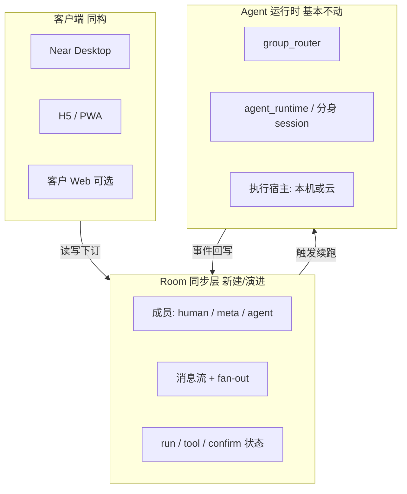

# 多人 + 多 Agent 项目房间（Project Room）总规划

> **Status: architecture superseded.** 产品目标已升级为云托管。本文的 LAN / 本机 serve H5 路线不再是主路径。  
> **现行总规划：** `.cursor/plans/pending/2026-08-13-cloud-project-room.plan.md`

Planned-with: cursor-grok-4.5

**Goal:** 最终交付「2–3 个真人 + N 个智能体同处一个项目房间/群聊，协同把事情做完」；同时保证「单人 H5 看 Desktop 群聊进度并续聊」是同一架构的自然子集，而不是另起炉灶。

**Architecture:** 在现有「单操作者 + 多分身群聊」之上，抽出 **Room（房间）= 消息真相源 + 成员表 + 运行态订阅**。Agent 运行时（推理/工具循环）不变；Desktop / H5 / 客户 Web 都是房间的客户端。真人与 Agent 都是一等成员。微信/飞书只做可选通知或单通道入口，不当多 Agent 主群承载面。

**Tech Stack:** 既有 `agx serve`（FastAPI + SSE）+ `GroupChatRegistry` / `group_router` + Desktop React；新增可达后端（远程 serve / 隧道）+ 瘦 H5 客户端；真人账号可复用 Enterprise IAM 或轻量 invite-token（分阶段选型）。

---

## 产品终态（验收画面）

房间 `R` 内同时存在：

| 成员类型 | 示例 | 能力 |
|----------|------|------|
| human | Alice、Bob | 发消息、@ 某 Agent / 某人、看全量历史与进度 |
| meta | Machi | 未 @ 时统筹/兜底（沿用现有 intelligent 路由语义） |
| agent | 调研分身、码农分身… | 被路由后真实执行；进度/工具态进房间消息流 |

**同构子集：** 仅 1 个 human（你自己）+ 同一房间 → 打开 H5 = 「看 Desktop 进度 / 上厕所续聊」。无需第二套产品。



---

## 现状基线（证据，不依赖对话记忆）

**已有（可复用）：**

- 群定义：`agenticx/avatar/group_chat.py` — `GroupChatConfig{id,name,avatar_ids,routing}`，落盘 `~/.agenticx/groups/<id>/group.yaml`
- 群路由：`agenticx/runtime/group_router.py` — @ / Meta 兜底 / intelligent
- Studio：`/api/groups*`、`POST /api/chat`（`avatar_id=group:<id>`）、session `messages.json`、SSE（`agenticx/studio/server.py`）
- Desktop 群 UI：`ProjectsView` / `GroupEditorInline` / `ChatPane` 群窗格
- 外写会话先例：飞书/微信 → 绑定 session → `POST /api/chat`（证明「非 Desktop UI 写入同一会话」可行）

**明显缺口：**

- 成员模型只有 `avatar_ids`，**无多 human**
- Desktop 默认绑本机 `127.0.0.1`，手机默认不可达（远程后端见 `.cursor/plans/2026-03-24-desktop-remote-backend.plan.md`，多为计划态）
- 无跨客户端 message fan-out / presence
- 无 H5 房间客户端；Enterprise portal 是 **按 userId 隔离的单人聊天**，不是共享房间
- IM 是「一通道绑一 session」，不是「多人同房」

---

## 设计原则（防走偏）

1. **Agent 框架不改内核**：不把多端同步做进 ReAct/tool loop；房间层与 runtime 解耦。
2. **单一真相源**：房间消息 + 成员 + run 状态；各端只是视图。
3. **一个房间模型吃掉两条用户故事**：多人协作 ⊃ 单人 H5 旁观。
4. **执行宿主显式**：工具/本机文件/桌面操控跑在哪台机器要可配置；手机默认「遥控 + 旁观」，不默认第二 runtime。
5. **微信不对齐成员模型**：可对齐气泡体验；多 Agent 群不建在微信里。
6. **no-scope-creep**：每阶段只交付该阶段 FR；不顺手重做 Enterprise portal 全站、不重做 IM 全家桶。

---

## 分阶段路线图（最终目标倒推）

### Phase 0 — 可达房间后端（前置基建）

**价值：** 手机/H5 能打到「跑 Agent 的那套 serve」。

| 项 | 说明 |
|----|------|
| 依赖/交叉 | 优先落地或裁剪实施 `.cursor/plans/2026-03-24-desktop-remote-backend.plan.md`；或过渡方案：内网/隧道把本机 serve 暴露给受信设备 |
| 交付 | `remote_server` 或等价：非本机客户端持 token 访问同一 Studio API；CORS/鉴权可用 |
| 非目标 | 完整多人 ACL、完整 H5 UI |

**Suggested-Impl-Model:** gpt-5.x / 代码专精中档（跨 Desktop main + server 鉴权，回归风险中）

---

### Phase 1 — Room 读模型 + 单人 H5（价值验证，且是终态子集）

**价值：** 你在 Desktop 开群跑任务 → 手机 H5 看同一房间消息与「是否在跑/是否完成」→ 可发一条续聊。

**模型演进（最小）：**

```text
# 概念：Room = 现有 group session 的对外稳定视图
Room {
  room_id          # 建议 = group_id 或 group:<id> 的规范化 id
  title
  members: [
    { type: "human", id, display_name }   # Phase 1 可仅 1 人：当前鉴权主体
    { type: "meta", id: "machi" }
    { type: "agent", id: avatar_id, display_name }
  ]
  session_id       # 承载 messages.json 的会话
}
```

**API 意图（落点在 `agenticx/studio/server.py` 新增薄封装，内部复用 groups + sessions，禁止重写 chat 内核）：**

| 能力 | 建议 | 复用 |
|------|------|------|
| 房间详情 | `GET /api/rooms/{room_id}` | `GroupChatRegistry` + 成员拼装 |
| 历史 | `GET /api/rooms/{room_id}/messages` | `GET /api/session/messages` 同源 |
| 实时 | `GET /api/rooms/{room_id}/events` SSE | 群/session SSE fan-out 归一 |
| 发言 | `POST /api/rooms/{room_id}/messages` | 内部转 `POST /api/chat`（带 group avatar_id） |
| 运行态 | events 中带 `run_status` / tool 摘要 | 现有群回合事件字段对齐 |

**H5：** 新建极瘦前端（建议独立目录如 `apps/room-h5/` 或 `desktop` 旁 `room-web/`，技术选型实施子 plan 再钉；禁止一上来原生 App）。

**AC（Phase 1）：**

- AC-1: Desktop 群 `G` 跑任务时，H5 订阅同一 `room_id` 能在 ≤3s 内看到新助手气泡或「生成中」态
- AC-2: H5 发送一条用户消息后，Desktop 同群窗格出现该消息且 Agent 继续答
- AC-3: 刷新 H5 可从持久化历史恢复，不丢盘
- AC-4: 不改 `group_router` 路由语义；单测/既有群聊冒烟仍绿

**Suggested-Impl-Model:** 后端接线 Codex/中档；H5 壳 Composer/Fast；联调收口强推理档

**Out of scope：** 第二真人、邀请链接、推送、原生 App、微信多 Bot

---

### Phase 2 — 多真人成员 + 邀请

**价值：** Alice / Bob 进同一房间，彼此看见对方与 Agent 的消息。

**数据模型（相对 Phase 1 增量）：**

- `GroupChatConfig`（或并行 `RoomConfig`）扩展：
  - `human_member_ids: list[str]`
  - 可选 `invites: [{token, role, expires_at}]`
- 消息元数据强制带 `sender: {type, id, display_name}`（真人 vs Agent 区分渲染）
- 鉴权：消息写入校验「调用者 ∈ 房间 human 成员」

**账号选型（实施前二选一，写进子 plan）：**

| 方案 | 适用 | 备注 |
|------|------|------|
| A. Enterprise IAM 用户 | 已有租户/门户 | 房间挂 `tenant_id`，成员 = IAM userId |
| B. 轻量 invite + 显示名 | 个人/小团队快速 | token 进房，后期再迁 IAM |

**AC：**

- AC-5: 两人持不同身份进同一 `room_id`，A 发言 B 的 H5/Desktop 均可见
- AC-6: 非成员 token 读写均 403
- AC-7: Agent @路由仍按现有规则；多真人发言都进入同一 `messages` 序

**Suggested-Impl-Model:** 后端 + 鉴权强推理/中档；UI Composer

**Out of scope：** 细粒度「仅某人可审批工具」可放到 Phase 3；不改微信群模型

---

### Phase 3 — 协作体验硬化（项目群聊可用）

在 Phase 2 稳定后按需叠加（可拆子 plan）：

- 工具确认 / `awaiting_confirm` 多端可见与可操作（指定角色）
- Agent 进度卡聚合（避免多真人场景刷屏；对齐 Desktop 群聊「过程广播聚合」偏好）
- Presence（谁在线）、已读可选
- 执行宿主策略：本机 Desktop edge vs 云端 runtime 标签展示
- PWA 推送或飞书/企微「房间摘要通知」桥（外发 only）

**Suggested-Impl-Model:** 跨栈一致性用强推理档；纯 UI 用中档/Composer

---

### Phase 4 — 客户面与产品化（可选）

- 客户 Web（portal）挂载同一 Room API（注意：今日 portal 是单人历史模型，需**房间投影**，禁止假装已是多人房）
- 品牌化房间链接、项目维度（repo/工作区绑定继承现有 taskspaces 语义）
- 仍不做：微信群内多 Agent

---

## 子规划 → 推荐实施模型

| 子规划 | Suggested-Impl-Model | 理由 |
|--------|----------------------|------|
| Phase 0 远程/可达后端 | gpt-5.x 或代码专精中档 | Desktop main + CORS/token，回归中 |
| Phase 1 Room API | 代码专精中档 | 薄封装复用 groups/chat |
| Phase 1 H5 壳 | Composer 2.5 / Fast | 列表+气泡+发送样板 |
| Phase 1 联调/SSE fan-out | 强推理档 | 多订阅者一致性敏感 |
| Phase 2 成员/邀请/鉴权 | 强推理档 | 安全与多写者序 |
| Phase 3 确认/进度/推送 | 按任务拆：后端中档，UI Composer | |
| Phase 4 Portal 房间投影 | 强推理档 | 易误改单人历史模型，需严守 scope |

各实施子 plan 顶部须写：`Suggested-Impl-Model: <型号>`；最终 commit 的 `Impl-Model` 以用户确认为准。

---

## In scope / Out of scope（总规划层）

**In scope（终态）：**

- Room 同步层、多端客户端（Desktop + H5）、多 human + 多 agent 同房、沿用群路由
- 单人 H5 旁观作为 Phase 1 交付物

**Out of scope（明确不做或另开 plan）：**

- 改造 AgentX 推理/tool 内核「以支持多端」
- 微信/个微群内挂载多个 Agent
- 一上来原生 iOS/Android App（H5/PWA 足够）
- 把 Enterprise 单人 chat history 整表塞进房间而不做模型区分
- OT/CRDT 富文本协同编辑（聊天有序 append 即可）

---

## 风险与对策

| 风险 | 对策 |
|------|------|
| 本机工具手机点了却无环境 | UI 标明执行宿主；确认类操作默认回 Desktop 或云宿主 |
| 多真人同时触发 Agent | 房间级 generation 锁或排队；沿用 interrupt + 延续上下文语义 |
| 与「会话只读分享」plan 混淆 | 分享 ≠ 同房协作；只读分享见 `pending/2026-07-21-near-share-*`，本规划是读写房间 |
| `server.py` 误伤 | 新增 room 路由时**精确增行**，禁止整段替换 import；改后冷启动 smoke（AGENTS.md 红线） |

---

## 建议的下一步（本文件之后）

本文件是 **总规划 / backlog 锚点**。Phase 0 完整远程后端 **不作为第一刀**（手机达成本机 serve 用局域网 bind 即可）。

**Phase 1 实施子 plan（可开工）：** `.cursor/plans/pending/2026-08-13-project-room-phase1-h5.plan.md`

Phase 2+ 在 Phase 1 验证「有人真用手机进房」后再拆。开始实施时将该子 plan 移到 `.cursor/plans/` 根目录再开分支。

---

## FR / NFR / AC 总表（追溯用）

| ID | 陈述 | 阶段 |
|----|------|------|
| FR-1 | 房间为多端共享真相源 | 1+ |
| FR-2 | 成员含 human / meta / agent | 1 起骨架，2 真多人 |
| FR-3 | H5 可读写与 Desktop 同一房间 | 1 |
| FR-4 | 多人 human 同房互见 | 2 |
| FR-5 | Agent 路由语义与现网群聊一致 | 1–2 |
| NFR-1 | 不修改 agent_runtime 核心循环以「支持多端」 | 全程 |
| NFR-2 | 手机不可达本机时有明确错误，而非静默空房 | 0–1 |
| AC-终态 | 2–3 human + N agent 在一书房完成一轮真实任务，且任一人用 H5 可续聊 | 2–3 |

---

## 与用户决策对齐（已确认意图）

- 最终目标 = 多人 + 多 Agent 项目群聊协作  
- 同意：单人 H5 看 Desktop **不必单独做成另一产品**，作为房间模型的第一刀交付  
- H5 优先于原生 App  
- 多 Agent 群不放在微信里  
