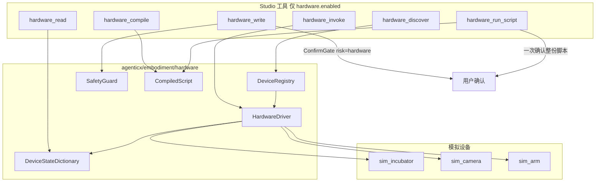

# Embodiment 硬件窄腰（物理具身第一波）

Planned-with: Cursor Grok 4.6

Suggested-Impl-Model: Composer 2.5（主实施）

> **For implementer:** 只按本文件落地。不要读本次对话。不要改 GUI 路径。不要声称实现了任何外部硬件标准。

**Goal:** 在现有 `agenticx/embodiment/` 下新增与 GUI 并列的物理设备窄腰：共享状态字典 + Driver(`read`/`write`/`invoke`) + 驱动硬限值 + 可回放脚本；Studio 在 `hardware.enabled` 时注入工具，写操作走 ConfirmGate `risk=hardware`。

**Architecture:** 不新建顶层包，不改 `core/` / `tools/adapters.py` / `GUIAgent`。新增兄弟子包 `agenticx/embodiment/hardware/`。GUI 继续管屏幕；物理层管点表与命名动作。模型只做探索与编译，脚本执行时模型不在环内。

**Tech Stack:** Python 3.11+, Pydantic v2, 现有 `ConfirmGate` / `STUDIO_TOOLS` / `ConfigManager`。无新 pip 依赖。

---

## 规划依据（实施者须自行核对）

1. 当前 `embodiment` 是 **M16 GUI Agent**：`core/models.py` 的 `ScreenState` / `GUIAction`，`tools/adapters.py` 的 `BasePlatformAdapter.click/type/scroll`。结论见 `conclusions/embodiment_conclusion.md`。
2. Desktop Computer Use 已内化到 `DesktopPlatformAdapter` + `COMPUTER_USE_TOOLS`，与物理仪器无关。
3. 2026-08 公开的物理设备标准只有设计原则、没有 wire protocol。本波对齐的是：**共享状态字典、read/write 窄腰、限值在驱动层、探索后固化脚本**。禁止在代码/用户文案写「已实现某某硬件标准」。
4. 调研笔记：`research/codedeepresearch/mhs/research-notes.md`（只作背景，实施以本 plan 的类型与 AC 为准）。



---

## Suggested-Impl-Model（子规划）

| 子规划 | 推荐模型 | 理由 |
|---|---|---|
| HW-1 类型 + 状态字典 + Driver ABC | Composer 2.5 | 纯数据结构与单测，样板足够 |
| HW-2 安全限值 + 三台模拟设备 | Composer 2.5 | 规则写死在 plan，无审美 |
| HW-3 脚本编译 / 回放 | Composer 2.5 | 序列敏感但步骤短，plan 已给伪代码 |
| HW-4 配置 + ConfirmGate + Studio 接线 | Composer 2.5 | 后端接线；**`server.py` 只准精确增行** |
| HW-5 系统提示块 + 前端确认文案镜像 | Composer 2.5 | 小改，对齐现有 computer_use 模式 |

最终 `Impl-Model` trailer 以实际使用为准。

---

## In scope

- 新建 `agenticx/embodiment/hardware/`（见文件清单）
- `~/.agenticx/config.yaml` 新增 `hardware:` 节（默认 `enabled: false`）
- Studio 工具 6 个 + `dispatch_tool_async` 分支
- ConfirmGate 新增 `risk=hardware`（受保护，不因「全部自动执行」静默放行）
- Meta 系统提示增加硬件能力块（仅 enabled 时）
- Desktop `confirm-scope.ts` 镜像一句中文理由
- 单测覆盖字典 / 限值 / 三模拟器 / 编译回放 / 开关注入

## Out of scope（严禁顺手做）

- 改 `embodiment/core/`、`tools/adapters.py`、`desktop_adapter.py`、`GUIAgent`、learning / workflow / routing / gui / evaluation
- 新建 `agenticx/hardware/` 顶层包
- Desktop「设备」设置 Tab、企业策略页
- 真仪器、GPIO、Home Assistant、串口、ROS
- 力矩 / 伺服 / 连续控制循环
- MCP Server 暴露（本波只走 Studio 工具）
- 把 FallbackChain 扩到物理层
- 任何「官方标准符合性」文案、证书、协议字段猜测

---

## 配置契约（写全，禁止按需推断）

`~/.agenticx/config.yaml` 新增节，缺省等于未启用：

```yaml
hardware:
  enabled: false
  script_dir: "~/.agenticx/hardware/scripts"
  devices:
    - id: sim-incubator-1
      driver: sim_incubator
    - id: sim-camera-1
      driver: sim_camera
    - id: sim-arm-1
      driver: sim_arm
```

规则：

- `enabled` 缺省 `false`。false 时不注入工具，dispatch 若被直接点名则返回明确 ERROR。
- `enabled: true` 且 `devices` 缺省或空列表：使用上面三台模拟设备（便于本机冒烟）。
- `driver` 只允许：`sim_incubator` | `sim_camera` | `sim_arm`。其它值：registry 加载时报错，该条跳过并记入 `load_errors`。
- `id` 必须非空、会话内唯一；重复 id 后者覆盖前者并在 `load_errors` 记一条 warning。

---

## 数据模型（写全）

全部放 `agenticx/embodiment/hardware/models.py`。注释与 docstring **英文**。文件头：

```python
#!/usr/bin/env python3
"""Physical-device waist models for embodiment (state dictionary, not GUI).

Author: Damon Li
"""
```

```python
from enum import Enum
from typing import Any, Literal
from pydantic import BaseModel, Field, ConfigDict

DriverKind = Literal["sim_incubator", "sim_camera", "sim_arm"]

class SafetyGuard(BaseModel):
    key: str
    min_value: float | None = None
    max_value: float | None = None
    allowed_values: list[Any] | None = None
    message: str = "value outside device safety guard"

class ProcedureSpec(BaseModel):
    name: str
    description: str
    confirm_required: bool = True

class DeviceCard(BaseModel):
    """Natural-language reference file for an unseen device."""
    device_id: str
    driver: DriverKind
    kind: str  # incubator | camera | arm
    summary: str
    measures: list[str]
    adjustable: list[str]
    procedures: list[ProcedureSpec]
    guards: list[SafetyGuard]
    notes: str = ""

class StateRevision(BaseModel):
    device_id: str
    revision: int
    values: dict[str, Any]
    model_config = ConfigDict(arbitrary_types_allowed=True)

class HardwareStep(BaseModel):
    op: Literal["write", "invoke"]
    device_id: str
    key: str | None = None      # write
    value: Any | None = None    # write
    procedure: str | None = None  # invoke
    args: dict[str, Any] = Field(default_factory=dict)

class CompiledScript(BaseModel):
    script_id: str
    title: str
    steps: list[HardwareStep]
    created_from: str = "hardware_compile"
```

`DeviceStateDictionary` 放 `dictionary.py`：

- 每设备一把 `asyncio.Lock`
- `snapshot(device_id) -> StateRevision`
- `read(device_id, key) -> Any`；缺 key 抛 `KeyError`（工具层译成 ERROR 字符串）
- `write(device_id, key, value) -> StateRevision`：先不校验 guard（guard 在 Driver.write 里做完再 commit）
- `commit(device_id, values: dict) -> StateRevision`：整表替换并 `revision += 1`，从 0 起
- 禁止用 `datetime.now` 做查询键；revision 用单调整数

---

## Driver 契约

`agenticx/embodiment/hardware/driver.py`：

```python
class HardwareDriver(ABC):
    device_id: str
    card: DeviceCard
    dictionary: DeviceStateDictionary

    @abstractmethod
    async def read(self, key: str) -> Any: ...

    @abstractmethod
    async def write(self, key: str, value: Any) -> StateRevision: ...

    @abstractmethod
    async def invoke(self, procedure: str, args: dict[str, Any] | None = None) -> StateRevision: ...
```

`safety.py` 的 `enforce_guard(card, key, value) -> None`：

- 找到 `card.guards` 中 `key` 相同的第一条
- 无 guard：允许（该 key 若根本不在 card.adjustable / measures，write 仍应拒：`KeyError` 或 `PermissionError("key not adjustable")`）
- `allowed_values` 非空：value 必须 `in` 列表
- `min_value`/`max_value`：value 必须能 `float()`，否则拒；越界抛 `PermissionError(guard.message)`
- **用户确认不能绕过 guard。** ConfirmGate 只决定「做不做」；越界在 confirm **之后**仍要拒（先 confirm 再执行时，执行函数内部必须再跑一遍 enforce）

Write 路径顺序（工具层必须遵守）：

1. 设备存在？
2. key 在 `card.adjustable`？
3. `enforce_guard`
4. ConfirmGate（`risk=hardware`）
5. `driver.write`（内部再次 `enforce_guard` 后 `dictionary.commit`）

Read / discover：**不**走 ConfirmGate。

---

## 三台模拟设备（参数写死）

### `sim_incubator`（`sim/incubator.py`）

初始 `values`：

```python
{"temperature_c": 37.0, "setpoint_c": 37.0, "lid_open": False}
```

- measures: `temperature_c`, `setpoint_c`, `lid_open`
- adjustable: `setpoint_c` only
- guards: `setpoint_c` min 10 max 80，message `"setpoint_c outside 10-80 C"`
- write `setpoint_c` 成功后：同步把 `temperature_c` 设为相同值（模拟瞬间到位，避免引入实时环）
- procedures:
  - `open_lid`：`lid_open=True`
  - `close_lid`：`lid_open=False`
- 未知 procedure → `ValueError`

### `sim_camera`（`sim/camera.py`）

初始：

```python
{"connected": True, "exposure_ms": 20.0, "last_frame_id": 0}
```

- measures: `connected`, `exposure_ms`, `last_frame_id`, `frame`
- adjustable: `exposure_ms`
- guards: `exposure_ms` min 1 max 200
- `read("frame")`：返回 dict `{"frame_id": int, "width": 8, "height": 8, "format": "luma", "pixels": [0, ... 63]}`（64 个 0–255 整数，用 `last_frame_id` 作种子：`[(last_frame_id * 13 + i) % 256 for i in range(64)]`），并 `last_frame_id += 1` 后 commit
- procedures: 无。`invoke` 一律 `ValueError("sim_camera has no procedures")`

### `sim_arm`（`sim/arm.py`）

初始：

```python
{
  "estop": False,
  "joints_deg": [0.0, 0.0, 0.0, 0.0, 0.0, 0.0],
}
```

- measures: `estop`, `joints_deg`
- adjustable: `joints_deg`（必须是长度 6 的 list[float]）
- guards: 每个关节角 **-170..170`**。实现：write 时对 6 个数逐个检查，越界 message `"joint[{i}] outside -170..170 deg"`
- 若 `estop is True`：任何 `write` / 除 `estop_reset` 外的 `invoke` 抛 `PermissionError("arm is in estop")`
- procedures:
  - `home`：`joints_deg = [0,0,0,0,0,0]`（estop 时拒）
  - `estop`：`estop=True`（不 confirm 豁免——工具层仍要 ConfirmGate；这是安全停，但本波不特殊放行，避免两套策略）
  - `estop_reset`：`estop=False`
- **禁止**接受 `torque` / `velocity` / `rate_hz` 等键；出现则 `PermissionError("realtime control keys are not allowed")`

Registry：`registry.py` 的 `DRIVER_FACTORIES` dict 映射三种 kind。`DeviceRegistry.from_config(settings)` 构建。进程内单例由 `get_hardware_registry()` 提供，读 `ConfigManager.load()`；测试可注入。

---

## 脚本编译（出环）

`compile.py`：

- `compile_steps(steps: list[HardwareStep], *, title: str, registry) -> CompiledScript`
  - 每个 step 先做与 write/invoke **相同的** guard / 可调检查（不执行、不 confirm）
  - 任一步失败：整份不落盘，抛 `PermissionError`
  - 成功：`script_id = "hw-" + 12 hex`（`secrets.token_hex(6)`）
  - 写入 `{script_dir}/{script_id}.json`（`CompiledScript.model_dump_json`）
- `run_script(script_id, registry) -> list[StateRevision]`
  - 按顺序执行，**无模型**
  - 任一步失败：停止后续步，返回已成功的 revisions + 最后错误（工具层 JSON 里 `ok: false, failed_step: N`）
  - 不在 run 内部做 ConfirmGate；由工具层在调用 `run_script` **之前**确认一次整份脚本

工具：

| 工具名 | 确认 | 作用 |
|---|---|---|
| `hardware_discover` | 否 | 返回所有 `DeviceCard` + 当前 revision |
| `hardware_read` | 否 | `device_id` + 可选 `key`；无 key 则整表 snapshot |
| `hardware_write` | 是 `risk=hardware` | 单次设参 |
| `hardware_invoke` | 是 `risk=hardware` | 命名 procedure |
| `hardware_compile` | 否 | `steps` + `title` → 落盘脚本，返回 `script_id` |
| `hardware_run_script` | 是 `risk=hardware`（一次，整份） | 回放 |

确认文案（中文，给用户看）：

- write：`将向设备 {id} 写入 {key}={value}（驱动限值仍会强制执行），是否继续？`
- invoke：`将在设备 {id} 执行动作 {procedure}，是否继续？`
- run_script：`将回放硬件脚本 {script_id}（共 N 步，模型不在环内），是否继续？`

---

## Studio / 配置接线（精确落点）

### HW-4a `config_manager.py`

**Modify:** `agenticx/cli/config_manager.py`

在 `ComputerUseSettings`（约 L95–L104）**之后**新增，不要改 ComputerUseSettings 字段：

```python
@dataclass
class HardwareSettings:
    """Physical-device waist (embodiment/hardware). Default off."""

    enabled: bool = False
    script_dir: str = "~/.agenticx/hardware/scripts"
    devices: list = field(default_factory=list)
```

`AgxConfig`（约 L181）在 `computer_use` 行后加：

```python
    hardware: HardwareSettings = field(default_factory=HardwareSettings)
```

`_build` / `from_dict` 里 `cu_raw` 块（约 L353–L388）**之后**加平行的 `hw_raw`：

```python
        hw_raw = merged.get("hardware", {}) or {}
        if not isinstance(hw_raw, dict):
            hw_raw = {}
        # ...
            hardware=HardwareSettings(
                enabled=bool(hw_raw.get("enabled", False)),
                script_dir=str(hw_raw.get("script_dir", "~/.agenticx/hardware/scripts") or "~/.agenticx/hardware/scripts"),
                devices=list(hw_raw.get("devices", []) or []),
            ),
```

构造 `AgxConfig(...)` 时必须带上 `hardware=`。禁止整段替换 import 或无关字段。

### HW-4b ConfirmGate

**Modify:** `agenticx/runtime/confirm.py`

- L20–L22 `PROTECTED_CONFIRM_RISKS` 集合加入 `"hardware"`（`normalize_confirm_risk` 对未知已 fail-closed，但理由表需要显式键）
- L47–L53 `PROTECTED_CONFIRM_REASONS` 增加：`"hardware": "这条操作会控制物理设备或模拟硬件"`

**Modify:** `desktop/src/utils/confirm-scope.ts`

- L64–L70 `LOCAL_PROTECTED_REASONS` 增加同样中文句。
- `confirm-scope.test.ts` L62 的 risk 数组**不必**为了 pass 而加 `hardware`（`unknown` 已覆盖受保护）。另加一条：`expect(protectedConfirmReason({ risk: "hardware" })).toContain("物理设备")`。

### HW-4c `agent_tools.py`

模式完全复制 Computer Use，放在 `COMPUTER_USE_TOOLS` 块（约 L2421–L2542）**之后**：

- `HARDWARE_TOOLS: List[Dict[str, Any]]`（6 个 schema，`additionalProperties: False`）
- `hardware_config_enabled()` → `ConfigManager.load().hardware.enabled`
- `merge_hardware_tools_into(tool_list)` 与 `merge_computer_use_tools_into` 同构
- `studio_tools_for_session`（L2606）改为：

```python
    tools = merge_hardware_tools_into(merge_computer_use_tools_into(list(STUDIO_TOOLS)))
```

- `dispatch_tool_async`（约 L8882 桌面三工具旁）增加 6 个 `if name == ...` 分支。**只插入这些 if，禁止改相邻 bash/mcp 分支。**

工具实现放 `agenticx/embodiment/hardware/studio_tools.py`（`_tool_hardware_*`），`agent_tools.py` 只做薄转发，避免把该文件再胀一截。

`_confirm` 的 `context`：

```python
{"tool": "hardware_write", "risk": "hardware", "device_id": device_id}
```

### HW-4d `server.py`（高危文件）

**Modify:** `agenticx/studio/server.py`

- L73–L78 import 元组里 **只新增一行** `merge_hardware_tools_into,`，不要整块替换 import。
- L3605、L4486 两处 `merge_computer_use_tools_into(...)` 外包一层 `merge_hardware_tools_into(...)`，与 `studio_tools_for_session` 一致。

改完必须按仓库规则做冷启动冒烟（见 AC-NFR-1）。

若 `server.py` 里还有 `_build_computer_use_capabilities_block` 的动态注入（约 L3731），在同一位置并列调用 `_build_hardware_capabilities_block()`。**只加一行调用，不改周围 import。**

### HW-4e 系统提示

**Modify:** `agenticx/runtime/prompts/meta_agent.py`

在 `_build_computer_use_capabilities_block`（L207）旁新增 `_build_hardware_capabilities_block()`：`hardware.enabled` 为假返回 `""`；为真则列出 6 个工具名，并写明：

- 写/动作/回放脚本会确认
- 限值在驱动层，确认不能绕过
- 禁止把模型放进连续控制循环；重复操作应 `hardware_compile` 再 `hardware_run_script`

`build_meta_agent_system_prompt` 在 `f"{computer_use_block}"`（L947）后插入 `f"{hardware_block}"`。

**Modify:** `agenticx/studio/context_usage.py`

- L20 旁 import `_build_hardware_capabilities_block`
- L277 旁 `+ len(_safe_block(_build_hardware_capabilities_block))`

---

## FR / AC

### FR-1 状态字典与 revision

- AC-1：`tests/embodiment/hardware/test_dictionary.py::test_commit_bumps_revision`
  - 同一 device 两次 commit，revision 为 1 然后 2；snapshot.values 等于最后一次。
- AC-2：`test_read_missing_key_raises` — `read(..., "nope")` 抛 `KeyError`。

### FR-2 限值不可被「已确认」绕过

- AC-3：`tests/embodiment/hardware/test_safety.py::test_setpoint_over_max_rejected`
  - incubator `write("setpoint_c", 90)` → `PermissionError`，字典仍为 37。
- AC-4：`test_guard_runs_inside_driver_even_if_caller_skipped` — 直接调 `driver.write`（不经工具）同样拒。

### FR-3 三台模拟器行为

- AC-5：incubator write 37→42 后 `temperature_c == 42` 且 `lid` 默认 False；`open_lid` 后 True。
- AC-6：camera `read("frame")` 两次 `frame_id` 递增；`pixels` 长度 64。
- AC-7：arm `write` 关节 `[180,0,0,0,0,0]` 拒；`estop` 后 `home` 拒；`estop_reset` 后 `home` 成功且关节全 0。
- AC-8：arm write 带 `torque` 键 → `PermissionError` 且含 `realtime`。

文件：`tests/embodiment/hardware/test_sim_devices.py`

### FR-4 编译与回放

- AC-9：`test_compile_rejects_illegal_step` — steps 含 setpoint 90，不落盘（`script_dir` 为空）。
- AC-10：`test_compile_and_run_incubator` — compile `[write setpoint 42]` → run → snapshot 42；JSON 文件存在于 tmp `script_dir`。
- AC-11：`test_run_stops_after_failure` — 两步：合法 42 + 非法 90；只完成第一步，`failed_step == 1`（0-index）。

文件：`tests/embodiment/hardware/test_compile.py`

### FR-5 开关与工具注入

- AC-12：`tests/embodiment/hardware/test_studio_merge.py::test_tools_absent_when_disabled`
  - monkeypatch `HardwareSettings(enabled=False)` 后 `merge_hardware_tools_into(list(STUDIO_TOOLS))` 不含 `hardware_discover`。
- AC-13：`test_tools_present_when_enabled` — enabled True 后六工具名都在，且不重复。
- AC-14：`dispatch_tool_async("hardware_write", ...)` 在 disabled 时返回字符串含 `hardware.enabled`。

### FR-6 确认风险

- AC-15：Python：`protected_confirm_reason({"risk": "hardware"}) == "这条操作会控制物理设备或模拟硬件"`
  - 文件：`tests/embodiment/hardware/test_confirm_reason.py`（直接测 `confirm.py`，不改其它 confirm 测试）。
- AC-16：`desktop/src/utils/confirm-scope.test.ts` 增加 hardware 文案断言。跑：`cd desktop && npx vitest run src/utils/confirm-scope.test.ts`

### NFR

- AC-NFR-1：改了 `server.py` 则必须冷启动冒烟：`agx serve --host 127.0.0.1 --port 18765`，`curl` `/api/session` 或健康接口 200，进程不因 `NameError` 崩。验证完杀掉该进程。
- AC-NFR-2：默认配置下现有 GUI / Computer Use 测试不需要改期望。跑：`pytest tests/embodiment/test_desktop_adapter.py tests/test_smoke_gui_agent_unified.py -q` 应绿。
- AC-NFR-3：用户可见字符串与 docstring 不出现「已实现 / 兼容某外部硬件标准」表述。工具 description 用「物理设备窄腰（模拟设备）」这类中性句。

---

## 任务拆解（按序，TDD）

### Task 1 — 模型与字典

**Files:**

- Create: `agenticx/embodiment/hardware/__init__.py`（导出 `DeviceCard`, `DeviceRegistry` 等，勿 import GUI）
- Create: `agenticx/embodiment/hardware/models.py`
- Create: `agenticx/embodiment/hardware/dictionary.py`
- Test: `tests/embodiment/hardware/test_dictionary.py`

Step: 先写 AC-1/AC-2 失败测试 → 实现 → `pytest tests/embodiment/hardware/test_dictionary.py -q` 绿。

### Task 2 — safety + Driver ABC + registry 空壳

**Files:**

- Create: `agenticx/embodiment/hardware/safety.py`
- Create: `agenticx/embodiment/hardware/driver.py`
- Create: `agenticx/embodiment/hardware/registry.py`
- Test: `tests/embodiment/hardware/test_safety.py`

`registry.py` 本任务可只有 `DRIVER_FACTORIES: dict[str, Callable] = {}` 与 `DeviceRegistry` 容器；Task 3 再填工厂。

### Task 3 — 三台模拟器

**Files:**

- Create: `agenticx/embodiment/hardware/sim/__init__.py`
- Create: `agenticx/embodiment/hardware/sim/incubator.py`
- Create: `agenticx/embodiment/hardware/sim/camera.py`
- Create: `agenticx/embodiment/hardware/sim/arm.py`
- Test: `tests/embodiment/hardware/test_sim_devices.py`

注册进 `DRIVER_FACTORIES`。

### Task 4 — compile / run_script

**Files:**

- Create: `agenticx/embodiment/hardware/compile.py`
- Test: `tests/embodiment/hardware/test_compile.py`

`script_dir` 测试用 `tmp_path`。

### Task 5 — Config + Confirm 理由

**Files:**

- Modify: `agenticx/cli/config_manager.py`（见 HW-4a）
- Modify: `agenticx/runtime/confirm.py`（见 HW-4b）
- Modify: `desktop/src/utils/confirm-scope.ts` + `confirm-scope.test.ts`
- Test: `tests/embodiment/hardware/test_confirm_reason.py`

另写 `tests/embodiment/hardware/test_config.py`：`ConfigManager` 从 dict 解析 `hardware.enabled: true` 与一台 device。

### Task 6 — Studio 工具与 dispatch

**Files:**

- Create: `agenticx/embodiment/hardware/studio_tools.py`
- Modify: `agenticx/cli/agent_tools.py`（见 HW-4c，只追加/薄转发）
- Modify: `agenticx/studio/server.py`（见 HW-4d，精确增行）
- Test: `tests/embodiment/hardware/test_studio_merge.py`

`studio_tools.py` 用可注入的 registry + confirm_gate，便于单测不弹窗：测试里用永远 approve 的 fake gate 与永远 reject 的 fake gate 各跑一次 write。

Fake gate 最小实现（方法名必须是 `request_confirm`，见 `agenticx/runtime/confirm.py` L137–L141）：

```python
class _Approve(ConfirmGate):
    async def request_confirm(self, question: str, context=None) -> bool:
        return True
```

写路径走 `agenticx/cli/agent_tools.py` 的 `_confirm(...)`（L3061），与 `_tool_desktop_screenshot` 同一条，以便 `risk=hardware` 进入受保护确认。

### Task 7 — 系统提示块

**Files:**

- Modify: `agenticx/runtime/prompts/meta_agent.py`
- Modify: `agenticx/studio/context_usage.py`
- Test: `tests/embodiment/hardware/test_prompt_block.py`
  - enabled false → `_build_hardware_capabilities_block()` == `""`
  - enabled true → 含 `hardware_discover` 与 `hardware_run_script`，不含「官方标准」字样

### Task 8 — 回归与 server 冒烟

```bash
pytest tests/embodiment/hardware tests/embodiment/test_desktop_adapter.py tests/test_smoke_gui_agent_unified.py -q
cd desktop && npx vitest run src/utils/confirm-scope.test.ts
```

若改了 `server.py`：临时端口冷启动 + curl 200（AC-NFR-1）。

---

## `studio_tools.py` 返回格式（写死）

所有工具返回 **JSON 字符串**（`json.dumps(ensure_ascii=False)`）：

成功：

```json
{"ok": true, "device_id": "sim-incubator-1", "revision": 2, "values": {"temperature_c": 42.0}}
```

失败：

```json
{"ok": false, "error": "setpoint_c outside 10-80 C", "error_type": "PermissionError"}
```

用户取消确认：与桌面工具一致，走现有 `_cancelled(...)` 文本（不要另发明格式）。

`hardware_discover` 成功：

```json
{"ok": true, "devices": [{"card": { ...DeviceCard }, "revision": 0, "values": { ... }}], "load_errors": []}
```

---

## 实施时禁止事项（对着 `no-scope-creep`）

- 不要「顺便」给 `BasePlatformAdapter` 加 `read/write`
- 不要把 `ScreenState` 复用成设备状态
- 不要改 `DeviceCloudRouter` 语义（那是端云**模型**路由）
- 不要在 `server.py` 用大段替换碰到 `GroupChatRegistry` 那类 import
- 不要把 `hardware.enabled` 默认改成 true

---

## 验收自测清单（实施者做完必跑）

1. `pytest tests/embodiment/hardware -q` 全绿  
2. AC-NFR-2 两条 GUI 回归绿  
3. vitest confirm-scope  
4. 改过 `server.py` 则 AC-NFR-1  
5. grep 本波新增文件：`rg -n "MHS|Model Hardware|官方标准" agenticx/embodiment/hardware agenticx/cli/agent_tools.py` 应为空（研究目录除外）
