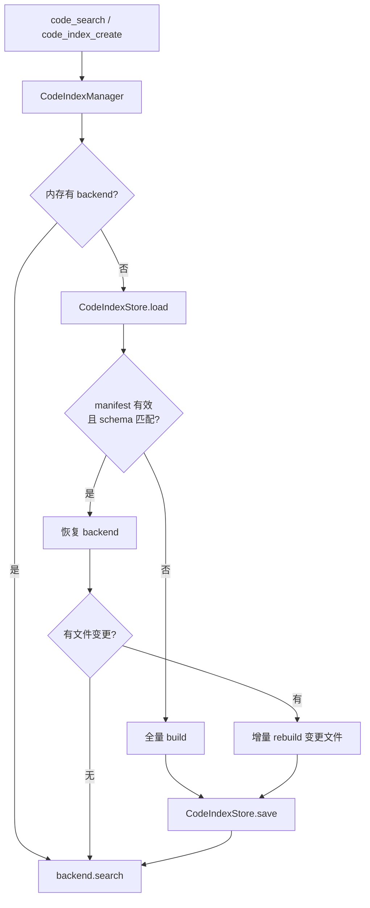

# Plan: 代码索引落盘与增量重建（code_index persistence）

Planned-with: claude-opus-5

- Plan-Id: 2026-09-02-code-index-persistence
- Plan-File: .cursor/plans/2026-09-02-code-index-persistence.plan.md
- Owner: Damon Li
- Status: Draft（待确认后移回 `.cursor/plans/` 根目录再实施）
- 关联既有 plan：
  - `.cursor/plans/2026-05-20-semble-code-search-integration.plan.md` — 本 plan 补其**未覆盖**的持久化能力（该 plan 的 Phase 3 是打包与跨平台，不含落盘）
  - `.cursor/plans/2026-05-06-code-context-index-internalization.plan.md` — 其 `native` backend 仍为长期备选，本 plan **不**实现 native
- 关联研究：
  - `research/codedeepresearch/zvec-grep/zvec-grep_source_notes.md` — 借鉴其 manifest/schema 钉死与 freshness 判定；**不引入该项目任何代码或运行时依赖**

## 0. 为什么做这件事（Why）

`agenticx/code_index/` 已落地 Semble 后端并可用，但索引**只活在进程内存里**：

```27:83:agenticx/code_index/manager.py
class CodeIndexManager:
    def __init__(self) -> None:
        self._lock = threading.RLock()
        self._tasks: dict[str, IndexTask] = {}
        self._backends: dict[str, CodeIndexBackend] = {}
```

`SembleCodeIndexBackend.build()` 把 chunks / embeddings / bm25 全部挂在实例字段上，`clear()` 只是丢引用：

```166:168:agenticx/code_index/backends/semble_backend.py
    def clear(self) -> None:
        self._index = None
        self._root = None
```

全包搜索确认 `agenticx/code_index/` 下**没有任何**落盘代码（无 snapshot、无 save/load、无 `~/.agenticx/code_index/` 写入）。

后果链条（这是本 plan 的根因）：

1. `agx serve` 每次冷启动 → 所有代码脑索引归零。
2. Machi Desktop 关闭/重启、改配置重启后端、DMG 更新，都会触发上述冷启动。
3. 用户在设置里点过「创建索引」、等了几分钟，下次开 App 又回到未索引态；`code_search` 要么懒重建（再等一次），要么返回 `partial`。
4. 这与用户对「耗时操作必须有明确进度、不要让人重复等待」的一贯要求直接冲突，也让代码脑在真实日常使用中价值大打折扣。

**这不是"缺混合检索能力"，Semble 的 hybrid/semantic/bm25 已经能用。缺的是索引寿命。**

## 1. 为什么不集成 zvec-grep（决策记录）

本 plan 起因于对 `zvec-ai/zvec-grep`（SHA `309a66995809243d3274fa8b5bea63ab11dda1a0`）的深度调研。结论是**不集成、不内化其实现**，只借鉴三条设计约束。理由：

| 否决理由 | 依据 |
|---|---|
| 运行时依赖冲突 | zg 要求 Node `>=22` + 独立 daemon 进程。AGX 后端是 PyInstaller 打包的 Python 单体（DMG/NSIS）。捆 Node 22 是比 `pip install chromadb` 更重的打包回归，违反「终端用户安装后不得触发运行时依赖安装」的既定底线 |
| 工具面重复 | `code_search` 已有代码脑 UI、分身挂载、预授权与中文标签。再引入 `zvec_grep_search` 会产生两个语义高度重叠的检索工具，制造路由歧义 |
| 运维面暴增 | 每个工作区多一个 `.zvec-grep/` 目录、一个 daemon、一套 home 读写锁 + daemon lease，以及**默认不校验的** Bearer（`validRequestToken` 在 token 未配置时直接放行） |
| 换不来子系统合并 | zg 把 PDF/Office 列为 binary 跳过，吃不下文档脑，无法减少 AGX 现有子系统数量 |
| 已交过两轮学费 | claude-context（弃用）→ Semble（落地）。再引第三方 TS 引擎是重复决策成本，不是补缺口 |

**借鉴但自研的三条**（全部 Python 侧，零新增依赖）：

1. manifest 钉死 embedding schema，模型/维度变更必须整体 rebuild，禁止静默用旧向量搜新模型的查询。
2. 用 mtime + size + 内容哈希做 per-file freshness，驱动增量。
3. 索引缺失/过期时给出**可执行的**错误提示，而不是泛化失败。

## 2. 范围

### In scope

- 新增 `agenticx/code_index/store.py`：索引产物落盘与加载。
- 改造 `agenticx/code_index/backends/semble_backend.py`：支持从缓存恢复、导出可持久化产物、按变更文件增量重建。
- 改造 `agenticx/code_index/manager.py`：启动时懒加载磁盘索引；build 成功后落盘；`clear()` 同时清磁盘。
- 扩展 `agenticx/code_index/config.py`：新增 `persist` 相关配置项。
- 扩展 `agenticx/code_index/state.py`：`IndexTask` 增加来源与新鲜度字段。
- 新增 `tests/code_index/test_persistence.py`。

### Out of scope（no-scope-creep 边界）

- ❌ 不实现 `NativeCodeIndexBackend`（保持 `NotImplementedError`）。
- ❌ 不改 `agenticx/studio/kb/`、`agenticx/brain/`、`agenticx/retrieval/`、`agenticx/memory/`。
- ❌ 不改 `agent_runtime.py`、`meta_tools.py`、`agenticx/studio/server.py`。
- ❌ 不改 `code_search` 的工具 schema 与参数（`_CODE_SEARCH_TOOL` 不动）。
- ❌ 不做 Desktop UI 改造（状态字段留给后续 plan 消费）。
- ❌ 不引入任何新的第三方依赖，不引入 Node。
- ❌ 不改 Semble 的 chunking / ranking / tokenize 逻辑。

## 3. 目标架构



磁盘布局（新增，不复用 KB 目录）：

```text
~/.agenticx/code_index/<sha256(resolved_codebase_path)[:16]>/
├── manifest.json      # schema 指纹 + 文件清单 + 统计
├── chunks.jsonl       # 每行一个 chunk 的可序列化字段
└── embeddings.npy     # float32 二维数组，行序与 chunks.jsonl 严格一致
```

**关键设计选择：只持久化 chunks 与 embeddings，加载时在内存重建 bm25 与向量后端。**

原因：昂贵的是 embedding 计算（要加载模型、逐 chunk 编码）；`bm25s.BM25().index(...)` 与 `SelectableBasicBackend(embeddings, args)` 都是纯 CPU、无模型、毫秒到秒级的构造。这样做可以完全避开 `semble` / `vicinity` / `bm25s` 内部序列化格式的版本稳定性风险——它们升版本时我们的磁盘格式不受影响。

## 4. 需求块

### Functional Requirements

- **FR-1 落盘**：`backend.build()` 成功后，`CodeIndexManager._run_build` 必须把 chunks + embeddings + manifest 写入上述目录。写入用「临时文件 + `os.replace` 原子换名」，禁止就地覆盖导致半截文件。
- **FR-2 恢复**：进程重启后首次对同一 `codebase_path` 调用 `search`/`ensure_indexing`，若磁盘 manifest 有效，必须从磁盘恢复索引而非重新 embedding。恢复路径**不得**加载 embedding 模型（除非随后需要增量）。
- **FR-3 schema 钉死**：manifest 记录 `{model, embedding_dim, include_text_files, store_version}`。任一不匹配当前配置时，**不得**使用磁盘索引，须走全量 rebuild，并在日志与 `IndexTask.error_summary` 之外的 `index_source` 字段体现原因。
- **FR-4 增量**：manifest 为每个已索引文件记录 `{relpath, size, mtime_ns, sha256}`。恢复后扫描工作区，计算 added / modified / removed；仅对 added + modified 重新 chunk 与 embed，removed 直接从 chunk 集合剔除，未变文件复用磁盘 embedding。
- **FR-5 清理**：`CodeIndexManager.clear(codebase_path)` 除弹出内存 backend 外，必须删除该 codebase 的磁盘目录。`clear_all()` 同理逐个清。
- **FR-6 状态可见**：`IndexTask.to_status_dict()` 新增 `index_source ∈ {"memory", "disk", "rebuilt", "incremental"}` 与 `stale_files: int`，供后续 Desktop 面板消费。本 plan 只产出字段，不改 UI。
- **FR-7 开关与降级**：新增配置 `code_index.persist.enabled`（默认 `true`）与 `code_index.persist.max_disk_mb`（默认 `2048`）。落盘失败（磁盘满、权限、超限）**不得**让 build 失败——记 warning、把 `index_source` 标为 `"memory"`、索引照常可用。
- **FR-8 损坏自愈**：manifest JSON 解析失败、`embeddings.npy` 行数与 `chunks.jsonl` 不一致、或文件缺失时，视为无缓存，删除该目录并走全量 rebuild，不向用户抛栈。

### Non-Functional Requirements

- **NFR-1 零新增依赖**：仅用标准库 + 已有的 `numpy`（`semble` 已传递依赖）。不新增 pyproject 条目。
- **NFR-2 隔离**：不修改 `agenticx/code_index/` 以外的任何生产文件。`tools.py`、`format.py` 不改。
- **NFR-3 默认关时零影响**：`code_index.enabled=false` 时全部新代码不被触达。
- **NFR-4 并发安全**：同一 codebase 的落盘写入必须在该 task 的锁内完成；跨进程用目录内 `.lock` 文件（含 pid + 时间戳），陈旧锁超过 6 小时或 pid 已死则可回收。
- **NFR-5 失败可读**：所有异常摘要走已有的 `format_error_summary`，禁止只透出单 token。
- **NFR-6 路径安全**：目录名用 `sha256(str(path.resolve()))[:16]`，与 `manager.py:_task_key` 保持同一算法，不得把用户路径直接拼进目录名。
- **NFR-7 跨平台**：`mtime_ns` 在不同文件系统精度不同，因此判定顺序必须是 `size 不同 → 脏`、`size 相同但 mtime_ns 不同 → 再比 sha256`，避免 Windows/网络盘上误判全库过期。

### Acceptance Criteria

- **AC-1**：`pytest tests/code_index/ -q` 全绿，含既有 smoke 测试零回归。
- **AC-2**：`tests/code_index/test_persistence.py` 至少 10 条，覆盖：
  1. build → save → 新建 manager → load，`index_source == "disk"` 且不触发 encoder 加载（用 `encoder_load_count_for_tests()` 断言计数不增）。
  2. 改一个文件内容 → load 后 `index_source == "incremental"`，`stale_files == 1`，新内容可被检索命中。
  3. 删一个文件 → 其 chunk 不再出现在结果里。
  4. 加一个文件 → 新文件可被检索命中。
  5. 改 `semble_model` → `index_source == "rebuilt"`，且磁盘旧目录被覆盖。
  6. 手工把 `manifest.json` 写成 `{`（非法 JSON）→ 自动全量 rebuild，不抛异常。
  7. 手工截断 `embeddings.npy` 行数 → 视为损坏并 rebuild。
  8. `clear()` 后磁盘目录不存在。
  9. `persist.enabled=false` 时不产生任何磁盘文件，行为与今日一致。
  10. 落盘目标目录不可写（chmod 0o500 或 monkeypatch 抛 `PermissionError`）→ build 仍成功，`index_source == "memory"`，日志有 warning。
- **AC-3**：在 AgenticX 自身仓库上人工验证：首次 `code_index_create` 记录耗时 T1；重启 `agx serve` 后首次 `code_search` 记录耗时 T2；要求 `T2 < T1 / 5`。把两个实测数字写进 commit body。
- **AC-4**：`agx serve --host 127.0.0.1 --port <临时端口>` 冷启动通过，`/api/session`、`/api/avatars`、`/api/sessions` 返回 200（本 plan 不改 `server.py`，此项为回归护栏）。
- **AC-5**：所有 commit 带 `Plan-Id` / `Plan-File` / `Plan-Model` / `Impl-Model` / `Made-with: Damon Li`，无其它 trailer。

## 5. 精确落点

### 5.1 新增 `agenticx/code_index/store.py`

对外接口（实现者按此签名写，不要自行扩大）：

```python
STORE_VERSION = 1

@dataclass(frozen=True)
class IndexedFileMeta:
    relpath: str
    size: int
    mtime_ns: int
    sha256: str

@dataclass(frozen=True)
class StoreManifest:
    store_version: int
    model: str
    embedding_dim: int
    include_text_files: bool
    codebase_path: str
    files: dict[str, IndexedFileMeta]   # key = relpath
    total_chunks: int
    languages: dict[str, int]
    saved_at: float

class CodeIndexStore:
    def __init__(self, codebase_path: Path) -> None: ...
    @property
    def root(self) -> Path: ...                      # ~/.agenticx/code_index/<sha16>/
    def load_manifest(self) -> StoreManifest | None: ...   # 损坏返回 None 并清目录
    def load_payload(self) -> tuple[list[dict], "np.ndarray"] | None: ...
    def save(self, manifest: StoreManifest, chunks: list[dict], embeddings) -> bool: ...
    def delete(self) -> None: ...
    def diff(self, manifest: StoreManifest, current: dict[str, IndexedFileMeta]) -> tuple[set[str], set[str], set[str]]: ...  # added, modified, removed
```

要点：
- `save()` 返回 `bool`，任何 IO 异常内部吞掉并记 warning 后返回 `False`（支撑 FR-7）。
- `diff()` 按 NFR-7 的顺序判定，sha256 只在 size 相同且 mtime 变了时才算。
- 原子写：先写 `manifest.json.tmp`，`os.replace` 换名；三个文件全部写成功后才算 save 成功，中途失败要清理临时文件。

### 5.2 `agenticx/code_index/backends/semble_backend.py`

当前 `build()` 在 `agenticx/code_index/backends/semble_backend.py:59-130` 一次性完成「walk → chunk → embed → 构造 SembleIndex」。新增三个方法，**不改 `build()` 的现有签名与行为**：

```python
def export_payload(self) -> tuple[list[dict], "np.ndarray"]: ...
    # 从 self._index 导出 chunk 的可序列化字段与 embedding 矩阵，行序一致

def restore(self, chunks: list[dict], embeddings, root: Path) -> None: ...
    # 反序列化 chunk 对象 → bm25s.BM25().index(...) → SelectableBasicBackend(embeddings, args)
    #   → SembleIndex(...)。整个过程不调用 encoder。

def rebuild_changed(self, codebase_path, *, changed: set[str], removed: set[str],
                    on_progress, cancel_event=None, include_text_files=False) -> None: ...
    # 只对 changed 文件重新 chunk + embed_chunks；removed 与 changed 的旧 chunk 从集合中剔除；
    # 拼接后重建 bm25 与向量后端。
```

实现者注意事项：
- chunk 的可序列化字段以 `semble.chunking.chunk_source` 实际产出为准。至少含 `content / file_path / start_line / end_line / language`。**动手前先打印一个真实 chunk 对象的 `__dict__` 确认字段全集**，缺字段会导致 `find_related` 或 bm25 富化行为漂移。
- `enrich_for_bm25` 与 `tokenize` 的调用方式照抄现有 `build()` 第 111-115 行，不要改写。
- `SelectableBasicBackend` / `BasicArgs` 的导入路径照抄现有 `build()` 第 74-75 行。
- 若实测发现 `SembleIndex` 构造需要额外参数，以现有 `build()` 第 118-124 行为准。

### 5.3 `agenticx/code_index/manager.py`

改 `_run_build`（当前 `agenticx/code_index/manager.py:149-209`）内部的 `_build()`：

before（语义）：拿 backend → `backend.build(全量)` → 写 task 统计。

after（语义）：

1. 若 `cfg.persist_enabled`，先 `store.load_manifest()`。
2. manifest 为空 / schema 指纹不匹配 → 全量 `backend.build()`，`index_source = "rebuilt"`。
3. manifest 有效 → `store.load_payload()` → `backend.restore(...)`；再 `store.diff()`：
   - 无变更 → `index_source = "disk"`，跳过 embedding。
   - 有变更 → `backend.rebuild_changed(...)`，`index_source = "incremental"`，`stale_files = len(added|modified|removed)`。
4. 任一路径结束后，若发生过重算，调用 `store.save(...)`；`save()` 返回 `False` 时把 `index_source` 降级为 `"memory"` 并记 warning。
5. `IndexStatus.INDEXED` 的写入位置与现有第 186-191 行保持一致，只多写两个新字段。

改 `clear`（当前 `agenticx/code_index/manager.py:120-131`）：在 `backend.clear()` 之后追加 `CodeIndexStore(codebase_path).delete()`，受 `persist_enabled` 保护。

**严禁**改动 `_make_backend`、`load_encoder`、`_get_task`、`cancel` 的现有逻辑。第 163-164 行「已 INDEXED 则直接 return」的短路要保留。

### 5.4 `agenticx/code_index/config.py`

在 `CodeIndexConfig`（`agenticx/code_index/config.py:13-22`）追加两个字段并在 `load_code_index_config()`（第 34-60 行）解析，沿用现有 `_nested` + 边界钳制风格：

```python
persist_enabled: bool = True          # code_index.persist.enabled
persist_max_disk_mb: int = 2048       # code_index.persist.max_disk_mb, clamp 到 [64, 32768]
```

### 5.5 `agenticx/code_index/state.py`

`IndexTask`（`agenticx/code_index/state.py:23-36`）追加：

```python
index_source: str = "memory"
stale_files: int = 0
```

并在 `to_status_dict()`（第 43-54 行）输出这两个键。**不要**改动已有键名，Desktop 与工具层正在读它们。

## 6. 阶段拆分

每阶段独立 commit，`pytest tests/code_index/ -q` 绿才进下一阶段。

| 阶段 | 内容 | DoD |
|---|---|---|
| P1 | `store.py` + `config.py` + `state.py` 字段 | FR-1/3/5/8 的存储层单测通过（可脱离 semble 用假数据测） |
| P2 | `semble_backend.py` 的 `export_payload` / `restore` | AC-2 第 1 条通过 |
| P3 | `rebuild_changed` + `manager.py` 接线 | FR-2/4/6/7，AC-2 全部通过 |
| P4 | 真实仓库实测 + 文档 | AC-3/AC-4，`docs/` 补一段代码脑索引持久化说明 |

## 7. 推荐实施模型（Suggested-Impl-Model）

| 子阶段 | 推荐模型 | 理由 |
|---|---|---|
| P1 存储层 | `composer-2.5-fast` | 纯标准库 IO + dataclass，规格已写死，属样板任务，不必上高价模型 |
| P2 导出/恢复 | `gpt-5.6-sol-medium` | 要读 semble 内部对象结构并保证行序严格对齐，属易错的后端接线 |
| P3 增量 + 接线 | `gpt-5.6-sol-medium` | 跨文件状态机改造、并发与降级路径敏感，需要稳的后端能力 |
| P4 实测与文档 | `composer-2.5-fast` | 跑命令、填数字、写说明 |

最终 `Impl-Model` trailer 以实际使用为准，由用户确认。

## 8. 风险与回滚

| 风险 | 缓解 |
|---|---|
| semble chunk 对象字段变化导致反序列化失配 | manifest 里的 `store_version` 兜底；升 semble 版本时 bump 该值即可让所有旧缓存自动失效重建 |
| 磁盘缓存与工作区不一致导致搜到已删代码 | FR-4 的 removed 处理 + AC-2 第 3 条专测 |
| 大仓库 embeddings.npy 过大 | `persist_max_disk_mb` 超限则跳过落盘并降级 `"memory"`，不阻塞功能 |
| 多进程同时写同一目录 | NFR-4 的 `.lock`；且写入是原子换名，最坏情况是后写者覆盖，不会产生半截文件 |

回滚方式：把 `code_index.persist.enabled` 设为 `false`，行为立即回到当前的纯内存模式；无需回滚代码。
