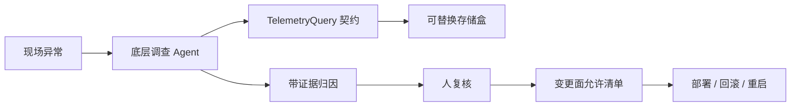
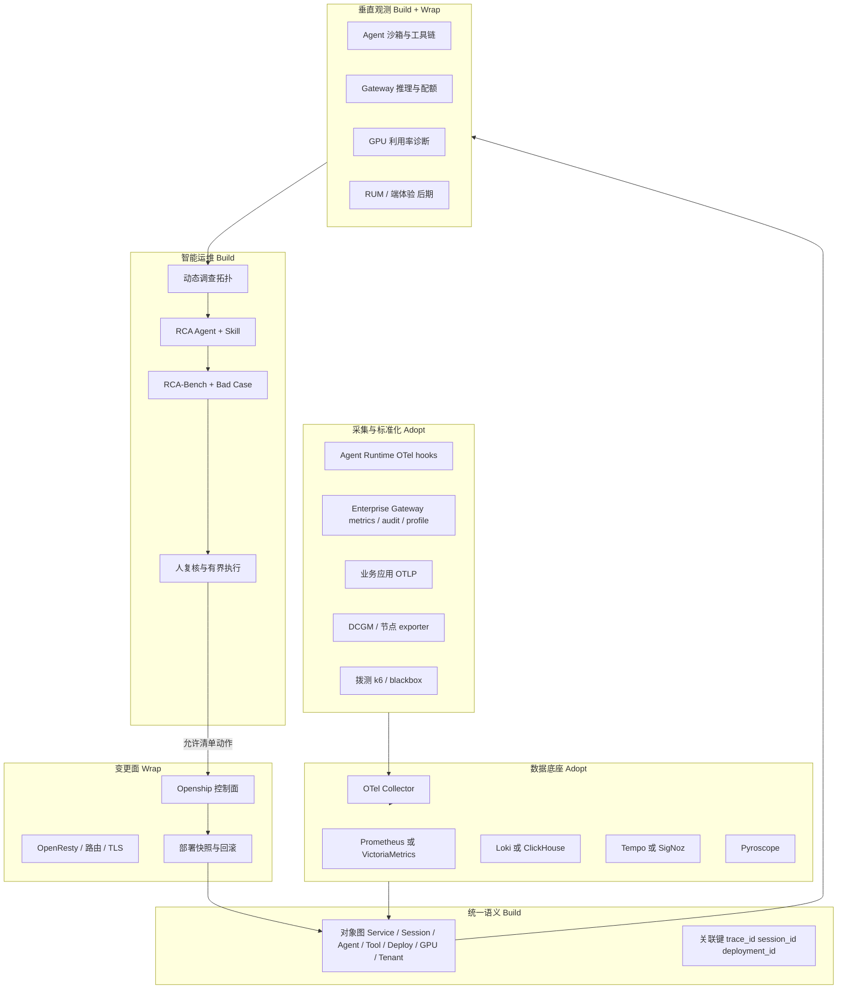
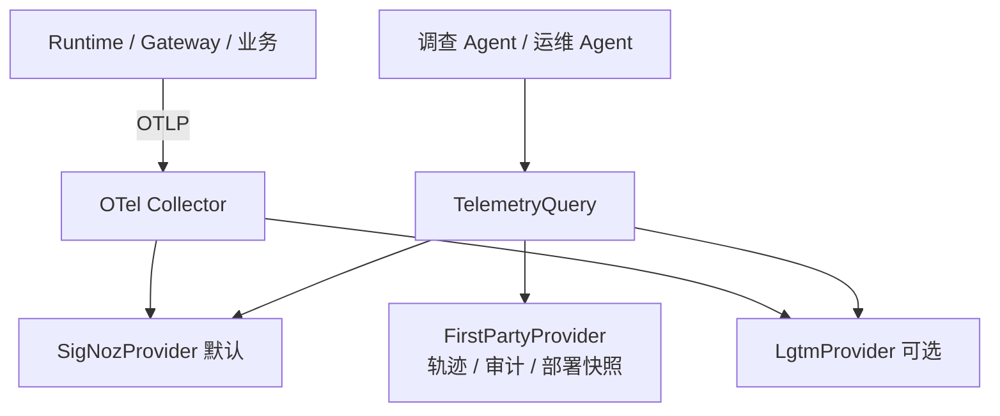
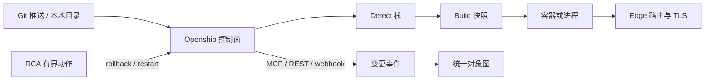
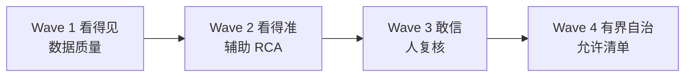
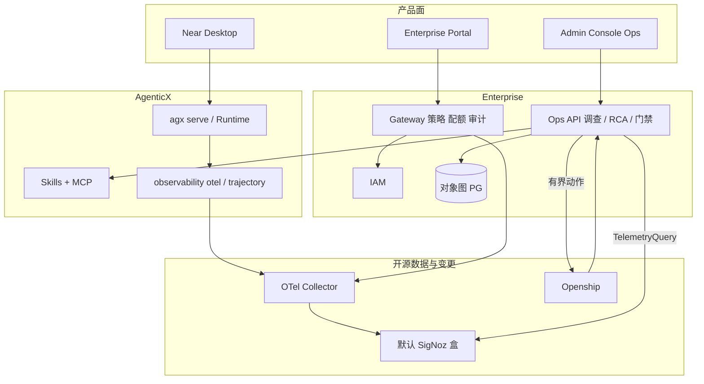

# AgenticOps 平台总规划：从「看得见」到「自己治」

Planned-with: Cursor Grok 4.6
Suggested-Impl-Model: 见文末「子规划 → 推荐模型」表；本文件是 **Master Plan**，禁止直接当实施清单开干。

**文档类型：** Master Plan（只定义北极星、分层、开源取舍、波次与可衍生子规划）。  
**不是：** 可执行 implementation plan（无逐文件 before/after、无 2–5 分钟任务）。后续每个 Wave 必须再写独立 subplan，落盘到 `.cursor/plans/pending/`，达到「Composer 2.5 不看对话也能高质量落地」门槛后再开工。

**Goal:** 产品随私有化落到任何现场时，都有一个 **Agent 原生的底层调查智能体**：能按关联键自己去拉链路 / 日志 / 指标 / 最近变更，给出带证据的归因；部署与辅助运维这条人肉链路，后续由同一套智能体按允许清单一键执行，而不是再雇一套人点控制台。

**Architecture:** 人看的看板不是产品；**TelemetryQuery（Agent 查询契约）才是产品**。存储后端可换（默认随包 SigNoz/ClickHouse，客户已有 Grafana 则走 LGTM 适配器）。调查 Agent 只通过该契约只读取数；写操作必须经过允许清单、二次确认与可回滚的变更面（Openship）。RCA 是锚点：根因不准就不开放自动执行。

**Tech Stack（原则：Adopt / Wrap / Build）：**
- **Adopt：** OpenTelemetry Collector；默认观测盒 [SigNoz](https://github.com/SigNoz/signoz)；LGTM 仅作客户已有栈的适配
- **Wrap：** Openship（变更/部署）、HolmesGPT / k8sgpt / Keep（作诊断 Skill 后端，不嵌入内核）
- **Build：** TelemetryQuery 契约、统一对象模型、调查拓扑、RCA-Bench、有界自愈编排

**依据文档：** [飞书原文](https://wv18cbjmgi0.feishu.cn/docx/GBDKd52tWoOHUVxafYhcZwevnyd)（Damon，rev 11，2026-07/08 阿里云可观测 11 篇读后）  
**读取方式：** `lark-cli docs +fetch --as user --doc GBDKd52tWoOHUVxafYhcZwevnyd`（MCP 过期时走 CLI，勿再走失效的 tenant token）

---

## 0. 本文件怎么用

| 角色 | 用法 |
|------|------|
| 产品 / 架构 | 用第 1–4 节对齐「做什么、不做什么、四道坎」 |
| 规划模型 | 用第 8 节清单衍生 subplan；每个 subplan 必须写清落点、AC、In/Out of scope |
| 实施模型 | **不要**拿本文件直接改代码；只执行已从本文件拆出、且已移到 `.cursor/plans/` 根目录的 subplan |

**衍生规则（强制）：**
1. 一个 Wave 可以拆 1–N 个 subplan，但一个 subplan 不得跨两个 Wave 的验收门槛。
2. 子规划标题/正文/文件名不得出现客户名、客户路径、对标竞品作为 commit 文案；内部对照可写开源仓库名。
3. 任何「顺手把 Desktop / admin-console / `server.py` import 区一起改」都视为越界，须先回到本 Master 确认。
4. 变更面若选择 Openship，默认 **MCP/API 适配器**，禁止第一年 fork 其 monorepo。

---

## 1. 北极星与非目标

### 1.1 从飞书文档抽出的、必须遵守的判断

原文结论不是「我们要做阿里云 STAROps」。原文真正可执行的判断是：

1. **赛道已换：** 采集/存储变成水电煤；差异化在「采上来之后能不能告诉你问题在哪」。
2. **RCA 是锚点，不是附属功能。** 根因错 → 建议浪费时间；根因错且有执行权 → 生产事故。
3. **POC 验不了可泛化 RCA。** 三个已知剧本（CrashLoop / 慢 SQL / Redis 挂）只能证明「会这三类」，证明不了遇到 D 类故障时 Agent 仍知道怎么查、怎么停。
4. **RCA 必须是系统工程：** 统一对象模型 + 动态调查拓扑 + 以规则为主的 Bench + 线上 Bad Case 回归。模型只是其中一块。
5. **四道坎不可跳级：** 数据质量 → 根因定位 → 决策信任 → 自动执行。现在行业整体卡在第 1–2 道之间。
6. **垂直场景短期 ROI 往往高于通用 AIOps。** 对 AgenticX：Agent 沙箱/工具链可观测、Gateway 推理成本、GPU 利用率，应先于「通用云资源 RCA」。
7. **智能运维是锦上添花。** 没有变更记录、没有关联得上的日志/链路、没有应急允许清单，上 Agent 是浪费。
8. **不要自己造非核心轮子。** 底座能 Adopt 就 Adopt；自研只留对象模型、调查框架、评测与执行门禁。

### 1.2 已锁定的产品诉求（2026-09-06）

现场交付后，核心不是「客户打开 Grafana 自己翻」。核心是：

1. **底层调查 Agent（P0）：** 无论产品部署在哪，都能按 `trace_id` / `session_id` / `deployment_id` / 时间窗，自己去取具体链路和日志，做归因分析。人可以复核，但取证不能依赖人肉翻三套 UI。
2. **辅助运维 / 部署链路（P1，同一 Agent 的写路径）：** 升级、回滚、重启、补证书、看发布是否健康——今天必须人点，后续要能一键 / 自主完成。这是变更面，不是再做一个 PaaS 品牌。
3. **跳级禁令不变：** 没有取证能力就开放「一键部署/自愈」，等于把生产事故自动化。四道坎仍适用；P1 的自主运维挂在 Wave 3–4，但 **产品叙事从第一天就按 Agent 来设计**，不要先做给人看的监控套件再补 Agent。



### 1.3 产品北极星（一句话）

> 私有化现场永远带着一个会查证的 Agent：先自己把链路和日志捞齐并归因；人点头之后，同一条智能体再去把繁琐的部署与运维做完，并且能回滚。

### 1.4 成功时用户能看见什么

- 现场出问题，调查 Agent 能在一分钟级给出：怀疑对象、排除分支、关键证据（某条 Trace / 日志片段 / 最近一次部署快照）、建议动作。没有证据的结论视为失败。
- 人不必先会 PromQL / LogQL / TraceQL。这些是适配器内部的事。
- 部署 / 回滚 / 重启等繁琐操作，最终走同一 Agent 的允许清单，而不是再开一份「运维操作手册让人点 Openship」。
- 自动执行默认关闭，直到 RCA-Bench 与误报率过门。

### 1.5 明确非目标（Out of scope for Master）

| 不做 | 原因 |
|------|------|
| 再造 SLS / ARMS / 云监控 2.0 级采集存储 | 开源与云厂商已完成云原生化上半场 |
| 第一年做「全自动自愈」或宣传生产级 AgenticOps | 原文已写明这是目标不是现状 |
| Fork Openship / Coolify 当自己的 PaaS 产品 | 变更面是能力，不是新品牌 |
| 把 Desktop Machi 聊天窗改成运维控制台 | 关注分离；运维 UI 走 Enterprise / 独立 Ops 面 |
| 用 LLM 互评 RCA 当唯一分数 | 原文：≥80% 分数必须是确定性规则 |
| 在客户方案里承诺「已支持部门/用户级配额自愈」等未落地能力 | 与现仓诚实完成度原则一致 |
| 把 `packaging/edge-agent` 空壳说成端侧闭环 | 现仓 edge-agent 仍是 skeleton |

---

## 2. 为什么是 AgenticX + Openship，而不是再做一个 AIOps

飞书文档里 STAROps 能成立，是因为阿里云已经有统一数据底座 + UModel。AgenticX **没有**这个底座，但有三块别人不好抄的存量：

| 存量 | 路径（实施者必须先读） | 对 AgenticOps 的含义 |
|------|------------------------|----------------------|
| Agent 执行轨迹 / Span 树 | `agenticx/observability/{trajectory,span_tree,analysis,evaluation}.py` | Agent 不再是黑盒组件；这是垂直观测的第一块自有数据 |
| OTel 桥 | `agenticx/observability/otel/{config,handler,hooks,span_exporter}.py`，`enable_otel()` | 已能把 Callback 打成标准 Trace，可进任意 OTLP 后端 |
| GenAI 语义常量 | `agenticx/observability/ai_attributes.py` | 对齐 OTel GenAI conventions，避免再发明一套属性名 |
| Gateway 指标 + 画像 | `enterprise/apps/gateway/internal/observability/{metrics,pyroscope}.go` | 已有 TTFT / TPS / cache / 通道健康 / plugin 延迟；Pyroscope 可开 |
| 网关审计 | `gateway_audit_events` + JSONL 兜底（见 AGENTS.md Enterprise 审计事实） | 变更与拦截本身就是 RCA 的「事件」源 |
| 策略引擎 | Enterprise Gateway 三通道评估（请求/响应/流式） | 自愈动作的安全边界应复用策略，而不是另做一套 |
| Skills + MCP | `agenticx/skills/`、`agenticx/extensions/`、Studio `/api/skills/*` | 对应原文「Skill 机制」：平台不懂数据库，数据库 Skill 来扩展 |
| 学习/复盘 | `agenticx/learning/` | Bad Case 回归与 skill 质量门禁可复用思路，不要另起一套「运维知识库」 |
| 子智能体状态 | `agenticx/runtime/team_manager.py`、`/api/subagents/status` | Agent Sandbox 可观测的现成对象 |

**缺口（必须诚实写进后续 subplan）：**

- 上述模块是**库级 / 单进程级**可观测，不是平台。没有统一对象 ID，没有跨 Gateway↔Runtime↔Deploy 的关联键。
- `FailureAnalyzer` 是轨迹文本分析，**不是**可泛化 RCA，不能当 STAROps 替代品对外讲。
- Gateway 指标未与 Runtime span、会话 `messages.json`、部署快照打通。
- 没有变更面：出了问题不知道「刚才谁发了什么版本」。这正是 Openship 要补的。
- `packaging/edge-agent` 不能承担采集端。

Openship 在本规划中的角色 **不是「我们的 Vercel」**，而是 **变更与运行时真相源**：

- 一次 deploy 冻结 `DeploymentConfigSnapshot`（构建命令、镜像、环境、端口、域名）
- 控制面（Desktop / CLI / Web / MCP）与数据面（容器 / 进程 / OpenResty edge）分离
- MCP 已按权限暴露 Projects / Deployments，且凭据路由永不成为 tool（见 [Openship README](https://github.com/oblien/openship) 与 DeepWiki Architecture）
- `onSuccess` / `onFailure` / `onCancelled` 与 `BuildLogger` 可映射成我们的「变更事件」

没有这条变更总线，RCA 永远缺「是代码、是配置、还是流量」的第三根支柱。

---

## 3. 目标分层（对照原文版图）

原文把阿里云拆成：数据底座 → UModel → 垂直观测 → STAROps。我们用同一逻辑，但每一层都先写 **Adopt / Wrap / Build**。



### 3.1 数据底座层 — Agent 先查到，存储可替换

**已拍板（2026-09-06，按「现场调查 Agent」重判）：**

| 层 | 选择 | 原因 |
|----|------|------|
| Agent 看到的 | **自研 `TelemetryQuery` 契约**（Build） | 调查 Agent 只学一种工具：按关联键取 Trace / 日志 / 指标 / 变更窗口。禁止 Agent 直接写 PromQL+LogQL+TraceQL 三套 |
| 随包默认盒 | **SigNoz + ClickHouse**（Adopt） | traces/metrics/logs 一个查询面、一个 APM 服务页；客户现场少运维 5 个 Grafana 组件；[SigNoz MCP](https://github.com/SigNoz/signoz-mcp-server) 可作 Wave 2 的加速，但仍须包在我们的契约里 |
| 客户已有盒 | **LGTM 适配器**（Wrap，非默认） | 现场已经在跑 Grafana/Prom 时，Collector 双写或只写客户栈；Agent 仍只打 TelemetryQuery |
| 采集 | **只认 OTLP** | 禁止再发明第二种 ingest |

Gateway 现有 Prometheus `/metrics` **不丢**：Collector 继续 scrape，再写入默认盒（SigNoz 收 OTLP metrics）。人看的 Grafana 不再是 Wave 1 必交物。



**为什么默认不再是 LGTM：** LGTM 对人友好（看板生态），对「随包落到客户现场、由 Agent 取证」不友好——调查 Skill 要对接三种查询语言，客户还要养 5–6 个容器。诉求是 Agent 原生归因，不是再交一套给人点的监控。

**SigNoz 不是字面单进程：** 仍是 Collector + ClickHouse + `signoz` 本体。省的是心智和查询面，ClickHouse 吃内存，小规格机器要在 S2 subplan 写清最低配。

**Wave 1 准出改为：** 调查 Agent（哪怕还是脚本化 Skill）能对一条失败会话执行 `get_trace` / `get_logs` / `get_recent_changes` 并引用证据。不是「Grafana 看板绿了」。

**Langfuse / Phoenix：** 仍是可选第二出口（评测 UI），不是现场默认盒。Wave 2 再开 S11。

### 3.2 统一语义层 — Build（核心自研，但要薄）

对标原文 UModel，但对象集合按 **Agent 平台** 而不是「全云产品 CMDB」来裁。

**v0 对象类型（冻结，后续只加不改语义）：**

```text
Tenant
  └─ Environment (dev/staging/prod)
       ├─ Service          # 可部署单元（来自 Openship project 或 compose service）
       ├─ Deployment       # 一次发布快照
       ├─ Route            # 域名 / 路径 / TLS
       ├─ AgentRuntime     # agx serve / studio session / subagent
       ├─ Session          # 对话会话
       ├─ ToolCall         # 工具 / MCP call
       ├─ ModelChannel     # Gateway 上游通道
       ├─ PolicyHit        # 策略命中
       ├─ GPUNode          # 可选
       └─ Alert            # 归一化告警
```

**关联键（实施时写进 schema，不允许「靠名称猜」）：**

| 键 | 谁产生 | 谁必须传播 |
|----|--------|------------|
| `trace_id` | OTel | Runtime span、Gateway span、工具调用 |
| `session_id` | Studio / Portal | 消息、token usage、subagent、审计 |
| `deployment_id` | 变更面 | 运行中的 Service、回滚、RCA 变更窗口 |
| `avatar_id` / `tenant_id` / `user_id` | IAM | 所有查询的强制 scope |
| `tool_call_id` | Runtime | 轨迹步、OTel span、学习观察 |

**落点预期（给后续 subplan，不是现在改）：**

- 新包建议：`enterprise/packages/ops-model` 或 `agenticx/ops/umodel/`（二选一，subplan 里拍板；不要两处各写一份）
- 运行时注入：`agenticx/observability/otel/handler.py` 给每个 span 补齐关联键
- Gateway：`enterprise/apps/gateway/internal/server/cache_integration.go` 已有 `spanMeta` 思路，扩展而不是新开一套
- 存储：PG 存对象图与调查任务；时序/日志仍在 Adopt 的后端。对象图不是把 Loki 搬进 PG。

### 3.3 变更面 — Wrap Openship，备选 Coolify / Dokploy / Kamal



**为什么首选 Openship（相对 Coolify / Dokploy / CapRover / Kamal）：**

| 能力 | Openship | Coolify | Dokploy | CapRover | Kamal |
|------|----------|---------|---------|----------|-------|
| 许可证 | Apache-2.0 | Apache-2.0 | Apache-2.0 + 商业限制需核 | Apache-2.0 | MIT |
| 控制面形态 | Desktop / Web / CLI / MCP | Web | Web | Web | 仅 CLI |
| 对 Agent 友好 | MCP 一等公民、工具分组、凭据永不进 tool | 需自写适配 | 需自写适配 | 弱 | 无控制面 |
| 变更快照 | `DeploymentConfigSnapshot` 冻结构建与运行时 | 有发布历史 | 有 | 有 | 镜像 tag，无产品级快照对象 |
| 部署目标 | Compose 同机 / SSH 远端 / Cloud | 多机较完整 | Compose 原生、轻 | Swarm 集群 | SSH 滚容器 |
| 成熟度 | 核心可用，多节点仍在路线图 | 最成熟、最重 | 轻、年轻 | 稳、UI 旧 | 不是 PaaS |

对照来源：[Openship](https://github.com/oblien/openship)、[2026 自托管 PaaS 对比](https://wz-it.com/en/blog/self-hosted-paas-comparison-coolify-dokploy-caprover/)、[Coolify vs Dokploy vs CapRover](https://nelsa.cloud/blog/self-hosted/coolify-vs-dokploy-vs-caprover-2026-picking-a-self-hosted-paas)。

**接入策略（三档，按验证结果升级，禁止一上来 fork）：**

1. **Adapter（Wave 1–2 默认）：** `enterprise` 或 `agenticx/ops/changeplane` 增加 `ChangePlaneProvider` Protocol。首个实现 `OpenshipProvider`：读 project/deployment、订 webhook 或轮询、把 snapshot 映射进 UModel。动作侧只暴露 `restart` / `rollback` / `redeploy`。
2. **Sidecar 同机：** 私有化交付时用 `openship up --compose`（Postgres + Redis + API + dashboard + OpenResty edge）。我们的 Gateway / Portal 不嵌入其 UI。
3. **Fallback Provider：** Openship MCP 权限模型或多租户不合则换 `CoolifyProvider` 或 `KamalProvider`（Kamal 适合「已经 IaC、不要再买一个控制面」）。接口保持不变。

**Openship 关键锚点（写 subplan 时直接引用）：**

- 控制面入口：`apps/api`（Hono）、`apps/dashboard`、`apps/cli`、`apps/desktop`
- 部署引擎：`apps/api/src/modules/deployments/build-pipeline.ts`、`build-execution-plan.ts`
- 适配器：`packages/adapters`（Docker / bare / cloud）
- 自托管栈：`docker/docker-compose.yml`（不要用仓库根 `docker-compose.yml`，那是 SaaS 控制面）
- 文档：<https://openship.io/docs>、DeepWiki `oblien/openship` §2–5 / §9 / §11

**安全红线：** API 容器挂载 Docker socket = 主机特权。私有化必须写进交付清单；Agent 不得拿到 raw socket，只能打我们的 ChangePlane API。

### 3.4 垂直观测层 — 按 ROI 排序，不按酷炫排序

原文顺序是 GPU / RUM / Agent Sandbox。**对我们要反过来：**

| 优先级 | 垂直场景 | 为什么先做 | 开源抓手 |
|--------|----------|------------|----------|
| P0 | Agent / 工具链 / 沙箱 | 我们自己就是 Agent 平台；黑盒会直接打脸 | 现有 trajectory + OTel + ToolCallCard 语义 |
| P0 | Gateway 推理与通道 | 已有指标，差关联与「为什么慢」 | Prometheus + Pyroscope + 审计 |
| P1 | 变更窗口与发布健康 | 没有变更，RCA 缺第三支柱 | Openship snapshot + 部署后 SLO |
| P2 | GPU | 端云路由 / 本地推理场景才刚需；通用 SaaS 可后置 | [DCGM Exporter](https://github.com/NVIDIA/dcgm-exporter)、节点 GPU metrics |
| P3 | RUM / 拨测 | 「指标全绿用户喊卡」是真问题，但不是第一年内核 | Grafana Faro / k6 / Blackbox；Flutter RUM 不做 |
| P3 | 传统主机/中间件深潜 | 交给 k8sgpt / HolmesGPT Skill，不自研探针 | 见 3.5 |

**Agent 可观测最低字段（P0 冻结）：**

- 步骤类型、工具名、MCP server、参数摘要（脱敏）、耗时、成功/失败、重试次数、token、`awaiting_confirm`、子智能体 `owner_session_id`
- 与 UI 已有语义对齐：过程性广播聚合、ReasoningBlock、ToolCallCard 默认折叠——Ops 面看的是同一对象，不是另一套文案

### 3.5 智能运维层 — Build 编排，Wrap 专家系统

**不要把 HolmesGPT 嵌进 Runtime。** 原文 Skill 机制的正确读法是：平台提供调查框架，领域能力可插拔。

| 组件 | 开源 | 我们怎么用 |
|------|------|------------|
| 调查引擎 | 自研（基于现有 agent loop + tools） | 动态调查拓扑、停损规则、人可接管 |
| K8s 专家 | [k8sgpt](https://github.com/k8sgpt-ai/k8sgpt)、[HolmesGPT](https://github.com/HolmesGPT/holmesgpt) | 作为 **只读 Skill 后端**；其 OTel 可并入同一 Collector（[Holmes OTel 文档](https://holmesgpt.dev/dev/reference/opentelemetry/)） |
| 告警归一 | [Keep](https://github.com/keephq/keep) 或 Grafana Alerting | Wave 2 再选；Wave 1 只用 Grafana 告警 + webhook |
| 工作流引擎 | 不引入 Temporal | 调查是短任务，走现有 runtime + 允许清单即可 |

**调查过程必须可画成图（原文「动态调查拓扑」）：**

- 节点 = UModel 对象
- 边 = 「查过 / 异常 / 排除 / 仍怀疑」
- 每个节点挂证据指针（query、log 行、span、deployment_id）
- 人可以在任一节点接管或否决

**RCA-Bench（Wave 2 必做，否则不准宣称 RCA）：**

- 每个用例：根因对象、故障类型、传播路径、关键证据、允许的调查动作集
- 评分：≥80% 确定性规则（是否点到根因对象、是否引用了必备证据、是否越权查了不该查的租户）；LLM 只打「叙述是否与证据矛盾」
- 首批用例必须来自 **我们自己的栈**，不要去模拟「阿里云 103 个云产品故障」：
  1. Gateway 上游通道冷却导致 TTFT 飙高
  2. `max_tool_rounds` 触顶，UI 表现为「突然无输出」
  3. MCP stdio 握手挂起（Docker 不响应）
  4. 某次 Openship 部署把错误环境变量打进 prod
  5. 策略 warn 被 UI 误当成 block（已有产品语义，适合当回归）
  6. 子智能体委派超时被当成主会话失败
  7. 本地 GPU / Ollama 不健康被端云路由切到云，但前端没展示原因

**Skill 质量（原文未写完的三问，我们要先立规）：**

1. Skill 必须声明 `requires_tools` / 输入输出 schema / 禁止副作用。
2. 调查编排器按对象类型选 Skill，冲突时展示分歧，不自动裁决。
3. 不准的 Skill 进 Bad Case，质量门禁可直接复用 `agenticx/learning/skill_quality_gate.py` 的思路（min_steps / evidence / dedup / guard_scan / actionability）。

---

## 4. 四道坎 = 四个 Wave（不可跳）

原文七、八两节是本规划的阶段门，不是散文。



| Wave | 坎 | 准入 | 准出（没到就不许开下一波） |
|------|----|------|----------------------------|
| 1 | 数据质量 | 现有 OTel / Gateway metrics 能跑 | 统一关联键在 Runtime+Gateway+一次部署事件上打通；Grafana 能按 `session_id` / `deployment_id` 跳转 |
| 2 | 根因定位 | Wave 1 准出 + RCA-Bench ≥ 7 条自有用例 | Bench 规则分达标阈值（subplan 定数字，建议首期 ≥0.6 且无租户越权）；调查图可回放 |
| 3 | 决策信任 | Wave 2 准出 | 人能一键否决；每条建议绑定责任人/角色；误报进入 Bad Case |
| 4 | 自动执行 | Wave 3 跑满一个发布周期的误报率可接受 | 仅允许清单；默认关；所有动作走 ChangePlane + 审计 + 可回滚 |

**Wave 内可并行的垂直项：** Agent 轨迹补全（W1）、Gateway 看板（W1）、Openship adapter（W1–2）、GPU（W2 末 / W3，仅当本地推理成为交付项）、RUM（W4 之后）。

**禁止：** 在 Wave 1 做「AI 聊天问监控」作为主交付。没有对象模型和关联键的聊天，只是套壳。

---

## 5. 与现仓的边界（防倒退）

### 5.1 可以动

- 新目录：`agenticx/ops/` 或 `enterprise/apps/ops-*` / `enterprise/packages/ops-model`（subplan 选定后锁定）
- `agenticx/observability/otel/*`：只加关联键与导出，不改 Callback 协议语义
- `enterprise/apps/gateway/internal/observability/*`：加 label / exemplar，不改计费与策略主路径
- Enterprise admin 新增 **独立** Ops / 可观测信息架构，不塞进策略规则中心
- 适配 Openship 的小型 provider 与 webhook 接收端

### 5.2 不可以动（除非独立 subplan 且用户确认）

- `agenticx/studio/server.py` 顶部 import 区（历史事故：误删 `GroupChatRegistry`）
- Desktop 主聊天 UX、群聊路由、分身颜色、Focus Mode
- Gateway 策略语义（`blocked` 仅 block；warn 不算拦截）
- 把运维日志打进 Meta 会话历史（自动化会话隔离规则同样适用）
- 客户方案承诺未落地能力

### 5.3 产品外观

- Desktop：最多在设置或 Automation 旁加「本机健康」只读入口，不做完整 SRE 控制台。
- Enterprise：Ops 是 admin-console 的一个信息架构分区（或独立 app），主题继续 vben indigo/violet。
- 面向客户文案用「业务演示 + 通用描述」，不写 RS256 / Blake2b / `oklch()` / 内部路径。

---

## 6. 开源地图（持续检索后的冻结清单）

后续 subplan **只许从本表加减，并在 PR 里说明**；禁止再散落引入第四个 APM SDK。

### 6.1 必须 Adopt

| 仓库 | 角色 |
|------|------|
| [open-telemetry/opentelemetry-collector-contrib](https://github.com/open-telemetry/opentelemetry-collector-contrib) | 唯一 ingest |
| [SigNoz/signoz](https://github.com/SigNoz/signoz) | 默认随包观测盒（ClickHouse） |
| [oblien/openship](https://github.com/oblien/openship) | 变更面首选（Apache-2.0） |

### 6.2 Wrap 为 Skill / Provider

| 仓库 | 角色 | 注意 |
|------|------|------|
| [HolmesGPT/holmesgpt](https://github.com/HolmesGPT/holmesgpt) | K8s/云资源调查 Skill | 自带 OTel；Langfuse 属性默认关 |
| [k8sgpt-ai/k8sgpt](https://github.com/k8sgpt-ai/k8sgpt) | 集群扫描 Skill | Operator 可常驻，但输出要进我们的调查图 |
| Grafana LGTM（Loki / Tempo / Prometheus / Grafana） | 客户已有观测栈的 `LgtmProvider` | 不是随包默认盒 |
| [keephq/keep](https://github.com/keephq/keep) | 多源告警归一 | Wave 2 评估 |
| [langfuse/langfuse](https://github.com/langfuse/langfuse) | LLM 评测 UI | 第二出口 |
| [NVIDIA/dcgm-exporter](https://github.com/NVIDIA/dcgm-exporter) | GPU 指标 | 无本地 GPU 交付则不做 |
| [grafana/k6](https://github.com/grafana/k6) | 拨测 | 对应原文「云拨测」，做简化版 |

### 6.3 对照但不引入内核

| 仓库 | 只借鉴什么 |
|------|------------|
| [coollabsio/coolify](https://github.com/coollabsio/coolify) | 多服务目录、多机；当 Openship 不适配时的 Plan B |
| [Dokploy/dokploy](https://github.com/Dokploy/dokploy) | Compose 原生、更轻；许可证有商业限制，选型时核 |
| [caprover/caprover](https://github.com/caprover/caprover) | Swarm 多节点稳妥路径 |
| [basecamp/kamal](https://github.com/basecamp/kamal) | 无控制面、纯 SSH 滚动；适合已 IaC 客户 |
| [grafana/grafana](https://github.com/grafana/grafana) 与 LGTM 全家桶 | 仅当客户现场已有，走适配器 |
| [Arize-ai/phoenix](https://github.com/Arize-ai/phoenix) | OpenInference 评测 |
| [openlit/openlit](https://github.com/openlit/openlit) | 自动埋点字段表 |
| [robustahq/robusta](https://github.com/robustahq/robusta) | Prometheus 告警 + playbook；与 Holmes 同源生态 |

### 6.4 明确不选（第一年）

- 自建 ELK「因为熟悉」
- Datadog / 云监控商业探针作为内核依赖（可以作客户侧已有数据源，经 Collector 接入）
- Temporal / 重型工作流引擎
- 再写一套「我们自己的 MCP 版监控协议」
- Fork Openship 改品牌当交付物

---

## 7. 目标架构（部署视角）



**三种交付形态（与 Openship 自己的 desktop / compose / cloud 类似，但我们卖的是 Agent 平台）：**

| 形态 | 谁跑控制面 | 数据面 | 变更面 |
|------|------------|--------|--------|
| 开发者本机 | `agx serve` + 调查 Agent | FirstParty（轨迹/审计）+ 可选本机 OTLP | 无或连一台 SSH 上的 Openship |
| 私有化单机 | Enterprise + Runtime + 调查 Agent | 随包 SigNoz 盒 | `openship up --compose` |
| 私有化拆分 | Gateway / IAM / Ops API + 调查 Agent | 独立 SigNoz，或客户自备 LGTM（走适配器） | Openship 独立实例 |

---

## 8. 可衍生子规划目录

下列每一条日后都应成为 `.cursor/plans/pending/YYYY-MM-DD-<name>.plan.md`。本表是 backlog，不是施工单。

### Wave 1 — 看得见（数据质量）

| ID | 子规划 | 做什么 | 建议模型 | 依赖 |
|----|--------|--------|----------|------|
| S1 | `otel-correlation-keys` | **已拆** [subplan](./2026-09-06-otel-correlation-keys.plan.md)。给 Runtime / Gateway span 补齐关联键；冻结字段表 | Composer 2.5 / 代码中档 | 无 |
| S2 | `telemetry-query-and-default-box` | **已拆** [subplan](./2026-09-06-telemetry-query-and-default-box.plan.md)。冻结 `TelemetryQuery`；FirstParty 接通轨迹/审计；默认盒走 Foundry casting；LGTM 后置 | Composer 2.5 | S1 |
| S3 | `umodel-v0` | **已拆** [subplan](../2026-09-07-umodel-v0.plan.md)。对象图 schema + 写入 API；只建模 Service/Session/ToolCall/ModelChannel/Alert/Deployment | Composer 2.5 / 代码中档 | S1 |
| S4 | `openship-changeplane-adapter` | **已拆** [subplan](../2026-09-07-openship-changeplane-adapter.plan.md)。`ChangePlaneProvider` + 只读同步部署快照；webhook → 变更事件 | Composer 2.5 / 代码中档 | S3 |
| S5 | `agent-trace-parity` | **已拆** [subplan](../2026-09-07-agent-trace-parity.plan.md)。工具调用 / 委派 / 确认等待与 span、轨迹步、usage 三方对账 | 强推理档 | S1, S3 |
| S6 | `gateway-slo-via-query` | 调查 Agent 能按通道/模型查出 TTFT、TPS、冷却、plugin 错误；人看页可复用 SigNoz 服务视图，不另做 Grafana 必选项 | Composer 2.5 | S2 |

### Wave 2 — 看得准（辅助 RCA）

| ID | 子规划 | 做什么 | 建议模型 | 依赖 |
|----|--------|--------|----------|------|
| S7 | `investigation-graph` | 调查任务、动态拓扑、证据指针、停损（步数/权限/时间） | 强推理档 | S3 |
| S8 | `rca-agent-skills` | 只读调查 Skill：日志、指标、链路、变更窗口；编排器按对象类型选 Skill | 代码中档 | S7 |
| S9 | `rca-bench-v0` | ≥7 条自有栈故障用例 + 规则评分 + CI | 强推理档 | S8 |
| S10 | `wrap-holmes-k8sgpt` | 可选 Skill 后端，失败降级，不阻塞主链 | Composer 2.5 | S8 |
| S11 | `langfuse-optional-export` | opt-in 第二出口，默认 `gen_ai.*` only | Composer 2.5 | S1, S2 |
| S12 | `gpu-vertical-optional` | DCGM + 「利用率低」诊断 Skill；无 GPU 交付则整规划跳过 | 代码中档 | S6 |

### Wave 3 — 敢信（人复核）

| ID | 子规划 | 做什么 | 建议模型 | 依赖 |
|----|--------|--------|----------|------|
| S13 | `ops-review-ui` | admin-console 调查回放、证据高亮、否决/采纳；主题走现有 token | 前端品味档 | S7, S9 |
| S14 | `bad-case-regression` | 线上低分调查进样本集；发版必跑 | 代码中档 | S9 |
| S15 | `alert-normalize` | Grafana webhook 或 Keep 二选一；告警卡片 → 一键开调查 | Composer 2.5 | S7 |

### Wave 4 — 有界自治

| ID | 子规划 | 做什么 | 建议模型 | 依赖 |
|----|--------|--------|----------|------|
| S16 | `changeplane-allowlist-actions` | restart / rollback / rate-limit / isolate-mcp；默认关；审计 | 强推理 / 跨栈收口 | S4, S13 |
| S17 | `policy-gated-remediation` | 复用 Gateway 策略与 IAM scope，禁止「Agent 直接 SSH」 | 跨栈高风险档 | S16 |
| S18 | `rum-or-synthetic` | k6 拨测或 Faro；明确不做 Flutter RUM | Composer 2.5 | Wave 3 准出 |

### 明确永不自动衍生（除非新开 Master）

- 多云 CMDB、完整 APM 产品化、邮件服务器（Openship 有 Mail，与我们无关）
- 把 Openship Dashboard 换皮进 Near
- 部门/用户级配额自愈（现仓配额仍以租户级为主）

---

## 9. 每个后续 subplan 必须回答的问题（质量门）

交给 Composer 2.5 之前，规划者用此清单自检。缺一条就打回：

1. **对应哪道坎？** 只能选 Wave 1–4 之一。
2. **Adopt / Wrap / Build？** 若 Build，为什么不能 Adopt。
3. **精确落点：** 路径 + 符号 + 锚点片段。涉及 `server.py` 只许精确增删目标行。
4. **关联键如何传播？** 写明 producer / consumer。
5. **AC：** 测试文件名、复现数据、断言（含「无证据不得给出根因」）。
6. **In / Out of scope** 与 no-scope-creep 边界。
7. **失败时人怎么接管？** Wave 2 起必填。
8. **Suggested-Impl-Model** 一行。

---

## 10. 风险与诚实限制

| 风险 | 缓解 |
|------|------|
| Openship 多节点 / 私有网络仍在路线图 | 第一年按单机 Compose 或 SSH 单目标设计；集群不承诺 |
| Openship API 不稳定 | Adapter 隔离；测一次真实 `openship up` 再写死字段 |
| Dokploy 许可证夹杂商业条款 | 只作对照，不默认 Adopt |
| 「又一个套壳大模型」 | Bench 规则分 + 无证据即失败；聊天问数不是 Wave 1 |
| 数据质量差导致 RCA 不可信 | 卡 Wave 门；宁可看板绿，不准 RCA 演示造假 |
| Docker socket 特权 | 变更面与 Agent 运行时进程隔离 |
| 观测成本爆炸 | 默认采样；原始 prompt 默认不进通用 Tempo，只进 opt-in Langfuse |
| 与现有 Desktop 可观测 UI 双源 | 同一对象模型；Desktop 继续会话内展示，Ops 看跨会话聚合 |

---

## 11. 建议的下一步（仍不是开工）

1. **已拍板：** 现场调查 Agent + `TelemetryQuery` 是产品；默认随包 SigNoz 盒；LGTM 仅适配客户已有 Grafana。自主部署/运维是同一 Agent 的写路径，过 RCA 门禁再开。
2. **仍待拍：**
   - 变更面：Wave 1 就接 Openship，**还是** 先用「手动登记 deployment_id」+ FirstParty 轨迹把取证跑通
   - 调查 Agent 的人机入口：独立 Ops 分区，**还是** 复用现有会话里一个「调查」工具（不是把主聊天改成运维台）
3. **S1 / S2 / S2.1 / S3 已拆出可实施 subplan：**
   - S1：`.cursor/plans/2026-09-06-otel-correlation-keys.plan.md`
   - S2：`.cursor/plans/2026-09-06-telemetry-query-and-default-box.plan.md`
   - S2.1：`.cursor/plans/2026-09-07-first-party-observation-review.plan.md`
   - S3：`.cursor/plans/2026-09-07-umodel-v0.plan.md`
   - S4：`.cursor/plans/2026-09-07-openship-changeplane-adapter.plan.md`
   - S5：`.cursor/plans/2026-09-07-agent-trace-parity.plan.md`
   S6–S18 先不拆。开干前把对应文件移到 `.cursor/plans/` 根目录。
4. 不要先做给人看的 Grafana 套件，也不要先做无取证的「一键部署 Copilot」。

---

## 12. 子规划 → 推荐模型

| 子规划 | Suggested-Impl-Model | 理由 |
|--------|----------------------|------|
| S1 关联键 / S2 TelemetryQuery+SigNoz 盒 / S6 经查询的 SLO / S10 wrap / S11 Langfuse / S15 告警 / S18 拨测 | Composer 2.5 或代码专精便宜档 | 样板、接线、配置，回归面可控 |
| S3 UModel / S4 Openship adapter / S8 Skills / S12 GPU / S14 Bad Case | 代码专精中档 | 协议字段与适配，需要读现仓 |
| S5 三方对账 / S7 调查图 / S9 RCA-Bench | 强推理档 | 一致性、评测设计、序列敏感 |
| S13 Ops UI | 前端品味档 | 调查回放与证据呈现需要密度控制 |
| S16–S17 有界自愈 | 跨栈高风险档 | 权限、回滚、审计、策略交叉 |

最终 `Impl-Model` trailer 以实际使用为准，未提供时禁止编造。

---

## 13. 参考

- 飞书原文：<https://wv18cbjmgi0.feishu.cn/docx/GBDKd52tWoOHUVxafYhcZwevnyd>（rev 11）
- Openship：<https://github.com/oblien/openship> · <https://openship.io> · DeepWiki `oblien/openship`
- HolmesGPT OTel：<https://holmesgpt.dev/dev/reference/opentelemetry/>
- 自托管 PaaS 对照：<https://wz-it.com/en/blog/self-hosted-paas-comparison-coolify-dokploy-caprover/>
- 现仓结论：`conclusions/observability_module_conclusion.md`
- 现仓网关指标：`enterprise/apps/gateway/internal/observability/metrics.go`
- 同类 Master 体例：`.cursor/plans/pending/2026-08-13-cloud-project-room.plan.md`
