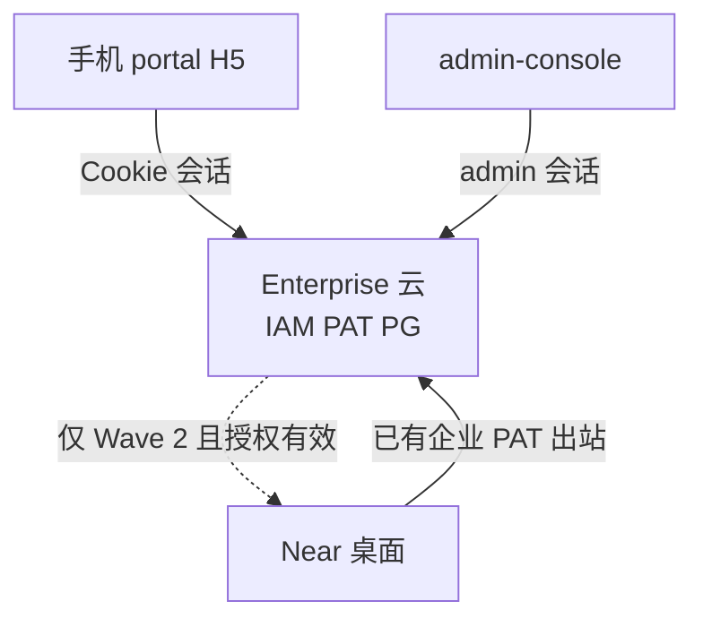
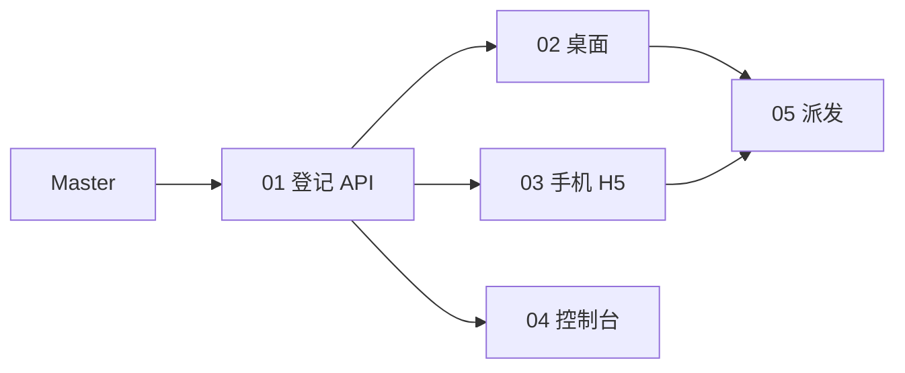

# 手机控制本机：总规划（Master）

Planned-with: cursor-grok-4.6
Suggested-Impl-Model: 见第 8 节表；本文件是 Master，禁止直接当实施清单开干。

**文档类型：** Master Plan（北极星、分层、波次、设计宪法、可衍生子规划）。  
**不是：** 可执行 implementation plan。每个 Wave 必须再读对应 subplan，移到 `.cursor/plans/` 根目录后再开工。

**Goal:** 同一企业账号下，手机（web-portal H5）能选任务跑在「云」还是「我的电脑」；桌面 Near 先授权、可防休眠、底栏显示手机连接态；admin-console 能看见设备与授权。跨设备只同步对话与 AI 产物，不把整盘镜像到云。

**Architecture:** 云是真相源。手机与桌面都连 Enterprise（IAM + PG）。桌面用已有企业 PAT **出站**心跳/接任务。手机从不直连 `127.0.0.1` 上的 `agx serve`。Wave 1 只做到「能看见、能授权、能选宿主」；选「我的电脑」发消息必须诚实拦截。Wave 2 才把任务派到本机 session。

---

## 0. 本文件怎么用

| 角色 | 用法 |
|---|---|
| 产品 / 架构 | 用第 1–5 节对齐做什么、不做什么 |
| 规划模型 | 用第 8 节衍生；不要在本文件里加客户名或外部产品名 |
| 实施模型（Grok 4.6） | **只执行已移到 `.cursor/plans/` 根目录的 subplan**；每个 UI subplan 开头必须先读第 5 节指定的 skill |

**衍生规则：**

1. 一个 subplan 不得跨两个 Wave 的验收门槛。
2. 标题 / 正文 / 文件名不得出现客户名、客户路径、外部产品名或「对齐 X / X-style」。
3. 禁止顺手改 `agenticx/studio/server.py` 的 import 区、admin 无关页、Desktop 聊天内核。
4. 禁止把 `packaging/edge-agent` 空壳说成已闭环；本能力走 **已登录企业账号的 Desktop + portal API**。
5. 禁止复用或改语义：`desktop_device_auth`（那是桌面登录设备码）、`RunModePicker`（那是 ask / allowlist / auto 权限档，不是执行宿主）。

开始实施时：把**当前 Wave 的那一个** subplan 从 `pending/` 移到 `.cursor/plans/`，再开分支。Master 可与首个 subplan 一起提交。

---

## 1. 北极星与非目标

### 1.1 用户能看见什么（终态）

1. 手机打开 portal：登录后可聊；输入区能选「云」或「我的电脑」（在线绿点）。
2. 桌面设置两开关：允许手机控制这台电脑（默认 180 天、可访问已创建任务的目录）；保持电脑唤醒（复用现成防休眠）。
3. 桌面侧栏底栏出现「手机」状态丸：授权有效且云上认为桌面在线时点亮。
4. 控制台「设备」页：桌面 / 手机、在线、授权到期、可吊销。
5. 选「我的电脑」且授权有效、桌面在线时，任务在那台 Near 的 session 执行，产物回写云，手机能看进度。

### 1.2 三刀（Wave）

| Wave | 名称 | 用户可验收 | 对应 subplan |
|---|---|---|---|
| 1 | 能看见 | 授权、心跳、宿主选择、后台列表；电脑宿主**不能**真跑任务 | 01–04 |
| 2 | 能遥控 | 选「我的电脑」后任务在桌面执行并回写 | 05 |
| 3 | 像产品 | 扫码安装体、多电脑、目录沙箱收紧、PWA/套壳 | **本 Master 不拆实施 subplan** |

### 1.3 明确不做（Master 级 Out of scope）

| 不做 | 原因 |
|---|---|
| 原生 iOS / 安卓 / React Native / Flutter | Wave 1–2 用 portal H5 |
| 手机直连本机 `agx serve` / 局域网房间页 | 已作废；4G 与合盖不可用 |
| 把 Gateway 改成 Agent 宿主 | 网关只做模型合规与计量 |
| 把 Desktop 本地 `messages.json` 全量灌进云 | 跨设备只同步 portal 已落库的对话与产物 |
| Work / Code 双 Tab、云 IDE | 另一条产品线 |
| 改 `packaging/edge-agent` 空壳顶替 Desktop | 诚实完成度 |
| admin-console 做成运维 AgenticOps 控制台 | 与 AgenticOps Master 分离 |
| 在 commit / PR 里写外部产品名 | 仓库约定 |

---

## 2. 目标架构



**两条铁律：**

1. **房间与个人聊天的真相源在云。** 电脑关机，手机仍能打开云会话。
2. **执行宿主显式。** 默认 `cloud`。只有用户选「我的电脑」且存在未过期授权、桌面 `last_seen_at` 在阈值内，才派发。手机从不假装自己是 runtime。

### 2.1 和现仓的边界

| 现成 | 用法 | 不要做的事 |
|---|---|---|
| `desktop_device_auth` + `/api/desktop/auth/*` | 桌面登录企业账号、拿 PAT | 不要改状态机、不要当「允许被手机控制」 |
| `resolveDesktopIdentity`（`enterprise/apps/web-portal/src/lib/desktop-auth.ts`） | Desktop API 鉴权 | 新 edge API 复用它，不要另造 token |
| `automation.prevent_sleep` + `PreventSleepToggle` | 保持唤醒 | 不要重写 powerSaveBlocker；抽共用组件 |
| portal 聊天落 PG | 跨设备对话 | 不要把 Desktop 本地 session 当云真相源 |
| `AuditClientType` | Wave 1 聊天仍记 `web-portal` | Wave 1 不要为了手机改审计写入路径 |
| `RunModePicker` | 权限档 | **禁止**改成云/本机选择器 |
| `packaging/edge-agent` | 忽略 | 禁止在本能力里改它 |

### 2.2 新对象（只在 01 建表）

- `enterprise_edge_devices`：一台桌面或一只手机在某租户某用户下的登记。
- `enterprise_edge_grants`：用户允许「手机控制某台桌面」，默认 180 天，可吊销。
- Wave 2 另表 `enterprise_edge_jobs`（见 05），Wave 1 禁止建任务派发表「先备着」。

在线定义（写死，禁止各端自己发明）：

```
ONLINE_AFTER_MS = 45_000
heartbeat 间隔 = 20_000
online = last_seen_at >= now() - 45s
```

---

## 3. Wave 1 诚实行为（实施者必须遵守）

宿主偏好可落 `localStorage` 键 `agx-edge-host-v1`，值只能是：

- `cloud`
- `computer:<deviceId>`

当值为 `computer:*` 时，`MachiChatView` 的 `handleSend` **必须 return**，并在输入区与消息列表之间展示主视区居中黄条（已有 warning Alert 样式）：

> 本机执行通道尚未开通，请改选云端后再发送。

禁止静默改回云端发送。禁止假装已派到电脑。

---

## 4. 安全与数据范围

面向用户的唯一解释文案（三端同一句，禁止发挥）：

> 为支持跨设备访问，仅对话内容和 AI 生成的产物会存到云端。

授权文案（桌面开关副标题）：

> 允许访问已创建任务的文件夹。有效期 180 天。

Wave 1 不实现目录 ACL 强制；`folder_scope` 列固定写 `created_tasks`，只展示。Wave 2 派发时再把工作区限制写进 job。

吊销立即生效：`grants.status = revoked` 或 `expires_at < now` 后，手机列表该电脑不得显示为「可控制」，桌面底栏药丸熄灭。

---

## 5. 设计宪法（所有 UI subplan 强制）

实施任何桌面 / portal / admin 界面前，**按顺序读完**这些 skill，并在该 subplan 的 PR/自测里写一行 Design Read。禁止把营销落地页规则套到产品 UI。

| 顺序 | 路径 | 用它做什么 | 明确不用它做什么 |
|---|---|---|---|
| 1 | `.agents/skills/redesign-existing-projects/SKILL.md` | 先审计再改；沿用现有 token / 图标族 / 圆角 | 不要换肤、不要新调色板 |
| 2 | `.agents/skills/emil-design-eng/SKILL.md` | 开关、药丸、sheet、时长、origin-aware、`:active` | 不要给高频控件加 >300ms 动画 |
| 3 | `.agents/skills/apple-design/SKILL.md` | 手机 sheet、safe-area、弹簧、可打断、按压即反馈 | 不要做落地页 hero / bento |
| 4 | `.agents/skills/design-taste-frontend/SKILL.md` | 只取：反 slop、对比度、shape lock、reduced-motion、禁止 AI 紫光 | **禁止**落地页 hero / 三等分卡片 / Inter 换字体 / 新图标库 |
| 5 | `.agents/skills/improve-animations/STANDARDS.md`（若存在）或 emil 时长表 | 核对 easing / duration | 不要做动画大扫除 |

**Design Read（写进每个 UI 文件头注释或 PR 说明，一字不改）：**

> Reading this as: enterprise B2B product UI, redesign-preserve, existing indigo/violet OKLCH tokens + lucide-react, Apple sheet/spring on phone, Emil polish on switches and pills.

**Dials（产品 UI，覆盖 taste-skill 营销默认值）：**

- `DESIGN_VARIANCE: 3`
- `MOTION_INTENSITY: 4`
- `VISUAL_DENSITY: 5`（桌面 / admin）/ `4`（手机聊天）

**Token 锁：**

- Portal / admin：只准用 `@agenticx/ui` 与 `enterprise/packages/ui/src/themes/base.css` 的 semantic token（`bg-background`、`text-muted-foreground`、`bg-primary`、`border-border`、`bg-sidebar`）。
- Desktop：只准用现有 `--ui-btn-primary-*`、`--text-strong`、`--text-muted`、`bg-surface-card`、`border-border`。开关视觉抄 `desktop/src/components/automation/AutomationTab.tsx` 的 `PreventSleepToggle`（约 L56–86）。
- 图标：继续 `lucide-react`。禁止新装 Phosphor / Hugeicons。
- 禁止新增青蓝硬编码、禁止外发光、禁止 `transition: all`、禁止入场 `scale(0)`（从 `scale(0.96)` + `opacity: 0`）。
- 三态主题必须可看：portal `system/light/dark`；Desktop `dark/dim/light`。

**Motion 锁（抄进组件）：**

| 元素 | 时长 | 曲线 | 备注 |
|---|---|---|---|
| 按钮 `:active` | 100–160ms | `ease-out` / `scale(0.97)` | pointer-down 就给反馈 |
| 药丸 / 小 popover | 125–200ms | `cubic-bezier(0.23, 1, 0.32, 1)` | origin 对着触发器 |
| 手机宿主 sheet | 200–320ms | Apple drawer：damping 0.8 / response 0.3，或 `cubic-bezier(0.32, 0.72, 0, 1)` | 手势可打断；reduced-motion 改为 160ms 淡入 |
| 开关滑块 | 200ms | `ease-out` | 已有 PreventSleepToggle 一致 |
| 键盘打开设置 | 0ms | 无 | 禁止为键盘切 tab 做动画 |

**文案锁：**

- 用户可见中文。英文 locale 必须同步 `messages/en.json`。
- 禁止 em dash 字符（`—` / `–`）出现在 UI 字符串里，用普通连字符 `-`。
- 取消关联用「移除」，删数据用「删除」。
- 产品名用 Near / AgenticX Enterprise，不要写外部品牌。

**验收视口（03 强制真机或浏览器）：**

- 390×844（iPhone 逻辑宽）与 360×800（安卓常见）
- 软键盘顶起后输入区仍可见（`100dvh` + `env(safe-area-inset-bottom)`）
- 桌面 1440 不得被手机改动破坏

---

## 6. 质量门槛（给 Grok 4.6）

每个 subplan 必须让实施者**不看本对话**也能做完。本 Master 再强调一次：

1. 只改 subplan「In scope」列出的路径。
2. 先写失败测试再写实现（TDD）。测试文件名写在该 FR 的 AC 里。
3. 改了 `server.py` 才需要冷启动 `agx serve`；本能力默认不改该文件。
4. UI 做完必须用浏览器或 Desktop 窗口走主路径，不能只靠截图。
5. 声称完成后必须列出改动文件。若仓库无 diff，视为未完成。
6. commit 须用户明确要求才做；trailer 只用 `Plan-Id` / `Plan-File` / `Plan-Model` / `Impl-Model` / `Made-with: Damon Li`。

---

## 7. 风险与诚实缺口

| 缺口 | 现状 | Wave |
|---|---|---|
| 设备登记表 | 没有；只有登录用 `desktop_device_auth` | 1 / 01 |
| 桌面出站心跳 | 企业登录后只 bootstrap 模型，无 presence | 1 / 02 |
| 手机窄屏聊天 | 侧栏抽屉已有，设置双栏与输入区未按手机收 | 1 / 03 |
| admin 设备页 | 无 | 1 / 04 |
| 本机任务派发 | 无；Desktop 仍是本地 runtime | 2 / 05 |
| 目录 ACL | 无 | 2 末 / Wave 3 |

---

## 8. 子规划与推荐实施模型

用户指定本批由 **Grok 4.6** 实施。下表「推荐」即该模型；理由供换人时对照。

| 子规划 | 文件 | Wave | Suggested-Impl-Model | 理由 |
|---|---|---|---|---|
| 01 设备登记与授权 API | `2026-09-07-mobile-edge-01-device-registry.plan.md` | 1 | cursor-grok-4.6-xhigh-fast | 表 + 服务 + 路由，无视觉 |
| 02 桌面开关与底栏药丸 | `2026-09-07-mobile-edge-02-desktop-control-chrome.plan.md` | 1 | cursor-grok-4.6-xhigh-fast | Electron + 现有设置体系；设计 skill 补审美 |
| 03 portal 手机 H5 + 宿主选择 | `2026-09-07-mobile-edge-03-portal-mobile-h5.plan.md` | 1 | cursor-grok-4.6-xhigh-fast | 视觉最重；必须先读第 5 节全部 skill |
| 04 控制台设备页 | `2026-09-07-mobile-edge-04-admin-device-fleet.plan.md` | 1 | cursor-grok-4.6-xhigh-fast | 对齐现有 admin Data/Card 页 |
| 05 本机派发 | `2026-09-07-mobile-edge-05-desktop-dispatch.plan.md` | 2 | cursor-grok-4.6-xhigh-fast | 序列敏感；01–04 全绿才能开工 |

**依赖：**



02 / 03 / 04 在 01 合并后可并行。05 禁止抢跑。

---

## 9. Wave 1 总验收（四份子计划都绿才算 Wave 1 完成）

1. 未登录企业账号的 Desktop：新设置页开关禁用，底栏无「手机」药丸。
2. 登录后打开「允许手机控制这台电脑」：PG 有 `active` grant，`expires_at` 约 180 天后；底栏药丸亮（需心跳已上报）。
3. 关开关或过期：药丸灭；portal 该电脑不可选为可控制宿主。
4. 手机 390 宽：能登录、发一条云对话、打开宿主 sheet、选电脑后发送被黄条拦住。
5. admin 设备页能看到该桌面与授权到期日，吊销后手机侧 5s 内不可再选。
6. 自动化「抑制系统睡眠」仍可用；新页「保持电脑唤醒」与它读写同一 `automation.prevent_sleep`。

Wave 2 验收见 05，不在此重复。
