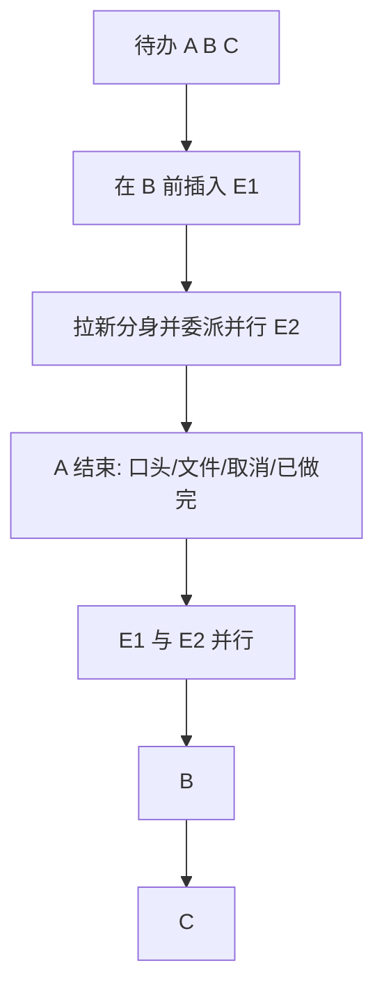

# Near 群待办板：口头结案、合并列表、插队与并行

Planned-with: Cursor Grok 4.6
Suggested-Impl-Model: 见文末「子规划 → 推荐模型」表。本文件是 **Master Plan**，禁止直接当实施清单改代码。

**文档类型：** Master Plan（定模型、改前一波「只认文件 / 两栏分列」的决策、切分 3 个子规划）。  
**不是：** 可执行 implementation plan。实施时只执行已从本文件拆出、且已移到 `.cursor/plans/` 根目录的 subplan。

**Parent：** `.cursor/plans/2026-09-06-near-ai-native-team-work-objects.plan.md`（01–03 已落地）。本文件**修正**其中两条：

| 旧决策（01–03） | 本波次 |
|---|---|
| `submit` 必须有群工作区文件，口头回复不算交付 | 口头完成 / 已做完 / 取消都是合法结案；文件只是其中一种 |
| 群窗格「待办」与「事项」分栏，SessionTodoList 保持不动 | **群窗格**合成一张「待办」板；1:1 窗格的 SessionTodoList **不改** |
| `blocked_by` 要等前置 **accepted** 才放行 | 前置 **已结束**（submitted / accepted / cancelled）即可放行下一件 |
| 点「创建」只落盘，必须再 @ 才开工 | 前置结束后，系统自动对就绪负责人发一轮开工消息（子规划 03） |

**Goal:** 群工作区里只有一张活着的队列：Near 规划出 A、B、C 之后，人可以把事项 E1 插到 B 前面、把新分身拉进群并行做 E2；A 结束后自动开 E1∥E2，再做 B、C。结案可以是文件、口头、已做完或取消。

---

## 0. 本文件怎么用

| 角色 | 用法 |
|---|---|
| 产品 | 用第 1–3 节对齐「什么叫做完、列表长什么样、插队/并行怎么走」 |
| 规划模型 | 用第 7 节衍生/修订子计划；子计划必须达到「Composer 2.5 不看对话也能落地」 |
| 实施模型 | **不要**拿本文件改代码；按 01 → 02 → 03 执行已移到 `.cursor/plans/` 根目录的 subplan |

**衍生规则：**

1. 本波次只允许 **3** 个子计划，禁止再拆第 4 份。
2. 标题/正文/文件名不得出现客户名；commit/PR 不得写第三方品牌对标。
3. 触碰 `agenticx/studio/server.py` 只能在现有 work-items handler 段精确插入，禁止整段替换 import。
4. 禁止改 `desktop/electron/main.ts`、`enterprise/`、1:1 窗格 `SessionTodoList` 行为。

---

## 1. 用户要的现象（验收剧本）

用群「小团」这类已有 2+ 分身的群，不要用 1:1。

1. **口头也能结。** 事项「翻译英文：…」进行中，北辰只在群里回了一句译文。人在待办行点「口头完成」→ 变成待验收；再点「验收」→ 已验收。**不要求**写出 md。
2. **可以取消 / 已做完。** 待开始或进行中的行可点「取消」（不必做了）或「已做完」（人认定不用再跑）。后续事项不再被它挡住。
3. **一栏待办。** 群摘要不再上下两截「待办 0」+「事项 3」。只剩一栏「待办」，进行中的行写成 `北辰 · 翻译英文：…`。
4. **插队。** Near 规划出 A、B、C 之后，人在 B 上方插入 E1（指定负责人）。顺序变成 A → E1 → B → C。
5. **并行加人。** 资源不够时，从下拉把群外分身拉进群，并在 E1 同档再委派 E2。A 结束后 E1 与 E2 **同时**开工，都结束后才到 B、C。



---

## 2. 机制定型（照抄）

### M1 · 群窗格的「待办」= 事项板

磁盘权威仍是 `~/.agenticx/groups/<gid>/work_items.json`。  
群窗格摘要**只渲染这一栏**。`todo_write` 在群会话里写出的 A/B/C，由 03 **提升**为事项（`origin=plan`），匹配键为规范化标题；已有分身负责的事项不得被同步覆盖或删掉。

1:1 窗格：`SessionTodoList` + `todo_write` 原样，本波次一行不改。

### M2 · 四种结案，文件只是一种

| 人的动作 | `status` | `close_kind` | 后继能否开跑 |
|---|---|---|---|
| 写出群工作区文件（已有） | submitted | `artifact` | 能 |
| 口头完成 | submitted | `verbal` | 能 |
| 已做完（人认定） | accepted | `already_done` | 能 |
| 取消 / 不必做 | cancelled | `cancelled` | 能（跳过） |
| 人点验收（仅 submitted） | accepted | 保持原 `close_kind` | 能 |

`accepted` 仍只有人能写（已做完 / 验收）。模型不能 accept。

### M3 · 后继放行看「结束」不看「验收章」

`blockers_released(item)`：每个 `blocked_by` 的状态 ∈ `{submitted, accepted, cancelled}`。  
`paused` / `open` / `in_progress` 仍挡住。  
UI 文案从「前置未验收」改为「前置未结束」。

### M4 · 顺序用 `sort_key` + `blocked_by`，并行=同前置

- `sort_key`：整数，创建默认 `max+10`。插入 E1 到 B 前：取 A 与 B 的中点；冲突则整表按 10、20、30… 重排。
- 插到 B 前：`E1.blocked_by = 原 B.blocked_by`（通常是 `[A]`）；`B.blocked_by` 改为含 `E1`（并集已有并行项）。
- 与 E1 并行的 E2：`E2.blocked_by = E1.blocked_by`；所有「紧后项」（原 blocked_by 含 E1 的，如 B）把 E2 并进 `blocked_by`。

### M5 · 开工仍走群聊，但可以由板触发

不新造后台执行器。就绪项（`open` 且 `blockers_released` 且负责人是分身/Near）由 Desktop 发**一条**群消息，正文带 `@负责人` + 事项标题，复用现有 `/api/chat` 群路由。`_run_one_target` 里已有的 `mark_in_progress` 负责改状态。禁止对同一组就绪 id 连发两次（前端 `lastKickoffKey`）。

### M6 · 拉人进群是创建事项的附带动作

创建时若 `owner_kind=avatar` 且 id 不在 `group.avatar_ids`：先 `GroupChatRegistry.update_group` 追加成员，再写入事项。Desktop 下拉 = 用户 / Near / 本群成员 / **未入群分身（标注「拉进群」）**。

---

## 3. 数据契约增量（01–03 共用，禁止各写一套）

在 01 已有字段上**只加**这些（不得改名）：

```json
{
  "close_kind": "",
  "sort_key": 10,
  "origin": "manual"
}
```

| 字段 | 规则 |
|---|---|
| `close_kind` | `""` / `artifact` / `verbal` / `already_done` / `cancelled` |
| `sort_key` | int，列表按它升序，再按 `created_at` |
| `origin` | `manual`（人/Near 工具创建）/ `plan`（群会话 `todo_write` 提升）。03 才写 `plan` |

**新增合法迁移（相对 01 表）：**

```text
open        → accepted     （仅 close_kind=already_done，人 REST）
in_progress → accepted     （仅 close_kind=already_done，人 REST）
open | in_progress | submitted → cancelled
in_progress → submitted    （允许 artifact_paths 为空，close_kind=verbal|artifact）
```

旧迁移（pause / resume / 验收 submitted→accepted）保留。

---

## 4. 明确不做

| 不做 | 原因 |
|---|---|
| 改 1:1 `SessionTodoList` / StickyTaskBar 语义 | 群板问题，不要拖单聊 |
| 把每条群闲聊变成事项 | 闲聊仍是闲聊；只有 `todo_write` 与人点创建才入板 |
| 新执行引擎 / 队列 worker | 开工复用群路由 |
| 多真人账号、房间、OKR | 已有独立规划 |
| 改 `electron/main.ts`、`server.py` import 区 | 回归面 |
| 自动 accept | 验收仍是人的章；「已做完」是人显式点的 |

---

## 5. 子规划切分

| 顺序 | 文件 | 交付 | 依赖 |
|---|---|---|---|
| 01 | `2026-09-07-near-group-board-01-close-kinds.plan.md` | `close_kind` / `sort_key`、口头完成/已做完/取消 REST、行内按钮、后继看「结束」 | 01–03 work-objects 已在主干 |
| 02 | `2026-09-07-near-group-board-02-unified-ui.plan.md` | 群窗格合并为一栏待办、`{名} · {题}`、插入位置、拉进群并委派、创建只列/可拉成员 | 必须先合 01 |
| 03 | `2026-09-07-near-group-board-03-sequence-kickoff.plan.md` | 群 `todo_write` 提升为 plan 事项、插队/并行重绑 `blocked_by`、前置结束后自动 @ 开工 | 必须先合 01+02 |

---

## 6. 与现有代码的关系

| 已有 | 关系 |
|---|---|
| `agenticx/runtime/work_items.py` | 加字段与 `close` / `blockers_released`；`submit_owner_delivery` 补 `close_kind=artifact` |
| `agenticx/studio/server.py` L6565–6693 | 只在 work-items 段加 `POST .../close`；create 接受 `insert_before_id` / `parallel_with_id` / `ensure_member` |
| `desktop/src/components/work-panel/GroupWorkItemList.tsx` | 01 加按钮；02 改成板或替换为 `GroupBoardList` |
| `desktop/src/components/work-panel/WorkPanel.tsx` L2209–2230 | 02 群窗格去掉独立「事项」Section，待办 Section 改渲染板 |
| `desktop/src/components/work-panel/SessionTodoList.tsx` | **群窗格不再挂它**；文件保留给 1:1 |
| `agenticx/cli/agent_tools.py` `_tool_todo_write` L6627 | 03 在 update 成功后若 `avatar_id` 以 `group:` 开头则 sync |
| `desktop/src/components/ChatPane.tsx` `sendChat` L8994 | 03 从 WorkPanel 回传一条开工文案，走现有发送 |

---

## 7. 子规划 → 推荐模型

| 子规划 | Suggested-Impl-Model | 理由 |
|---|---|---|
| 01 结案种类 | Composer 2.5 | 状态机 + REST + 行内按钮，落点清楚 |
| 02 合并 UI | Composer 2.5 | 复用现有 token / Section，不做视觉重塑 |
| 03 提升与开工 | gpt-5.5-codex | `todo_write` 同步 + `blocked_by` 重绑 + 防重复开工，序列敏感 |

最终 `Impl-Model` trailer 以实际使用为准，由用户确认。
