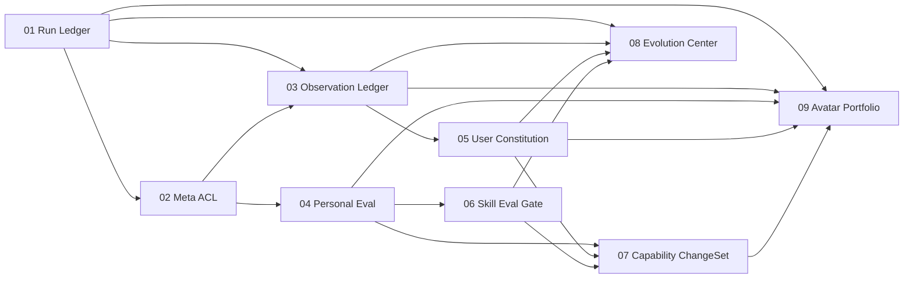

# Near Personal Agent Control Plane 主计划

Planned-with: GPT-5.6 Sol
Suggested-Impl-Model: 按子计划选择；默认 cursor-grok-4.6-xhigh-fast
Plan-Id: 2026-09-09-near-personal-agent-control-plane-master
Source: `research/codedeepresearch/deepseek-harness/deepseek-harness_near_strategy_2026-09-08.md`

> **For implementer:** 本文件只负责执行编排，不允许据此一次性实现所有功能。每次只将一个子计划从 `.cursor/plans/pending/` 移到 `.cursor/plans/` 根目录，按其 TDD/验收完成并通过 Go/No-Go 后，才开始下一项。使用 executing-plans；不要 commit，除非用户明确要求。

**Goal:** 将 Near 建成围绕单一用户持续观察、验证、治理数字专家与可逆进化的 Personal Agent Control Plane，而不是只提供可修改的 Agent Harness。

**Architecture:** 先统一运行事实与跨主体权限，再建设只存摘要和证据指针的观察账本；随后补齐行为级 Personal Eval、结构化用户宪法、技能晋级门禁与跨组件可逆 ChangeSet；最后才聚合 Desktop 演进中心并开放人工批准的 Avatar Portfolio MVP。每一层都必须能单独停用、回退和验收。

**Tech Stack:** AgenticX Python runtime、FastAPI Studio、SQLite/JSONL/Markdown、React/Zustand/Electron、pytest/Vitest。

---

## 1. 战略判定

Near 的差异化不应是“组件更容易热替换”，而是回答四个问题：

1. **为谁而变：** 结构化 User Constitution，而非一段不可追溯的 preference 文本。
2. **根据什么证据变：** Meta-only Observation Ledger，保留 provenance、scope、confidence、sensitivity。
3. **变完是否真的更好：** 用户私有 baseline/candidate replay 与联合质量、成本、延迟、安全门禁。
4. **失败如何撤销：** Skill/Prompt/Tool Policy 的事务式 ChangeSet 与 Avatar lineage rollback。

---

## 2. 全局范围

### In scope

- 委派运行状态的唯一可信账本。
- Meta-only 与 avatar-scoped 强制 ACL。
- 跨分身增量观察账本与 Meta digest。
- 人工选题的 Personal Eval MVP。
- 用户宪法/偏好图的版本、来源、冲突、撤销。
- Skill proposal 的行为评测门禁。
- Skill + Prompt + Tool Policy 的 ChangeSet v1。
- Desktop 演进中心对真实数据的聚合。
- Avatar Portfolio 人工 proposal/candidate/approve/rollback。

### Out of scope

- 自动 merge/split/retire 数字专家。
- 无人值守自动晋级或全量生产 canary。
- 完整网络沙箱、跨主机隔离或多副本 HA。
- 模型权重训练、RL、自动生成训练集。
- Memory、Model、MCP、Hook、Group 成员的 ChangeSet。
- Enterprise 前后台、网关策略、移动端。
- Desktop 视觉系统重构。

---

## 3. 子计划清单

| 顺序 | Plan | 交付 | 依赖 | 规模 | 推荐模型 |
|---|---|---|---|---|---|
| 01 | `2026-09-09-near-personal-control-01-run-ledger.plan.md` | 统一 spawn/delegate run SoT | 无 | M | Grok 4.6 |
| 02 | `2026-09-09-near-personal-control-02-meta-acl.plan.md` | Meta-only / avatar-scoped 强制边界 | 01 | S–M | Grok 4.6 |
| 03 | `2026-09-09-near-personal-control-03-observation-ledger.plan.md` | append-only 观察账本 + cursor + digest | 01, 02 | M–L | Grok 4.6 |
| 04 | `2026-09-09-near-personal-control-04-personal-eval.plan.md` | Session→Case、read-only replay、paired compare | 02 | L | Grok 4.6 |
| 05 | `2026-09-09-near-personal-control-05-user-constitution.plan.md` | 宪法节点、编译视图、迁移与撤销 | 03 | L | Grok 4.6 |
| 06 | `2026-09-09-near-personal-control-06-skill-eval-gate.plan.md` | Skill proposal 行为评测后再批准 | 04 | M | Grok 4.6 |
| 07 | `2026-09-09-near-personal-control-07-capability-changeset.plan.md` | Skill/Prompt/Policy 事务激活回滚 | 04, 05, 06 | XL/高风险 | GPT-5.6 Sol 或同级强推理 |
| 08 | `2026-09-09-near-personal-control-08-evolution-center.plan.md` | Desktop 委派证据、健康度、真实待审聚合 | 01, 03, 05, 06 | M | Grok 4.6；机械 UI 可用便宜模型 |
| 09 | `2026-09-09-near-personal-control-09-avatar-portfolio.plan.md` | proposal→candidate→approve→rollback lineage | 01, 03, 04, 05, 07 | XL/高风险 | GPT-5.6 Sol 或同级强推理 |

所有文件位于 `.cursor/plans/pending/`。开始某项前将该文件移到 `.cursor/plans/`，并把其 `Parent-Plan` 保持指向本 master。

---

## 4. 依赖图

并行规则：

- 01 完成后，02 是下一硬门禁。
- 02 完成后，03 与 04 可并行，但必须用独立分支/工作树，禁止同时编辑同一工作区。
- 05 与 06 分别在 03/04 后可并行。
- 07 必须等待 04+05+06。
- 08 可在 05+06 后与 07 并行；不得接假 API。
- 09 永远最后。

---

## 5. 成本优先执行波次

### Wave 0：先修控制面事实与权限（01–02）

**预算目标：** 约 1–2 个中型 PR。

输出：

- 冷启动后仍可查询的 canonical run ledger。
- `session_search`、Observation、跨 workspace 等能力有强制主体边界。

Go 条件：

- owner session 隔离测试全部通过。
- 分身无法获得跨主体 session 内容。
- `agx serve` 冷启动与核心 API 200。

No-Go：

- 仍需依赖 chat_history/scratchpad 才能找运行状态。
- ACL 只能靠 prompt 约束。

### Wave 1：证明“持续看见”和“变得更好”（03–04）

**预算目标：** 2 个中大型后端 PR；可并行。

输出：

- Meta 以 cursor 增量读取摘要事件，不注入原始全量对话。
- 20–50 个手工用例可做 baseline/candidate read-only replay。

Go 条件：

- Ledger provenance、visibility、sensitivity、cursor 有测试。
- Eval 对同一用例成对输出质量/轨迹/token/延迟/安全结果。
- replay 不污染用户 session，写工具被 policy 拦截。

No-Go：

- 无法稳定复现同一 case。
- 把文件只读隔离宣传成完整网络沙箱。
- Observation 记录原始 secret/PII。

### Wave 2：形成用户对齐与技能晋级闭环（05–06）

**预算目标：** 2 个中型 PR。

输出：

- 用户显式指令、边界、风格与推断偏好可版本化、撤销、按主体编译。
- Skill proposal 必须先展示行为 Eval，再允许批准。

Go 条件：

- USER.md/localStorage 兼容迁移幂等。
- revoke 后 prompt 不再包含条目。
- candidate 未通过行为门禁时不可普通 approve；人工 override 有明确审计。

No-Go：

- 直接自动把推断偏好提升为全局 Directive。
- 继续把文本 keyword benchmark 称为行为评测。

### Wave 3：可逆变更与用户可见治理（07–08）

**预算目标：** 07 为高风险 XL，08 为中型 UI；先做 07 后端，也可让 08 先接已稳定的数据源。

输出：

- Skill/Prompt/Tool Policy 的 immutable artifacts、before snapshot、atomic current pointer、rollback。
- Desktop 演进中心聚合证据、健康度与真实待审项目。

Go 条件：

- 任一 adapter 激活失败，current 保持旧值且其他组件恢复。
- Desktop 三态主题、中文、无 mock 成功态。

No-Go：

- 事务失败留下部分组件生效。
- 07 跨入 Model/Memory/Avatar/Group。

### Wave 4：Avatar Portfolio MVP（09）

**预算目标：** 单独高风险 XL PR。

输出：

- 只读绩效建议。
- candidate fork + lineage。
- 人工 approve/activate + rollback。

Go 条件：

- proposal 创建绝不修改 `avatar.yaml`/`group.yaml`。
- 激活前 Eval pass + 用户批准。
- rollback 恢复旧配置，历史 lineage 不丢。

No-Go：

- 自动 merge/split/retire。
- 自动修改群成员。
- 默认替换当前分身。

---

## 6. 模型与成本分配

### Grok 4.6 适用

- 单模块 schema/store/resolver。
- 明确接口下的 REST/CLI 接线。
- TDD 测试、i18n、现有 UI 组件组合。
- 计划 01–06、08 的主体实现。

### 可用更便宜模型

- i18n key 和 parity 测试。
- Settings Tab 注册、纯类型扩展。
- 已定义 API 的列表/空态 UI。
- 文档与固定 fixture。

便宜模型不得独立负责：

- owner/subject ACL。
- replay safety policy。
- current pointer 原子切换。
- rollback 事务。
- Avatar activate/lineage。

### 强推理模型保留项

- 07 ChangeSet 收口与故障注入验证。
- 09 Avatar Portfolio activate/rollback。
- 跨 3 个以上 subsystem 的最终 code review。

---

## 7. 每个子计划的统一实施协议

1. 移动当前子计划到 `.cursor/plans/`，不要一次移动多个。
2. 新建独立分支；工作区有大量未提交变更时优先 worktree。
3. 只读确认函数锚点；行号漂移时按符号定位。
4. 每个 FR：先写失败测试 → 确认失败原因 → 最小实现 → 局部绿测。
5. 不允许把下一计划的 schema/空壳提前塞进当前 PR。
6. 修改 `agenticx/studio/server.py` 时禁止大块替换 import，且必须冷启动验证核心 API。
7. 修改 Desktop Electron 主进程时必须完整重启；仅渲染层则跑对应 Vitest/typecheck。
8. 完成后记录测试命令与真实输出；未运行不得写“通过”。
9. 只有用户明确要求时才 commit；提交只暂存当前 plan 与当前任务文件。
10. commit trailer 由用户提供实际 `Impl-Model`，禁止猜测。

---

## 8. 系列验收指标

| 维度 | MVP 可验收定义 |
|---|---|
| 可观察 | Meta 可按 cursor 拉取新增事件，重启后不丢、不重复 |
| 隔离 | avatar/group 不能读取未授权跨主体 session/ledger |
| 可解释 | 每个进化建议引用 session/message/run/eval report |
| 可评测 | baseline/candidate 在同一 case、同一 policy 下成对比较 |
| 可控成本 | token 与 latency delta 是晋级门禁，不只是展示项 |
| 可撤销 | Skill/Prompt/Policy 与 avatar candidate 均有 previous snapshot |
| 用户主权 | inferred preference 默认 pending，显式 user directive 优先 |
| 不刷屏 | 过程事件聚合进折叠卡/演进中心，不生成逐工具群聊气泡 |

---

## 9. 最低可停止点

如果预算有限，可在任一 Go 门禁后停止：

- **只做 01–02：** 先得到可信且安全的 Meta 控制面。
- **做到 04：** 已能证明某个候选是否在个人任务上更好，是最关键差异化 MVP。
- **做到 06：** 形成 Skill 自进化的第一个真实闭环，建议作为首个公开里程碑。
- **做到 08：** 用户能理解、批准、回滚演进，是完整产品化 MVP。
- **09：** 属于第二阶段壁垒，不应压缩前述质量门禁来抢进度。

推荐成本终点：**先完成 01–06，依据真实 Eval 数据决定是否投入 07–09。**
