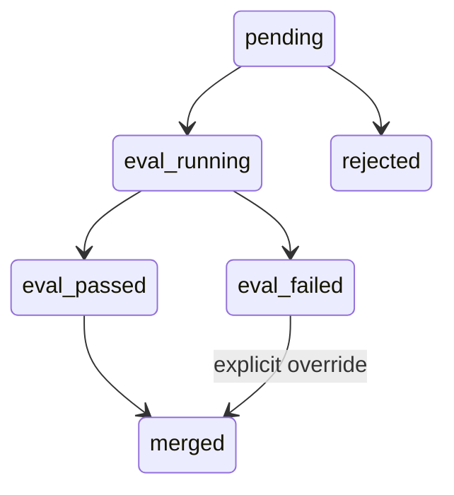

# 子计划 06：Skill 行为评测晋级门禁

Planned-with: GPT-5.6 Sol
Suggested-Impl-Model: cursor-grok-4.6-xhigh-fast
Parent-Plan: `.cursor/plans/pending/2026-09-09-near-personal-agent-control-plane-master.plan.md`
Depends-on: `2026-09-09-near-personal-control-04-personal-eval`
Plan-Id: 2026-09-09-near-personal-control-06-skill-eval-gate

> **For implementer:** 使用 executing-plans。仅把 Personal Eval 接入 Skill proposal；不要在本计划抽象跨组件 ChangeSet。

**Goal:** Skill candidate 必须通过用户私有行为 replay 后才允许批准，文本 benchmark 与文档质量只作为 pre-flight/辅助信号。

**Architecture:** 扩展 proposal 状态和报告引用；eval endpoint 调 Personal Eval baseline/candidate；approve 默认要求 passed，用户 override 必须显式理由和审计。保留现有 guard、pending queue、snapshot/rollback。

**Tech Stack:** pending_queue、skill_quality_gate、Personal Eval、FastAPI、React existing pending list、pytest/Vitest。

## 根因

- `drift_detector._case_hits` 扫 Skill Markdown 文本，甚至把 benchmark input 当成正文必须包含的字符串；不是行为测试。
- `skill_quality_gate.evaluate()` 运行路径零调用，`quality_gate_min_score` 是死配置。
- `pending_queue.approve()` 只做 guard/discoverable，未验证真实任务效果。
- patch 有 snapshot/rollback，create/approve 的版本覆盖仍不完整。

## In scope

- quality gate pre-flight 接线。
- proposal eval 状态、运行、报告、批准拦截与审计 override。
- PendingProposalsList 展示 baseline/candidate 摘要。

## Out of scope

- ChangeSet、自动 approve、自动生成 EvalSet、Avatar/Prompt/Policy。
- 删除 benchmark.yaml；它保留为辅助信号。

## Proposal schema 扩展

```json
{
  "eval_status": "pending|running|passed|failed|skipped",
  "eval_report_id": null,
  "eval_scores": {"baseline": 0, "candidate": 0, "delta": 0},
  "eval_block_reason": "",
  "override": {"actor": "", "reason": "", "at": ""}
}
```

## FR-06-1：文档质量 pre-flight

**Files:**
- Modify: `agenticx/skills/pending_queue.py`
- Modify: `agenticx/cli/agent_tools.py::_write_skill_md_with_checks`
- Modify: `agenticx/learning/skill_quality_gate.py`（仅必要兼容）
- Modify: `tests/test_smoke_hermes_agent_quality_gate.py`

要求：create/patch/approve 都调用 `evaluate()` + `quality_gate_min_score`；guard/size 仍是硬门禁；质量分不足进入 proposal failed/preflight_blocked，不替代行为 eval。

## FR-06-2：Skill proposal replay adapter

**Files:**
- Create: `agenticx/evaluation/skill_proposal_eval.py`
- Create: `tests/test_personal_eval_skill_proposal.py`

接口：

```python
async def evaluate_skill_proposal(proposal_id: str, evalset_name: str) -> EvalRunSummary: ...
```

baseline=当前 live SKILL.md；candidate=proposal SKILL.md。两者同 EvalSet、model、policy、case 顺序；variant overlay 只能改变目标 skill 内容。报告写 Personal Eval run store，并回写 proposal 原子 JSON。

**AC:** baseline/candidate 真正读取不同内容；failed/error 仍保存 report；不能修改 live skill。

## FR-06-3：批准状态机

**Files:**
- Modify: `agenticx/skills/pending_queue.py::approve/reject/list_pending`
- Create: `tests/test_pending_queue_eval_gate.py`
- Modify: `tests/test_pending_queue.py`

状态：



要求：
- enabled 时仅 eval_passed 可普通 approve。
- failed/running/missing report 返回 `eval_blocked`，目录保留。
- override 需 `actor + non-empty reason`，写 proposal 审计和 Observation Ledger。
- approve 前保存当前 skill snapshot；guard/apply 失败恢复旧内容。

## FR-06-4：REST

**Files:**
- Modify: `agenticx/studio/server.py` 技能 proposal 路由邻近区域
- Modify: `tests/test_pending_queue_eval_gate.py` 或新增 API 测试

新增：
- `POST /api/skills/proposals/{id}/eval`
- `GET /api/skills/proposals/{id}/eval`
- approve body 可选 `override_reason`，后端仍验证。

禁止编辑 `server.py` 顶部 import 区；用局部 import 或已有模块导入方式。

## FR-06-5：Desktop 待审卡

**Files:**
- Modify: `desktop/src/components/settings/skills/PendingProposalsList.tsx`
- Add: `desktop/src/components/settings/skills/PendingProposalsList.test.tsx`
- Modify: `desktop/locales/zh/settings.json` 与英文 parity

展示 eval 状态、baseline/candidate/delta、block reason、打开报告；running/failed 时普通批准禁用。override 使用主题 ConfirmDialog，失败保留弹窗并展示底层错误。不得显示假分数。

## 验证

```bash
pytest \
  tests/test_smoke_hermes_agent_quality_gate.py \
  tests/test_personal_eval_skill_proposal.py \
  tests/test_pending_queue_eval_gate.py \
  tests/test_pending_queue.py -q
cd desktop && npm test -- --run PendingProposalsList
```

并执行 `server.py` 冷启动核心 API 200 验收。

## 停止条件

- EvalSet 不足时显示“缺少代表性用例”，不得自动通过。
- Personal Eval 运行错误视为 blocked，不得降级只看 drift score。
- 不新增 current pointer；交给计划 07。
