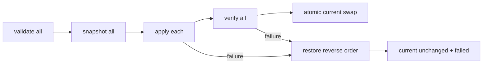

# 子计划 07：Reversible Capability ChangeSet v1

Planned-with: GPT-5.6 Sol
Suggested-Impl-Model: gpt-5.6-sol-medium
Parent-Plan: `.cursor/plans/pending/2026-09-09-near-personal-agent-control-plane-master.plan.md`
Depends-on: `2026-09-09-near-personal-control-04-personal-eval`, `2026-09-09-near-personal-control-05-user-constitution`, `2026-09-09-near-personal-control-06-skill-eval-gate`
Plan-Id: 2026-09-09-near-personal-control-07-capability-changeset

> **For implementer:** 高风险事务计划。使用 executing-plans，并在每个 adapter 后做故障注入。v1 只允许 Skill、Prompt Overlay、Tool Policy Snapshot。

**Goal:** 把多个能力变更包装为先评测、后人工批准、原子激活、任一步失败自动恢复、可显式回滚的事务。

**Architecture:** ChangeSet store 保存 immutable artifacts 与状态机；各 adapter 实现 snapshot/stage/apply/verify/restore；全局 `current.json` 只在所有组件验证成功后原子替换。Personal Eval report 是批准前置，不由 ChangeSet 自行跑生产任务。

**Tech Stack:** Python、Pydantic、atomic file replace、Skill versions、Constitution evidence、Tool Policy、pytest。

## In scope

- `skill`、`prompt`、`tool_policy` 三种 component。
- draft→evaluating→approved→activating→active/failed→rolled_back。
- before/after snapshot、current pointer、故障恢复、审计事件。

## Out of scope

- Model、Memory、Avatar、Group、Hook、MCP、Enterprise policy。
- 自动批准、百分比 canary、多进程分布式事务。
- 直接修改 Python 源码 prompt；Prompt 组件只允许 runtime overlay artifact。

## 存储契约

```json
{
  "changeset_id": "uuid",
  "status": "draft|evaluating|approved|activating|active|failed|rolled_back",
  "motivation": "...",
  "evidence_refs": ["observation:...", "constitution:...", "eval-report:..."],
  "components": [
    {"kind":"skill","target":"name","artifact_id":"..."},
    {"kind":"prompt","target":"meta.system.overlay","artifact_id":"..."},
    {"kind":"tool_policy","target":"default","artifact_id":"..."}
  ],
  "eval_report_id": "...",
  "before_snapshot_id": null,
  "after_snapshot_id": null,
  "error": null,
  "schema_version": 1
}
```

路径：
- `~/.agenticx/capability/changesets/<id>/manifest.json`
- `.../artifacts/<artifact_id>`
- `.../snapshots/<snapshot_id>/`
- `~/.agenticx/capability/current.json`

current 必须用同目录临时文件 + fsync + `os.replace`。

## FR-07-1：类型与 Store

**Files:**
- Create: `agenticx/capability/changeset/types.py`
- Create: `agenticx/capability/changeset/store.py`
- Create: package `__init__.py`
- Test: `tests/test_changeset_store.py`

**AC:** 合法状态迁移表强制；artifact 内容 hash；manifest 原子写；重启恢复；active artifact immutable；非法路径 traversal 拒绝。

## FR-07-2：Adapter protocol

**Files:**
- Create: `agenticx/capability/changeset/adapters/base.py`
- Create: `.../skill.py`, `.../prompt.py`, `.../tool_policy.py`
- Test: `tests/test_changeset_adapters.py`

协议：

```python
class ChangeAdapter(Protocol):
    def validate(self, component, artifact) -> None: ...
    def snapshot(self, component, destination) -> dict: ...
    def apply(self, component, artifact) -> None: ...
    def verify(self, component, artifact) -> None: ...
    def restore(self, component, snapshot) -> None: ...
```

要求：
- Skill 复用 guard、quality gate、`skill_versions.save_snapshot`。
- Prompt 只写 `~/.agenticx/capability/prompts/` overlay，不改 `meta_agent.py`。
- Tool Policy 用可序列化 CategoryPolicy snapshot，未知 category fail closed。

## FR-07-3：事务激活

**Files:**
- Create: `agenticx/capability/changeset/activate.py`
- Create: `tests/test_changeset_activate_rollback.py`

顺序：



**AC:** 对每个 adapter 的 validate/apply/verify 注入异常；任何失败 current byte-for-byte 不变；已 apply 组件逆序恢复；rollback 自身失败保留双重错误并标记 `manual_recovery_required`，不得伪报成功。

## FR-07-4：Eval 与批准门禁

**Files:**
- Create: `agenticx/capability/changeset/service.py`
- Test: `tests/test_changeset_eval_gate.py`

要求：
- approve 需要存在且 `promotion_allowed=true` 的 report。
- report 的 candidate artifact hashes 必须与 ChangeSet artifacts 一致，防止评测 A、激活 B。
- User Constitution Boundary 冲突阻断；仅用户显式 override 可继续，并审计。
- approve 与 activate 分离。

## FR-07-5：Runtime current 读取

**Files:**
- Modify: Skill loader、Meta prompt builder、Tool policy builder 的最窄读取入口
- Test: `tests/test_changeset_runtime_current.py`

要求：
- current 缺失时完全回退现有行为。
- 读取一次 snapshot 后用于整轮，不能 mid-turn 混版本。
- current 损坏时拒绝新 overlay 并记录错误，不破坏原配置。

## FR-07-6：API/CLI

**Files:**
- Create: `agenticx/cli/changeset_commands.py`
- Modify: `agenticx/studio/server.py` 新增局部路由
- Test: `tests/test_changeset_api.py`

命令/API：create/get/list/approve/activate/rollback；activate/rollback 必须明确确认。REST 错误返回具体失败 component/stage。

## 验证

```bash
pytest \
  tests/test_changeset_store.py \
  tests/test_changeset_adapters.py \
  tests/test_changeset_activate_rollback.py \
  tests/test_changeset_eval_gate.py \
  tests/test_changeset_runtime_current.py \
  tests/test_changeset_api.py \
  tests/test_pending_queue_eval_gate.py -q
```

改 `server.py` 后冷启动核心 API；另做 kill/restart 后 current 与 active manifest 一致性检查。

## 强制 Review Gate

实施完成后必须由强推理模型或人工审查：
- 原子写/fsync/恢复顺序。
- artifact hash 与 eval report 绑定。
- 每轮版本一致性。
- policy 回滚是否真正恢复。

任一项无法证明，计划状态不得标记完成。
