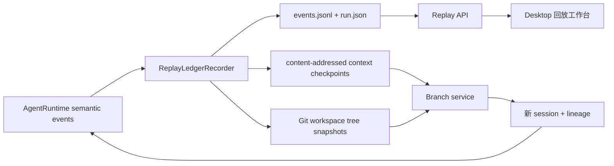

# 长程任务回放与安全节点分叉：主规划

Planned-with: gpt-5.6-sol-medium

Suggested-Impl-Model: gpt-5.6-sol-medium

Status: pending

Plan-Id: 2026-09-10-long-run-replay-branching-master

## Goal

为 Near / AgenticX 增加一套面向长程任务的权威运行账本：用户可以在任务结束后按真实顺序回放消息、轮次、工具、确认、子智能体、错误与产物；也可以选择历史工具节点，在不重新执行前缀工具的前提下，从该节点之前最近的稳定状态创建一个新会话并输入不同指令继续。

本规划优先交付两项最显性的用户收益：

1. **看得见：** 一个可拖动、可暂停、可筛选、可展开详情、可复制结构化回顾的只读回放工作台。
2. **改得动：** 在工具调用 101 上选择“从此前分叉”时，恢复工具结果 100 之后的模型上下文与代码工作区状态，在新会话中用新指令继续。

## Product contract

### 回放

- 回放是只读投影，绝不重新调用 LLM、工具、MCP、浏览器、命令或外部 API。
- 回放顺序由持久化的全局单调 `seq` 决定，不依赖前端收到 SSE 的时机。
- 不逐 token 落盘。文本播放根据 `assistant_output_started` / `assistant_output_completed` 的时间范围做视觉动画，避免长回答产生数万条事件。
- 回放展示已对用户可见的 reasoning 文本；不额外抓取或暴露 provider 隐藏推理。
- “复制回顾”生成确定性的 Markdown 摘要，不调用模型；默认对常见密钥字段做脱敏。

### 分叉

- 分叉不是重新执行前 100 个工具，而是加载稳定检查点并从那里继续。
- 稳定检查点只出现在：
  - 用户输入持久化完成后；
  - 一批 assistant tool calls 的全部 tool results 已配对完成后；
  - confirmation / clarification 已响应并写回上下文后；
  - FINAL 已持久化后。
- 若用户选中工具调用 101，后端解析到调用 101 之前最近的稳定检查点，通常是工具结果 100 之后；原工具调用 101 及其结果不进入新分支。
- 分支总是创建新 session。源 session、源 run、源事件和源工作区保持只读，不原地截断。
- 新分支重建当前版本的 system prompt 与安全策略；复制历史的 provider-ready context，但不复用旧 system prompt 正文。运行记录保存旧 system prompt 的哈希，明确这属于“语义续跑”，不是 bit-exact 模型复现。
- 没有可验证工作区快照时禁止宣称“完整分叉”。API 返回明确不可分叉原因，Desktop 禁用主按钮。
- 外部世界不可回滚。分支弹层必须列出此前出现过的外部写入或未知副作用工具，并明确“这些外部操作不会被撤销”。

## Why the current code is insufficient

1. `agenticx/runtime/checkpoint.py::AgentCheckpoint` 只保存当前 turn 的 `round_idx`、未决 tool calls 与 confirm state，用于崩溃恢复；正常完成后会清除，不能支持历史回放和任意节点分叉。
2. `agenticx/runtime/events.py::RuntimeEvent` 只有 `type/data/agent_id`，没有 durable event id、全局序号、时间、run/turn/parent 关联、重放完整性或 branch checkpoint 引用。
3. `agenticx/studio/session_manager.py::fork_session`（约 L1606–1625）只复制“当前时刻”的完整 chat/context，不支持历史边界，也不保存 lineage。
4. `agenticx/runtime/subagent_runs/store.py::SubAgentRunStore` 的活动日志只覆盖子智能体，详情是有损摘要，超过 500 条会截断，且根路径硬编码为本机目录。
5. `agenticx/observability/trajectory.py` 是旧 callback 体系里的内存对象，没有接入 Studio `AgentRuntime` 的权威持久化；禁止把它改造成第二条并行真相源。
6. `desktop/src/components/graph/ExecutionTimeline.tsx` 只从当前 Graph Zustand 状态派生工具时长；刷新或重启后没有完整历史事件。
7. `agenticx/runtime/isolate_run.py` 已提供每次任务的 git worktree 隔离，但没有每个工具稳定边界的 workspace tree 快照。

## Relationship to existing plans

本系列不替代 2026-09-09 Personal Agent Control Plane，必须遵守以下边界：

- `2026-09-09-near-personal-control-01-run-ledger` 的 `SubAgentRunStore` 继续是 spawn/delegate 身份、状态、activity、artifact 的唯一真相源。本系列的 Replay Ledger 只记录 Studio 主 turn 的可回放语义事件；子智能体详情通过 `source_tool_call_id -> SubAgentRunStore.run_id` 嵌套投影，禁止复制第二份 sub-agent `RunRecord`。
- `2026-09-09-near-personal-control-03-observation-ledger` 是只存摘要、provenance、visibility、sensitivity 与 evidence refs 的 Meta 学习账本。本系列保存本机回放所需的详细事件和 payload；不得把详细 Replay Ledger 直接注入 Meta prompt。
- `2026-09-09-near-personal-control-04-personal-eval` 的 `ReplayRunner` 会在 read-only policy 下重新执行 baseline/candidate case。本系列的“回放”只做历史可视化，绝不执行工具。UI、API 和文档必须分别使用“执行回放”和“评测重跑”，避免同名误导。
- `2026-05-29-live-sse-reattach-per-session-event-bus` 的 SessionEventHub 只负责进行中会话的 bounded live reattach。本系列负责跨重启持久历史，不能把内存 ring buffer 当归档。
- `2026-08-11-execution-timeline-and-members-workbench-tab` 的 `ExecutionTimeline` 保留为 live 甘特视图。本系列复用同一个 WorkPanel timeline tab，但必须保留 live run 的工具跨度体验，不能删除现有 span 派生与测试。

执行顺序新增硬依赖：先完成 `2026-09-09-near-personal-control-01-run-ledger`，再开始本系列 01；Personal Control 03/04 与本系列没有代码级阻塞，但实施时必须按上述职责隔离。

## Chosen architecture

采用 **append-only Run Ledger + content-addressed checkpoints + replay projection + immutable branch lineage**。

拒绝以下替代方案：

- **仅从 `messages.json` 生成回放：** 缺 round start、等待确认、失败重试、子智能体状态、精确时序；compaction 后也无法恢复当时模型看到的上下文。
- **直接复用 OTel / trace：** Collector 是可选组件，span 可能采样或缺边，不能作为本机分叉的权威数据。
- **直接扩展 `ExecutionTrajectory`：** 当前 Studio runtime 未接线，会产生第二套事件协议与双写漂移。
- **第一期实现 CRIU / 进程内存快照：** 与用户最先需要的“过程可见 + 改指令续跑”不成比例；进程、Socket 与外部世界也不能可靠复制。

## Data flow



## Storage layout

本地第一期的唯一落点：

```text
~/.agenticx/sessions/<session_id>/runs/
  index.json
  <run_id>/
    run.json
    events.jsonl
    blobs/
      <sha256>.json.gz
    checkpoints/
      <sha256>.json.gz
```

Git 工作区内容不重复复制到上述目录。每个 workspace checkpoint 保存：

- `repo_root`
- `source_worktree`
- `base_sha`
- `tree_oid`
- `snapshot_ref`
- `changed_paths`
- `branchable`
- `unbranchable_reason`

Git object 由私有 ref `refs/agenticx/replay/<session_id>/<run_id>/<seq>` 固定，避免 `git gc` 清除。删除 session 或明确删除 run 时同步删除这些私有 refs；不运行 `git gc`。

## Frozen contracts

### `ReplayRunRecord`

新增 `agenticx/runtime/replay_ledger/contracts.py`：

```python
@dataclass
class ReplayRunRecord:
    run_id: str
    session_id: str
    turn_id: str
    agent_id: str
    status: str
    created_at: float
    updated_at: float
    completed_at: float | None = None
    parent_run_id: str | None = None
    forked_from_event_id: str | None = None
    forked_from_seq: int | None = None
    provider: str | None = None
    model: str | None = None
    event_count: int = 0
    last_seq: int = 0
    completeness: str = "complete"  # complete | partial
    gap_reason: str | None = None
    schema_version: int = 1
```

### `RunEvent`

```python
@dataclass
class RunEvent:
    event_id: str
    run_id: str
    session_id: str
    turn_id: str
    seq: int
    ts: float
    type: str
    agent_id: str
    round_idx: int | None = None
    tool_call_id: str | None = None
    parent_event_id: str | None = None
    title: str = ""
    summary: str = ""
    payload: dict[str, Any] = field(default_factory=dict)
    payload_ref: str | None = None
    checkpoint_ref: str | None = None
    workspace_ref: str | None = None
    effect_class: str = "none"  # none | read | local_write | external_write | unknown
    branchable: bool = False
    unbranchable_reason: str | None = None
    schema_version: int = 1
```

事件类型白名单：

- `run_started`
- `user_message`
- `round_started`
- `assistant_output_started`
- `assistant_output_completed`
- `tool_call`
- `tool_progress`
- `tool_result`
- `confirm_required`
- `confirm_response`
- `clarification_required`
- `clarification_response`
- `subagent_started`
- `subagent_progress`
- `subagent_checkpoint`
- `subagent_completed`
- `subagent_error`
- `compaction`
- `context_stats`
- `stall`
- `error`
- `artifact`
- `run_completed`
- `ledger_gap`

### `ContextCheckpoint`

```python
@dataclass
class ContextCheckpoint:
    checkpoint_id: str
    session_id: str
    run_id: str
    event_id: str
    seq: int
    created_at: float
    agent_messages: list[dict[str, Any]]
    chat_history: list[dict[str, Any]]
    context_files: dict[str, Any]
    taskspaces: list[dict[str, Any]]
    active_taskspace_id: str | None
    scratchpad: dict[str, Any]
    artifacts: dict[str, Any]
    todos: list[dict[str, Any]]
    provider: str | None
    model: str | None
    session_mode: str
    system_prompt_hash: str
    workspace_ref: str | None
    branchable: bool
    unbranchable_reason: str | None
    schema_version: int = 1
```

`agent_messages` 写入前必须经过 `agenticx.runtime.agent_runtime._sanitize_context_messages`；检查点中不得保存未配对的 assistant tool call。

## Event normalization rules

- `RuntimeEvent.TOKEN` 不直接 append；recorder 只记录输出开始时间，最终从 `FINAL.data.text/reasoning` 写一个 `assistant_output_completed`。
- `TOOL_CALL` 保存完整参数到 `payload_ref`，JSONL 只保留工具名、参数摘要和关联 id。
- `TOOL_RESULT` 保存完整结果到 `payload_ref`，JSONL 只保留状态、长度、哈希与 500 字符预览。
- `ROUND_START` 写 `round_idx`。
- `CONFIRM_*`、`CLARIFICATION_*` 保存用户可见问题和结果，但 export 默认脱敏敏感字段。
- 主 ledger 只保存触发 spawn/delegate 的 parent tool call。子智能体事件从 canonical `SubAgentRunStore` 按 `source_tool_call_id` 嵌套读取，以独立 lane 展示并保留自己的局部 seq；不得伪造为主 ledger 的全局 branch seq。
- 任何 append 或 checkpoint 写入失败都不得中断原任务；将 `run.completeness` 标为 `partial`。只要 checkpoint 前存在 gap，该 checkpoint 及后续事件均不可分叉。

## Side-effect classification

新增 `agenticx/runtime/replay_ledger/effects.py`，不得散落在 UI：

- 纯读取工具：`read`
- `file_write`、`file_edit`、在隔离 worktree 内确认成功的 `bash_exec`：`local_write`
- 发布、发消息、提交远端、日历、审批、外部 API 写入：`external_write`
- 无法静态判断的 `mcp_call`、Computer Use、通用 `bash_exec`：`unknown`
- LLM、round、final 等：`none`

优先复用 `agenticx/runtime/command_safety.py::assess_command` 的 findings；禁止复制一份命令风险字典。

## Workspace snapshot boundary

第一期只支持满足以下全部条件的代码工作区：

1. session 有 `isolate_run.py` 管理的独立 git worktree；
2. 只有一个可写 Git 根；
3. `git status --porcelain=v1 -z` 可成功读取；
4. 没有路径命中现有 secret / credential deny 规则；
5. 没有单文件超过计划常量 `MAX_SNAPSHOT_FILE_BYTES = 20 * 1024 * 1024`；
6. 没有 submodule dirty 状态。

快照必须使用临时 index，不得改变用户或 isolate worktree 的 index：

```text
GIT_INDEX_FILE=<temp> git read-tree <base_sha>
GIT_INDEX_FILE=<temp> git add -A -- .
GIT_INDEX_FILE=<temp> git write-tree
git commit-tree <tree_oid> -p <base_sha>
git update-ref refs/agenticx/replay/<sid>/<run>/<seq> <snapshot_commit>
```

恢复到新 isolate worktree：

```text
git worktree add -b agx-branch/<sid8>-<run8>-<seq> <dest> <base_sha>
git read-tree --reset -u <tree_oid>
git reset --mixed <base_sha>
```

以上命令只允许在新建的 isolate worktree 执行。不得对用户原始 checkout 执行 reset、checkout 或 clean。

## API surface

新文件 `agenticx/studio/run_replay_routes.py` 注册：

- `GET /api/runs?session_id=<sid>`
- `GET /api/runs/{run_id}`
- `GET /api/runs/{run_id}/events?after_seq=<n>&limit=<1..500>&types=<csv>`
- `GET /api/runs/{run_id}/export?format=markdown|json&redact=true`
- `POST /api/runs/{run_id}/branches`

`POST /branches` body：

```json
{
  "source_event_id": "evt-...",
  "instruction": "换一种实现方式，使用新的工具继续",
  "provider": "optional",
  "model": "optional"
}
```

成功返回：

```json
{
  "ok": true,
  "session_id": "new-session-id",
  "source_run_id": "run-id",
  "source_event_id": "requested-event",
  "resolved_checkpoint_event_id": "stable-event",
  "resolved_checkpoint_seq": 100,
  "warnings": ["external_effects_not_rolled_back"]
}
```

错误语义：

- `404 run_not_found`
- `404 event_not_found`
- `409 run_incomplete`
- `409 no_stable_checkpoint`
- `409 workspace_not_branchable`
- `409 source_session_running`
- `422 instruction_required`

禁止返回模糊 `fork failed`。

## Desktop experience

回放作为 session 级右侧面板，与 History / Graph 同级互斥：

- 顶栏使用播放圆形图标，tooltip「执行回放」。
- 面板顶部显示任务状态、持续时间、总轮次、工具数、错误数、分支数。
- 中部为多 lane 时间线：Meta、各分身/子智能体独立一行；工具、等待确认、错误、产物使用有限语义色。
- 底部为事件详情：输入、参数、结果、产物、耗时、模型、token、side-effect 标签。
- 控制条：播放/暂停、上一步/下一步、拖动进度、`0.5× / 1× / 2× / 即时`、事件筛选。
- “复制回顾”复制确定性 Markdown。
- 事件行在 `branchable=true` 时显示“从此前分叉”；不可分叉时 hover/详情显示具体原因。

分叉弹层必须包含：

- 原任务与所选步骤；
- 实际恢复的稳定步骤；
- “不会重新执行此前 N 个工具”；
- 工作区恢复状态；
- 外部副作用警告；
- 新指令输入框；
- 可选 provider/model；
- 主按钮「创建分支并继续」。

创建成功后立即打开新 pane，展示只读 lineage card，再通过现有发送链路发出新指令。若发送失败，新 session 保留，输入框保留原指令并显示就近错误。

## Subplans and recommended implementation models

1. `.cursor/plans/pending/2026-09-10-long-run-replay-01-event-ledger.plan.md`
   - Suggested-Impl-Model: `gpt-5.6-sol-medium`
   - 原因：事件顺序、成对 tool calls、崩溃容错和持久化一致性属于高回归风险路径。
2. `.cursor/plans/pending/2026-09-10-long-run-replay-02-desktop-replay.plan.md`
   - Suggested-Impl-Model: `cursor-grok-4.6-xhigh-fast`
   - 原因：主要难点是长时间线的信息密度、交互层级和视觉可读性。
3. `.cursor/plans/pending/2026-09-10-long-run-replay-03-safe-step-branch.plan.md`
   - Suggested-Impl-Model: `gpt-5.6-sol-medium`
   - 原因：模型上下文合法性、Git tree 恢复、不可逆副作用与 lineage 需要强一致性推理。

必须按 01 → 02 → 03 顺序实施。01 和 02 完成后即可独立发布“只读回放”；03 不得反向阻塞前两项的显性收益。

## In scope

- Desktop / Studio 主会话、分身会话的语义事件账本，以及对子智能体 canonical activity 的只读嵌套投影。
- 已完成和执行中的 run 只读回放。
- 确定性 Markdown / JSON 导出。
- 稳定节点逻辑上下文 checkpoint。
- 受控 Git isolate workspace checkpoint。
- 从历史节点创建新 session 并继续。
- lineage 在源 run、新 run、源 session、新 session 中双向可查。

## Out of scope

- CRIU、容器内存、进程、PTY、TCP/WebSocket 的 checkpoint/restore。
- 重新执行整条历史轨迹。
- 撤销邮件、GitHub、飞书、审批、支付、浏览器等外部副作用。
- 非 Git 工作区的字节级目录快照。
- 从未完成 tool call 中间、token 中间或 pending confirm 中间分叉。
- 对已有历史 session 伪造完整事件。旧会话只显示“可生成消息摘要，但无完整运行账本”，不得假装可回放。
- Enterprise portal/admin-console。
- 自动比较多个分支并选优。
- 修改 Orchard 或引入 Orchard 运行依赖。

## Global acceptance criteria

- 新任务执行 100 次工具后，重启 Desktop 仍能按 `seq=1..N` 完整读取语义事件，不出现重复或乱序。
- 拖动回放到工具 101 不触发任何后端执行调用。
- 选择工具 101 分叉时，新 session 的第一轮 LLM 上下文只含稳定前缀；不存在未配对 assistant tool call。
- 源 session 和源 isolate worktree 内容不变。
- Git 分支恢复后，工作树字节状态与 checkpoint 的 `tree_oid` 一致，且历史中不出现用户可见的合成 commit。
- ledger 有 gap、非 Git workspace、危险未捕获路径、dirty submodule 时分叉按钮禁用并显示确定原因。
- 分支执行仍经过现有权限确认、command sandbox、tool allowlist 和 hooks；不得因“历史分叉”绕过安全策略。
- 删除 session 会删除其 run ledger 与私有 Git refs，但不执行 `git gc`。
- 修改 `agenticx/studio/server.py` 后必须冷启动 `agx serve`，并验证 `/api/session`、`/api/avatars`、`/api/sessions` 与新增 `/api/runs` 均返回预期状态。

## No-scope-creep boundary

- 不把 replay 事件混入聊天气泡；回放是独立右侧面板。
- 不重写现有 `GraphRunStore`、`SubAgentRunStore` 或 OTel。
- 不顺手迁移全部 SessionStorageBackend 到 SQL。
- 不修改 Enterprise。
- 不把 run ledger 失败升级为任务失败。
- 不声称逻辑 checkpoint 等于完整状态化沙箱。
