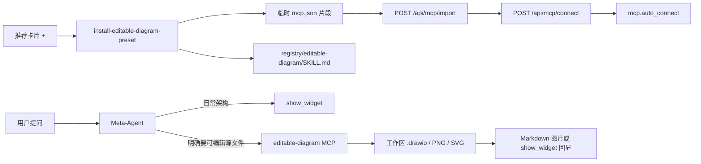

# 可选可编辑架构图 MCP

Planned-with: Cursor Grok 4.6
Suggested-Impl-Model: Composer 2.5
Plan-Id: 2026-09-11-near-editable-diagram-mcp

> **For implementer:** 只改本文件列出的符号。禁止改 `show_widget` 渲染、禁止做气泡内 Mermaid 增量编辑、禁止把第三方画布嵌进 Desktop、禁止改 `server.py` 顶部 import 区、禁止往 `_DEFAULT_MCP_ENTRIES` 塞默认项。不要 commit，除非用户明确要求。

**Goal:** 用户可在设置 → 技能市场「官方推荐」一键安装可选 MCP：对话里仍用 `show_widget` 出图；只有明确要可编辑源文件时，才用 MCP 导出 `.drawio` / PNG / SVG。

**Architecture:** 不新起 Studio 路由。主进程把一份本地 MCP JSON 片段交给已有 `POST /api/mcp/import`，再 `POST /api/mcp/connect`（connect 已会 `append_mcp_auto_connect_name`）。同时把技能说明写到 `~/.agenticx/skills/registry/editable-diagram/SKILL.md`。Meta 系统提示加两行分流，避免「架构必须 show_widget」把 MCP 打死。

**Tech Stack:** 现有 Electron IPC、`import_mcp_config`、`connectMcp`、推荐技能卡片、pytest / vitest。运行时依赖本机 `npx`（与 firecrawl 同类，不内嵌 Node）。

---

## In scope

- 推荐技能卡片 `editable-diagram`（第三方 / 架构可视化 / `cta: install`）
- 主进程 IPC `install-editable-diagram-preset`：写 MCP + 写 SKILL.md + import + connect
- 卡片就近 toast；已安装显示「已添加」、去掉 `+`
- Meta 系统提示两处各加 **同一段** 分流（见 FR-4），不改 `show_widget` 工具定义
- 中英文案；commit / PR / UI 主名称用「可编辑架构图」，不写第三方产品名

## Out of scope

- 聊天气泡里对同一张 Mermaid / SVG 做增量改图
- 嵌第三方 Next.js 画布、iframe `embed.diagrams.net`、改 Desktop 聊天布局
- 把该 MCP 写入 `_DEFAULT_MCP_ENTRIES`（会变成全员默认，不是可选）
- 改 `agenticx/studio/server.py` 任何现有路由或 import
- 企业 portal / admin-console
- 为该 MCP 做云厂商图标库、PDF 复刻、版本历史（上游 MCP 自带，Near 不重做）

## 根因与证据

用户要的是「可编辑 `.drawio` 交付物」，不是再做一套聊天气泡画图。

Near 已有：

- `show_widget`：`agenticx/cli/agent_tools.py` 约 L2095–2133，强制 Mermaid/SVG 气泡出图
- Meta 硬纪律：`agenticx/runtime/prompts/meta_agent.py` `_build_widget_capability_block` 约 L730–745，以及「输出要求」约 L960–962
- 推荐技能安装：`desktop/src/data/recommended-skills.ts` 的 Archscribe / OfficeCLI，点 `+` 后走 Meta 对话装技能
- MCP 写入：`agenticx/cli/studio_mcp.py` `import_mcp_config` 约 L592–654 → `~/.agenticx/mcp.json`
- MCP 连接并记 `auto_connect`：`agenticx/studio/server.py` `POST /api/mcp/connect` 约 L5054–5119（成功路径调用 `append_mcp_auto_connect_name`）
- 市场安装后刷新：`SettingsPanel.tsx` `handleInstallMarketplaceMcp` 约 L6761–6802

上游 MCP（`npx -y @next-ai-drawio/mcp-server@latest`）本身 **不生成图**：`create_new_diagram` 要求调用方提供 draw.io XML。Near 的 Meta 负责吐 XML；MCP 负责预览会话与导出文件。预览在系统浏览器，不进气泡。

若不改 Meta 硬纪律，装了 MCP 也不会被用：架构类问题会被强制 `show_widget`。



---

## 现状锚点

| 符号 | 路径 | 约行 |
|---|---|---|
| 推荐列表 | `desktop/src/data/recommended-skills.ts` `RECOMMENDED_SKILLS` L36–94 | 在 `archscribe` 后插入一条 |
| 安装分发 | `desktop/src/components/SettingsPanel.tsx` `onRecommendedSkillInstall` L2938–2947 | 增加 `editable-diagram` 分支，**不要**走 `runInstallPromptInMetaAgent` |
| 推荐卡片 | 同文件 L3563–3641 | `+` 在已安装时改为绿点「已添加」 |
| 技能刷新 | 同文件 `reloadSkillsAfterMarketInstall` L2877–2893 | 安装成功后调用 |
| MCP 刷新 | 同文件 `onRefreshMcp` / `sessionId` props L4914–4918 | 安装成功后 `onRefreshMcp(sessionId)` |
| 市场 toast | 同文件 `mcpMarketplaceStatus` L6775–6790 | 推荐区复用同一套就近 status，或技能区已有 `skillhubMsg`（装失败必须留在设置页并显示原因） |
| IPC import | `desktop/electron/main.ts` `import-mcp-config` L10170–10191 | **在其后插入**新 handler，禁止整段替换相邻代码 |
| preload | `desktop/electron/preload.ts` L511–512 附近 | 只追加一行方法 |
| 类型 | `desktop/src/global.d.ts` `importMcpConfig` L1034–1041 附近 | 只追加方法类型 |
| 连接 | `desktop/electron/main.ts` `connect-mcp` L10193 | 新 handler 内部 `fetch` 同一 URL，不要改旧 handler |
| 默认 MCP | `agenticx/cli/studio_mcp.py` `_DEFAULT_MCP_ENTRIES` L95–110 | **禁止改** |
| Widget 纪律 | `agenticx/runtime/prompts/meta_agent.py` L730–745 与 L960–962 | 各追加同一分流段 |
| 中文案 | `desktop/locales/zh/settings.json` `skills.recommended` L603–624 | 加 `editable-diagram` |
| 英文案 | `desktop/locales/en/settings.json` 对等位置 | 加 `editable-diagram` |
| 图标 | `desktop/src/assets/recommended/` | 新增 `editable-diagram.svg` |
| 种子测试 | `tests/test_studio_mcp_default_seed.py` | **不要**把本 MCP 加进默认种子断言 |

`SettingsPanel` 已有 `sessionId`、`mcpServers`、`onRefreshMcp`。安装必须用当前设置页 session，禁止为此新建聊天窗格。

---

## FR-1：推荐卡片与文案

**Files:**

- Modify: `desktop/src/data/recommended-skills.ts`
- Modify: `desktop/locales/zh/settings.json`
- Modify: `desktop/locales/en/settings.json`
- Create: `desktop/src/assets/recommended/editable-diagram.svg`
- Test: `desktop/src/data/recommended-skills.test.ts`（新建）

### 列表项（插在 `archscribe` 对象之后）

```ts
  {
    id: "editable-diagram",
    name: "可编辑架构图",
    provider: "community",
    description:
      "需要可继续改的架构/流程图源文件时使用；日常对话出图仍走内置图表。点安装后写入本机 MCP 并添加第三方技能说明。",
    icon_src: editableDiagramIcon,
    official_url: "https://www.npmjs.com/package/@next-ai-drawio/mcp-server",
    category: "架构可视化",
    tier: "third_party",
    cta: "install",
  },
```

`official_url` 只给卡片「了解来源」用，安装路径禁止打开该页、禁止让用户去公网演示站填 Key。

### i18n（必须）

`skills.recommended.editable-diagram.category` = `架构可视化` / `Architecture visuals`

`skills.recommended.editable-diagram.description` = 与上面 `description` 同义的中/英，**不要**写第三方产品名、不要写 GitHub star、不要写「对齐某某」。

另加（技能区 toast 用，可放 `skills.` 下）：

- `skills.editableDiagram.installing` = `正在安装可编辑架构图…`
- `skills.editableDiagram.installed` = `已添加`
- `skills.editableDiagram.installOk` = `已添加可编辑架构图。日常架构图仍在对话里出图；需要源文件时再说「导出可编辑架构图」。`
- `skills.editableDiagram.installFailed` = `安装失败：{{reason}}`
- `skills.editableDiagram.npxMissing` = `已写入配置，但本机找不到 npx。请安装 Node.js 并保证终端能运行 npx 后，到 MCP 页打开开关。`

### 图标

128×128，圆角方底、节点+连线，**只用黑白灰**（不要 Archscribe 那套青/紫/粉）。`recommended-skills.ts` 用 `import editableDiagramIcon from "../assets/recommended/editable-diagram.svg"`。

### 已添加判定

`desktop/src/utils/editable-diagram-install.ts`（新建）：

```ts
export const EDITABLE_DIAGRAM_MCP_NAME = "editable-diagram";
export const EDITABLE_DIAGRAM_SKILL_DIR_NEEDLE = "/registry/editable-diagram";

export function isEditableDiagramInstalled(input: {
  mcpServerNames: string[];
  skillBaseDirs: string[];
}): boolean {
  const mcpHit = input.mcpServerNames.some((n) => n.trim() === EDITABLE_DIAGRAM_MCP_NAME);
  const skillHit = input.skillBaseDirs.some((d) =>
    d.replace(/\\/g, "/").includes(EDITABLE_DIAGRAM_SKILL_DIR_NEEDLE),
  );
  return mcpHit || skillHit;
}
```

卡片：`isEditableDiagramInstalled` 为 true 时主按钮改为不可再点的绿点 + `skills.editableDiagram.installed`，**禁止**再显示 `+`。

### AC-1

- vitest：`RECOMMENDED_SKILLS` 含 `id === "editable-diagram"`，`tier === "third_party"`，`cta === "install"`，`name === "可编辑架构图"`
- vitest：`isEditableDiagramInstalled({ mcpServerNames: ["editable-diagram"], skillBaseDirs: [] }) === true`
- vitest：两边都空为 false
- 中英文 key 都存在（跑现有 i18n 检查即可；若无现成检查，至少 grep 两份 json 都有该 id）

---

## FR-2：主进程确定性安装（不走 Meta 装 YAML）

**Files:**

- Create: `desktop/electron/editable-diagram-preset.ts`
- Modify: `desktop/electron/main.ts`（只在 `import-mcp-config` handler **之后**插入新 handler）
- Modify: `desktop/electron/preload.ts`
- Modify: `desktop/src/global.d.ts`
- Test: `tests/cli/test_editable_diagram_mcp_import.py`（新建）

### MCP 片段（必须原样）

`desktop/electron/editable-diagram-preset.ts`：

```ts
export const EDITABLE_DIAGRAM_MCP_NAME = "editable-diagram";

export const EDITABLE_DIAGRAM_MCP_PAYLOAD = {
  mcpServers: {
    "editable-diagram": {
      command: "npx",
      args: ["-y", "@next-ai-drawio/mcp-server@latest"],
      timeout: 180.0,
    },
  },
};
```

禁止设 `PORT`（上游 6002 被占会试到 6020）。禁止默认写 `DRAWIO_BASE_URL`。禁止 API Key。不要加入 `_DEFAULT_MCP_ENTRIES`。

### SKILL.md（必须原样写入）

同一文件导出 `EDITABLE_DIAGRAM_SKILL_MD`，安装时写到：

`~/.agenticx/skills/registry/editable-diagram/SKILL.md`

目录不存在就 `mkdir`。已存在则覆盖 SKILL.md，不要删用户其它文件。

````markdown
---
name: editable-diagram
description: >
  仅在用户明确要求可编辑架构/流程图源文件（.drawio）、云厂商图标库架构图、
  或从截图还原为可继续改的图时使用。日常对话里的架构/流程/时序说明继续用内置 show_widget。
source: registry
---

# 可编辑架构图

## 何时用

用这个技能（以及已连接的 `editable-diagram` MCP）当且仅当用户明确提到：

- 可编辑源文件、`.drawio`、draw.io、能继续改的架构图
- AWS / GCP / Azure 图标库架构图（作为附件，不是气泡示意）
- 把截图/旧图变成可编辑图

其它架构/流程/时序问题：**只用** `show_widget`（`widget_format=mermaid`），不要启动本 MCP。

## 步骤

1. 若工具列表没有 `start_session` / `create_new_diagram` / `export_diagram`，告诉用户先到设置安装「可编辑架构图」，不要改用公网演示站。
2. 先 `start_session`（会打开系统浏览器预览，这是预期）。
3. 由你生成合法 draw.io XML（`mxfile` / `mxGraphModel`），再 `create_new_diagram`，`xml` 参数必填。
4. 按用户意见 `edit_diagram`（按 cell id），不要整图重生成，除非用户要求重画。
5. `export_diagram` 到当前工作区或 taskspace，文件名用 ASCII，扩展名 `.drawio`；若用户要图片再导出 `.svg` 或 `.png`。
6. 导出后在对话里用绝对路径 Markdown 图片或 `show_widget` 回显 SVG，并给出源文件路径。禁止只说「已在浏览器打开」。

## 约束

- 不要把公司内部架构、客户资料上传到任何公网演示站。
- 本机预览画布默认会加载公共 embed 页；用户若要求内网，告知在 MCP 的 env 里设 `DRAWIO_BASE_URL` 指向自托管实例。本技能不代改该 env。
- 弱模型可能吐不出合法 XML。失败时说明是模型输出格式问题，并回退 `show_widget`，不要死循环重试超过 2 次。
````

### IPC `install-editable-diagram-preset`

`main.ts` 在 L10191 的 `import-mcp-config` handler **结束之后**插入，只新增，禁止用大段替换碰到 `connect-mcp`。

入参：`{ sessionId: string }`

出参：

```ts
{
  ok: boolean;
  imported?: string[];
  updated?: string[];
  skillPath?: string;
  npxFound?: boolean;
  connected?: boolean;
  error?: string;
  warning?: string; // npx 缺失时用 i18n 对应英文/中文键的英文句子即可，前端再 t()
}
```

伪代码（必须按此顺序）：

1. `sessionId` 空 → `{ ok: false, error: "sessionId is required" }`
2. `npxFound = Boolean(which npx)`：`process.platform === "win32"` 用 `where npx`，否则 `which npx`（已有 `execFile` / `execFileSync`）。找不到不中止写入。
3. `os.tmpdir()` 写 `agx-editable-diagram-<ts>.json`，内容为 `JSON.stringify(EDITABLE_DIAGRAM_MCP_PAYLOAD, null, 2) + "\n"`
4. `fetch(getStudioUrl() + "/api/mcp/import", { method: "POST", headers: desktop token + json, body: { session_id, source_path } })` —— 与 L10175–10181 **同一 URL / 同一 header 字段名**
5. `finally` 删除临时文件
6. import 失败 → `{ ok: false, error: HTTP 正文前 300 字 }`
7. 写 SKILL.md 到 `path.join(os.homedir(), ".agenticx", "skills", "registry", "editable-diagram", "SKILL.md")`
8. `fetch(.../api/mcp/connect, { session_id, name: "editable-diagram" })`；connect 失败不回滚已写入的 mcp.json / SKILL.md，`connected: false`，`warning` 带上原因
9. 成功：`ok: true`，带上 import 的 `imported`/`updated`，`skillPath`，`npxFound`

`preload.ts` 在 `importMcpConfig` 后追加：

```ts
  installEditableDiagramPreset: async (payload: { sessionId: string }) =>
    ipcRenderer.invoke("install-editable-diagram-preset", payload),
```

`global.d.ts` 同步追加返回类型（与上面出参一致）。

改 `main.ts` / preload 后，实施者须在回复里写明：**需要完全退出再开 `npm run dev`**，刷新渲染进程看不到新 IPC。

### AC-2

`tests/cli/test_editable_diagram_mcp_import.py`：

1. `tmp_path` 当 `Path.home()`（对标 `tests/test_studio_mcp_default_seed.py` 的 `fake_home`）
2. 先写一个已有 `~/.agenticx/mcp.json`，内含无关 server `keep-me`
3. 把 FR-2 的 MCP JSON 写到临时 source，调用 `import_mcp_config(source, target)`
4. 断言 `ok`，`imported == ["editable-diagram"]`（或已存在则 `updated`）
5. 断言 `keep-me` 仍在
6. 断言 `editable-diagram.command == "npx"` 且 `args == ["-y", "@next-ai-drawio/mcp-server@latest"]` 且 `timeout == 180.0` 且无 `env`
7. 再 import 一次同一片段：`skipped` 含 `editable-diagram` 或 `imported`/`updated` 为空，文件仍合法 JSON

跑：`pytest tests/cli/test_editable_diagram_mcp_import.py -q`

---

## FR-3：设置页安装 UX

**Files:**

- Modify: `desktop/src/components/SettingsPanel.tsx` `onRecommendedSkillInstall` L2938–2947、推荐卡片 L3563–3641
- Test: 若已有 Settings 推荐区测试则补一条；没有则只测 `isEditableDiagramInstalled` + 卡片分支用纯函数抽出 `recommendedSkillPrimaryKind(skill, installed): "install" | "installed" | "open_site"`

### `onRecommendedSkillInstall`

当 `skillId === "editable-diagram"`：

1. 不要 `runInstallPromptInMetaAgent`，不要 `closeSettings()`，不要 `addPane`
2. 无 `sessionId` → toast `skills.editableDiagram.installFailed`，reason=`缺少当前会话`，**留在设置页**
3. `setInstallPromptBusy(true)`，卡片旁 / 技能市场顶部显示 `skills.editableDiagram.installing`（不要只用顶栏）
4. `await window.agenticxDesktop.installEditableDiagramPreset({ sessionId })`
5. 失败：busy=false，toast 失败原因，弹层不关
6. 成功：`reloadSkillsAfterMarketInstall("editable-diagram")`；若 `sessionId` 则 `onRefreshMcp(sessionId)`；toast `installOk`；若 `npxFound === false` 再追加 `npxMissing`（同一次展示，不要只顶栏）
7. connect 失败但 `ok: true`：仍算已添加，toast 里带 `warning`

`officecli` / `archscribe` 分支一行不改。

### AC-3

- `editable-diagram` 已在 `mcpServers` 时，卡片无 `+`，有「已添加」
- 安装失败文案在技能市场区域内可见（与 MCP 市场「就近 toast」同一标准）
- 安装成功不新开 Meta 窗格（与 Archscribe 不同，这是故意的）

---

## FR-4：Meta 分流（两处同一段）

**Files:**

- Modify: `agenticx/runtime/prompts/meta_agent.py` `_build_widget_capability_block` L730–745
- Modify: 同文件「输出要求」技术方案那一条 L960–962
- Test: 已有 prompt 快照 / 字符串测试则补断言；没有则新建 `tests/test_meta_agent_editable_diagram_prompt.py`

### 追加段（两处都加，禁止改写旧的「必须 show_widget」原句）

```text
- 若本轮工具已包含 start_session / create_new_diagram / export_diagram，且用户明确要求可编辑源文件（.drawio）或云厂商图标库架构附件：先用该 MCP 导出到工作区，再用导出的 SVG/PNG 回显（Markdown 图片或 show_widget）。用户没提可编辑源文件时，仍只走 show_widget，禁止无故 start_session。
```

L960 原句保留。不要改 `agent_tools.py` 的 `show_widget` description。

### AC-4

- `_build_widget_capability_block()` 与拼好的输出要求字符串都包含 `create_new_diagram` 和「没提可编辑源文件时，仍只走 show_widget」
- 仍包含原强制语「必须 `show_widget`」/「先写 1–3 句可见衔接语」

---

## 子任务 → 推荐模型

| 子任务 | 推荐模型 | 理由 |
|---|---|---|
| FR-1 卡片 + i18n + 图标 | Composer 2.5 | 复用推荐技能样板 |
| FR-2 IPC + import 单测 | Composer 2.5 | 复用现成 import/connect |
| FR-3 设置 UX | Composer 2.5 | 对标市场安装 toast |
| FR-4 两行 prompt | Composer 2.5 | 只追加，不改工具 schema |

---

## 实施顺序

1. 先写 `tests/cli/test_editable_diagram_mcp_import.py` 与 `isEditableDiagramInstalled` 单测并跑红
2. 落地 preset + `import_mcp_config` 断言绿
3. IPC + preload + 类型
4. 推荐卡片 + 安装回调 + i18n + 图标
5. Meta 分流 + prompt 测试
6. 自测清单（不改 `server.py` 则不必冷启 `agx serve`；**改了 main.ts 必须完全重启 Desktop**）

## 自测清单

- 未安装：第三方筛选能看到「可编辑架构图」，有 `+`
- 点 `+`：不关设置、不新开聊天；成功后该卡变「已添加」；`~/.agenticx/mcp.json` 有 `editable-diagram`；`~/.agenticx/skills/registry/editable-diagram/SKILL.md` 存在；技能列表第三方分组能刷出
- MCP 页该行可开/关；新会话会按 `auto_connect` 补连（connect 成功后）
- 无 npx：配置仍写入，技能区能看到「找不到 npx」
- 对话「画一下登录流程」→ 只有 `show_widget`，不 `start_session`
- 对话「导出一张可编辑的登录架构图」且 MCP 已连 → `start_session` + `create_new_diagram` + `export_diagram`，气泡里能看到导出图或路径
- `keep-me` 类已有 MCP 不被覆盖（AC-2）

## 风险

- DMG/打包环境 PATH 无 `npx`：只提示，不装 Node
- 首次 `npx -y` 要下载，connect 可能超过用户耐心：依赖现有「拉起 npx 运行时…」
- 预览走系统浏览器 + 默认公共 embed：SKILL.md 已写明；企业自托管只文档，不在本计划做 UI
- 改 `main.ts` 后必须完全重启 Desktop，否则 IPC 不存在、按钮会失败
