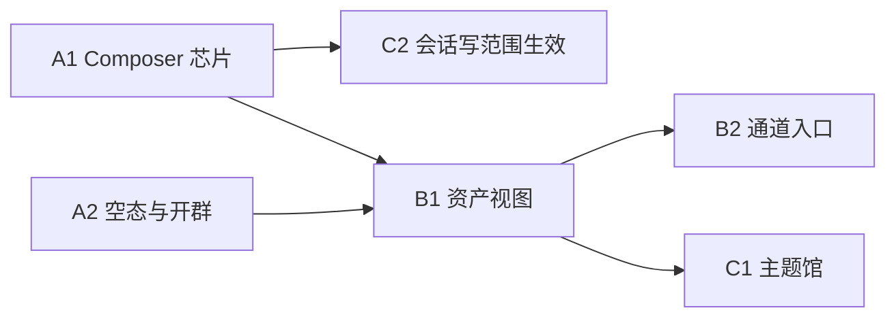

# Near Desktop 资产可见面 主计划

Planned-with: Cursor Grok 4.6
Suggested-Impl-Model: 按子计划选择；Wave A 默认 Composer 2.5；跨栈权限接线用代码专精中档；视觉空态用强审美档
Plan-Id: 2026-09-14-near-desktop-asset-surfaces-master
Source: `research/codedeepresearch/CowAgent/CowAgent_source_notes.md` 第 11 节（仅内部调研依据；实施与 commit 用本产品中性描述）

> **For implementer:** 本文件只负责编排。禁止据此一次性改完所有波次。每次只把**一个**子计划从 `.cursor/plans/pending/` 移到 `.cursor/plans/`，按该子计划 TDD/验收完成后再开下一项。使用 executing-plans。不要 commit，除非用户明确要求。

**Goal:** 让 Near 桌面端把已有能力变成用户可巡视、可就地改的产品面，而不是再造一套控制台或替换现有运行时。

**Architecture:** 三波递进。Wave A 只改对话窗格已有控件的可见性与短路径；Wave B 把设置里已有面板升为可打开的资产视图（同一组件，禁止复制一份互不同步的全页）；Wave C 才碰主题维 Markdown 馆与会话级写范围的运行时强制。每一层必须能单独停用。

**Tech Stack:** Desktop React/Zustand/Electron、现有 Studio `/api/permissions` 与 context usage API、Vitest；Wave C 才允许改 Python runtime。

---

## 1. 战略判定

调研结论不是「缺能力」，而是「能力埋在设置里，对话里看不见」。

Near 已经具备：

| 已有能力 | 落点 | 当前缺口 |
|---|---|---|
| 确认策略三态 | Composer `RunModePicker`（ask / allowlist / auto） | 不要替换 |
| 写范围三态 | 设置 Security `WorkspaceIsolationPanel` + `SandboxTier` | 只在设置；对话里看不到「这一轮能写到哪」 |
| Context 分类用量 | `ContextUsagePopup` | `ChatPane.tsx` 约 14230–14240：**空会话故意不展示** |
| 空对话 | `ChatView.tsx` 约 2661–2666：emoji + 一句 hint | 无能力发现卡 |
| 分身画廊 | `AvatarGalleryView.tsx` | 无「用这些成员开群」短路径 |
| 知识 / 记忆 / 技能 / 自动化 / 通道 | `SettingsPanel` tabs（`settings-tab.ts`） | 只能从设置进入 |
| 演进中心 | 已有主计划 08 | 本轨道禁止另起炉灶 |

因此规划原则：

1. **先露出，再升级。** 能用现有 API/组件解决的，不新开信息架构。
2. **对话仍是中心。** 不把主窗改成 Hash 全页「知识/记忆/技能」控制台。
3. **设置是唯一写入源。** 资产视图只是同一组件的另一入口。
4. **两条权限轴并存。** `RunMode` = 问不问；`SandboxTier` = 能写到哪。文案必须诚实（shell 不是 OS sandbox）。
5. **进化/记忆治理走已有 Control Plane。** 本轨道只做可见入口，不重做账本。

---

## 2. 全局范围

### In scope

- Composer 上会话级写范围芯片（叠在 `RunModePicker` 旁，不替换它）。
- Context 常驻小饼 + compact / 清上下文 / 跳 Token 预算（空会话也可看上限）。
- Pro/Lite 空对话能力发现卡（指向已有工作区、技能、知识、定时、通道）。
- 分身画廊「用已选成员开群」短路径。
- 资产视图：打开已有 Settings 内容，而不是复制页面。
- 通道入口收敛（飞书/微信已有绑定，只做 IA）。
- Wave C：主题维 Markdown 馆 + 链接图浏览（补充向量库，不替换）。
- Wave C：会话级 `SandboxTier` 真正随 `/api/chat` 生效。

### Out of scope

- 桌面视觉系统重塑、换强调色、wallpaper/玻璃主题包。
- 第二套 Web 控制台或 Hash 全页路由壳。
- 用写范围三态替换 Ask / Allowlist / Run Everything。
- 覆盖写 `MEMORY.md` 替换现有记忆索引（无备份事务不做）。
- 设置里 Skills/KB/Automation 再做一份互不同步的全页。
- 把 MCP 从桌面默认启动路径拿掉。
- Enterprise 前后台、移动端。
- 重做 IM 通道协议栈。
- Personal Agent Control Plane 的账本 / Eval / ChangeSet（已有独立 master）。

### 与其它 pending 计划的边界

| 其它计划 | 关系 |
|---|---|
| `2026-09-09-near-personal-agent-control-plane-master` 及其 08 演进中心 | 记忆/进化的**治理与证据**归那边；本轨道最多加「打开」入口 |
| `2026-09-11-near-editable-diagram-mcp` | 无关；不要顺手改图编辑 |
| 知识库 Stage-1 已落地代码 | Wave C wiki 是**补充**主题馆，不改向量入库主路径 |

---

## 3. 三波次与子计划

| 顺序 | 子计划（待撰写） | 交付 | 依赖 | 规模 | 推荐模型 |
|---|---|---|---|---|---|
| A1 | `2026-09-14-near-desktop-surfaces-01-composer-chips.plan.md` | 会话写范围芯片 + 拒绝态一键改；Context 空会话也可见 + compact/清上下文/跳预算 | 无 | S–M | Composer 2.5；若接线 session prefs API 则代码专精中档 |
| A2 | `2026-09-14-near-desktop-surfaces-02-empty-and-team.plan.md` | 空对话发现卡；画廊一键开群 | 无（可与 A1 并行） | S | Composer 2.5；空态视觉用强审美档 |
| B1 | `2026-09-14-near-desktop-surfaces-03-asset-views.plan.md` | 侧栏/工作区打开知识、技能、记忆、自动化（复用 Settings 组件） | A 完成后再开，避免入口打架 | M | Composer 2.5 + 前端品味档审视觉 |
| B2 | `2026-09-14-near-desktop-surfaces-04-channels-hub.plan.md` | 通道一览入口，复用已有飞书/微信绑定 UI | B1 的入口模式 | S | Composer 2.5 |
| C1 | `2026-09-14-near-desktop-surfaces-05-topic-wiki.plan.md` | 主题维 Markdown 馆 + 链接图浏览 | B1 | L | 跨栈用强推理档；图视觉用品味档 |
| C2 | `2026-09-14-near-desktop-surfaces-06-session-write-scope.plan.md` | 会话 `SandboxTier` 随请求生效 + 测试 | A1 | M–L / 安全敏感 | 代码专精中档或 GPT-5.x |

当前 backlog **只落本 master**。子计划必须在开工前按 writing-plans 写全（精确路径、before/after、FR/AC、测试文件名）。未写子计划不得实施。

推荐开工顺序：**先写并实施 A1 → A2**，用一周内可见的对话区变化验证叙事；B/C 等用户看过 A 再开。

---

## 4. 依赖图

A1 与 A2 无互相依赖，可并行规划、串行实施（避免同时大改 `ChatPane.tsx`）。

---

## 5. Wave A 精确落点（子计划必须从此展开）

### A1 · Composer 芯片

**根因：** 写范围已是全局默认 `workspace-write`（`desktop/src/utils/sandbox-status.ts:1-36`），但用户只在设置 Security 能改；对话里只有确认策略。Context 分类已经做完，却在空会话被藏起来（`ChatPane.tsx` 约 14229–14240 注释：「还没开聊就不该有已用」——展示**上限/空环**并不违反该心智）。

**改动意图：**

- 在 `RunModePicker` 左侧或同一芯片行增加 `WriteScopePicker`，选项复用 `SANDBOX_TIER_OPTIONS`，文案复用 `security.tier*`，并写明 shell 非沙箱。
- 默认显示全局 tier；用户改的是**当前 pane/session 覆盖**，未选则继承全局（与 `WorkspaceIsolationPanel` 不打架）。
- A1 允许先做「只存在前端 + 设置跳转」的乐观芯片，但必须在 UI 标明「本轮尚未强制」或直接做 C2；**禁止**做成看起来已生效的假开关。子计划必须二选一写死，推荐 A1 只做可见 + 跳设置，C2 再强制。
- `ContextUsageButton`：空会话也渲染空环/0 + 上限；增加 compact、清上下文、跳设置 Token 预算（`TokenBudgetConfigSection`）。分类切片保持现有七类，不要缩成四色饼而丢掉 Near 已有精度。

**Files（子计划须按行号复核）：**

- Modify: `desktop/src/components/ChatPane.tsx`（composer 行约 14190–14242）
- Modify: `desktop/src/components/ContextUsagePopup.tsx`
- Modify: `desktop/src/utils/context-usage-refresh.ts` + `.test.ts`
- Create: `desktop/src/components/composer/WriteScopePicker.tsx` + `.test.tsx`
- Reuse: `desktop/src/utils/sandbox-status.ts`、`desktop/src/components/composer/RunModePicker.tsx`
- i18n: `desktop/locales/{zh,en}/` 对应 chat/settings

**验收（A1）：**

- AC-1: 有消息与无消息时都能看到 Context 控件；无消息不显示「已用 12k」类假数字。
- AC-2: 写范围芯片与 `RunModePicker` 同时存在，改其中一个不改另一个。
- AC-3: 点「跳预算」打开 Settings 并滚到 Token 预算区块。
- AC-4: 文案不含「已沙箱隔离」等过度承诺。
- AC-5: 不改 `RunModePicker` 的 Ask/Allowlist/Auto 语义。

### A2 · 空态与开群

**根因：** Lite 空态只有一句 hint（`ChatView.tsx:2661-2666`）。Pro `ChatPane` 空列表无能力发现。画廊能管分身，开群要另走新建群流程。

**改动意图：**

- 空对话 4–6 张卡：工作区、技能、知识、定时、通道、命令帮助。点击：填入 composer 提示语，或打开对应设置/侧栏。**不要**新路由。
- `AvatarGalleryView`（及如有的分身管理入口）在已有 ≥2 分身时给「开群聊」，复用现有建群弹窗/API，预勾选当前可见成员。禁止新做第二套群路由。

**Files：**

- Modify: `desktop/src/components/ChatView.tsx:2661-2666`
- Modify: `desktop/src/components/ChatPane.tsx` 空消息分支（约 13126 附近）
- Modify: `desktop/src/components/gallery/AvatarGalleryView.tsx`
- 复用现有建群组件（子计划必须点名当前符号，禁止猜一个新 Modal）

**验收（A2）：**

- AC-1: Pro/Lite 空态都有发现卡；有消息后卡片消失。
- AC-2: 卡不刷屏、不用绿色营销色，跟现有 token。
- AC-3: 开群后进真实群窗格，成员与预勾选一致。
- AC-4: 仅 1 个分身时不展示开群主按钮。

---

## 6. Wave B/C 意图（子计划撰写时再钉行号）

### B1 资产视图

侧栏或工作区增加「打开知识/技能/记忆/自动化」，`createPortal` 或面板内渲染**现有** `KnowledgeSettings`、Skills 列表、`MemoryGraphExplorer`、`AutomationTab`。关闭后面板复原。禁止复制 CRUD。

与 Control Plane 08：若 08 已提供演进中心 Tab，B1 记忆入口指过去，不新建「进化」页。

### B2 通道入口

一个「通道」列表：飞书、微信、已绑定标记。动作调用现有 IPC/绑定流程（历史右键仍保留，本项只补总览）。顶栏不恢复与右键重复的绑定按钮。

### C1 主题馆

在向量 KB 旁增加 `knowledge/` 风格的 Markdown 树 + 相对链接图。写入靠 skill/prompt，不宣称后台策展引擎。不覆盖写长期记忆主文件。

### C2 会话写范围生效

`SandboxTier` 按 pane/session 进 `/api/chat` 与工具权限检查；拒绝时工具卡出「改写范围」；补 pytest + Vitest。全局设置仍是默认值。这是安全敏感项，A1 不得假装已生效。

---

## 7. 实施纪律

- `no-scope-creep`：子计划未点名的文件不准改。
- Desktop 视觉保持 Near token；禁止迁入调研对象的强调色或皮肤包。
- commit / PR 只用产品内中性描述（「会话写范围芯片」「空对话发现卡」），不对标外部产品。
- 改 `agenticx/studio/server.py` 时只增删目标行，提交前冷启动 smoke。
- 每个子计划顶部写 `Parent-Plan` 指向本文件，并带 `Suggested-Impl-Model`。

---

## 8. Go / No-Go

| 检查 | 通过条件 |
|---|---|
| A 完成 | Composer 两轴并存；Context 空会话可见；空态卡与开群可点；设置里原功能无回归 |
| B 完成 | 资产入口打开的是同一 Settings 组件；改设置再从入口打开数据一致 |
| C 完成 | wiki 不替换向量库；会话写范围有测试证明拒绝/放行 |
| 任一波次 | 无第二套控制台壳；无假开关 |

---

## 9. 下一步（规划动作，不是写代码）

1. 用户确认先做 Wave A（推荐）还是直接开 B/C。
2. 把对应子计划写到 `.cursor/plans/pending/`，达到「Composer 2.5 不看对话也能实施」的粒度。
3. 开工时把该子计划移到 `.cursor/plans/` 再开分支。
