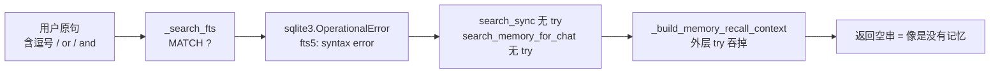

# 召回修复：FTS 查询消毒 + 按 avatar 的跨会话 turn 召回

Planned-with: Claude Opus 5
Suggested-Impl-Model: Codex 档（后端实施，含隔离语义与性能约束，中风险）
Plan-Id: 2026-09-14-near-memory-02-recall-fts-cross-session
Parent-Plan: `.cursor/plans/pending/2026-09-14-near-memory-recall-overhaul-master.plan.md`
Depends-On: `2026-09-14-near-memory-01-eval-harness`
Status: draft

---

## 0. 给实施者的阅读须知

- 行号是 2026-09-14 快照。偏移时用函数名/SQL 字符串锚点定位，**不要猜**。
- 严守 `no-scope-creep`：只改下面点名的函数。`workspace_memory.py` 里 chunks 相关的切分、rerank、embedding 逻辑一律不动。
- **不要触碰 `agenticx/studio/server.py`**（高敏文件，见 AGENTS.md）。本计划不需要改它。
- Python 遵守 google 风格：英文 docstring、禁相对 import、代码内无 emoji。
- 每个 Phase 的测试通过后再进下一个。

---

## 1. 根因与证据链（不依赖对话记忆，实施者据此自行判断改动是否对症）

2026-09-14 用 LongMemEval cleaned Oracle 20 题实测：当前 Near 生产召回路径的证据召回率为 **0%**，应用正确率 10%（全部来自两道拒答题），与「完全关闭记忆」同分。只改召回后升到 90% / 100%（词面），LLM 判分从 11% 升到 53%。数据见 `research/memory-eval/results/2026-09-14-poc/REPORT.md`。

### 根因 A：FTS 查询未消毒，异常把整条召回吞成空

链路：



- `agenticx/memory/workspace_memory.py::_search_fts`（L538）：`WHERE chunks_fts MATCH ?`，query 原样传入。
- 同文件 `_search_turns_fts`（L665）：`WHERE turns_fts MATCH ?`，同样。
- `search_sync`（L241）在 hybrid 模式下第一步就调 `_search_fts`（L256），异常直接冒泡。
- `agenticx/memory/recall.py::search_memory_for_chat`（L204）无保护。
- `agenticx/runtime/prompts/meta_agent.py::_build_memory_recall_context`（L356）的外层 `try` 捕获后返回 `""`。

复现：`"Which device did I get first, the Galaxy S22 or the Dell XPS 13?"` 这类英文问句必崩；中文短句通常不崩（无逗号、无保留字），这解释了为什么 NearMemoryEval-10 的中文用例能过 7 条，而英文 benchmark 全挂。

### 根因 B：turn 召回被当前 session_id 限死

- `search_turns_sync`（L325）参数 `session_id: str = ""`，转发给 `_search_turns_fts`（L338）与 `_search_turns_semantic`（L339）。
- `_search_turns_fts`（L665）在 `sid` 非空时加 `AND t.session_id = ?`（L680）。
- `_search_turns_semantic`（L701）在 `sid` 非空时 `WHERE session_id = ?`（L717）。
- `recall.py::search_memory_for_chat`（L220）传 `session_id=str(session_id or "")`。
- `_build_memory_recall_context`（L393）传当前会话 id。

结果：新开会话去查上一场对话，历史 turn 被 100% 过滤。turn archive 写进去的数据永远读不回来。

### 已核实的两个有利事实（决定了本计划的规模）

1. **`turns` 表已有 `avatar_id` 列**（L172 的 `CREATE TABLE`），`archive_turn_sync`（L270）已在 L306 写入 `avatar_id or ""`，`TurnArchiveHook._archive`（`agenticx/runtime/hooks/turn_archive_hook.py` L87-93）已传入。**因此不需要任何 schema 迁移，也不需要回填。** Meta 会话的 turn 存为空字符串而非 NULL。
2. `turns_fts` 是 `content=''` 的 external content 表（L192），已经 `JOIN turns t ON t.rowid = f.rowid`，在 WHERE 里追加 `t.avatar_id` 条件无需改 FTS schema。

### 必须同时处理的性能陷阱

`_search_turns_semantic`（L701）在 `sid` 为空时执行 `SELECT ... FROM turns`（L722-727）——**无 WHERE、无 LIMIT 的全表扫描**，逐行解码 embedding 算余弦。本机 `~/.agenticx/memory/sessions.sqlite` 已接近 900MB，历史上出现过冷启动 FTS backfill 堵塞事件循环导致 `/api/session/messages` 从 0.7ms 退化到数百 ms 的事故。**一旦放开跨会话而不加约束，这条分支就会被走到，属于可预见的新事故。** 本计划必须同时给候选集设上限。

---

## 2. In scope / Out of scope

### In scope

- 新增 FTS 查询消毒函数，应用于 chunks 与 turns 两条 MATCH 路径。
- FTS 查询失败不再让整条召回崩溃。
- turn 召回隔离维度由 `session_id` 显式改为 `avatar_id`，并开放跨会话。
- 语义 turn 召回的候选集上限与索引。
- 对应 feature flag 与回退。
- 单元测试 + 20 题回归。

### Out of scope

- `MemoryHook` 写入侧任何改动（属主计划 03）。
- `_build_memory_recall_context` 的 500 字注入上限与排序（属主计划 04）。
- embedding provider 更换（属已有 plan `2026-06-14-workspace-memory-semantic-embedding-upgrade`）。
- 记忆图谱、知识库、Desktop UI、`studio/server.py`。
- chunks 侧的 `session_id` / 主体过滤（`_filter_workspace_rows_for_subject` 已在 `recall.py` L205 处理，不动）。
- 改 `score_context` 等评测口径。

---

## 3. Phase 1：FTS 查询消毒

### FR-1：新增 `sanitize_fts_query`

位置：`agenticx/memory/workspace_memory.py`，紧跟 `extract_search_terms`（L52-76）之后、`_like_escape`（L79）之前。

```python
_FTS_RESERVED = {"or", "and", "not", "near"}
_FTS_TERM_RE = re.compile(r"[A-Za-z0-9]+|[\u4e00-\u9fff\u3400-\u4dbf\uf900-\ufaff]+")
_FTS_MAX_TERMS = 16


def sanitize_fts_query(query: str) -> str:
    """Strip FTS5 operators and punctuation so MATCH cannot abort the search.

    FTS5 treats commas, quotes and the bare words OR/AND/NOT/NEAR as syntax.
    User questions contain them routinely, which raised OperationalError and
    silently emptied the whole recall path.
    """
    terms = [
        term
        for term in _FTS_TERM_RE.findall(query or "")
        if term.lower() not in _FTS_RESERVED
    ]
    return " ".join(terms[:_FTS_MAX_TERMS]).strip()
```

说明：

- 这与评测脚本 `research/memory-eval/run_poc.py::sanitize_query`（L97）等价，该实现已被 20 题实测验证（0% → 90% 证据召回）。保持一致以便结果可比。
- 不要改成「用双引号包裹每个 token」的变体。那也能工作，但没有实测数据，会让回归数字不可对照。
- `_CJK_SEQ_RE`（L40）要求 2–8 字连续，语义不同，**不要复用**它来做本函数的分词。

### FR-2：在两条 MATCH 路径上应用消毒，并让失败降级而非崩溃

`_search_fts`（L538）改为：

```python
def _search_fts(self, query: str, limit: int) -> List[Dict[str, Any]]:
    safe = sanitize_fts_query(query)
    if not safe:
        return []
    try:
        with self._connect() as conn:
            rows = conn.execute(
                """
                SELECT c.id, c.path, c.source, c.start_line, c.end_line, c.model, c.text, c.created_at, c.access_count
                FROM chunks_fts f
                JOIN chunks c ON c.rowid = f.rowid
                WHERE chunks_fts MATCH ?
                LIMIT ?
                """,
                (safe, max(1, limit)),
            ).fetchall()
    except sqlite3.OperationalError:
        logger.warning("chunks FTS match failed, falling back to other paths", exc_info=True)
        return []
    return [self._row_to_result(row, score=1.0 - (idx * 0.01)) for idx, row in enumerate(rows)]
```

`_search_turns_fts`（L665）同样：开头 `safe = sanitize_fts_query(query)`，空则 `return []`，两个分支的 SQL 参数由 `query` 改为 `safe`，整体包 `try/except sqlite3.OperationalError` 返回 `[]` 并 warning。

注意：

- 消毒放在这两个私有方法内部，可覆盖所有调用路径（`search_sync` 的 hybrid/fts 两种模式、`search_turns_sync`），调用方无需改动。
- `_search_substring`（L512）走 LIKE 不走 MATCH，`_search_semantic`（L552）走向量，**都不要改**。
- 若 `logger` 未在模块中定义，按文件既有约定新增 `logger = logging.getLogger("agenticx.memory.workspace")`；若已有同名 logger 直接复用，不要重复定义。
- 本项是异常路径修复，**不加 feature flag**。加开关意味着允许保留一条会崩的路径，没有意义。

### Phase 1 测试

新建 `tests/test_workspace_memory_fts_sanitize.py`：

- `test_sanitize_strips_operators_and_punctuation`：
  `sanitize_fts_query("Which device did I get first, the Galaxy S22 or the Dell XPS 13?")`
  结果不含 `,`、`?`、`or`，且包含 `galaxy`、`s22`、`dell`、`xps`。
- `test_sanitize_keeps_cjk`：中文问句「上周我说的那个向量库结论是什么？」消毒后仍含「向量库」相关 token，不含 `？`。
- `test_sanitize_empty_for_punctuation_only`：`sanitize_fts_query("?!,,")` 返回 `""`。
- `test_search_sync_survives_operator_query`：在 `tmp_path` 建 store，索引一段含目标关键词的 markdown，用带逗号和 `or` 的英文问句调 `search_sync`，**不抛异常且返回非空**。这是回归本 bug 的核心断言。
- `test_search_turns_sync_survives_operator_query`：`archive_turn_sync` 写一条英文 turn，用带逗号和 `or` 的问句查（同 session），不抛异常且命中。

---

## 4. Phase 2：按 avatar 的跨会话 turn 召回

### FR-3：`search_turns_sync` 新增参数

`agenticx/memory/workspace_memory.py::search_turns_sync`（L325）签名改为：

```python
def search_turns_sync(
    self,
    query: str,
    limit: int = 5,
    *,
    session_id: str = "",
    avatar_id: Optional[str] = None,
    cross_session: bool = False,
    halflife_days: float = _TURN_RECALL_HALFLIFE_DAYS,
) -> List[Dict[str, Any]]:
```

语义（必须严格按此实现）：

| `cross_session` | 过滤条件 | 用途 |
|---|---|---|
| `False`（默认） | 与现状完全一致：`session_id` 非空则按 session 过滤 | 零回归；关闭开关后行为不变 |
| `True` | 忽略 `session_id`，改用 `COALESCE(t.avatar_id, '') = ?`，值取 `avatar_id or ""` | 跨会话召回，按主体隔离 |

`avatar_id` 为 `None` 或 `""` 表示元智能体（Meta），匹配 `avatar_id` 为空串或 NULL 的行。分身传其自身 id，严格相等匹配。

**为什么是严格相等而不是「分身也能看 Meta」：** N06 分身隔离、N07 项目隔离是当前唯二通过的隔离用例，用户明确把跨主体串台列为严重倒退。放宽可见范围必须另开需求并单独评测，不在本计划内。

### FR-4：两个底层查询支持 avatar 过滤

`_search_turns_fts`（L665）签名增加 `avatar_id: Optional[str] = None, cross_session: bool = False`。SQL 分三种情况：

- `cross_session=True`：`WHERE turns_fts MATCH ? AND COALESCE(t.avatar_id, '') = ? LIMIT ?`
- `cross_session=False` 且 `sid` 非空：保持现状 `AND t.session_id = ?`
- 其余：保持现状的无过滤分支

`_search_turns_semantic`（L701）签名同样增加两个参数，并**必须同时修掉全表扫描**：

```python
_TURN_SEMANTIC_CANDIDATE_CAP = 2000
```

- `cross_session=True`：
  `SELECT id, session_id, text, embedding, created_at, access_count FROM turns WHERE COALESCE(avatar_id, '') = ? ORDER BY created_at DESC LIMIT ?`，`LIMIT` 取 `_TURN_SEMANTIC_CANDIDATE_CAP`。
- `cross_session=False` 且 `sid` 非空：保持现状按 session 过滤（单会话行数天然有限，可不加 cap）。
- 无过滤分支：**也要加 `ORDER BY created_at DESC LIMIT _TURN_SEMANTIC_CANDIDATE_CAP`**。这条分支今天就存在且是裸全表扫描，放开跨会话后更容易被走到，属于本计划的直接风险面，必须收口。

候选集用 `created_at DESC` 截断是有意的近似：超出最近 2000 条的历史只能靠 FTS 命中，不参与语义打分。这是性能与召回的折中，若日后证明不够，由主计划 05（真语义 embedding）配合向量索引解决，不在本计划扩大范围。

### FR-5：索引

在建表逻辑（`CREATE TABLE IF NOT EXISTS turns` 之后，约 L183）追加幂等索引：

```sql
CREATE INDEX IF NOT EXISTS idx_turns_avatar_created ON turns(avatar_id, created_at DESC)
```

与既有 `PRAGMA table_info(chunks)` 迁移块（L196-201）风格一致，放在同一 `with self._connect()` 块内、`conn.commit()` 之前。

### FR-6：配置开关

`agenticx/memory/turn_archive_config.py` 的 `DEFAULTS`（L16）新增：

```python
"cross_session_recall": True,
```

并在 `load_turn_archive_config` 现有的类型归一化逻辑中自动生效（bool 分支已存在，无需额外代码）。同时支持环境变量覆盖，紧跟 `AGX_TURN_ARCHIVE_ENABLED`（L74-76）之后：

```python
env_cross = os.getenv("AGX_TURN_CROSS_SESSION_RECALL")
if env_cross is not None:
    merged["cross_session_recall"] = env_cross.strip().lower() in {"1", "true", "on", "yes"}
```

**默认为 `True` 的理由：** 默认关闭等于修复不生效，用户升级后仍然「记忆没用」。风险由 FR-3 的严格 avatar 隔离 + AC-6 的隔离测试兜底；需要回退时改 `~/.agenticx/config.yaml` 的 `memory.turn_archive.cross_session_recall: false` 或设环境变量即可，无需回滚版本。

### FR-7：召回入口接线

`agenticx/memory/recall.py::search_memory_for_chat`，`store.search_turns_sync` 调用处（L220-225）改为传入 `avatar_id` 与 `cross_session`：

```python
turns_rows = store.search_turns_sync(
    q,
    turns_cap,
    session_id=str(session_id or ""),
    avatar_id=avatar_id,
    cross_session=bool(turn_cfg.get("cross_session_recall", True)),
    halflife_days=float(turn_cfg.get("halflife_days", 7.0)),
)
```

`avatar_id` 已是该函数的现有形参（L181），直接复用，不要新增参数。`agenticx/runtime/prompts/meta_agent.py::_build_memory_recall_context`（L402-410）已经在传 `avatar_id=avatar_id`，**无需改动该文件**。

### Phase 2 测试

扩展 `tests/test_workspace_memory_turns.py`（保留现有用例不动）：

- `test_cross_session_recall_finds_other_session`：同一 `avatar_id=""`，`sess-A` 归档「向量库默认用 Chroma」，从 `sess-B` 以 `cross_session=True` 查询能命中。
- `test_cross_session_off_keeps_session_scope`：同样数据，`cross_session=False`（默认）从 `sess-B` 查询**查不到**，证明零回归。
- `test_cross_session_isolates_avatars`：`avatar-1` 归档一条、`avatar-2` 归档一条，以 `cross_session=True, avatar_id="avatar-1"` 查询只返回 avatar-1 的行。
- `test_cross_session_meta_scope`：`avatar_id=""` 的 turn 与 `avatar_id="avatar-1"` 的 turn 共存，以 `avatar_id=None` 查询只拿到空串那条。
- `test_semantic_candidate_cap`：归档条数超过 cap 时（测试里把 `_TURN_SEMANTIC_CANDIDATE_CAP` monkeypatch 成 5），`_search_turns_semantic` 的候选不超过 5 条，且取的是最近的。

---

## 5. 验收标准

### 单元测试

- **AC-1**：`pytest tests/test_workspace_memory_fts_sanitize.py` 全绿。
- **AC-2**：`pytest tests/test_workspace_memory_turns.py` 全绿（含既有 2 条用例）。
- **AC-3**：`pytest tests/test_smoke_memory_recall_bridge.py tests/test_workspace_memory.py tests/test_workspace_memory_chunk_rerank.py` 全绿，证明未波及 chunks 侧。

### 端到端回归（用 01 的 harness）

在临时 HOME 下跑同一 20 题（`sample_ids.json` 固化的那批）：

- **AC-4**：生产路径（`near_current_prompt500`）词面应用正确率 **≥ 85%**（改前 10%）。词面是主 gate，因为它无 LLM 噪声。
- **AC-5**：GLM-5.3-Flash 判分下，生产路径 **≥ 45%**（改前 11%）。作为辅助确认，允许因模型噪声波动。
- **AC-6**：NearMemoryEval-10 中 **N06 分身隔离、N07 项目隔离仍然通过**。任一失败即判定本计划不可合入。
- **AC-7**：`compare_runs.py` 对比改前改后，翻转项里**没有 `yes → no`**（不允许用新 bug 换新分数）。

### 性能

- **AC-8**：在真实规模数据下（可用 harness 的 LongMemEval-S haystack 造出每题 200+ turn 的库，或直接对本机库做只读压测），`cross_session=True` 的单次 `search_turns_sync` 耗时 **< 300ms**。记录实测值到回归报告。超出则收紧 `_TURN_SEMANTIC_CANDIDATE_CAP` 后重测。

### 回退

- **AC-9**：设 `AGX_TURN_CROSS_SESSION_RECALL=0` 后重跑 AC-4 的用例，结果回到改前水平，证明开关真实生效、可回退。

---

## 6. 交付物

| 文件 | 改动 |
|---|---|
| `agenticx/memory/workspace_memory.py` | FR-1 新增函数；FR-2 两处 MATCH 消毒与降级；FR-3/FR-4 三个方法签名与 SQL；FR-5 索引 |
| `agenticx/memory/turn_archive_config.py` | FR-6 新增配置键与环境变量 |
| `agenticx/memory/recall.py` | FR-7 调用处传参（仅此一处） |
| `tests/test_workspace_memory_fts_sanitize.py` | 新建 |
| `tests/test_workspace_memory_turns.py` | 扩展 5 条用例 |
| `research/memory-eval/results/<date>-post-recall-fix/` | 回归产物 |

---

## 7. 禁止事项

- 不改 `agenticx/studio/server.py`。
- 不改 `_build_memory_recall_context` 的 500 字预算、排序或去重逻辑（属 04）。
- 不改 `MemoryHook` 的提取启发式（属 03）。
- 不改 `_search_substring`、`_search_semantic`、`_rerank_chunks_composite` 等 chunks 侧逻辑。
- 不为了让数字好看而放宽 avatar 隔离。
- 不把 `cross_session` 默认值改成对所有 avatar 可见。
- 不在本计划内引入新依赖。
