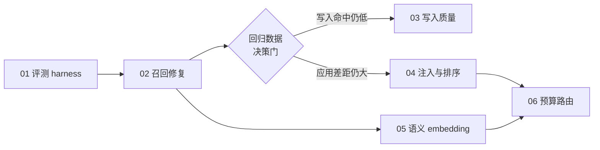

# Near 记忆可用性整治 主计划

Planned-with: Claude Opus 5
Plan-Id: 2026-09-14-near-memory-recall-overhaul-master
Status: draft（待用户确认后逐子计划执行）
Owner: Damon Li
Evidence: `research/memory-eval/results/2026-09-14-poc/REPORT.md`、`research/memory-eval/results/2026-09-14-glm-reader/REPORT.md`

> **For implementer:** 本文件只负责编排，不允许据此一次性实现所有功能。每次只把一个子计划从 `.cursor/plans/pending/` 移到 `.cursor/plans/` 根目录，按其 AC 完成并通过 Go/No-Go 后，才开始下一项。不要 commit，除非用户明确要求。

---

## 1. 判定结论（先读这段，它决定了整个排序）

2026-09-14 用 LongMemEval cleaned（Oracle 分层抽 20，seed `20260914`）+ 自建 NearMemoryEval-10 实测，得到两组互相印证的数据。

**词面检索受限正确率（不调 LLM，指标稳定，作为主 gate）：**

| 基线 | 证据召回 | 应用 |
|---|---:|---:|
| 无记忆 | 0% | 10% |
| 当前 Near 生产路径 | 0% | 10% |
| 跨会话 turn + 原问句 | 0% | 10% |
| FTS 消毒问句、仍按新会话 | 20% | 30% |
| **FTS 消毒 + 跨会话 turn** | **90%** | **100%** |
| Oracle 正确证据 | 90% | 100% |

**GLM-5.3-Flash 读者 + LongMemEval 官方 yes/no 判分（辅助指标，含模型噪声）：**

| 基线 | 正确率 | 成功调用 |
|---|---:|---:|
| 无记忆 | 10% | 20/20 |
| 当前 Near（生产 500 字注入） | 11% | 19/20 |
| FTS 消毒 + 跨会话 turn | 53% | 17/20 |
| Oracle 正确证据 | 89% | 19/20 |

无记忆与生产 Near 的「正确」全部来自两道拒答题（`0862e8bf_abs`、`2311e44b_abs`），即**生产记忆对答题的净贡献为零**。

三段拆解：

- **写入**：数据在。turn archive 已开启并落盘（Oracle 每题平均 10 条、S haystack 每题 244 条）。`MemoryHook` 启发式提取弱（证据命中 15%），但不是主瓶颈。
- **召回**：断了。两条机械故障使召回恒定返回空（见 §2）。这是唯一让「11% → 53%」的改动。
- **应用**：有次级差距。证据进上下文后词面 100%，但读者只有 53%，与 Oracle 的 89% 差 36 个百分点。原因未定，禁止拍脑袋，由 M4 用数据定位。

NearMemoryEval-10 过 7 条（N01/N02/N04/N06/N07/N08/N09），不过 3 条：N03 偏好更新未覆盖旧值、N05 时间来源被模板挤掉、N10 密钥被原样写入 `MEMORY.md`。

**排序结论：先修召回，再补评测常设化，之后才谈写入质量与注入策略。Constitution / Deep Dream / 图谱升级 / 预算路由都解决不了「新会话找不到上周说过的话」，不进本轮。**

---

## 2. 两条根因（已定位到行）

### 根因 A：FTS 查询未消毒，整条 hybrid 搜索被异常吞掉

- `agenticx/memory/workspace_memory.py::_search_fts`（L538）：`WHERE chunks_fts MATCH ?` 直接把用户原句传入。
- 同文件 `_search_turns_fts`（L665）：`WHERE turns_fts MATCH ?` 同样。
- 英文问句里的逗号、`or`/`and`/`not`/`near` 是 FTS5 保留语法，触发 `sqlite3.OperationalError: fts5: syntax error`。
- `search_sync`（L241）与 `search_memory_for_chat`（`agenticx/memory/recall.py` L204）都没有 try/except，异常一路冒泡到 `agenticx/runtime/prompts/meta_agent.py::_build_memory_recall_context`（L356）的外层 try，被静默吞成空字符串。

对用户的表现：不是报错，是「像是没有记忆」。

### 根因 B：turn 召回被当前 session_id 限死

- `WorkspaceMemoryStore.search_turns_sync`（L325）签名带 `session_id: str = ""`，转发给 `_search_turns_fts` / `_search_turns_semantic`。
- `_search_turns_fts`（L665）在 `sid` 非空时加 `AND t.session_id = ?`。
- `recall.py::search_memory_for_chat`（L220）传 `session_id=str(session_id or "")`。
- `_build_memory_recall_context`（L393）传当前会话 id。

结果：新会话带着新 id 去查，历史 turn 全部被过滤掉。已经写下的东西，永远查不回来。

**关键约束（设计必须遵守）：** 这个 `session_id` 过滤当前同时承担了两个职责——会话内精确检索，以及**隐式的主体隔离**。N06 分身隔离、N07 项目隔离之所以通过，部分靠它。直接改成全库搜会造成分身串台，属于严重倒退。必须把隔离维度显式换成 `avatar_id`，详见子计划 02。

---

## 3. 子计划清单

| 顺序 | Plan | 交付 | 依赖 | 规模 | 推荐模型 |
|---|---|---|---|---|---|
| 01 | `2026-09-14-near-memory-01-eval-harness.plan.md` | 记忆评测常设化，可重复回归 | 无 | S–M | Composer 2.5 档（纯脚本，无生产风险） |
| 02 | `2026-09-14-near-memory-02-recall-fts-cross-session.plan.md` | FTS 消毒 + 按 avatar 的跨会话 turn 召回 | 01 | M | Codex 档（含 schema 迁移与隔离语义，中风险） |
| 03 | 写入质量（`MemoryHook`）— 待 02 回归后拆分 | 英文线索、密钥过滤、写入门槛 | 02 | M | Codex 档 |
| 04 | 注入预算与排序 — 待 02 回归后拆分 | 定位 53% vs 89% 的差距并收口 | 02, 01 | M–L | GPT-5.x 档（需判断力） |
| 05 | `2026-06-14-workspace-memory-semantic-embedding-upgrade.plan.md`（已存在） | 哈希向量 → 真语义 embedding | 02 | L | Codex 档 |
| 06 | `2026-06-14-budgetmem-query-aware-memory-routing.plan.md`（已存在） | query-aware 预算路由 + 召回后精炼 | 04, 05 | L | GPT-5.x 档 |

05 / 06 是仓库里**已有的 pending plan**，本主计划不重写它们，只重新定位它们的执行时机：**必须排在 02 之后**。理由：召回链路断着的时候升级 embedding，等于给一条断路换更好的导线，收益无法观测。

03 / 04 **故意不预先细化**。它们的优先级和具体内容取决于 02 落地后的回归数据（见 §5 决策门）。现在写细节等于凭空猜测，违反「根因与证据链要写进 plan」的要求。

---

## 4. 依赖与执行流

---

## 5. 决策门（02 完成后必须先跑，再决定 03/04）

02 落地后，用 01 的 harness 重跑同一 20 题 + Near 10 条，按下表判定：

| 观测 | 判定 | 下一步 |
|---|---|---|
| 词面生产基线 ≥ 85% 且 GLM ≥ 45% | 召回修复达标 | 进入决策门后续判断 |
| 词面 < 85% | 修复不完整 | 回到 02，不要开新战线 |
| 写入证据命中 < 30% | 写入是新瓶颈 | 拆 03 |
| GLM 与 Oracle 差距 > 25 个百分点 | 应用是新瓶颈 | 拆 04，先做归因再改代码 |
| Near 10 条仍 < 9 条通过 | 行为语义有缺口 | 按失败项归入 03 或另开 |

**04 的归因要求（写在这里，避免将来拍脑袋）：** 必须先区分三种可能，再决定改什么——注入预算 500 字截断把证据切掉；召回上下文噪声过多淹没证据；时间信息在 turn 文本里丢失（LongMemEval 有 4 道 temporal-reasoning，生产路径全错）。归因手段是对同一批题打印实际注入的上下文并人工核对，不是直接调参。

---

## 6. 全局范围

### In scope

- FTS 查询消毒（chunks 与 turns 两条路径）。
- turn 召回的隔离维度从 `session_id` 显式改为 `avatar_id`，并开放跨会话。
- 记忆评测 harness 常设化与回归基线落盘。
- 上述改动的 feature flag 与回退路径。

### Out of scope

- 记忆图谱（Graphiti / Kuzu）相关任何改动。
- User Constitution、Observation Ledger、Personal Eval 等 Control Plane 子计划。
- Desktop 记忆相关 UI 改版（设置面板、记忆列表、图谱浏览器）。
- `agenticx/studio/kb/` 知识库检索链路。
- 更换默认 embedding provider（那是 05 的事）。
- 重写 `MemoryHook` 的整体架构（03 只做点状修复）。

### no-scope-creep 边界

每个子计划只改其明确点名的文件与函数。看到相邻「顺手能优化」的旧逻辑一律不动。特别提醒：`agenticx/studio/server.py` 属高敏文件，本轮**不应触碰**；若某子计划确需改动，必须单独说明并按 AGENTS.md 的冷启动验证门槛执行。

---

## 7. 风险登记

| 风险 | 影响 | 缓解 |
|---|---|---|
| 放开跨会话导致分身串台 | 严重倒退，用户明确反对 | 02 强制按 avatar_id 隔离，并新增隔离用例；N06/N07 必须仍通过 |
| turns 表 schema 迁移损坏既有数据 | 历史归档不可用 | 只加列不改列；旧行 NULL 语义明确；迁移幂等；先在临时 HOME 验证 |
| 本机 `sessions.sqlite` 已近 900MB，查询放宽后变慢 | 冷启动堵事件循环（有先例） | 02 必须加索引并记录召回耗时；超过阈值改为按 avatar 预过滤 |
| GLM 判分有噪声、网关长 prompt 会超时 | 误判改动效果 | 以词面指标为主 gate，LLM 判分为辅助；harness 支持只跑词面 |
| 评测污染真实 `~/.agenticx` | 用户数据受损 | harness 强制临时 HOME，已有实现须保留并加断言 |

---

## 8. 验收（整体）

本主计划在下列条件全部满足时关闭：

1. 02 完成且决策门跑过，回归数据落盘在 `research/memory-eval/results/` 下新目录。
2. 生产路径（不是诊断基线）在同一 20 题上，词面应用 ≥ 85%。
3. NearMemoryEval-10 中 N06、N07 仍通过（隔离未倒退）。
4. 关闭新增 feature flag 后，行为与当前 main 等价（有测试证明）。
5. 03/04 要么已拆分并执行，要么按决策门判定为不需要并在本文件记录理由。
