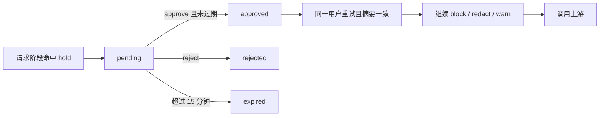

# 策略动作：需确认

Planned-with: grok-4.7
Suggested-Impl-Model: 强推理档。状态机跨 Go gateway、策略类型、前台卡片和管理台审批，不要交给只做样板的模型自由发挥。

> **For implementer:** 只凭本文落地。不要回看规划对话。Master：`.cursor/plans/pending/2026-09-23-enterprise-org-production-master.plan.md`。排在「技能进工作区」之后。两份都改 `completions/route.ts` 时，以已落地的技能剥除逻辑为准，只追加 hold 响应处理。

**Goal:** 已发布规则的动作为「需确认」时，网关不调用上游模型，留下一张确认单；有权限的人确认后，同一条用户内容可以继续，审计能对上这张单。

这是请求发出前的暂停，不是「回答生成后确认并回写知识库」。回写入库不在本规划。2026-09-24 起，本规划仍排在技能进工作区之后，且不与 C/A 同一批发版，直到上一轮架构审里的读写面、待办列表、请求头转发和摘要算法补进本文再开工。

**Architecture:** 确认只发生在请求阶段，针对最后一条 user 文本。`block` / `redact` / `warn` 语义不变。确认通过后再跑剩余策略：拦截仍然拦截，脱敏仍然脱敏。跨境配置里的 `require_approval` 保持现状（直接拒绝），不要把它改成这张单。

**Tech Stack:** `enterprise/packages/policy-engine`、Go gateway、Drizzle 双方言、web-portal 聊天错误展示、admin-console 策略表单、iam-core scope 注册表。

---

## 根因

`PolicyRuleAction` 在 `enterprise/features/policy/src/types.ts` L2 只有 `"block" | "redact" | "warn"`。Go 侧 `enterprise/packages/policy-engine/types.go` L14–L18 相同。

Gateway 在请求阶段命中 `block` 会直接返回业务错误，不会上游推理。没有「先停、人点确认、再继续」的状态。

`enterprise/apps/gateway/internal/server/crossborder_integration.go` 约 L123 的 `cross_border:require_approval` 是另一条硬拒绝。本规划的动作名用 `hold`，避免和跨境字符串混用。

## In scope / Out of scope

**In scope**

- 策略动作新增值 `hold`，中文界面显示「需确认」
- 请求阶段命中后写确认单并返回 `409` + `code: "40901"`
- 确认 / 拒绝 API，scope `policy:approve`
- 带确认单 id 的重试只跳过这一张单对应的那次 hold，不跳过 block
- 前台把 40901 画成等待确认，而不是普通报错气泡
- 审计动作扩展出 `hold`（待确认时）以及确认后的 allow 关联

**Out of scope**

- 响应阶段 hold
- 多级审批、会签、转交
- 按业务对象（客户、合同）授权
- 修改跨境 `require_approval`
- 修改 block / redact / warn 的匹配器
- 技能运行时

## 状态机



合法迁移只有：`pending → approved`、`pending → rejected`。`approved` 只能被对应重试消费一次，消费后记 `consumed_at`，不能第二次放行。过期在读取时计算，不依赖定时任务：`now > created_at + 15min` 且仍为 pending 则视为 expired，批准返回 409。

## 表

PostgreSQL 与 MySQL 各一份，放在 `enterprise/packages/db-schema/src/schema/` 与 `mysql-schema/` 的新文件 `policy-holds.ts`，并在各自 schema index 导出。

```text
enterprise_policy_holds
  id              ulid pk
  tenant_id       not null
  user_id         not null
  dept_id         可空
  session_id      not null     -- 聊天 session
  rule_id         not null
  rule_message    text         -- 规则上的 message，给界面
  content_sha256  char(64)     -- 见下方摘要
  status          varchar(16)  -- pending | approved | rejected
  approver_id     可空
  created_at      not null
  decided_at      可空
  consumed_at     可空
```

索引：`(tenant_id, user_id, status, created_at)`。

摘要算法（Gateway 与批准后的重试必须同一函数，放在 Go `policyengine` 包）：

```text
sha256_hex( UTF-8( tenant_id + "\n" + user_id + "\n" + model + "\n" + last_user_text ) )
```

`last_user_text` 是消息数组里最后一条 `role=user` 的字符串 content。content 不是字符串（多模态）时，本规划 **不 hold**，按未命中 hold 继续原逻辑。不要把图片哈希进 v1。

`model` 用客户端原始 model 字符串（含 `provider/model` 若有）。重试必须原样。

## Gateway

在请求阶段评估、并且动作是 `block` 的那个分支旁边（`enterprise/apps/gateway/internal/server/server.go` 里按 `policyengine.RuleKind*` 处理命中的 switch，约 L300 起）增加 `ActionHold`。

命中 hold 且请求头没有可消费的确认单：

1. 插入 `pending` 行。
2. 写审计，`action` 增加枚举值 `hold`（`enterprise/packages/core-api/src/audit.ts` L13 今天是 `allow | redact | block`）。JSONL 与 PG 都写。不要用 `block` 冒充。
3. 返回 HTTP 409：

```json
{
  "error": {
    "code": "40901",
    "message": "<规则 message，空则用「需要确认后才能继续」>",
    "hold_id": "<ulid>",
    "rule_id": "<id>"
  }
}
```

不调用上游。

请求头 `x-agenticx-policy-hold: <id>` 存在时：

- 行必须属于同一 tenant、同一 user、`status=approved`、`consumed_at` 空、未过期、`content_sha256` 与本请求一致。
- 任一不符：409，`code: "40902"`，message `policy hold is not usable`，不调用上游。
- 相符：本请求跳过 **这一条 rule id** 的 hold。其他规则照常。若另一条 block 命中，仍然 block。通过后把 `consumed_at` 设为现在，审计 `action=allow`，扩展字段 `hold_id`。
- 跳过不是「关闭策略」。

同一请求同时命中 block 与 hold：block 优先，不建确认单。

同一请求命中多条 hold：只建第一条的单（规则列表的现有顺序），避免一轮多张单。

旧快照里不认识的 action：保持今天的失败方式（拒绝加载或当作不匹配）。禁止把未知动作当成 allow。新增 `hold` 之后，未知仍然不是 allow。

## 批准 API

`POST enterprise/apps/admin-console/src/app/api/policy/holds/[id]/route.ts`

Body：`{ "decision": "approve" | "reject" }`

`requireAdminScope(["policy:approve"])`。

scope 注册在 `enterprise/packages/iam-core/src/scope-registry.ts` 的 policy verbs 增加 `approve`。同步 `enterprise/docs/rbac/scopes.md` 表格。种子角色 **不要** 把 `policy:approve` 塞进普通 member。`security` 与 `admin` 的种子若在 `enterprise/packages/db-schema` 的 seed 里列举了 policy verbs，给这两角色加上；`owner` 若是 `*` 则不用改。

批准人与提单人可以是同一人（小团队管理员自己确认）。不要额外禁止。

pending 以外的状态：409，message `policy hold is not pending`。

过期：409，message `policy hold expired`，并把 status 留在 pending（读取时算过期即可），避免和 rejected 混淆。

成功：`{ "code": "00000", "data": { "status": "approved" | "rejected" } }`。

前台不提供员工自批，除非该用户同时有 `policy:approve`（走管理台）。不要在 web-portal 做第二套批准路由。

## 管理台策略表单

策略规则编辑里动作下拉今天是拦截 / 脱敏 / 警告。增加「需确认」，提交值 `hold`。

`enterprise/features/policy/src/types.ts`、`pg-store.ts` L38 附近的联合类型、`mysql-store.ts` 同样加上 `hold`。发布快照把 `action: "hold"` 原样写入，Gateway 才认。

草稿里选需确认、未发布：网关不生效。这与现有发布模型一致，不要走旁路。

## 前台展示

`packages/sdk-ts` 或 feature-chat 里，completions 返回 409 且 `error.code === "40901"` 时，不要当成普通助手错误段落。

在 `enterprise/features/chat` 的消息列表里追加一条本地消息，`metadata.kind = "policy_hold"`，字段 `holdId`、`ruleId`、`message`。渲染组件新建 `enterprise/features/chat/src/components/molecules/PolicyHoldCard.tsx`：

- 文案：规则 message
- 说明：等待有确认权限的管理员处理。15 分钟内有效
- 没有批准按钮（批准在管理台）
- 管理台批准后，用户再次发送 **同一条** 内容时，客户端若本地仍存着未消费的 `holdId`，带上请求头 `x-agenticx-policy-hold`

请求头由 `enterprise/packages/sdk-ts/src/chat/http.ts` 在 `pending.request.policyHoldId` 时设置。发送成功或收到非 40902 的最终响应后清掉本地 holdId。40902 时卡片改为「确认已失效，请重新发送」，并清掉 holdId。

找 chat store 里现有的错误处理（搜 `40303` 或 gateway error code 的展示）。hold 不要复用「模型不支持该文件类型」那条黄色警告。

## FR / AC

- FR-1: 已发布 `hold` 规则命中最后一条用户文本时，不产生上游模型调用，响应 40901，库中有 pending 行。
- FR-2: `policy:approve` 可批准；无该 scope 为 403。member 默认没有该 scope。
- FR-3: 批准后重试，摘要一致，上游被调用恰好一次，`consumed_at` 非空；第二次用同一 hold 返回 40902。
- FR-4: 摘要不一致（改了一个字或换模型）返回 40902，且不调用上游。
- FR-5: 同时命中 block 与 hold 时行为与今天的 block 相同，不插入 hold 行。
- FR-6: `redact` / `warn` 的既有测试仍过。

- AC-1: Go 测试 `enterprise/apps/gateway/internal/server/policy_hold_test.go` 覆盖 FR-1、FR-3、FR-4、FR-5。用现有 policy 测试的 httptest 风格（参考 `policy_request_scope_test.go`）。上游用 `httptest` 计数器，断言 0 或 1。
- AC-2: `enterprise/features/policy` 的类型测试或 store 测试：`action: "hold"` 能保存草稿。拒绝 `action: "approve"` 这类别名。
- AC-3: 前台组件测试：40901 JSON 渲染出 `PolicyHoldCard` 且不含「发送失败」通用文案。

## 验证命令

```bash
cd enterprise/apps/gateway && go test ./internal/server/ -count=1 -run 'PolicyHold|PolicyRequest'
pnpm -C enterprise exec vitest run features/policy
```

期望：`go test` PASS，vitest PASS。手工：发布一条关键词规则动作为需确认，前台发送含该词的句子，气泡为等待确认；管理台批准后原句重发得到模型回复；改一个字重发得到新的等待确认，而不是沿用旧单。
