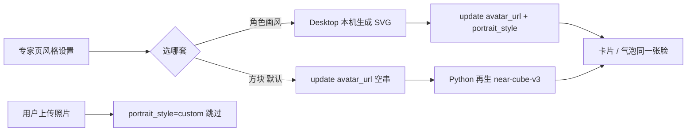

# 数字专家：批量换头像风格（方块默认 + 角色画风）

Planned-with: grok-4.6
Suggested-Impl-Model: composer-2.5（生成器 / registry 契约 / 批量 PATCH）；专家页风格轨第一稿建议用有审美的中档或以上模型，再由 composer-2.5 收口

> **For implementer:** 只凭本文落地。不要回看规划对话。不要复活「设计头像 / Identity Studio」。不要改 Near 本人的方块服装。不要打远程头像接口。不要改 `agenticx/studio/server.py` 顶部 import 区。

**Goal:** 数字专家页提供一次换全员画风的设置。默认仍是现在的方块；用户可以改成一套彩色角色画风，也可以换回方块。上传的照片永不覆盖。

**Architecture:** 画风是专家集合级选择，存在 Desktop `localStorage`。选方块时走现有 Python 立方体生成（`avatar_url=""`）。选角色画风时由 Desktop 本机生成 SVG，经已有 `updateAvatar` / `createAvatar` 写入每张专家的 `avatar_url` + `portrait_style`。Python `list_avatars` 不得把角色脸刷回方块。

**Tech Stack:** Desktop React + Zustand；`@dicebear/core` + 8 个彩色 style 包（钉死 `9.2.4`，不要 `^`）；Python 只改 `portrait.py` / `registry.py` 的刷新契约，以及 `server.py` 创建接口多传一个字段。

---

## 0. 根因与证据（不依赖对话记忆）

上次做错了对象：把发灰的 `*-neutral` 线稿套在「我」上，做成设置里的「设计头像」。用户要的是图2 **数字专家画廊** 的集合画风，而且 **方块必须留下并作为默认**。

当前专家脸全部由 Python 生成本地方块：

| 点 | 文件 | 现状 |
|---|---|---|
| 默认生成 | `agenticx/avatar/portrait.py` L47 `PORTRAIT_STYLE = "near-cube-v3"`；`generate_avatar_portrait_url` L578–596 | 只出方块 |
| 列表刷新 | `needs_portrait_refresh` L252–268；`AvatarRegistry.list_avatars` L202–210 | **不是方块、不是 custom、不是空** 就会刷成方块 |
| 写入自定义 | `registry.py` `create_avatar` L322–334；`update_avatar` L396–410 | 只要客户端带了非空 `avatar_url`，`portrait_style` 一律写成 `custom` |
| 画廊展示 | `desktop/src/components/gallery/AvatarGalleryView.tsx` L231–248 | 只渲染 `avatar.avatarUrl` |
| 顶栏 | 同文件 L171–187 | 只有标题 +「新建专家」，没有画风入口 |
| 映射丢字段 | `desktop/src/utils/splash-preload-core.ts` `AvatarApiRow` L87–105、`mapAvatarsFromApi` L108–138 | API 已有 `portrait_style`，前端丢掉了 |

因此：只在 Desktop 生成角色脸、却不改 `needs_portrait_refresh`，下次 `GET /api/avatars` 会把脸刷回方块。只 PATCH `avatar_url` 不改 `update_avatar` 分支，角色脸会被标成 `custom`，以后无法和真上传照片区分。



---

## 1. 推荐实施模型

| 子任务 | 推荐模型 | 理由 |
|---|---|---|
| `portrait.py` / `registry.py` 刷新契约 + 测试 | Composer 2.5 | 分支条件写死在本文，属后端样板 |
| 本机生成器 + 批量 PATCH | Composer 2.5 | 对照上次 Identity Studio 生成器即可，不要再做微调芯片 |
| 专家页风格轨 UI | 有审美的中档或以上，再收口 | 这是用户能看见的唯一新面 |

Suggested-Impl-Model: composer-2.5

---

## 2. In scope / Out of scope

### In scope

- 数字专家页顶栏「头像风格」：方块（默认）+ 8 套彩色角色画风，**一次换全部非 custom 专家**
- 本机生成角色 SVG，写入已有 `avatar_url`
- `portrait_style` 正确落盘：`near-cube-v3` / `avataaars` / … / `custom`
- `needs_portrait_refresh` 不再把角色脸刷回方块
- 新建专家跟随当前集合画风
- 中英文案；主题染色跳过彩色角色 SVG
- 测试：刷新契约、生成器确定性、映射带上 `portraitStyle`

### Out of scope（严禁顺手做）

- 复活 `IdentityStudio` / `IdentityStudioOverlay` / 「设计头像」/ 首次 overlay
- 改 Near 服装、`UserCubeColorwayPicker`、`metaAvatarUrl`
- 每张专家卡片单独选画风（只要集合级批量）
- 上架 61 套、微调芯片、Shuffle 种子、远程 `api.dicebear.com`
- 复用 / 改写 `onboarding_completed`
- 改 `agenticx/studio/server.py` **顶部 import 区**；创建接口只允许在 `create_avatar(...)` 调用处多传一个已有 payload 字段
- 企业 portal / admin-console

---

## 3. 产品规则（实施时对照）

| 规则 | 做成什么样 |
|---|---|
| 默认 | 未选过 = 方块。启动不得自动把现有方块换成角色脸 |
| 批量 | 点风格轨某一项，所有 `portrait_style !== "custom"` 的专家换成该画风 |
| 稳定 | 同一专家、同一画风，种子 = `name:id`（与 `portrait.py` `portrait_seed` L529–533 一致），换画风后面孔主题可变、身份仍跟这个人 |
| 照片 | `portrait_style === "custom"` 或 URL 是栅格图（`data:image/png` / `jpeg` / `webp` / `gif` 或 `http` 图）一律跳过 |
| 换回方块 | 对非 custom 专家 `updateAvatar({ id, avatar_url: "", portrait_style: "near-cube-v3" })`，让 Python 走空 URL 分支再生方块 |
| Near / 我 | 不动 |

风格轨从左到右（方块第一，其余用官网那种**彩色成套**，禁止 `*-neutral` / `rings`）：

| id | npm 包 | 中文 | 英文 |
|---|---|---|---|
| `near-cube-v3` | （已有 Python） | 方块 | Cube |
| `avataaars` | `@dicebear/avataaars` | 卡通 | Cartoon |
| `lorelei` | `@dicebear/lorelei` | 插画 | Illustrated |
| `adventurer` | `@dicebear/adventurer` | 冒险 | Adventure |
| `bottts` | `@dicebear/bottts` | 机甲 | Mech |
| `personas` | `@dicebear/personas` | 角色 | Persona |
| `big-smile` | `@dicebear/big-smile` | 笑脸 | Smile |
| `notionists` | `@dicebear/notionists` | 线描 | Line |
| `pixel-art` | `@dicebear/pixel-art` | 像素 | Pixel |

全部钉死 `9.2.4`，`desktop/package.json` 不要 `^`。另加 `@dicebear/core@9.2.4`。

角色 SVG 根节点必须带 `data-portrait="dicebear-<id>"`（例如 `dicebear-lorelei`），供 Python / 主题层识别。方块继续 `data-portrait="near-cube-v3"`。

集合选择键：`localStorage.agx-expert-collection-portrait`，合法值 = 上表 id，缺省 / 非法回落 `near-cube-v3`。

---

## 4. 数据与契约

### 4.1 Python `needs_portrait_refresh`

`agenticx/avatar/portrait.py` L252–268 **现在**：

```python
if not url: return True
if style == PORTRAIT_STYLE_CUSTOM: return False
if is_local_fallback_svg(url): return True
if style == PORTRAIT_STYLE: return False
return True  # 任何角色脸都会在 list() 时被刷成方块
```

**改成**：

```python
COLLECTION_PORTRAIT_PREFIX = 'data-portrait="dicebear-'

def is_collection_portrait_svg(avatar_url: str) -> bool:
    return COLLECTION_PORTRAIT_PREFIX in _decode_svg_data_url(avatar_url)

def needs_portrait_refresh(avatar_url: str, *, portrait_style: str = "") -> bool:
    url = str(avatar_url or "").strip()
    style = str(portrait_style or "").strip()
    if not url:
        return True
    if style == PORTRAIT_STYLE_CUSTOM:
        return False
    if is_collection_portrait_svg(url):
        return False
    if is_local_fallback_svg(url):
        return True
    if style == PORTRAIT_STYLE:
        return False
    return True
```

语义：空 / 几何 fallback 仍补方块；custom 永不碰；带 `dicebear-` 标记的角色脸 **list 不覆盖**；方块保持。

`tests/test_avatar_portrait.py` 增补（现有 cube / empty / geometric 用例保持）：

```python
def test_needs_portrait_refresh_skips_collection_svg() -> None:
    svg = '<svg xmlns="http://www.w3.org/2000/svg" data-portrait="dicebear-lorelei"></svg>'
    import base64
    url = "data:image/svg+xml;base64," + base64.b64encode(svg.encode()).decode()
    assert needs_portrait_refresh(url, portrait_style="lorelei") is False
    assert needs_portrait_refresh(url, portrait_style="") is False

def test_needs_portrait_refresh_still_fills_empty() -> None:
    assert needs_portrait_refresh("", portrait_style="") is True
```

### 4.2 `create_avatar` / `update_avatar` 必须认识集合画风

允许的集合 style 集合（Python 与 TS 各写一份，值必须相同）：

```text
near-cube-v3, avataaars, lorelei, adventurer, bottts, personas, big-smile, notionists, pixel-art
```

另加 `custom`。

**`registry.py` `create_avatar` L321–340**

现在：有 `avatar_url` → `portrait_style=custom`。

改为：增加可选参数 `portrait_style: str = ""`。

```python
requested = str(portrait_style or "").strip()
resolved_avatar_url = str(avatar_url or "").strip()
if resolved_avatar_url:
    if requested in COLLECTION_STYLE_IDS and requested != PORTRAIT_STYLE:
        resolved_style = requested
    elif requested == PORTRAIT_STYLE_CUSTOM:
        resolved_style = PORTRAIT_STYLE_CUSTOM
    else:
        resolved_style = PORTRAIT_STYLE_CUSTOM  # 未声明的非空 URL 仍当上传
else:
    resolved_avatar_url = generate_avatar_portrait_url(...)
    resolved_style = PORTRAIT_STYLE
```

**`registry.py` `update_avatar` L396–410**

现在：非空且变了的 `avatar_url` → 一律 `custom`。

改为（在写 `avatar_url` 之后）：

```python
if "avatar_url" in patch:
    new_url = str(config.avatar_url or "").strip()
    requested = str(patch.get("portrait_style") or "").strip()
    if not new_url:
        config.avatar_url = generate_avatar_portrait_url(...)  # 现有空 URL 分支原样
        config.portrait_style = PORTRAIT_STYLE
    elif requested in COLLECTION_STYLE_IDS and requested != PORTRAIT_STYLE:
        config.portrait_style = requested
    elif requested == PORTRAIT_STYLE:
        config.portrait_style = PORTRAIT_STYLE
    elif new_url != original_url:
        config.portrait_style = PORTRAIT_STYLE_CUSTOM
```

`portrait_style` 必须从 `patch` 读，且 **不要** 被后面 `if hasattr(config, key): setattr` 先写成脏值。实施时：在字段循环里 `continue` 掉 `portrait_style`，统一在 `avatar_url` 分支收口；若 patch 只有 `portrait_style` 没有 `avatar_url`，允许单独设置（仍须在 allowlist 内）。

**测试** `tests/test_avatar_portrait.py` 或现有 registry 测试文件：

- `create_avatar(name=..., avatar_url=lorelei_svg, portrait_style="lorelei")` → `portrait_style=="lorelei"`，不是 `custom`
- `update_avatar(id, {"avatar_url": lorelei_svg, "portrait_style": "lorelei"})` → 同上
- `update_avatar(id, {"avatar_url": ""})` → 变回 cube + `near-cube-v3`
- `update_avatar(id, {"avatar_url": "data:image/png;base64,aaa"})` 不带 style → `custom`
- `list_avatars` 不会改掉 lorelei SVG

### 4.3 `server.py` 只加一个参数（禁止动 import）

`agenticx/studio/server.py` `create_avatar` 处理函数 L5909–5923：在 `avatar_registry.create_avatar(...)` **现有关键字参数列表末尾** 精确增加一行：

```python
portrait_style=str(payload.get("portrait_style", "")).strip(),
```

不要改文件顶部 import。改完按仓库规则做一次 `agx serve --host 127.0.0.1 --port <临时端口>` 冷启动，确认 `/api/avatars` 200。

`PUT /api/avatars/{id}` 已把 JSON payload 原样交给 `update_avatar`，**不必改**（只要 registry 认 `portrait_style`）。

### 4.4 Desktop 类型贯通

| 文件 | 改动 |
|---|---|
| `desktop/src/store.ts` `Avatar` L114 起 | 加 `portraitStyle?: string` |
| `desktop/src/global.d.ts` `AvatarItem` L190 | 加 `portrait_style?: string` |
| `createAvatar` / `updateAvatar` 类型（`global.d.ts` L625+、`preload.ts` L240+、`electron/main.ts` create/update payload） | 加可选 `portrait_style?: string` |
| `desktop/src/utils/splash-preload-core.ts` `AvatarApiRow` L87 | 加 `portrait_style?: string` |
| `mapAvatarsFromApi` L116 旁 | `portraitStyle: typeof a.portrait_style === "string" ? a.portrait_style : ""` |

`main.ts` 的 create/update 已 `JSON.stringify(payload)`，加字段即可，不要改 fetch 结构。

---

## 5. Desktop 生成器

**新建** `desktop/src/utils/expert-portrait.ts`

```ts
export const CUBE_PORTRAIT_STYLE = "near-cube-v3";
export const COLLECTION_STYLE_IDS = [
  "near-cube-v3",
  "avataaars",
  "lorelei",
  "adventurer",
  "bottts",
  "personas",
  "big-smile",
  "notionists",
  "pixel-art",
] as const;
export type CollectionStyleId = (typeof COLLECTION_STYLE_IDS)[number];

export function portraitSeed(name: string, avatarId: string): string {
  const namePart = name.trim() || "avatar";
  const idPart = avatarId.trim();
  return idPart ? `${namePart}:${idPart}` : namePart;
}

export function isCollectionStyleId(value: unknown): value is CollectionStyleId { /* ... */ }

export function isCustomExpertPortrait(opts: { portraitStyle?: string; avatarUrl?: string }): boolean {
  if ((opts.portraitStyle || "").trim() === "custom") return true;
  const url = (opts.avatarUrl || "").trim();
  if (!url) return false;
  if (url.startsWith("data:image/svg+xml")) return false;
  return /^(data:image\/(png|jpeg|jpg|webp|gif)|https?:)/i.test(url);
}

export function buildCollectionPortraitDataUri(style: CollectionStyleId, seed: string): string {
  // cube 不在这里生成，返回空串，由 Python 走空 URL
  // 其它：createAvatar(stylePack, { seed, size: 128 })
  // toString() 后 replace("<svg ", `<svg data-portrait="dicebear-${style}" `)
  // 再 data:image/svg+xml;utf8, encodeURIComponent
}
```

`default backgroundColor`：角色包用官网默认即可，不要强制透明黑线。不要做眼镜/底色微调。

**新建** `desktop/src/utils/expert-portrait.test.ts`：

- `portraitSeed("飞坦", "abc") === "飞坦:abc"`
- 同一 style+seed 两次 URI 相同
- lorelei URI 含 `data-portrait="dicebear-lorelei"`
- `isCustomExpertPortrait({ portraitStyle: "custom" })` true
- `isCustomExpertPortrait({ portraitStyle: "lorelei", avatarUrl: "data:image/svg+xml,..." })` false
- `buildCollectionPortraitDataUri("near-cube-v3", "x") === ""`

集合选择读写可放同文件：`loadCollectionPortraitStyle()` / `writeCollectionPortraitStyle()`，键 `agx-expert-collection-portrait`。

---

## 6. 批量换脸与新建

**新建** `desktop/src/utils/apply-expert-collection-style.ts`（纯函数 + 注入 update/create，便于测）：

```ts
export async function applyCollectionStyleToExperts(opts: {
  style: CollectionStyleId;
  avatars: Array<{ id: string; name: string; portraitStyle?: string; avatarUrl?: string }>;
  updateAvatar: (payload: { id: string; avatar_url: string; portrait_style: string }) => Promise<{ ok: boolean; error?: string }>;
}): Promise<{ updated: number; skipped: number; error?: string }>
```

逻辑：

1. `writeCollectionPortraitStyle(style)`
2. 对每个专家：`isCustomExpertPortrait` → skip
3. `style === "near-cube-v3"` → `updateAvatar({ id, avatar_url: "", portrait_style: "near-cube-v3" })`
4. 否则 → `uri = buildCollectionPortraitDataUri(style, portraitSeed(name, id))`，然后 `updateAvatar({ id, avatar_url: uri, portrait_style: style })`
5. 串行（不要 9 路齐发），一个失败记录 error 并停止，已写成的不用回滚
6. 调用方再 `refreshAvatars()` / `setAvatars(mapAvatarsFromApi(...))`

**新建专家** `AvatarGalleryView.handleCreate` L113：在 `createAvatar` 前读当前集合风格；若不是方块，生成 URI 并传入 `avatar_url` + `portrait_style`。Quick compose / 群模板创建（`QuickComposeOverlay.tsx`、`group-template-creation.ts`）同样跟随当前集合风格，否则新建出来又是方块、和画廊不一致。

**主题** `desktop/src/utils/theme-portrait.ts` `looksLikeGeneratedLineArt` L36 起：若 `svg.includes('data-portrait="dicebear-')` 则 `return false`。`theme-portrait.test.ts` 补一条彩色角色不被改成 `currentColor`。

---

## 7. 专家页 UI

**新建** `desktop/src/components/gallery/ExpertPortraitStyleControl.tsx`

放在 `AvatarGalleryView.tsx` L171–187 标题行右侧，「新建专家」**左边**：

```
[ 头像风格 ▾ ]  [ + 新建专家 ]
```

展开为浮层（`createPortal` 到 `document.body`，避免 sticky 裁切），内容：

- 一行说明：`为全部专家换一套头像。你上传的照片不会动。`
- 横向风格轨：每项 48×48 预览。方块预览用现有 `buildCubePortraitDataUrl`（`desktop/src/utils/cube-colorway.ts`）一个固定 colorway（如 `cotton`），不要新画。角色预览用 `buildCollectionPortraitDataUri(style, "Felix")`
- 选中：`border-text-primary` + 细环，对齐设置里主题色点
- 进行中：轨禁用，按钮文案 `正在换风格…`，不要只有 spinner
- 失败：按钮旁短错误，不要只 toast 到顶栏

不要把风格轨做进 `AvatarSettingsPanel`。不要每张卡片上再放一套。

i18n：`desktop/locales/zh/sidebar.json` `gallery` 与 `en/sidebar.json` 同级增加：

```json
"portraitStyle": "头像风格",
"portraitStyleHint": "为全部专家换一套头像。你上传的照片不会动。",
"portraitApplying": "正在换风格…",
"portraitApplyFailed": "换风格失败：{{error}}",
"styleCube": "方块",
"styleAvataaars": "卡通",
"styleLorelei": "插画",
"styleAdventurer": "冒险",
"styleBottts": "机甲",
"stylePersonas": "角色",
"styleBigSmile": "笑脸",
"styleNotionists": "线描",
"stylePixel": "像素"
```

英文对应：Portrait style / Applies to every expert. Photos you uploaded stay. / Updating portraits… / Couldn’t update portraits: {{error}} / Cube, Cartoon, …

---

## 8. 任务拆分

### Task 1: 刷新契约（先红后绿）

**Files:** `agenticx/avatar/portrait.py`；`tests/test_avatar_portrait.py`

按 §4.1 改 `needs_portrait_refresh`，补 skip-collection / still-empty 测试。

跑：`pytest tests/test_avatar_portrait.py -q`  
期望：全绿；角色 SVG 不再被当成要刷新。

### Task 2: registry 写入 portrait_style

**Files:** `agenticx/avatar/registry.py`；`agenticx/studio/server.py` 仅 L5909–5923 加 `portrait_style=`；对应测试

按 §4.2 / §4.3。`server.py` 改完必须冷启动 smoke：`/api/session`、`/api/avatars` 200。

### Task 3: 生成器 + 依赖

**Files:** `desktop/package.json` + lock；`desktop/src/utils/expert-portrait.ts` + test

先写测试再实现。`npm test -- src/utils/expert-portrait.test.ts`。

### Task 4: 类型贯通 + 批量 apply

**Files:** store / global.d.ts / preload / main payload / `splash-preload-core.ts`；`apply-expert-collection-style.ts` + test（mock `updateAvatar`）

断言：custom 被 skip；cube 路径传空 `avatar_url`；lorelei 路径 URI 含 `dicebear-lorelei`。

### Task 5: 专家页控件 + 新建跟随

**Files:** `ExpertPortraitStyleControl.tsx`；`AvatarGalleryView.tsx`；quick compose / group-template 创建；i18n；`theme-portrait.ts` + test

### Task 6: 手验

1. 启动现有专家页：仍是方块，不自动变脸
2. 点「头像风格」→ 插画：非上传专家全换；照片专家不动
3. 聊天气泡 / 侧栏与卡片同一张脸
4. ⌘Q 重开：角色脸还在（没被 list 刷回方块）
5. 再选方块：回到方块
6. 新建专家：跟当前画风
7. 设置 → 用户档案：没有「设计头像」

---

## 9. 需求与验收

- **FR-1** 专家页可批量选择画风；默认方块。  
  **AC-1** 未操作过 localStorage 时卡片仍是 `near-cube-v3`。
- **FR-2** 选角色画风后，非 custom 专家 `avatar_url` 为本机 SVG 且含 `data-portrait="dicebear-<id>"`。  
  **AC-2** `tests/test_avatar_portrait.py` 断言 list 不覆盖该 URL；Desktop 生成器测试断言标记存在。
- **FR-3** 选方块时非 custom 专家回到立方体。  
  **AC-3** apply 测试断言 `avatar_url === ""`；Python 空 URL 分支测例仍绿。
- **FR-4** `portrait_style=custom` 或栅格图跳过。  
  **AC-4** apply 测试 `skipped >= 1`。
- **FR-5** 新建专家跟随当前集合画风。  
  **AC-5** `handleCreate` / quick compose 在非方块时带 `avatar_url` + `portrait_style`。
- **NFR-1** 零网络生成；`server.py` import 区零改动。  
  **AC-6** diff 不含 import 区；角色包无 `api.dicebear.com`。

---

## 10. 提交

实施前把本文件移到 `.cursor/plans/2026-09-23-expert-collection-portrait.plan.md`。

Commit 只写产品行为（专家页批量换头像、默认方块），**不要**写第三方库名或「对标」字样。Trailers：`Plan-Id` / `Plan-File` / `Plan-Model` / `Impl-Model` / `Made-with: Damon Li`。
