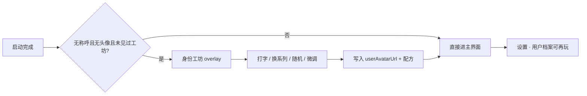

# Identity Studio：首次启动把「我」做成可玩的头像

Planned-with: grok-4.6
Suggested-Impl-Model: composer-2.5（生成器 / store / 接线）；Studio 视觉层建议用有审美的中档或以上模型做第一稿，再由 composer-2.5 收口

> **For implementer:** 只凭本文落地。不要回看规划对话。不要改 Near 方块、不要改分身默认肖像、不要复用 `onboarding_completed`。

**Goal:** 用户第一次进入 Desktop 时，用 30–60 秒玩出一张属于自己的头像；同一套工坊可在设置里反复玩。乐趣来自「改一下立刻变脸」，不是填一张表。

**Architecture:** 本机用 DiceBear 核心库按 `style + seed + 少量 options` 生成 SVG data URI，写入已有的 `userAvatarUrl`。配方另存，方便改称呼/换系列时重生成。Near 与分身继续走方块。

**Tech Stack:** Desktop React + Zustand + Vite；`@dicebear/core` + 5 个独立 style 包（本机生成，零网络）。

---

## 对上一版判断的修正（根因）

上一版（Grok 4.7）工程边界大体正确：不要塞进安装向导、Near 保持方块、存 `style+seed`、本机生成、精选风格、新 flag 不要复用 `onboarding_completed`。

它漏了仓库里已经发生过的事，因此乐趣设计偏薄、范围也偏大：

1. **分身已经用过 DiceBear，后来主动换成方块。** `agenticx/avatar/portrait.py` 仍留着 `https://api.dicebear.com/9.x/notionists/svg` 与 `PORTRAIT_STYLE_LEGACY_GENERATED = "notionists-v1"`，但 `fetch_collection_portrait_url()` / `generate_avatar_portrait_url()` 现在只返回本机 `near-cube-v3`。`needs_portrait_refresh()` 会把旧插画脸刷成方块。v1 **禁止**再把分身默认改回 DiceBear，否则是回退。
2. **用户头像才是空的。** `userAvatarUrl` 只有上传图片；`isPersistedUserAvatarUrl()` 明确把方块排除在「我」之外。自定义乐趣应落在「我」，不是再给分身加一套脸。
3. **产品已经有玩法语言。** Near 服装是色板 +「随机一套」+「抽卡」。身份工坊应复用同一套手感（大预览、点选即变、Shuffle），不要做成三步问卷。
4. **旧欢迎页已废。** `App.tsx` ~L579 把 `onboardingCompleted` 恒写 `true`。身份工坊必须用独立 `agx-identity-studio-seen`。



---

## 乐趣怎么成立（产品原则，实施时对照）

用户要感到「这是我做出来的」，必须同时满足：

| 原则 | 做成什么样 | 不要做成什么样 |
|---|---|---|
| 即时因果 | 改称呼 160ms 内脸变 | 填完表再出图 |
| 系列是世界 | 点系列，整张预览换画风 | 下拉里 63 个英文 id |
| 随机是玩 | Shuffle 只换 seed，系列与微调保留 | 随机把所有选项打乱 |
| 微调一层 | 每系列最多 3 个芯片（眼镜 / 发型 / 底） | 把 DiceBear 全量 option 铺开 |
| 立刻看见自己 | 确认后顶栏 `AccountIdentityControl` 已是这张脸 | 只存在设置页 |
| 可再玩 | 设置里同一组件，可回到生成稿 | 一次性 onboarding |

默认系列（开发者工具气质，禁止低幼/强二次元进默认轨）：

| id | 包名 | 中文标签 | 微调芯片 |
|---|---|---|---|
| `notionists-neutral` | `@dicebear/notionists-neutral` | 线稿 | 眼镜开/关、短发/长发、无底/浅底 |
| `lorelei-neutral` | `@dicebear/lorelei-neutral` | 插画 | 同上 |
| `bottts-neutral` | `@dicebear/bottts-neutral` | 机甲 | 颜色深/浅、配件开/关、无底/浅底 |
| `pixel-art-neutral` | `@dicebear/pixel-art-neutral` | 像素 | 眼镜开/关、无底/浅底 |
| `rings` | `@dicebear/rings` | 几何 | 环数少/多、无底/浅底 |

默认预选 `notionists-neutral`（仓库曾经用过这套，视觉连续）。种子默认 = 称呼；称呼为空时用 `me`。点「随机一张」生成 `studio-<timestamp36>` 这类新 seed，**不要**改称呼输入框。

---

## In scope / Out of scope

**In scope**

- 本机 DiceBear 生成器 + 5 个精选风格
- 可复用 `IdentityStudio`（大预览 / 系列轨 / Shuffle / 最多 3 个微调 / 上传照片）
- 首次 overlay（可跳过）+ 设置「用户档案」接入同一组件
- `userAvatarUrl` + 配方持久化；改称呼在 `source=studio` 时重生成
- 中英文案；风格署名一行

**Out of scope（严禁顺手做）**

- 安装包 / DMG / NSIS 向导
- 改 Near 方块、`UserCubeColorwayPicker`、cube gacha
- 改分身默认肖像、`portrait.py` 生成路径、`needs_portrait_refresh` 语义
- 请求 `api.dicebear.com` 或任何远程头像
- 复用 / 改写 `onboarding_completed`
- 上架 63 套风格、AI 画人脸、企业 portal
- 改 `agenticx/studio/server.py` import 区

---

## 数据模型

### 配方（localStorage `agx-user-avatar-studio`）

```ts
type IdentityStudioRecipe = {
  source: "studio" | "upload";
  style: "notionists-neutral" | "lorelei-neutral" | "bottts-neutral" | "pixel-art-neutral" | "rings";
  seed: string;
  options: Record<string, string | number | boolean | string[]>;
};
```

- `source=studio`：`userAvatarUrl` 必须是该配方现生成的 SVG data URI。
- `source=upload`：保留最后一份配方，设置里可「回到生成头像」。
- `agx-user-avatar-url` 继续只存最终图（已有）。
- `agx-identity-studio-seen=1`：overlay 已看过或已跳过。已有头像或已有称呼的老用户启动时直接记 seen，不打断。

### Store

`desktop/src/store.ts` 现有 `userAvatarUrl` / `setUserAvatarUrl` / `userNickname`（~L623–737, ~L1591–1607）保持图片写入路径。新增：

```ts
userAvatarStudio: IdentityStudioRecipe | null;
identityStudioSeen: boolean;
setUserAvatarStudio: (recipe: IdentityStudioRecipe | null) => void;
setIdentityStudioSeen: (seen: boolean) => void;
commitStudioAvatar: (recipe: IdentityStudioRecipe, nickname?: string) => void;
```

`commitStudioAvatar` 必须原子写入：生成 data URI → `userAvatarUrl` + 配方 + `identityStudioSeen=true`。可选同时 `setUserNickname`。禁止只写图不写配方。

`setUserNickname`（~L1587）：若当前 `userAvatarStudio?.source === "studio"`，用新称呼重算 seed（用户没点过 Shuffle 时 seed 跟随称呼；点过 Shuffle 则 seed 冻结，见生成器 `seedFrozen`）。为少加字段：配方加 `seedFrozen?: boolean`。Shuffle 设 `true`；用户清空称呼以外手动改回跟随则不必做（v1 不提供「解除冻结」按钮）。

---

## 精确落点

### 1) 生成器 — 新建 `desktop/src/utils/identity-studio.ts`

依赖（在 `desktop/` 安装，钉 v9 以对齐仓库里残留的 9.x 风格语义；禁止装整个 `@dicebear/collection`）：

```bash
cd desktop
npm install @dicebear/core@9.2.4 \
  @dicebear/notionists-neutral@9.2.4 \
  @dicebear/lorelei-neutral@9.2.4 \
  @dicebear/bottts-neutral@9.2.4 \
  @dicebear/pixel-art-neutral@9.2.4 \
  @dicebear/rings@9.2.4
```

若 9.2.4 不存在，改用各包当前 9.x 最新，**五个 style 主版本必须一致**。不要上 10/11（API 换成 `Avatar` + JSON definition，实施成本更高）。

```ts
import { createAvatar } from "@dicebear/core";
import { notionistsNeutral } from "@dicebear/notionists-neutral";
// …其余 4 个

export const STUDIO_STYLE_IDS = [
  "notionists-neutral",
  "lorelei-neutral",
  "bottts-neutral",
  "pixel-art-neutral",
  "rings",
] as const;

export function buildStudioSvgDataUri(recipe: IdentityStudioRecipe): string {
  const style = styleModule(recipe.style);
  const avatar = createAvatar(style, {
    seed: recipe.seed || "me",
    size: 128,
    ...normalizeOptions(recipe.style, recipe.options),
  });
  return avatar.toDataUri();
}

export function randomStudioSeed(): string {
  return `studio-${Date.now().toString(36)}`;
}

export function defaultRecipe(nickname: string): IdentityStudioRecipe {
  const seed = nickname.trim() || "me";
  return {
    source: "studio",
    style: "notionists-neutral",
    seed,
    seedFrozen: false,
    options: { glasses: false, hair: "short", background: "none" },
  };
}
```

`normalizeOptions` 必须按风格白名单映射到该包真实 option 名（眼镜 → `glasses` / `glassesProbability`，底 → `backgroundColor: ['transparent']` 或浅灰）。**每个风格的映射表写死在本文件**，禁止运行时猜。实施前先在 Node/vitest 里对每个 style `createAvatar(...).toString()` 一次，确认 option 名；名不对就改映射，不要把错误 option 传进库。

透明底必须能在 light / dim / dark 下看清。工坊预览容器用 `bg-surface-card`，不要假定白底。

署名：设置与 overlay 底部一行「头像风格由开源头像库及各风格作者提供」。不要在 commit / PR 里写第三方品牌名（仓库 git 规则）；**UI 文案可以写库名**，因为用户要知道授权来源。

### 2) 工坊 UI — 新建 `desktop/src/components/identity/IdentityStudio.tsx`

对照 `UserCubeColorwayPicker.tsx` 的密度：大预览、色板/系列轨、Shuffle、主按钮用 `--ui-btn-primary-*`。

```tsx
type Props = {
  nickname: string;
  onNicknameChange: (name: string) => void;
  recipe: IdentityStudioRecipe;
  onRecipeChange: (next: IdentityStudioRecipe) => void;
  onUploadFile: (file: File) => void;
  compact?: boolean; // settings 用 true
};
```

布局（overlay 非 compact）：

- 中央 160×160 圆预览；换 style/seed 用 180ms opacity crossfade，不要整页刷新
- 预览下：称呼 input（max 48，与 store 一致）
- 一行 5 个系列圆钮（每个预览用固定 demo seed `Felix` 生成小图，避免随用户 seed 让色板乱跳）
- 右侧/下方：`Shuffle`「换一张」、隐藏 file input「用照片」
- 展开「微调」：最多 3 个芯片，选中用 `bg-surface-card-strong text-text-strong`
- 不要长说明

`compact`：预览 96、系列轨保留、微调默认折叠。设置页用这个。

称呼 debounce 160ms 后：若 `!seedFrozen`，`seed = nickname || "me"` 并 `onRecipeChange`。

### 3) 首次 overlay — 新建 `desktop/src/components/identity/IdentityStudioOverlay.tsx`

- 全屏主题化遮罩 + 居中卡（宽约 420，不要异常拉宽）。取消在左、主按钮在右紧邻（与设置弹层一致）
- 主按钮「就用这张」→ `commitStudioAvatar` + 关
- 「稍后再说」→ 只 `setIdentityStudioSeen(true)`，不写头像
- 不挡 `focusMode`；只在 `configLoaded && apiBase && !focusMode && !identityStudioSeen && !userAvatarUrl && !userNickname` 时出现
- 已有头像或已有称呼：`App.tsx` 启动时直接 `setIdentityStudioSeen(true)`，不弹

挂载：`desktop/src/App.tsx` 主 return 里、`ExternalLinkConfirmDialog` 旁（~L2599）。

### 4) 设置接入 — `desktop/src/components/SettingsPanel.tsx`

用户档案 Panel 现况（~L7276–7336）：点圆头像 = 上传；hint =「点击头像即可更换」。

After：

- 圆头像仍可点上传（老路径保留）
- 头像右侧加「设计头像」展开，内嵌 `<IdentityStudio compact />`
- hint 改为「可以玩一套生成头像，也可以上传照片。」
- 「恢复默认」同时清 `userAvatarUrl` 与配方
- 上传成功：`source=upload`，保留上一份 style/seed 以便回到生成

不要把工坊再做一个第二套 state；draft 以 store 配方为源，本地只持 debounce 中的 nickname。

### 5) Store / 校验 — `desktop/src/store.ts` + `desktop/src/utils/identity-avatar.ts`

`isPersistedUserAvatarUrl`：DiceBear SVG data URI 必须返回 true（不是方块即可）。现逻辑已排除 `isNearCubePortraitUrl`，生成器不要写入 `data-portrait="near-cube`。

`store.identity.test.ts` 现有「换方块不丢用户照片」。补：

- `commitStudioAvatar` 后 `userAvatarUrl` 以 `data:image/svg+xml` 开头，配方 `source=studio`
- 再 `setUserCubeColorwayId("matcha-lid")`，用户 SVG 仍在
- `source=studio` 且 `seedFrozen=false` 时改称呼，URL 变且仍是 SVG
- `seedFrozen=true` 时改称呼，URL 不变

### 6) i18n

`desktop/locales/zh/settings.json` `profile` 段（~L128）与 `en/settings.json` 对称新增：

- `studioTitle` / `studioHint` / `studioShuffle` / `studioUsePhoto` / `studioConfirm` / `studioSkip` / `studioTweak` / `studioCredit`
- 五个 style 标签、微调芯片标签

overlay 可用 `settings` namespace，不必新开 ns。

---

## 子规划 → 推荐模型

| 子规划 | Suggested-Impl-Model | 理由 |
|---|---|---|
| A. 生成器 + 配方类型 + vitest | composer-2.5 | 纯函数、映射表、断言 SVG |
| B. store 持久化 + identity 测试 | composer-2.5 | 仿现有 localStorage 模式 |
| C. IdentityStudio + Overlay 视觉 | 有审美的中档或以上 | 首次印象，密度对齐设置页 |
| D. Settings / App 接线 + i18n | composer-2.5 | 对照现有 Panel 模式 |

最终 `Impl-Model` trailer 以实际使用为准。

---

## 任务（按序，可单独 commit）

### Task 1: 生成器与映射表

**Files:**
- Create: `desktop/src/utils/identity-studio.ts`
- Create: `desktop/src/utils/identity-studio.test.ts`
- Modify: `desktop/package.json`（仅加上述 6 个依赖）

**Step 1:** 写失败测试：`defaultRecipe("阿来")` 的 style/seed；`buildStudioSvgDataUri` 对 5 个 style 都返回 `data:image/svg+xml` 且 decode 后含 `<svg`；`randomStudioSeed` 两次不等；未知 option 被丢掉。

**Step 2:** `cd desktop && npx vitest run src/utils/identity-studio.test.ts` → FAIL（模块不存在）。

**Step 3:** 安装依赖，写死 5 个 style 的 option 映射，实现生成。

**Step 4:** 同上 vitest → PASS。抽查 `rings` 透明底仍出 SVG。

**Step 5:** 只 commit 这 3 个文件 + lockfile。

### Task 2: store 配方

**Files:**
- Modify: `desktop/src/store.ts`（state ~L623、actions ~L736、load ~L1141、setters ~L1591）
- Modify: `desktop/src/store.identity.test.ts`
- Modify: `desktop/src/utils/identity-avatar.test.ts`（如需断言 SVG data URI 可通过）

**Before（setUserAvatarUrl ~L1598）:** 只写 URL。
**After:** 保留该方法给上传；studio 走 `commitStudioAvatar`。

键名：`agx-user-avatar-studio`、`agx-identity-studio-seen`。load 时 JSON 坏掉则当 `null` / `false`，不要抛。

vitest：`cd desktop && npx vitest run src/store.identity.test.ts src/utils/identity-avatar.test.ts`

### Task 3: 工坊组件

**Files:**
- Create: `desktop/src/components/identity/IdentityStudio.tsx`
- Create: `desktop/src/components/identity/IdentityStudio.test.tsx`

测试（testing-library）：

- 改称呼后预览 `img[src]` 变成新 data URI（fake timers 160ms）
- 点第二个系列，recipe.style 变
- 点 Shuffle，seed 变、style 不变、称呼 input 仍是原字
- 最多渲染 3 个微调芯片

视觉：对齐 `UserCubeColorwayPicker` 与 settings token，禁止硬编码 cyan、禁止半透到看不清。

### Task 4: overlay + App

**Files:**
- Create: `desktop/src/components/identity/IdentityStudioOverlay.tsx`
- Modify: `desktop/src/App.tsx`（~L2532 `configLoaded` 分支内、~L2599 旁）

门闩伪代码：

```ts
const shouldOfferStudio =
  configLoaded &&
  Boolean(apiBase) &&
  !focusMode &&
  !identityStudioSeen &&
  !userAvatarUrl.trim() &&
  !userNickname.trim();
```

老用户有称呼或头像：config 加载后 `setIdentityStudioSeen(true)`（仅当尚未 seen）。

### Task 5: 设置页 + i18n

**Files:**
- Modify: `desktop/src/components/SettingsPanel.tsx`（用户档案 Panel ~L7276–7336）
- Modify: `desktop/locales/zh/settings.json`、`desktop/locales/en/settings.json`

上传仍走 `handlePickUserAvatar`（~L5437），成功后把配方 `source` 标 `upload`。

`cd desktop && npx vitest run src/components/settings/UserCubeColorwayPicker.test.tsx src/store.identity.test.ts src/utils/identity-studio.test.ts src/components/identity/IdentityStudio.test.tsx`

### Task 6: 浏览器/Desktop 手验

Desktop 无浏览器工具时：清 `localStorage` 的 `agx-user-avatar-*` 与 `agx-identity-studio-seen`，重启 `npm run dev`（Vite 默认 5713）。

手验清单见下方 AC。不要只截一张静态图。

---

## Requirements

### FR-1 本机生成
- 5 个风格、零网络、结果为 SVG data URI。
- AC-1: 断网 vitest 5 风格全绿。
- AC-2: 生成物不含 `data-portrait="near-cube`。

### FR-2 工坊手感
- 称呼 / 系列 / Shuffle / ≤3 微调即时变脸；Shuffle 不改称呼。
- AC-3: IdentityStudio 测试覆盖上述 4 个交互。
- AC-4: 系列轨小图用固定 seed `Felix`，不随用户 seed 乱跳。

### FR-3 首次 overlay
- 空身份弹一次；跳过只记 seen；确认后顶栏是这张脸。
- AC-5: 清 storage 重启出现 overlay；「稍后再说」后重开不再出现。
- AC-6: 已有 `userNickname` 或 `userAvatarUrl` 的档案不弹。
- AC-7: Focus Mode 不弹。

### FR-4 设置可再玩
- 同一组件；上传仍可用；恢复默认双清。
- AC-8: 设置里换系列后 `AccountIdentityControl` 立即变。
- AC-9: 上传照片后改方块配色，用户照片仍在（旧 identity 测试继续绿）。
- AC-10: 上传后再「回到生成头像」能恢复上一份 style/seed。

### FR-5 配方可重放
- 存 style/seed/options/source；未冻结时改称呼重生成。
- AC-11: store 测试覆盖冻结 / 未冻结。
- AC-12: 刷新后头像与配方一致（同一 data URI 或同一 SVG 结构）。

### NFR
- NFR-1: 不改 `server.py`、`portrait.py` 默认生成、cube gacha。
- NFR-2: light/dim/dark 预览都可读。
- NFR-3: 主按钮用主题 `--ui-btn-primary-*`。
- NFR-4: git commit / PR 不写第三方品牌或对标句；UI 署名除外。
- NFR-5: 新增依赖仅限列出的 6 个包。

---

## 风险

| 风险 | 处理 |
|---|---|
| style option 名与文档不一致 | Task 1 先对每个包打一发 SVG，映射写死 |
| 5 个 JSON/包撑大 bundle | 禁止 `@dicebear/collection`；只要 5 个 style |
| SVG data URI 撑满 localStorage | size=128；超 180KB 则降到 96 再存（与 portrait 180_000 上限同量级） |
| 老用户被 overlay 打断 | 有称呼或头像直接 seen |
| 实施时误改分身方块 | Out of scope；`needs_portrait_refresh` 禁止动 |

---

## 以后再做（本文不实施）

- 分身 **opt-in** 插画脸：新 `portrait_style`（如 `studio-v1`），且 `needs_portrait_refresh` 不得把它刷回方块
- 工坊里顺带点一下 Near 方块（容易做成第二问卷，v1 不做）
- 更多风格、导入自定义 style JSON
