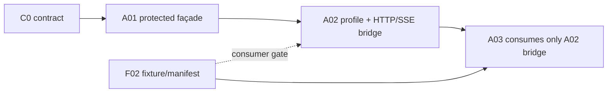

# A02：Near 金融连接、受保护 MCP façade 与 run HTTP/SSE 桥

Planned-with: Manus
Suggested-Impl-Model: **代码专精中档**（Electron 安全存储、主进程网络边界、Studio 集成和既有 MCP 生命周期）
Parent-Plan: [金融垂类研究智能体：双仓 Master Plan（canonical planning branch）](https://github.com/DemonDamon/FinnewsHunter/blob/docs/finance-agent-master-plan-20261001/.cursor/plans/pending/2026-10-01-finance-agent-master.plan.md)；合并后的固定位置：[main pending](https://github.com/DemonDamon/FinnewsHunter/blob/main/.cursor/plans/pending/2026-10-01-finance-agent-master.plan.md)
Plan-Id: `2026-10-01-finance-02-near-connection`
Plan-Type: Implementation Subplan（**pending，未实施**）
Owner: AgenticX / Near Desktop
Timebox: **约 1 周，最长 2 周**

> **唯一接入边界。** A02 消费 C0 的五个 MCP 工具、A01 已合并的 `ProtectedRemoteMcpFacade` 和 F02 的权威 fixture。它既是 Near 金融 MCP profile 的唯一安全入口，也是 A03 唯一可用的、受限的 finance HTTP/SSE IPC/preload bridge。FinnewsHunter 仍是 principal、授权、ResearchRun、Evidence、配额、许可和业务事件的权威；Near 不复制业务状态机。

## 1. 目标与完成定义

在 Settings → MCP 提供一张“金融研究服务”卡，并交付一条供 A03 消费的固定能力桥：

1. **受保护 MCP profile**：hydrate、status、connect、reconnect 均只经 A01 `ProtectedRemoteMcpFacade`，其 protected 输入固定为 `remote_security.credential_ref`、已认证 `PrincipalContext` 和 `CredentialResolver`。不得构造 `MCPServerConfig(headers={secret})`，不得读取/写入普通 raw `mcp.json`。
2. **凭据与身份边界**：Electron main 是唯一的持久凭据所有者；`safeStorage` 不可用即拒绝保存。Studio 至多持有短生命周期、内存中的 resolver material；renderer、日志、status API 和普通配置永不见 secret。Desktop admin token 只认证 Studio 管理边界，绝不作为金融 Authorization。
3. **A03 消费桥**：preload 只暴露有界的 `createRun`、`getRun`、`getEvidence`、`subscribeRunEvents`、`unsubscribeRunEvents`（及只读 status）。Electron main 以安全凭据发起固定 HTTPS REST/SSE 路径，发送 `Last-Event-ID`，解析并净化事件后才转给 renderer；不暴露 token、headers、任意 URL 或原始 SSE frame。
4. **fail closed**：非 HTTPS、未认证/无权、认证主体无法绑定、TLS/网络失败、C0 合同不匹配或 bridge 输入越界时，金融能力不可用；通用聊天和其他 MCP 不受影响。

本节点不做 A03 的市场收件箱、run reducer、证据 drawer 或 UI 状态机，也不实现 FinnewsHunter 服务端、重写 A01 transport 或声称 F02 尚未发布的能力已经存在。

## 2. 冻结契约、前置条件与不变量

### 2.1 C0 与 A01 合同

- C0 MCP v1 allowlist **恰为五项**：`finnews.search_articles`、`finnews.get_evidence`、`finnews.get_market_snapshot`、`finnews.start_research`、`finnews.get_run`。发现额外、缺失或 fixture envelope 不符时为 `contract_mismatch`，不启用部分工具。
- C0 REST 只允许本桥调用 `POST /api/v1/research/runs`、`GET /api/v1/research/runs/{id}`、`GET /api/v1/research/evidence/{id}?run_id=<id>`、`GET /api/v1/research/runs/{id}/events`。证据读取必须传已授权 run 的 `run_id`，不得省略或以任意 URL 替代。HTTP 与 MCP 必须代表同一 FinnewsHunter principal；`start_research` 仍由服务端执行 `research:create`、配额、审计和许可检查。
- A01 的 protected façade 是硬前置。A02 只能将 `MCPServerConfig` 的非敏感字段、`remote_security={mode:"protected", credential_ref}`、`PrincipalContext` 和一个内存 `CredentialResolver` 交给它。**protected `MCPServerConfig` 中 `headers` 属性必须不存在，连空对象也不允许。** resolver 返回的临时 header 只在 A01 session 创建期间存活。
- `PrincipalContext` 不得从 renderer 自报的 id/scope 产生。它必须来自已定义的、服务端认证的非秘密身份绑定；F02/C0 未提供可验证绑定来源时，A02 停止在 profile 配置门禁，不猜测 token claim 或伪造 principal。

### 2.2 网络与 ownership 不变量

- Electron main 保留加密 credential record 和 subscription lifecycle；renderer 仅持有脱敏 profile/status、DTO 和 subscription id。Studio 不是凭据持久化层。
- profile 记录一个经核验的 HTTPS service origin、F02/C0 批准的 MCP endpoint path，以及 C0 固定 REST path templates。renderer 不能提供 origin、path、header、redirect target 或 TLS bypass；main 拒绝 userinfo/query/fragment、跨 origin redirect 和不在 allowlist 的 path。
- 仅 loopback Studio 可走受 Electron 控制的本地 Desktop-admin 通道；**remote Studio 的任何 secret hydration 仅可在证书校验通过的 authenticated HTTPS 管理请求中发送**，且 remote Studio origin 须在 main 的受信 allowlist。HTTP、非 loopback local 地址、无 admin 认证、证书/hostname 错误时不得发送 secret。
- A03 不新增 IPC 或 preload API；它只调用本计划冻结的 bridge。A02 不向 A03 承诺 run list、全量历史或本地批准功能。

## 3. 基线与根因

| 当前证据 | 影响 / A02 决策 |
|---|---|
| `agenticx/tools/remote_v2.py` 当前接受 URL/headers，`studio_mcp.py` 会序列化通用配置。 | 普通 remote MCP 路径不能承载金融 secret；必须等 A01 façade 禁止 protected static headers 后接入。 |
| `McpRemoteServerModal`、`mcpGetRaw` / `mcpPutRaw` 可保存 headers。 | `finnews` 是保留连接名；金融 profile 必须拒绝这条 raw JSON 路径。 |
| Electron main 已通过 context-isolated preload 调 Studio，并附 Desktop token。 | 扩展最小 typed IPC；token 留在 main，不能下放 renderer 或转发至 FinnewsHunter。 |
| 当前没有金融 HTTP/SSE desktop bridge。 | A03 不能直接 fetch、不能复用 chat SSE；A02 必须在 main 实现有界、认证、可取消的 bridge。 |
| F02 fixture 尚是前置 artifact。 | 只在带 source revision/hash 的 fixture manifest 到位后作五工具和 DTO 合同门禁；不手写平行业务 fixture。 |

## 4. 范围

### In scope

- Finance card 的受保护 profile：安全保存/移除、hydrate、status、connect/reconnect/disconnect、脱敏错误和 C0 五工具合同检查。
- Studio 内存 resolver vault 与对 A01 façade 的单一调用点；profile/status/connect 均不得有 header-based 旁路。
- Electron main + preload 的固定 finance run HTTP/SSE bridge，含 request/response bounds、SSE subscription cleanup、`Last-Event-ID` 和事件净化。
- F02 fixture manifest consumer 测试、Studio/API/Electron unit tests、desktop build 与 required server cold-start smoke。

### Out of scope

- FinnewsHunter API/MCP/认证/数据库/SSE replay log/业务授权和任何 F02 fixture 的权威定义。
- `remote_v2.py` transport 或第二个 MCP client；A02 不复写 handshake、socket reconnect 或 SSE protocol implementation。
- 任意 raw `mcp.json` 金融配置、`MCPServerConfig(headers=...)` protected 配置、renderer 网络 fetch、任意 URL/header IPC、明文凭据 fallback。
- A03 的 UI/reducer/证据抽屉，以及任何 `needs_review` 本地批准、交易、券商、账户或付费内容功能。

## 5. 文件边界与明确所有权

| 文件 | 最小职责 |
|---|---|
| `desktop/electron/finance-connection-store.ts`（新） | `safeStorage` 加密 record、原子写入及 `0600`；公开 metadata 与密文分离，main-only。record 含 opaque `credential_ref`，不把 secret 写入普通 MCP 配置。 |
| `desktop/electron/finance-run-bridge.ts`（新） | main-only HTTPS REST/SSE client：固定 allowlisted origin/path、请求和 body 上限、同一 principal 的 resolver、SSE parsing/validation/sanitization、subscription abort/cleanup。 |
| `desktop/electron/main.ts` | 注册 Finance profile IPC 和 bridge IPC；将 sanitized event 仅送回发起 subscription 的 `webContents`；窗口销毁、unsubscribe、profile 移除均 abort。 |
| `desktop/electron/preload.ts` / `desktop/src/global.d.ts` | 只暴露 typed `getFinanceMcpStatus`、profile 管理和 `financeResearch.{createRun,getRun,getEvidence,subscribeRunEvents,unsubscribeRunEvents}`；event callback 只能收到已解析的 public DTO。 |
| `agenticx/studio/finance_mcp_connection.py`（新）与 `agenticx/studio/server.py` | 临时 resolver vault、A01 façade adapter、脱敏 profile/status/connect routes；不写 secret 到 disk，不调用 raw mcp route。 |
| `desktop/src/components/SettingsPanel.tsx`、`FinanceConnectionPanel.tsx`（新）及 i18n | Finance card 只配置脱敏 metadata/secret input，不能回填 secret 或使用普通 remote modal。 |
| `tests/fixtures/contracts/finnews-mcp-v1.json` | F02 **逐字 consumer mirror**，仅在含 `source_repo`、`source_commit`/release、`sha256`、schema version 的 manifest 到位时导入。 |

明确不修改：`agenticx/tools/remote_v2.py`（由 A01 拥有）、`agenticx/cli/studio_mcp.py` 的 legacy/raw lifecycle、普通 `McpRemoteServerModal`（仅可拒绝保留名）、FinnewsHunter 任意文件，以及 A03 renderer components。

## 6. 功能需求与实施意图

### FR-A02-1：仅通过 A01 façade hydrate/status/connect

`POST /api/mcp/finance/hydrate` 接收来自 Electron main 的脱敏 endpoint metadata、opaque `credential_ref`、验证过的 principal binding 和一次性 credential material。它只将 material 存入进程内 resolver vault，然后构造：

```text
MCPServerConfig(
  name="finnews", url=approved_mcp_url, enabled_tools=C0_FIVE,
  remote_security={mode:"protected", credential_ref: opaque_ref}
  # no headers property
)
A01.ProtectedRemoteMcpFacade.hydrate_or_connect(config, principal, resolver)
```

具体 façade method 名以 A01 已导出的 public API 为准，但这四个对象和禁止 `headers` 的语义不可改变。`status` 必须由同一 façade 的脱敏 health projection 返回（如其内部读取 manager，也只能由 façade 封装）；A02 route 不得直接重建 config、解析 raw JSON 或解密 credential。`connect`/`reconnect` 同样只通过该 façade；401/403、TLS、resolver 或 contract failure 立刻移除可见 finance tools。

Studio routes 全部要求 Desktop-admin authentication。`GET status` 仅返回 `credential_present`、endpoint origin/host、transport、connection/auth/contract state、五工具 names、时间和短错误码；不返回 ref、header name/value、URL query、exception body 或 principal id。

### FR-A02-2：安全存储、身份绑定与 remote Studio transfer

保存时 main 校验 endpoint/path allowlist 和边界，再以 `safeStorage` 加密包含 secret 的 record；不能加密、解密、atomic rename 或 chmod `0600` 时返回 typed failure 并清理内存。renderer 仅获 `credential_present`，编辑留空只表示保持旧值。

main 只在已取得 service-authenticated `PrincipalContext` 后调用 hydrate。对于 local Studio，目标必须 loopback 并通过 Desktop-admin auth；对于 remote Studio，main 必须在 **authenticated HTTPS**、证书与 host 校验、配置的 trusted origin、无重定向条件同时满足时才发送 hydration body。失败时不发送任何 secret，不能降级 HTTP 或将 secret 写入 `mcp.json`。Studio 每次 resolver 使用后清理可清理 material；disconnect 清除 vault/profile overlay，remove 同时删除密文文件。

### FR-A02-3：有界、认证的 HTTP/SSE bridge

preload API contract（A03 必须原样消费）：

```ts
type FinanceResearchBridge = {
  createRun(input: BoundedResearchCreate): Promise<SanitizedRunResult>;
  getRun(runId: string): Promise<SanitizedRunResult>;
  getEvidence(input: { evidenceId: string; runId: string }): Promise<SanitizedEvidenceResult>;
  subscribeRunEvents(input: { runId: string; lastEventId?: string }, onEvent: (event: SanitizedRunEvent) => void): Promise<{ subscriptionId: string }>;
  unsubscribeRunEvents(subscriptionId: string): Promise<void>;
};
```

main derives all four C0 paths from validated IDs; it never accepts a URL/header/Authorization argument. It resolves the same secure credential/principal used for the profile, performs HTTPS requests with redirects disabled, bounds input strings/entity counts/body bytes/concurrent subscriptions/event bytes and total buffered data, and maps 401/403/429/transport/contract failures to typed public errors. For SSE it sends `Last-Event-ID` from the semantic `lastEventId` input, verifies the expected `run_id`, parses only F02/C0 public event fields, strips headers/raw frames/error bodies, and forwards only sanitized parsed events. It never forwards a token to preload/renderer. `unsubscribe`, webContents destruction and profile deletion abort the stream; automatic unlimited reconnect is forbidden.

### FR-A02-4：合同与健康

Fixture manifest parser asserts exactly five, not six, allowed MCP tools and validates required C0 envelope fields (`schema_version`、`as_of`、`source`、许可状态). A successful tools/list must equal the C0 set; any additional/missing tool is `contract_mismatch`. This is consumer validation only: no source-of-truth model, run state machine, or fixture repair belongs in AgenticX.

## 7. 测试与验收（待实施，先测后写）

| 测试 | 关键断言 |
|---|---|
| `tests/studio/test_finance_mcp_connection_api.py` | hydrate/status/connect/reconnect spy asserts invocation of A01 façade with `remote_security.credential_ref` + `PrincipalContext` + resolver and a config with **no `headers` property**; raw routes cannot create/read `finnews`; missing principal/resolver/HTTPS is fail closed; 401/403/TLS/contract cases expose no tools or secret. |
| `tests/studio/test_finance_mcp_fixture_manifest.py` | mirrored F02 manifest provenance/hash is checked; allowlist assertion is **exactly five** names, unknown/sixth/missing name fails; envelope/permission samples are consumed but not redefined. |
| `desktop/tests/finance-connection-store.test.ts` | encrypted output contains no sentinel secret, mode `0600`, unavailable secure storage/decrypt/permission failure has no plaintext output or result echo. |
| `desktop/electron/finance-run-bridge.test.ts` | only fixed HTTPS origin/path templates are callable; `getEvidence` always sends a validated `run_id` query bound to the active run and refuses missing/foreign run IDs; renderer URL/header input is impossible; request bounds and cancellation work; 401/403/429 are typed, no token/event leaks. |
| `desktop/electron/finance-run-bridge.test.ts` (SSE replay) | subscribe sends the supplied last accepted id as `Last-Event-ID`; replayed SSE events are parsed/sanitized and delivered once per received frame without raw frame/token; malformed/wrong-run/oversize input fails closed and aborts. |
| `desktop/electron/finance-remote-studio.test.ts` | a remote hydration attempt to HTTP, untrusted origin, bad certificate/hostname, redirect or missing admin auth sends no secret; authenticated HTTPS to configured origin is the only mock transport allowed, and status responses remain redacted. |
| preload/global type tests + desktop build | only the listed typed bridge functions are exposed; no `safeStorage`, raw fetch, token, arbitrary URL/header, or raw SSE API reaches renderer. |

Suggested focused commands after implementation:

```bash
cd /home/ubuntu/FinnewsHunter/AgenticX
pytest -q --no-cov \
  tests/studio/test_finance_mcp_connection_api.py \
  tests/studio/test_finance_mcp_fixture_manifest.py \
  tests/studio/test_mcp_connect_status_api.py

cd desktop
npx vitest run tests/finance-connection-store.test.ts \
  electron/finance-run-bridge.test.ts electron/finance-remote-studio.test.ts
npm run build
```

If `agenticx/studio/server.py` changes, also run the repository-mandated cold-start smoke. No current plan text claims these tests have passed.

## 8. Failure handling and rollback

| Failure | Required behavior |
|---|---|
| A01 façade absent/incompatible, no authenticated principal binding, resolver failure | Stop A02; do not create a direct client or header path. |
| secure storage or remote Studio HTTPS/admin verification failure | Do not persist/transfer secret; retain only a prior validated profile, if any. |
| 401/403/429, TLS/DNS/network, contract mismatch | Return classified redacted status, abort connection/subscription and expose no finance tools or stale successful state. |
| SSE replay, malformed event, wrong run, size/concurrency cap | Abort that subscription; renderer gets typed failure, never synthetic completion. |
| secret in raw config/log/status | Treat as security incident: disable profile, remove overlay, rotate credential and audit before re-enabling. |

Rollback removes this plan's Finance card, main/preload bridge and in-memory overlay only. It neither deletes server runs nor changes FinnewsHunter audit history.

## 9. DAG, handoff and future PR



- **Hard gate:** C0 reviewed; A01 merged with its protected façade tests; F02 provides hash-addressed fixture/manifest. A02 may build store/typed IPC in parallel but cannot declare a usable connection without those gates.
- **A03 handoff:** the frozen preload methods in FR-A02-3 plus `getFinanceMcpStatus`; no credentials, no direct HTTP/SSE, and no new IPC. A03 owns only presentation/reducer consumption.
- **Known blocker:** C0 currently states same-principal semantics but this plan requires an implementation-defined, service-authenticated nonsecret principal binding source. F02/C0 must identify it before hydrate/connect implementation; otherwise A02 remains pending.
- Future implementation uses AgenticX branch `feat/finance-a02-near-connection`, targets `main`, and touches only listed AgenticX files. This planning edit performs no git action, implementation, test claim, commit or PR.

## 10. Definition of Done

- [ ] protected finance MCP never has `MCPServerConfig.headers`; hydrate/status/connect all use A01 façade with ref, principal and resolver.
- [ ] Electron main is the only persistent credential owner; remote Studio transfer is authenticated HTTPS only; renderer/raw config/status/logs expose no secret.
- [ ] C0 fixture consumer gate asserts exactly five tools and fails closed on mismatch.
- [ ] A03 has the bounded authenticated HTTPS bridge, including sanitized SSE with `Last-Event-ID`, unsubscribe and required replay/unauthorized/remote-Studio tests.
- [ ] Existing non-finance MCP/chat behavior, required cold-start smoke and desktop build remain green.
