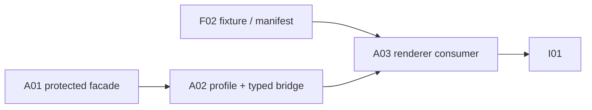

# A03：Near 金融工作台——A02 bridge 的 run、证据与风险展示

Planned-with: Manus
Suggested-Impl-Model: **前端视觉/交互能力强的模型**（高密度桌面信息架构、严格事件消费、断线恢复和无障碍交互）
Parent-Plan: [金融垂类研究智能体：双仓 Master Plan（canonical planning branch）](https://github.com/DemonDamon/FinnewsHunter/blob/docs/finance-agent-master-plan-20261001/.cursor/plans/pending/2026-10-01-finance-agent-master.plan.md)；合并后的固定位置：[main pending](https://github.com/DemonDamon/FinnewsHunter/blob/main/.cursor/plans/pending/2026-10-01-finance-agent-master.plan.md)
Plan-Id: `2026-10-01-finance-03-near-workspace`
Depends-On: **A02 已合并的 Finance profile + HTTP/SSE bridge** 与 **F02 已发布的 v1 fixture/manifest**；可与 F03 并行
Plan-Type: Implementation Subplan（**pending，未实施**）

> A03 是 renderer-only 的 C0 消费者。它只使用 A02 已冻结的 preload bridge，绝不新增 Electron IPC、preload API、HTTP/SSE client、凭据存储或任意 URL 能力。FinnewsHunter 是 run、证据、授权、配额、许可与 `needs_review` 的权威；Near 只显示服务端结果和本地最小恢复游标。

## 1. 目标与完成定义

在 Near Desktop 增加一个与 `WorkPanel` 并列的金融工作台侧栏：

1. 市场收件箱可提交一个**范围受限的只读研究请求**，明确 entity、`as_of` 和“服务端将重新检查身份、`research:create`、配额、审计、许可与政策”的内联披露；不含交易、账户、券商或任意 URL。
2. 以 A02 bridge 创建、查询、订阅和取消订阅 C0 run；正确消费 `Last-Event-ID` replay、严格 seq 和服务端 canonical snapshot。
3. 在独立证据 drawer 按许可与时点显示 `EvidenceV1`；不把受限内容、主张或授权信息持久化到本地。
4. 对未认证、无权、配额、失联、时间倒挂、许可限制和 `needs_review` 显示准确的风险/状态卡，不伪造成功或“本地批准”。
5. 不回归既有聊天、WorkPanel、子智能体、Enterprise 或通用确认行为。

**只读 research create 是可逆、受服务端幂等/授权控制的提交，不需要本地强制一次确认。** 本计划采用内联披露 + 范围受限提交 + 服务端授权/配额，而非 `ConfirmDialog`。未来任何外部/不可逆动作的 approval 设计明确不在 A03 scope。

## 2. 冻结依赖、唯一 bridge 与开工门禁

### 2.1 C0 消费规则

- 仅消费 `EvidenceV1`、`ClaimV1`、`ResearchRunV1`、`RunEventV1`、`ResearchBriefV1` 的 F02 fixture 定义；保留 `as_of`、`available_at`、`timezone`、`license_scope`、`quality_status` 和服务端 status 的原义。
- run event 仅接受 C0 类型与单 run 严格递增 `seq`；重连语义是 `Last-Event-ID`，不是 chat session replay。C0 服务器才是 run 终态和授权的权威。
- `needs_review` 仅表示**等待服务端复核**。卡片可以显示“重新同步”和解释，不能出现批准、绕过、强制继续或伪装成人工已批准的控件。

### 2.2 A02 public contract（A03 不得扩展）

A03 只通过 `window.agenticxDesktop` 已发布的以下 A02 方法工作：

```ts
getFinanceMcpStatus(): Promise<SanitizedFinanceStatus>
financeResearch.createRun(input: BoundedResearchCreate): Promise<SanitizedRunResult>
financeResearch.getRun(runId: string): Promise<SanitizedRunResult>
financeResearch.getEvidence(input: { evidenceId: string; runId: string }): Promise<SanitizedEvidenceResult>
financeResearch.subscribeRunEvents(
  { runId: string, lastEventId?: string },
  onEvent: (event: SanitizedRunEvent) => void,
): Promise<{ subscriptionId: string }>
financeResearch.unsubscribeRunEvents(subscriptionId: string): Promise<void>
```

A03 passes a semantic cursor only; it never makes/sets `Last-Event-ID` headers. It never receives a token, raw header, raw SSE frame, profile secret, arbitrary origin/path, or an Electron event channel. A02 main owns HTTPS allowlisting, authentication, bounds, parsing, sanitized delivery and abort lifecycle. **No new IPC, preload edit, main-process edit or substitute bridge is permitted in A03.**

### 2.3 Stop gates

1. A02 is merged and exposes exactly the above typed bridge with its replay, unauthorized and remote-Studio security tests green.
2. F02 fixture manifest and consumer copy give source revision/release, hash and C0 v1 samples for create/get/evidence/SSE replay, 401/403, quota, `needs_review`, license restriction and time anomaly. If actual pointer keys differ, mapping changes only in A03’s contract adapter after C0/F02 revision.
3. A02 status proves a usable authenticated connection. Otherwise the entry can explain unavailability but must not call create/subscription methods.
4. If a fixture, bridge method or DTO is absent/incompatible, stop and update C0/A02/F02; do not use a local mock transport as a production fallback.

## 3. Current baseline and root cause

| Evidence | A03 consequence |
|---|---|
| `desktop/src/store.ts` has only workspace/members/graph side-panel state; `openRunDrawer` is mutually exclusive. | Add minimal finance pane/cursor UI state and preserve right-panel exclusivity; do not reuse graph/subagent IDs. |
| `App.tsx` persist whitelist stores pane UI state. | Persist only `runId` and event cursor (`lastEventId`, `lastSeq`, timestamp), never DTO bodies, evidence, principal, secret or raw error. |
| `ChatPane.tsx` has broad/narrow right-panel mounting but its SSE code is for `/api/chat`. | Mount a separate finance panel using existing layout semantics; never reuse chat parser, session id or local message merge. |
| Current Desktop has generic confirmation and scope helpers. | They are unrelated to this reversible read-only submit. A03 **does not edit** `ConfirmDialog.tsx`, `confirm-scope.ts`, `App.tsx` confirm controller, or their tests. |
| Current code has no finance renderer client. | A03 adds a thin typed wrapper over the already-published A02 bridge only; it cannot open fetch/EventSource or add Electron handlers. |

## 4. Scope

### In scope

- Pane-local finance panel switch, market inbox, minimal known-run references and restart cursor.
- F02-fixture-driven DTO parser, pure reducer, wrapper over A02 bridge, run observer, evidence drawer and status/risk cards.
- Inline disclosure and range-limited C0 create form; service-side 401/403/429/`needs_review` rendering.
- Broad right rail / narrow overlay, keyboard/ARIA and fixture-only visual tests.

### Out of scope

- Any `ConfirmDialog`/confirm-scope/promise-controller edit, forced local confirmation, approval UI for `needs_review`, or approval policy for future external actions.
- New IPC/preload/main handlers, direct fetch/EventSource, secret/profile access, token/header/URL input, raw MCP or direct FinnewsHunter database access.
- Trading, broker/account functions, paid-content purchase, arbitrary source retrieval, report publication, prediction or recommendation.
- F02 API/service state machine/fixture authorship, F03 evaluation, I01 integration, Enterprise, generic chat routing, `GraphRunStore`, WorkPanel file/terminal behavior, or fabricated all-history run list.

## 5. File boundaries

### Existing files to modify

| File | Narrow change |
|---|---|
| `desktop/src/store.ts` | Add finance panel open/active run/minimal cursor state and mutual-exclusion actions; no business results. |
| `desktop/src/App.tsx` | Extend persisted pane-state normalization/whitelist for minimal finance cursor only; no confirmation code changes. |
| `desktop/src/components/ChatPane.tsx` | Toolbar entry, wide/narrow panel mounting and calls into `FinanceWorkspacePanel`; pass only A02 typed bridge/status methods. |
| `desktop/package.json` | Add a scoped Finance visual-test script only if repository conventions require it; do not upgrade dependencies. |

### New A03 files

| File | Responsibility |
|---|---|
| `desktop/src/components/finance/finance-contract.ts` | Runtime C0 DTO/fixture-manifest validation and display helpers; unknown/malformed data fail closed. |
| `desktop/src/components/finance/finance-run-reducer.ts` | Pure dedupe/strict-seq/gap/cursor reducer; no server status transition logic. |
| `desktop/src/components/finance/finance-run-client.ts` | Thin adapter over precisely the A02 methods in §2.2; no fetch, headers, URL or IPC code. |
| `desktop/src/components/finance/FinanceWorkspacePanel.tsx` | Connection state, inline disclosure, bounded create form, run selection and risk cards. |
| `desktop/src/components/finance/ResearchRunObserver.tsx` | Snapshot/event timeline, resync and subscription cleanup UI. |
| `desktop/src/components/finance/EvidenceDrawer.tsx` | Lazy evidence read and license/time-safe drawer. |
| component/reducer/client tests and fixture-only Playwright harness | Tests named in §7; all fake the A02 bridge, not an HTTP server. |
| `desktop/tests/fixtures/finance/f02-contract-v1.json` | Versioned F02 consumer copy with provenance/hash; no hand-authored parallel business payload. |

### Explicitly not touched

`desktop/electron/main.ts`, `desktop/electron/preload.ts`, `desktop/src/global.d.ts`, `agenticx/studio/**`, `agenticx/runtime/**`, `ConfirmDialog.tsx`, `confirm-scope.ts`, generic chat SSE files, `WorkPanel.tsx`, and FinnewsHunter files.

## 6. Functional requirements

### FR-A03-1: fixture-driven contract boundary

`finance-contract.ts` verifies manifest provenance/hash and parses only F02/C0 DTOs. It rejects unknown schema/status/event type, missing IDs, different `run_id`, non-positive seq, naive/invalid timestamp, invalid evidence pointer or incompatible manifest before data is rendered as a result. It does not infer financial facts, compute prices or repair payloads.

```ts
parseRunEvent(raw, expectedRunId): Result<RunEventV1, ContractError>
// requires expected id, positive seq, known C0 event type, offset-bearing occurred_at
```

`ClaimV1.kind` remains visibly fact/inference/hypothesis. Renderer never promotes inference/hypothesis to a fact and does not derive a claim from model text.

### FR-A03-2: market inbox, inline disclosure and scoped submission

The toolbar entry has `aria-label="打开金融工作台"`. The form accepts only fixture-defined C0 create fields: generated idempotency `request_id`, bounded `entity_ids`, timezone-bearing `as_of`, and only F02-approved optional context. There are no free URL, broker, account, order or hidden auth fields.

Immediately adjacent to submit, show this plain-language disclosure (localized as needed):

> 提交将请求**只读金融研究**，范围仅限所列实体和 `as_of`；不执行交易、不访问账户。服务端仍会校验身份、`research:create`、配额、审计、许可与政策。

The submit control invokes `financeResearch.createRun` directly after client-side form validation. It reuses the same `request_id` for timeout retry, and only shows the new run after the sanitized bridge response returns. It makes no local authorization decision, no fake approval state and no confirmation dialog. 401/403/429/transport/contract failures remain local error/status cards; `needs_review` is a server status, not an interactive approval request.

`store.ts` persists only pane open state, active run and bounded resume cursor. On narrow screens the panel uses existing overlay conventions; closing it unsubscribes locally but does not cancel a server run.

### FR-A03-3: run observer and replay consumption

The observer calls `getRun` for canonical state, then calls A02 `subscribeRunEvents({runId,lastEventId}, onEvent)`. It stores the returned subscription id and always invokes `unsubscribeRunEvents` on run change, close, unmount or terminal cleanup. It cannot reconnect by creating EventSource or setting headers.

```ts
applyEvent(state, event):
  if (seen(event.event_id) || event.seq <= state.lastSeq) return state
  if (state.lastSeq > 0 && event.seq !== state.lastSeq + 1)
    return { ...state, sync: "gap", requestedReplayFrom: state.lastEventId }
  return acceptBounded(state, event)
```

On interruption/gap it says “连接中断；研究可能仍在服务端运行”, fetches the canonical snapshot through A02 and resubscribes with the last **accepted event id**. It never synthesizes completed/failed. A terminal event is visually final only after canonical GET agrees. Startup restores only an open panel’s minimal run reference; 403/404/identity change clears it and renders no old evidence.

### FR-A03-4: evidence drawer, license and temporal safety

Evidence is lazily retrieved only with `financeResearch.getEvidence({evidenceId, runId: activeRunId})`. The run id is required by C0 to enforce owner, snapshot membership and `available_at <= run.as_of`; the drawer may not query evidence outside the active run. `license_scope=no-redisplay`, unavailable license, 403 or error clears old content and never leaves excerpt/full body in DOM/state. It may show permitted minimal metadata (`source_id`, safe source URL, hashes, timestamps, quality and license notice).

`available_at > run.as_of`, missing timezone, invalid time or snapshot mismatch produces a visible risk card and never marks evidence as factual support. The dialog uses `role="dialog"`, `aria-modal`, labelled title, focus restore, Esc, `aria-busy` and alert semantics.

### FR-A03-5: status cards without local authorization

A02 status/typed errors are rendered as unconfigured, connection unavailable, unauthenticated, unauthorized, quota limited, transport failed, contract unavailable or healthy. The panel may offer settings navigation, close or resync. It does **not** offer “approve”, “force continue”, “retry with broader scope”, “switch token”, or approval policy configuration. `needs_review` displays waiting-for-service-review with no approval affordance. Approval requirements for future external/non-reversible actions remain a separate, unplanned policy effort.

## 7. Tests and acceptance (all future/TDD tests)

| Test | Required assertion |
|---|---|
| `finance-contract.test.ts` | Validates F02 provenance/hash and C0 samples; rejects missing IDs/seq, unknown event/status, naive date, wrong run and bad evidence pointer. |
| `finance-run-reducer.test.ts` | Strict `1,2,3`; duplicate id/old seq no-op; `1→3` gap retains last trusted cursor; `needs_review` never becomes completed locally; canonical snapshot required for final state. |
| `finance-run-client.test.ts` | Mock only A02 bridge; calls exact five bridge methods, carries semantic last accepted id, unsubscribes correctly, cannot accept token/header/URL/fetch options. |
| `FinanceWorkspacePanel.test.tsx` | Unhealthy A02 status disables submission; disclosure and scoped fields visible; direct create sends exactly bounded C0 input; 401/403/429/network render status without optimistic run or confirmation dialog. |
| `ResearchRunObserver.test.tsx` | A02 replay event handling/dedup, gap resync, unsubscribe lifecycle, connection interruption copy and `needs_review` with no approval control. |
| `EvidenceDrawer.test.tsx` | `getEvidence` receives both `evidenceId` and current authorized `runId`; missing/changed run context prevents request. No-redisplay excerpt absent from DOM, time anomaly not factual, dialog keyboard/focus/loading/error behavior correct. |
| store/ChatPane regression tests | Pane mutual exclusion, minimal persistence and no changes to ordinary chat/workspace/confirmation flows. |
| fixture-only Playwright visual test | 1440px/390px light/dim/dark states for inbox/running/needs_review/license restriction; keyboard can reach toolbar, submit, resync, close and drawer; no restricted excerpt or approval control exists. |

```bash
npm --prefix desktop exec vitest run \
  src/components/finance/finance-contract.test.ts \
  src/components/finance/finance-run-reducer.test.ts \
  src/components/finance/finance-run-client.test.ts \
  src/components/finance/FinanceWorkspacePanel.test.tsx \
  src/components/finance/ResearchRunObserver.test.tsx \
  src/components/finance/EvidenceDrawer.test.tsx
npm --prefix desktop run build
npm --prefix desktop exec playwright test -c playwright.finance.config.ts tests/finance-workspace.visual.spec.ts
```

No current plan text claims these future tests pass. The harness injects fixture data through a fake **A02 bridge**, never a direct finance HTTP/SSE endpoint.

## 8. Failure, rollback and limitations

| Situation | User-visible behavior / invariant |
|---|---|
| A02 absent/unhealthy, 401/403, quota, TLS/network | Explain and fail closed; no create/subscription fallback, no Desktop token or local mock transport. |
| SSE interruption/replay/gap | Preserve trusted cursor, say server may still run, canonical GET + A02 resubscribe; no synthetic terminal result. |
| fixture/DTO mismatch | Contract unavailable; stop A03 integration rather than widening parser. |
| license/time/evidence anomaly | Show restriction/unknown/risk, remove stale restricted text and do not make fact claim. |
| UI rollback | Hide/remove A03 renderer/store fields; server run and A02 credentials remain untouched. |

## 9. DAG, handoff and future PR



- A03 cannot begin production integration until A02’s exact bridge and F02’s hash-addressed fixture are merged. F03 remains parallel and is not presumed complete.
- A03 hands I01 renderer tests and fixture provenance; it does not add credentials, HTTP transport, service authorization, approval policy or backend behavior.
- Future implementation is an AgenticX-only branch `feat/finance-a03-near-workspace` targeting `main`; it moves this plan before implementation and follows repository PR rules. This planning edit makes no git change, code change, test claim, commit or PR.

## 10. Definition of Done

- [ ] A03 consumes **only** A02’s fixed bridge; no new IPC/preload/main/network/security capability was added.
- [ ] The create UI provides inline read-only disclosure and a scoped C0 submit; FinnewsHunter service authorization/quota determine the outcome.
- [ ] No `ConfirmDialog`/confirm-scope edits, forced local confirmation, or fake `needs_review` approval UI exists; future external-action approval remains out of scope.
- [ ] seq/replay, `Last-Event-ID` bridge consumption, license/time safety, A02 error handling, accessibility and fixture provenance have the listed tests.
- [ ] Existing chat/workspace/confirmation behavior is unchanged and desktop build/visual regressions are green when implemented.
