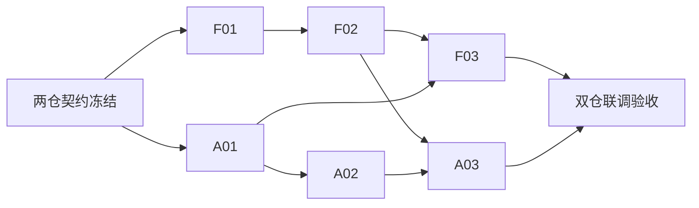

# Near 金融工作台：AgenticX 仓执行索引

Planned-with: Manus
Suggested-Impl-Model: A01/A02 为代码专精中档，A03 为有桌面视觉/交互经验的模型；实际实施模型以用户确认值为准
Plan-Id: 2026-10-01-finance-agent-execution-index
Plan-Type: Index（只索引，不直接实施）

> **给实施者**：唯一跨仓 Master Plan 在 [FinnewsHunter 的规划分支](https://github.com/DemonDamon/FinnewsHunter/blob/docs/finance-agent-master-plan-20261001/.cursor/plans/pending/2026-10-01-finance-agent-master.plan.md)。如果规划 PR 合并，则改读 `main` 上同一路径。请首先核对它的 C0 契约、DAG、权限边界及 PR 顺序；本索引只列出本仓工作，不复制另一套协议定义。本轮规划 PR 不实现功能。

**Goal:** 在 AgenticX 与 Near 中复用已有框架，为金融研究服务提供安全的远程能力消费、可恢复的 run 事件观察与可追溯的桌面工作台；不在通用 runtime 中重新实现 FinnewsHunter 的金融业务状态机。

**Architecture:** FinnewsHunter 是 Evidence、Claim、ResearchRun 与金融授权的权威；AgenticX 提供 MCP/工具调用/通用事件适配及模型、确认、观测原语；Near 负责安全的 MCP + HTTP/SSE 桥接、状态、证据与风险的用户体验。只读研究优先，没有交易工具或券商连接器；发起研究由服务端鉴权与配额保护，不人为增加桌面确认弹窗。

## 实施节点

| 节点 | 本仓子计划 | 交付 | 依赖与并行 |
|---|---|---|---|
| A01 | [通用运行时适配](2026-10-01-finance-01-runtime-adapter.plan.md) | 只补已有 MCP/事件能力的确切缺口，完善安全、权限上下文和结构化事件消费 | C0；与 F01 并行 |
| A02 | [Near 金融连接](2026-10-01-finance-02-near-connection.plan.md) | 受控 MCP 配置、凭据保护、受限 HTTP/SSE 研究桥、连接状态和契约 fixture 的测试 | A01 + C0；与 F02 并行 |
| A03 | [Near 金融工作台](2026-10-01-finance-03-near-workspace.plan.md) | 市场收件箱、run 观察、证据抽屉、风险状态 UI 与断线恢复，不新增只读研究确认门禁 | A02 + F02 契约 fixture；与 F03 并行 |

跨仓 DAG（F 节点在 FinnewsHunter）：

**执行机制**：`[F01 || A01] → [F02 || A02] → [F03 || A03] → I01`；同一批次的不同节点由独立 subagent、不同仓库/工作树及独立分支实施并各提 PR。每个子计划在开工时从 `.cursor/plans/pending/` 移到 `.cursor/plans/` 根目录；不得把另仓嵌套 checkout 加入 FinnewsHunter 提交。当前规划 PR 与未来代码实施 PR 分离。

**停止条件**：远程身份无法与金融 API principal 对齐、来源许可不足、事件 `seq`/断线恢复不一致或证据引用断裂时，不通过改 UI、自动确认或模型提示词绕过服务端限制；先修订 Master C0 与对应合同测试。
