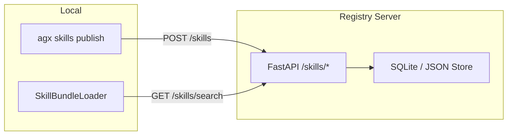
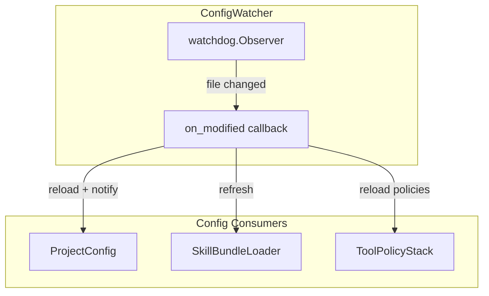

# Phase 3 生态增强计划 + 文档更新

## 一、文档更新（openclaw_proposal.md）

更新 [openclaw_proposal.md](research/codedeepresearch/openclaw/openclaw_proposal.md) 中以下内容：

### 1.1 头部状态行

- 状态从 `Phase 1 核心已落地 → Phase 2 新增方案待实现` 改为 `Phase 1/2 全部落地 → Phase 3 生态增强进行中`
- 新增 Phase 3 日期

### 1.2 Phase 2A (L722-735)

- 所有 `- [ ]` 改为 `- [x]`
- 标题后追加 `— 已完成`

### 1.3 Phase 2B (L737-744)

- 所有 `- [ ]` 改为 `- [x]`
- 标题后追加 `— 已完成`

### 1.4 评测 6.2 (L763-774)

- 追加 Phase 2 已验证状态表

### 1.5 Phase 3 详细计划

将现有 Phase 3 的 3 行占位替换为以下详细子阶段。

---

## 二、Phase 3 实现计划

### 3A: Skill 远程注册中心 API + CLI（3 周）

**新增文件：**

- `agenticx/skills/registry.py` - `SkillRegistryClient` + `SkillRegistryServer`
  - 数据模型: `RegistrySkillEntry`（name, version, description, gate, author, created_at, checksum）
  - 服务端: FastAPI app，提供 `POST /skills`（发布）、`GET /skills`（列表/搜索）、`GET /skills/{name}`（详情）、`DELETE /skills/{name}/{version}`（下架）
  - 客户端: `SkillRegistryClient`（publish / search / install / uninstall），默认连 `http://localhost:8321`
  - 存储层: 先用 JSON 文件 (`~/.agenticx/registry.json`)，预留 SQLite 接口
- `agenticx/skills/__init__.py` - 导出

**改动文件：**

- [agenticx/tools/skill_bundle.py](agenticx/tools/skill_bundle.py) - `SkillBundleLoader` 增加 `registry_url` 参数，`scan()` 时可选从 registry 拉取远程技能索引
- [agenticx/cli/main.py](agenticx/cli/main.py) - 新增 `skills` 子命令组:
  - `agx skills list` - 列出本地 + 远程技能
  - `agx skills search <query>` - 搜索远程注册中心
  - `agx skills install <name>` - 安装远程技能到本地
  - `agx skills publish <path>` - 发布本地技能到注册中心
  - `agx skills serve` - 启动本地注册中心服务
  - `agx skills uninstall <name>` - 卸载本地技能

### 3B: Config Hot Reload 全面化（2 周）

**新增文件：**

- `agenticx/core/config_watcher.py` - `ConfigWatcher` 类
  - 基于 `watchdog` 库监听配置文件变更（`agenticx.yaml`、`tool-policy.yaml`、`skills/` 目录）
  - 观察者模式: `ConfigWatcher.on_change(callback)` 注册回调
  - 防抖: 500ms debounce 避免连续触发
  - 生命周期: `start()` / `stop()` / 上下文管理器
  - 线程安全: 回调在主线程或指定 event loop 中执行

**改动文件：**

- [agenticx/deploy/config.py](agenticx/deploy/config.py) - `ProjectConfig` 增加 `watch()` / `unwatch()` 方法；`load_config()` 支持 `auto_watch=True` 参数
- [agenticx/tools/skill_bundle.py](agenticx/tools/skill_bundle.py) - `SkillBundleLoader` 支持接收 `ConfigWatcher` 信号自动 `refresh()`
- [agenticx/core/hooks/tool_hooks.py](agenticx/core/hooks/tool_hooks.py) - `ToolPolicyStack` 支持 hot reload policy YAML

**依赖：**

- `watchdog` (新增到 pyproject.toml extras)

### 3C: 端到端测试覆盖 + 文档（2-3 周）

**端到端测试：**

新增 `tests/e2e/` 目录，覆盖以下场景：

| 测试文件                               | 覆盖场景                                                             | 依赖             |
| ---------------------------------- | ---------------------------------------------------------------- | -------------- |
| `test_e2e_overflow_to_recovery.py` | Agent 执行 -> 上下文溢出 -> L1/L2/L3 递进恢复 -> 继续执行                       | Mock LLM       |
| `test_e2e_auth_rotation.py`        | LLM 调用 -> rate limit -> profile 切换 -> 重试成功                       | Mock Provider  |
| `test_e2e_skill_lifecycle.py`      | 发布 skill -> search -> install -> Agent 使用 -> uninstall           | Local registry |
| `test_e2e_config_hot_reload.py`    | Agent 运行中 -> 修改 config -> 自动生效                                   | ConfigWatcher  |
| `test_e2e_subagent_chain.py`       | 主 Agent -> handoff subagent -> depth limit -> PromptMode minimal | Mock LLM       |

**文档：**

新增/更新文档：

- `docs/architecture/phase3-ecosystem.md` - Phase 3 架构设计文档
- `docs/guides/skill-registry.md` - Skill 注册中心使用指南
- `docs/guides/config-hot-reload.md` - Config Hot Reload 使用指南
- 更新 [README.md](README.md) 中的功能列表

---

## 三、Phase 3 评测标准

| 评测项               | 验证方法                                   | 成功标准              |
| ----------------- | -------------------------------------- | ----------------- |
| Skill 注册中心        | publish -> search -> install 全流程       | 端到端 < 5s          |
| Skill CLI         | agx skills list/search/install/publish | 所有子命令正常工作         |
| Config Hot Reload | 修改 YAML -> 回调触发                        | < 1s 延迟，无丢失       |
| Hot Reload 线程安全   | 并发修改 + 读取                              | 无死锁/竞态            |
| E2E 覆盖率           | 五个核心场景                                 | 全部通过              |
| 文档完整性             | 手动 review                              | 覆盖所有 Phase 1-3 功能 |

---

## 四、风险与缓解

| 风险                 | 影响  | 缓解                                     | 回滚                     |
| ------------------ | --- | -------------------------------------- | ---------------------- |
| watchdog 平台兼容性     | 中   | 优先测试 darwin/linux；fallback 到 polling   | 禁用 auto_watch          |
| Registry 存储并发写入    | 低-中 | JSON 文件写入原子化（tmp + rename），后续升级 SQLite | 重建 registry.json       |
| Skill install 路径冲突 | 低   | 安装目录隔离 `~/.agenticx/skills/registry/`  | 手动删除目录                 |
| E2E 测试 flaky       | 中   | Mock 所有外部调用，固定超时                       | 标记 `@pytest.mark.slow` |

---

## 五、时间线

- **Week 1-3**: 3A — Skill 远程注册中心 API + CLI
- **Week 3-4**: 3B — Config Hot Reload 全面化
- **Week 4-6**: 3C — E2E 测试 + 文档

