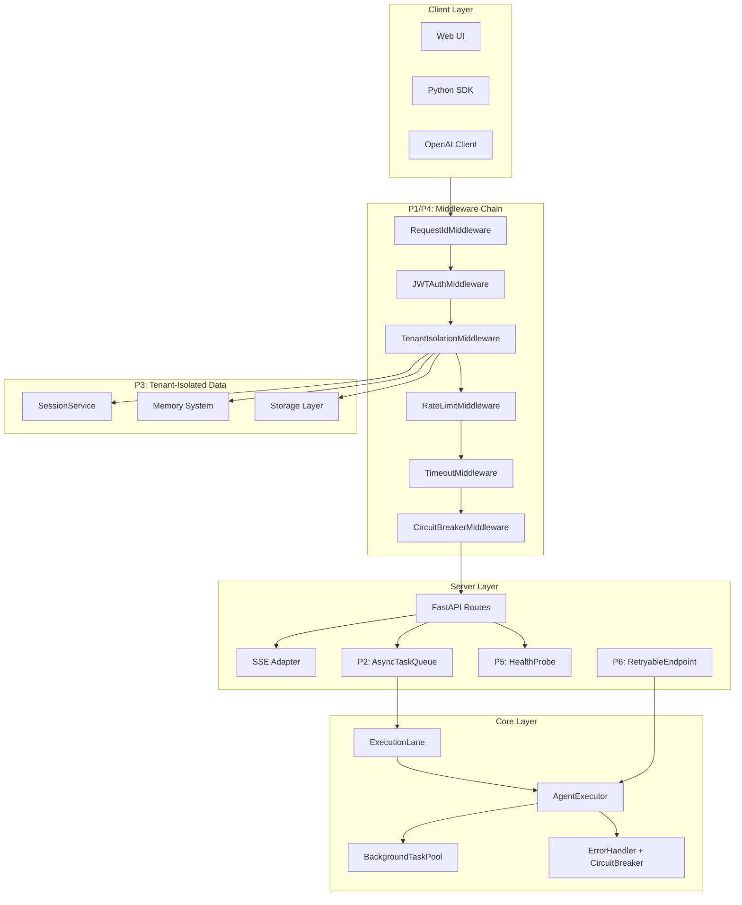

# AgenticX 第二步生产级 API 基础设施补全

## 现状盘点

已有能力（直接可用）:

- `agenticx/server/` — FastAPI + OpenAI 兼容 API + SSE 流式响应
- `agenticx/sessions/` — InMemory/Database SessionService + SessionWriteLock
- `agenticx/core/execution_lane.py` — per-session 串行化 + 全局并发上限
- `agenticx/core/error_handler.py` — ErrorClassifier + CircuitBreaker（Agent 层级）
- `agenticx/core/background.py` — 线程池后台任务池（参考 Agno）
- `agenticx/observability/mineru/rate_limiter.py` — 完整限流实现（5 种策略、6 种 scope）
- `agenticx/observability/mineru/retry_policy.py` — 完整重试实现（5 种策略）
- `agenticx/server/user_manager.py` — SQLite 用户管理
- `agenticx/core/stream_accumulator.py` — 流式内容累积
- `agenticx/deploy/` — Docker/Local/VolcEngine 部署组件

关键缺口:

1. **API 网关中间件层** — rate_limiter/retry_policy 存在于 mineru 子模块，未集成到 server 层
2. **后台任务队列** — background.py 是同步线程池，缺少 async 任务调度、持久化队列、失败重调度
3. **多租户数据隔离** — user_manager 管用户身份，但 Session/Memory/Storage 无 tenant 隔离
4. **健康检查/自愈** — /health 只返回静态 JSON，无深度探针
5. **API 认证中间件** — 当前 token 是 `secrets.token_urlsafe`，无 JWT 验证中间件
6. **请求生命周期管理** — 无 request-id 追踪、无请求超时控制

---

## 补全方案（6 个模块，按优先级排列）

### P1: API 网关中间件层

**目标**: 将已有的限流/熔断/重试能力从 mineru 提升为 server 层通用中间件

**新建文件**: `agenticx/server/middleware.py`

**设计**:

```python
# 复用现有实现，包装为 FastAPI 中间件
class RateLimitMiddleware(BaseHTTPMiddleware):
    # 内部使用 observability.mineru.rate_limiter.RateLimiter
    # 支持 per-user / per-ip / per-api-key scope
    # 返回标准 429 + Retry-After header

class CircuitBreakerMiddleware(BaseHTTPMiddleware):
    # 内部使用 core.error_handler.CircuitBreaker
    # 按路由粒度熔断
    # 返回 503 Service Unavailable

class RequestIdMiddleware(BaseHTTPMiddleware):
    # 注入 X-Request-ID header
    # 贯穿日志 / SSE / 错误响应

class TimeoutMiddleware(BaseHTTPMiddleware):
    # 请求级超时控制（默认 300s，可配置）
    # 超时返回 504 Gateway Timeout
```

**修改文件**: [agenticx/server/server.py](agenticx/server/server.py) — 在 `AgentServer.__init__` 中注册中间件链

**关键引用**:

- [agenticx/observability/mineru/rate_limiter.py](agenticx/observability/mineru/rate_limiter.py) — `RateLimiter`, `RateLimitConfig`, 5 种策略
- [agenticx/core/error_handler.py](agenticx/core/error_handler.py) — `CircuitBreaker`

---

### P2: 异步后台任务队列

**目标**: 将现有 `background.py` 线程池升级为支持持久化、失败重调度的异步任务系统

**新建文件**: `agenticx/server/task_queue.py`

**设计**:

```python
class AsyncTaskQueue:
    """基于 asyncio + DatabaseSessionService 的持久化任务队列"""
    # submit(task_fn, args, retry_config) -> task_id
    # get_status(task_id) -> TaskStatus
    # cancel(task_id)
    # 内部: asyncio.Queue + worker pool + 可选 DB 持久化
    # 失败重调度: 使用 retry_policy.RetryConfig

class BackgroundAgentRunner:
    """后台执行 Agent 任务"""
    # 将长时 Agent run 提交到 AsyncTaskQueue
    # SSE 实时推送进度
    # 支持 cancel / pause / resume
```

**修改文件**:

- [agenticx/core/background.py](agenticx/core/background.py) — 新增 `AsyncBackgroundPool` 作为协程版本
- [agenticx/server/api_routes.py](agenticx/server/api_routes.py) — 新增 `POST /tasks/submit` 和 `GET /tasks/{id}/status` 端点

**关键引用**:

- [agenticx/core/background.py](agenticx/core/background.py) — 现有 `BackgroundTaskPool` 设计模式
- [agenticx/observability/mineru/retry_policy.py](agenticx/observability/mineru/retry_policy.py) — `RetryConfig`, `RetryPolicy`

---

### P3: 多租户数据隔离

**目标**: 在 Session / Memory / Storage 层注入 tenant_id 维度，实现数据完全隔离

**新建文件**: `agenticx/server/tenant.py`

**设计**:

```python
class TenantContext:
    """请求级租户上下文（基于 contextvars）"""
    # 从 JWT / API-Key 提取 tenant_id
    # 通过 Python contextvars 在整个请求链路传播

class TenantIsolationMiddleware(BaseHTTPMiddleware):
    # 从请求提取 tenant_id 并设置到 TenantContext
    # 下游 SessionService / Memory 自动注入 tenant_id 过滤
```

**修改文件**:

- [agenticx/sessions/base.py](agenticx/sessions/base.py) — `BaseSessionService` 方法签名增加可选 `tenant_id` 参数
- [agenticx/sessions/database.py](agenticx/sessions/database.py) — `SessionRecord` 表增加 `tenant_id` 列 + 查询自动注入 WHERE 条件
- [agenticx/memory/base.py](agenticx/memory/base.py) — `BaseMemory` 增加 `tenant_id` 上下文感知

**关键引用**:

- [agenticx/sessions/**init**.py](agenticx/sessions/__init__.py) — 现有 Session 模型
- [agenticx/server/user_manager.py](agenticx/server/user_manager.py) — 用户表结构

---

### P4: JWT 认证中间件

**目标**: 替换当前 `secrets.token_urlsafe` 为标准 JWT 认证

**新建文件**: `agenticx/server/auth.py`

**设计**:

```python
class JWTAuthMiddleware(BaseHTTPMiddleware):
    # Bearer token 验证
    # 提取 user_id / tenant_id / roles
    # 注入 request.state

class APIKeyAuth:
    # X-API-Key header 验证
    # 用于 M2M (machine-to-machine) 场景

# 路由级权限装饰器
def require_role(*roles: str) -> Callable:
    ...

def require_permission(*perms: str) -> Callable:
    ...
```

**修改文件**:

- [agenticx/server/api_routes.py](agenticx/server/api_routes.py) — login 端点返回 JWT；受保护端点增加依赖注入
- [agenticx/server/user_manager.py](agenticx/server/user_manager.py) — 新增 `generate_jwt` / `verify_jwt` 方法

**关键引用**:

- [agenticx/core/security.py](agenticx/core/security.py) — 现有 `Permission` 枚举、RBAC 模型

---

### P5: 深度健康检查与自愈

**目标**: /health 从静态响应升级为深度探针 + 自动恢复

**新建文件**: `agenticx/server/health.py`

**设计**:

```python
class HealthProbe:
    """深度健康检查"""
    # liveness: 进程存活
    # readiness: 依赖就绪（DB / LLM / 外部服务）
    # startup: 初始化完成

class DependencyChecker:
    # check_database() -> HealthStatus
    # check_llm_provider() -> HealthStatus
    # check_memory_backend() -> HealthStatus

class SelfHealingManager:
    # 检测到依赖故障时自动重连
    # 连续失败时触发 CircuitBreaker
    # 恢复后自动解除熔断
```

**修改文件**:

- [agenticx/server/api_routes.py](agenticx/server/api_routes.py) — 替换静态 `/health`，新增 `/health/live`、`/health/ready`、`/health/startup`
- [agenticx/server/server.py](agenticx/server/server.py) — 启动时注册健康检查定时任务

---

### P6: 通用重试与优雅降级

**目标**: 将 mineru 子模块的重试策略泛化为 server 层通用能力

**新建文件**: `agenticx/server/resilience.py`

**设计**:

```python
class RetryableEndpoint:
    """可重试端点装饰器"""
    # 内部使用 retry_policy.RetryPolicy
    # 支持 idempotency key 防止重复提交
    # 自动分类错误决定是否重试

class GracefulDegradation:
    """优雅降级管理"""
    # LLM 不可用时返回 cached 响应
    # 工具执行失败时跳过非关键工具
    # 降级状态通过 /health/ready 暴露

class IdempotencyStore:
    """幂等性存储（防重复提交）"""
    # 基于 request_id + 操作类型
    # TTL 过期自动清理
    # 支持 InMemory / Redis 后端
```

**修改文件**:

- [agenticx/server/server.py](agenticx/server/server.py) — 注册 resilience 组件
- [agenticx/core/error_handler.py](agenticx/core/error_handler.py) — 新增 `is_retryable()` 分类方法

---

## 架构全景




## 文件变更汇总


| 操作  | 文件                                         | 说明                     |
| --- | ------------------------------------------ | ---------------------- |
| 新建  | `agenticx/server/middleware.py`            | 限流/熔断/RequestId/超时中间件  |
| 新建  | `agenticx/server/auth.py`                  | JWT + API-Key 认证       |
| 新建  | `agenticx/server/tenant.py`                | 租户上下文 + 隔离中间件          |
| 新建  | `agenticx/server/task_queue.py`            | 异步持久化任务队列              |
| 新建  | `agenticx/server/health.py`                | 深度健康检查 + 自愈            |
| 新建  | `agenticx/server/resilience.py`            | 通用重试 + 降级 + 幂等         |
| 修改  | `agenticx/server/server.py`                | 注册中间件链 + 健康检查          |
| 修改  | `agenticx/server/api_routes.py`            | 新增端点 + 认证依赖注入          |
| 修改  | `agenticx/server/__init__.py`              | 导出新组件                  |
| 修改  | `agenticx/sessions/base.py`                | 增加 tenant_id 参数        |
| 修改  | `agenticx/sessions/database.py`            | 增加 tenant_id 列         |
| 修改  | `agenticx/core/background.py`              | 新增 AsyncBackgroundPool |
| 修改  | `agenticx/core/error_handler.py`           | 新增 is_retryable()      |
| 修改  | `agenticx/server/user_manager.py`          | JWT 生成/验证              |
| 新建  | `conclusions/server_gateway_conclusion.md` | 模块总结                   |


## 依赖变更

```
# pyproject.toml [server] extra
PyJWT>=2.8.0
```

无其他新增外部依赖。限流/重试/熔断均复用现有 agenticx 内部实现。