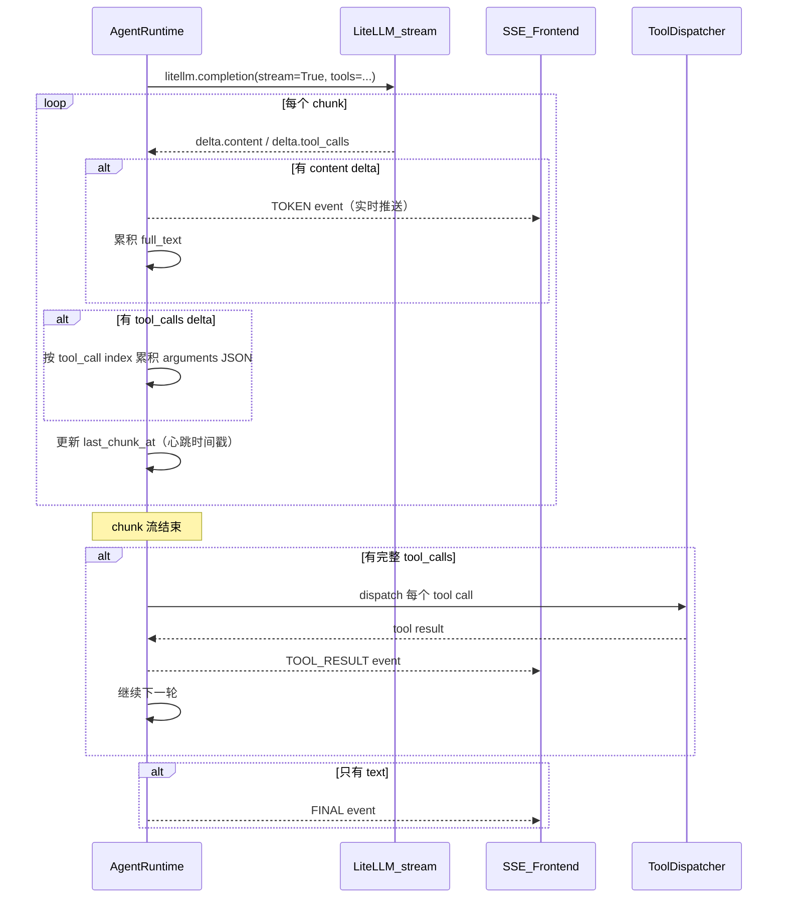
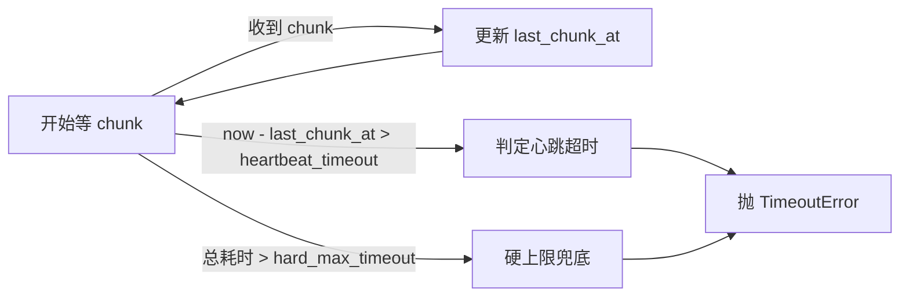

# 流式工具调用重构：invoke -> stream with tool call delta accumulation

## 背景与根因

当前 [agent_runtime.py](agenticx/runtime/agent_runtime.py) 第 531-539 行，所有带工具的轮次一律走 `llm.invoke`（`litellm.completion` 非流式），模型必须生成完整响应后才返回。对 glm-5/doubao-seed 等重推理模型，首包延迟可达 60-120s，期间前端零反馈，且硬超时阈值容易误杀。

**Claude Code** 和 **OpenClaw** 的做法都是 **流式优先**：

- Claude Code：默认走 streaming，tool_use 作为 content_block 通过 delta 增量到达，累积拼接后 dispatch
- OpenClaw：通过 `StreamFn` 抽象 + `partialJsonByIndex` 按 `contentIndex` 累积 `toolcall_delta`，`toolcall_end` 时拼接完成后执行。还叠加了 `wrapStreamRepairMalformedToolCallArguments` 修复畸形 JSON

## 核心设计

### 数据流（重构后）




### 超时策略（重构后）




- `heartbeat_timeout`：连续 N 秒无新 chunk 即超时（默认 60s，可通过 `AGX_LLM_HEARTBEAT_TIMEOUT_SECONDS` 或 config 覆盖）
- `hard_max_timeout`：整轮硬上限兜底（默认 300s），防止慢速持续 trickle 的极端场景

## 改动范围

### 1. [agenticx/llms/litellm_provider.py](agenticx/llms/litellm_provider.py) - stream 方法增强

当前 `stream()` 方法（第 78-111 行）只 yield `delta.content` 文本，忽略了 `delta.tool_calls`。需要改为：

- yield 文本 chunk 时返回 `str`
- yield tool_call delta 时返回 `dict`（包含 `index`, `id`, `function.name`, `function.arguments` 的增量片段）
- yield 最终 `finish_reason` 信号

LiteLLM 的 streaming tool call delta 格式（OpenAI 兼容）：

```python
# chunk.choices[0].delta 结构：
# - delta.content: str | None        # 文本增量
# - delta.tool_calls: list | None    # 工具调用增量
#   每个 tool_call delta 包含:
#   - index: int                      # 该 tool call 的序号
#   - id: str | None                  # 仅首个 delta 有值
#   - function.name: str | None       # 仅首个 delta 有值
#   - function.arguments: str         # JSON 片段，需累积
```

新增 `stream_with_tools()` 方法，yield 类型为 `StreamChunk`（一个 TypedDict/dataclass），包含：

- `type`: `"content"` | `"tool_call_delta"` | `"done"`
- `text`: 文本增量（content 类型）
- `tool_index`, `tool_call_id`, `tool_name`, `arguments_delta`: 工具调用增量字段
- `finish_reason`: 结束原因

### 2. [agenticx/runtime/agent_runtime.py](agenticx/runtime/agent_runtime.py) - 核心循环重构

将第 528-592 行的 invoke + timeout 轮询替换为 stream + delta 累积 + 心跳超时：

**关键变更：**

- 新增 `_accumulate_stream_response()` 异步方法：
  - 调用 `llm.stream_with_tools(messages, tools=active_tools, ...)`
  - 维护 `tool_calls_acc: Dict[int, {id, name, arguments_buffer}]` 按 index 累积
  - 每收到 content chunk 立即 yield `TOKEN` event
  - 每收到 tool_call delta 累积到 `arguments_buffer`
  - 跟踪 `last_chunk_at` 用于心跳超时
  - 流结束后，将 `arguments_buffer` JSON.parse 为完整 arguments
  - 返回 `(full_text, parsed_tool_calls, finish_reason)`
- 心跳超时实现：在 stream 消费循环中，若 `time.time() - last_chunk_at > heartbeat_timeout` 则中断流并报超时
- 保留 invoke fallback：若 `stream_with_tools` 不可用（provider 不支持），回退到现有 invoke 路径

### 3. [agenticx/llms/base.py](agenticx/llms/base.py) - 基类新增接口

新增 `stream_with_tools()` 抽象方法，默认实现抛 `NotImplementedError`，让不支持的 provider 可以优雅降级到 invoke。

### 4. 前端无需改动

前端已经通过 SSE `TOKEN` event 接收实时 token。后端只要在 stream 过程中持续 yield `RuntimeEvent(type=TOKEN)`，前端自然会实时显示。这一块在上次 P4（token streaming）已经打通。

## 风险与兼容性

- **LiteLLM stream tool_calls 兼容性**：LiteLLM 底层对 OpenAI/Anthropic/Zhipu/Volcengine 的 streaming tool calls 已有标准化处理，`delta.tool_calls` 字段格式一致
- **畸形 JSON 片段**：参考 OpenClaw 的 `wrapStreamRepairMalformedToolCallArguments`，在 `arguments_buffer` 累积完成后做一次 repair 尝试（已有 `_repair_malformed_file_tool_arguments` 可复用）
- **并发安全**：stream 消费在单个 asyncio task 内完成，无并发问题
- **回退策略**：若 stream 抛异常，可 fallback 到 invoke 重试一次（可选，第一版不做）

